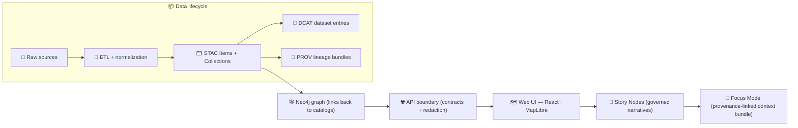

# 🌾🗺️ Kansas Matrix System (KFM) — *Provenance‑First Living Atlas*


-brightgreen)

**KFM is a geospatial knowledge + modeling platform** that fuses **maps**, **datasets**, **historical narratives**, and **AI‑assisted analysis** into a single governed system — where every output has a traceable **“map behind the map.”** ✅

> [!IMPORTANT]
> **KFM is not a black‑box GIS.** Nothing “magically appears” in the UI. All user-facing content flows through deterministic pipelines, metadata catalogs, database boundaries, and contracted APIs.

---

## 🧭 Quick navigation
- ⚡ [Quick Start](#-quick-start-docker-compose)
- 🧩 [Architecture](#-architecture-at-a-glance)
- 🧱 [Non‑negotiables](#-non-negotiable-invariants-dont-fight-these)
- 🗂️ [Repo layout](#️-repo-layout--canonical-homes)
- 🧪 [Common tasks](#-common-developer-tasks)
- 🧠 [Focus Mode AI](#-focus-mode-ai-local-llm)
- 🛡️ [Governance](#️-governance--provenance-boundary-artifacts)
- 🤝 [Contributing](#-contributing)
- 🆘 [Troubleshooting](#-troubleshooting-fast-fixes)

---

## ✨ What you get
- 🧱 **Pipeline → Catalog → Database → API → UI → Story Nodes → Focus Mode** (strict ordering)
- 🧾 **Evidence metadata**: STAC / DCAT / PROV boundary artifacts
- 🧭 **Interactive atlas UI**: map + time + narrative reading (Focus Mode)
- 🧠 **Local AI (Ollama)** with **citations + policy gates**
- 🧰 **Reproducible workflows**: deterministic pipelines, versioned outputs, CI + pre-commit hooks

---

## ⚡ Quick Start (Docker Compose)

> [!TIP]
> This is the recommended path for a consistent dev environment (DBs, API, UI, and optional AI services).

### 1) Prereqs ✅
- Docker Desktop (or Docker Engine) + Docker Compose plugin
- Git
- (Optional) **Ollama** installed locally for Focus Mode AI

### 2) Boot the stack 🚀
```bash
# from repo root
cp .env.example .env   # if present
docker compose up --build
# (older installs: docker-compose up --build)
```

### 3) Open the services 🌐
> Ports can be configured via `.env` / `docker-compose.yml`.

- 🧪 API docs (Swagger): `http://localhost:8000/docs`
- 🗺️ Web UI: `http://localhost:3000`
- 🕸️ Neo4j Browser: `http://localhost:7474`
- 🐘 PostGIS: `localhost:5432`

> [!WARNING]
> If you have port conflicts, the usual suspects are: **5432**, **7474**, **7687**, **8000**, **3000**.  
> Update your `.env` and/or `docker-compose.yml` accordingly.

---

## 🧩 Architecture at a glance



---

## 🧱 Non‑negotiable invariants (don’t fight these)

> [!CAUTION]
> These are **hard rules**. If you break them, KFM becomes un-auditable.

1. **Pipeline ordering is absolute**  
   **ETL → STAC/DCAT/PROV → Graph → API → UI → Story Nodes → Focus Mode**
2. **API boundary rule**  
   The UI **must never** query PostGIS/Neo4j directly — only through the governed API.
3. **Provenance‑first**  
   No dataset, narrative claim, or AI answer is “valid” without traceable sources.

---

## 🗂️ Repo layout & canonical homes

> [!NOTE]
> This repo is evolving toward a **v13 “canonical home”** model: *one true directory per subsystem* (no duplicate “API” folders, no scattered story content, etc.).  
> If you see overlap (e.g., both `api/` and `src/server/`), treat `src/` as the **migration target**, while keeping existing code working.

### 🧭 Root layout (what should exist)
```text
📦 .
├── 🧩 .github/                    # CI workflows, issue templates, automation
├── 🌐 api/                        # Backend API (active / legacy-friendly)
├── 📦 data/                       # Datasets + catalogs (versioned evidence)
├── 📚 docs/                       # Architecture, standards, runbooks, story nodes
├── 🧫 mcp/                        # Methods & computational experiments (optional)
├── 🧪 pipelines/                  # Deterministic ETL & ingestion scripts (active / legacy-friendly)
├── 🧠 src/                        # v13 canonical homes (server/graph/pipelines), shared libs
├── 🧪 tests/                      # Unit + integration tests
├── 🧰 tools/                      # Validators, linters, helpers (repo tooling)
├── 🗺️ web/                        # React UI (MapLibre layers, components, Focus Mode)
├── ⚙️ .editorconfig
├── 🧾 .env.example
├── ✅ .pre-commit-config.yaml
├── 📝 CHANGELOG.md
├── 📌 CITATION.cff
├── 🤝 CONTRIBUTING.md
├── 📄 LICENSE
├── 🐳 docker-compose.yml
└── 📘 README.md
```

### 📦 `data/` structure (required staging)
KFM treats **data as evidence**. Every dataset must have:
- **raw** inputs (unchanged)
- **processed** outputs (cleaned/standardized)
- **catalog** records (STAC/DCAT)
- **provenance** records (PROV lineage)

Recommended `data/` layout:
```text
📁 data/
├── raw/<domain>/                  # write-once source snapshots
├── work/<domain>/                 # intermediate pipeline outputs (scratch)
├── processed/<domain>/            # publish-ready outputs consumed by downstream stages
├── stac/
│   ├── collections/               # STAC collections
│   └── items/                     # STAC items
├── catalog/
│   └── dcat/                      # DCAT dataset entries (JSON-LD)
└── prov/                          # PROV lineage bundles
```

> [!TIP]
> If any of these folders are missing, add them with a `.gitkeep` so the structure stays enforceable in Git.

### 📚 `docs/` structure (where the “rules” live)
```text
📁 docs/
├── architecture/                  # blueprints, diagrams, ADRs
├── standards/                     # KFM profiles (STAC/DCAT/PROV) + doc protocols
├── templates/                     # governed templates (Story Nodes, API contract changes, etc.)
├── data/<domain>/                 # domain runbooks (how to ingest + cite + validate)
└── reports/story_nodes/
    ├── draft/                     # WIP narratives
    └── published/                 # released narratives (folder-per-story)
```

---

## 🧱 Subsystems (what goes where)

### 🌐 API boundary (`api/` → `src/server/`)
- The API is the **only** approved access path for UI + AI to query data.
- Contract-first workflow is preferred:
  1) define/extend contracts (OpenAPI / GraphQL schema)
  2) implement handlers
  3) add tests + governance checks

### 🧪 Pipelines (`pipelines/` → `src/pipelines/`)
- Deterministic ETL: **raw → work → processed**
- Must be **idempotent** (re-runs do not create duplicate “truth”)
- Must produce boundary artifacts before publication:
  - 🗂️ STAC
  - 🧾 DCAT
  - 🔗 PROV

### 🕸️ Graph (Neo4j) (`src/graph/`)
- Stores relationships across people/places/events/documents/datasets
- Graph nodes should link back to stable catalog/provenance IDs

### 🗺️ Web UI (`web/`)
- Pure client: renders governed outputs from the API
- Every layer should surface provenance (tooltips/legends/source panels)
- Focus Mode: narrative + map + citations as first-class UX

### 🧫 MCP (`mcp/`)
- Experiments, notebooks, model cards, methods
- Anything “experimental” belongs here until promoted into pipelines + catalogs

---

## 🧪 Common developer tasks

### Run tests ✅
```bash
docker compose exec api pytest
```

### Run a pipeline (example) 🧪
```bash
docker compose exec api python pipelines/<domain_or_job>/run.py
# or: docker compose exec api python pipelines/my_pipeline.py
```

### Jump into the API container 🐚
```bash
docker compose exec api bash
```

---

## 🧠 Focus Mode AI (local LLM)

KFM’s AI is designed to be **knowledge-grounded and auditable**:
- AI must operate **through approved tools/APIs**
- AI must return **answers with citations**
- AI outputs should be **policy-checked** (redaction, sensitive topics, refusal paths)

### Enable Ollama locally (typical)
1) Install Ollama and confirm it works:
```bash
ollama run llama2:7b "Hello"
```

2) Point the stack at Ollama (example pattern)
- Run Ollama on the host (default port `11434`)
- In `.env`, set something like:
  - `AI_BACKEND_URL=http://host.docker.internal:11434`
  - `OLLAMA_MODEL=...`

> [!NOTE]
> If the API runs in Docker, reaching host services often uses `host.docker.internal` (platform dependent).  
> You can also run Ollama in Docker if you prefer fully containerized dev.

---

## 🛡️ Governance & provenance boundary artifacts

KFM “fails closed” by design:
- no license → no merge
- no provenance → no publication
- policy check fails → blocked

### ✅ Evidence requirements for any dataset
- **Raw**: immutable snapshot in `data/raw/<domain>/`
- **Processed**: publishable output in `data/processed/<domain>/`
- **STAC**: `data/stac/collections/` + `data/stac/items/`
- **DCAT**: `data/catalog/dcat/`
- **PROV**: `data/prov/`

---

## 🤝 Contributing

Read: **`CONTRIBUTING.md`** 🤝  
We welcome contributions — **as long as they preserve provenance**. 🙌

### ✅ Contribution checklist
- [ ] Deterministic pipeline (or doc-only change) with repeatable steps
- [ ] STAC/DCAT/PROV artifacts produced/updated where applicable
- [ ] UI reads only from the API (no direct DB calls)
- [ ] Tests added/updated (unit + integration where relevant)
- [ ] Documentation updated (runbooks, templates, or architecture notes)
- [ ] `pre-commit` passes locally (see `.pre-commit-config.yaml`)

---

## 📌 Citation
If you publish work derived from KFM, use **`CITATION.cff`** as the canonical citation record.

---

## 🧾 Changelog
See **`CHANGELOG.md`** for release notes and version history.

---

## 📄 License
See **`LICENSE`**.

---

## 🆘 Troubleshooting (fast fixes)

- 🧱 **DB not ready** → re-run `docker compose up` and check logs
- 🔁 **Hot reload not working** → verify volume mounts for `web/src` and backend code
- 🚫 **Ports busy** → stop the conflicting service or remap ports in `.env` / compose
- 🧠 **Ollama not reachable** → ensure `ollama serve` is running and API can reach `11434`
- 🧰 **Permission issues** (mounted volumes) → ensure `data/` is writable by containers

---

<details>
  <summary>🔮 Roadmap (high level)</summary>

- 🧠 Stronger Focus Mode tool-use + provenance “context bundles”
- 🧭 Policy-as-code expansion (redaction tiers, sensitivity gates)
- 🛰️ More domains: remote sensing, archival corpora, simulation outputs
- 🧱 Automated schema validation + contract compatibility checks
- 🌐 Public “evidence explorer” UX (downloadable + citable artifacts)

</details>