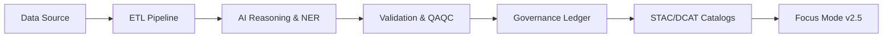
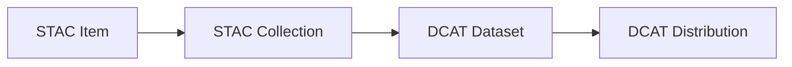

<div align="center">

# 🌾 **Kansas Frontier Matrix — Open-Source Geospatial Historical Mapping Hub**  
`README.md`

**Purpose:**  
Define the official, MCP-DL v6.3–compliant entrypoint for the Kansas Frontier Matrix (KFM): a Diamond⁹ Ω / Crown∞Ω certified, FAIR+CARE-aligned, ontology-driven geospatial AI system unifying Kansas’s cultural heritage, ecological history, climate records, land deeds, paleoenvironments, archaeology, and future projections into a reproducible, lineage-secured, open-science knowledge graph.

[](docs/README.md)
[](docs/standards/faircare.md)
[](LICENSE)
[]()
[]()
[]()
[]()

</div>

---

## 📘 Overview

The **Kansas Frontier Matrix (KFM)** is a *living, multi-era digital atlas* combining:

- Semantic knowledge graphs  
- AI-assisted reasoning (Focus Mode v2.5+)  
- FAIR+CARE governance  
- GeoSPARQL-based spatial intelligence  
- OWL-Time temporal modeling  
- Predictive modeling for 2030–2100  
- Historical + archaeological + geological deep-time layers  
- Full operational integrity (WAL, retry, rollback, lineage, hotfix)

It synthesizes heterogeneous datasets into one reproducible, governed, transparent system.

---

# 🧬 Core Guarantees (Diamond⁹ Ω)

| Guarantee | Description |
|----------|-------------|
| **Reproducibility** | Deterministic pipelines with full provenance & dataset fingerprints. |
| **Reversibility** | WAL, snapshot, rollback, hotfix with immutable audit trails. |
| **FAIR+CARE Compliance** | Ethical, culturally respectful data stewardship. |
| **Sustainability** | ISO 50001 energy tracking, ISO 14064 carbon telemetry. |
| **Governance** | Diamond⁹ Ω / Crown∞Ω governance chain ensures trust & safety. |
| **Open Standards** | STAC 1.0, DCAT 3.0, OWL-Time, CIDOC-CRM, PROV-O. |
| **Security** | SBOM (SPDX), SLSA supply-chain hardening, signed manifests. |

---

# 🏗️ System Architecture (v10.3.3)

```mermaid
flowchart TD
  A[External Data<br/>NOAA · USGS · Tribal Nations · KHS · Sensors] --> B[LangGraph DAG Pipelines<br/>ETL · OCR · NER · RasterOps · QAQC]
  B --> C[Semantic Knowledge Graph<br/>Neo4j · CIDOC CRM · GeoSPARQL · OWL Time · PROV O]
  C --> D[API Layer<br/>FastAPI · GraphQL · Auth · Governance Webhooks]
  D --> E[Frontend<br/>React · MapLibre · Cesium 3D · Focus Mode v2.5]
  B --> F[Governance Core<br/>FAIR+CARE · SBOM · SLSA · Ledger v4 · Energy/Carbon Telemetry]
  C --> F
  D --> F
````

---

# ⚙️ Operational Safety & Control Plane

KFM v10.3.3 enforces deterministic, reversible operations:

* **WAL (Write-Ahead Log)** – Every mutation logged pre-execution.
* **Retries** – Checkpoint-driven automatic recovery.
* **Rollback** – Graph + asset snapshot restoration.
* **Hotfix** – Surgical reversible patches under governance.
* **Lineage** – Full derivation tree across all datasets, models, and narratives.
* **Ops Tests** – Deterministic system-wide validation.

```mermaid
flowchart LR
  O1[WAL] --> O2[Retry] --> O3[Rollback] --> O4[Hotfix] --> O5[Lineage] --> O6[Ops Tests]
```

---

# 🔗 End-to-End Provenance



All provenance is duplicated into PROV-O classes within Neo4j.

---

# 🧱 Repository Layout

```text
KansasFrontierMatrix/
|-- src/
|   |-- ai/
|   |-- api/
|   |-- graph/
|   |-- pipelines/
|   |-- telemetry/
|   |-- operations/
|-- web/
|-- data/
|-- docs/
|-- tools/
|-- tests/
|-- .github/
|-- LICENSE
|-- CONTRIBUTING.md
|-- Makefile
```

---

# 🌐 Ontology & Metadata Stack

| Standard        | Role                           |
| --------------- | ------------------------------ |
| **CIDOC-CRM**   | Heritage + event modeling      |
| **GeoSPARQL**   | Spatial reasoning & topologies |
| **OWL-Time**    | Temporal intervals & instants  |
| **PROV-O**      | Derivation & lineage           |
| **STAC 1.0**    | Geospatial asset metadata      |
| **DCAT 3.0**    | Dataset catalog metadata       |
| **JSON-LD**     | Semantic context for entities  |
| **SPDX + SLSA** | Supply-chain trust             |

---

# 🧭 Data Domains

| Domain     | Examples                         | License         |
| ---------- | -------------------------------- | --------------- |
| Historical | KHS, newspapers, treaties        | PD/CC-BY        |
| Tribal     | Oral histories, territorial maps | CARE-restricted |
| Climate    | NOAA, Daymet                     | PD              |
| Hydrology  | NWIS, KGS wells                  | PD              |
| Ecology    | GBIF, eBird                      | CC0/CC-BY       |
| Hazards    | NOAA Storm Events                | PD              |
| Geology    | USGS, KGS                        | PD              |
| Sensors    | Mesonet, USGS real-time          | PD              |
| Rasters    | NAIP, Landsat                    | PD              |

---

# 🧠 AI Model Governance (v10.3.3)

* Full model cards
* Dataset provenance review
* SHAP + LIME explainability
* Drift detection (ai_drift_monitor.py)
* Bias audits (ai_bias_detection.py)
* Narrative safety filters (CARE-aligned)
* Lineage tracking for training runs

---

# 🧩 STAC/DCAT Versioning Model



Each STAC Item contains:

* DOIs
* Checksums
* WAL IDs
* Spatial/temporal footprints
* Lineage hashes

---

# 📚 Glossary

| Term           | Definition                                              |
| -------------- | ------------------------------------------------------- |
| **Story Node** | Spatial + temporal + narrative atom used in Focus Mode. |
| **Focus Mode** | Entity-centric reasoning and semantic exploration.      |
| **WAL**        | Write-Ahead Log for deterministic mutation management.  |
| **Rollback**   | Snapshot-based restoration.                             |
| **Lineage**    | Immutable derivation records.                           |
| **STAC/DCAT**  | Metadata and discovery frameworks.                      |

---

# ⚙️ Quickstart

```bash
git clone https://github.com/bartytime4life/Kansas-Frontier-Matrix.git
cd KansasFrontierMatrix
docker compose up --build
```

Manual:

```bash
make setup
uvicorn src.api.main:app --reload &
npm --prefix web start
```

UI: [http://localhost:3000](http://localhost:3000)
API: [http://localhost:8000/docs](http://localhost:8000/docs)

---

# 🤝 Contributing (MCP-DL v6.3)

```bash
make validate
make test
```

* Documentation-first
* Semantic commits
* CARE review for sensitive datasets
* Governance gating for all new models

---

# ⚖️ Licensing

| Component | License          |
| --------- | ---------------- |
| Code      | MIT              |
| Docs      | CC-BY 4.0        |
| Data      | Dataset-specific |
| Security  | SPDX + SLSA      |

---

# 🌱 Sustainability (ISO 50001 · ISO 14064)

* Energy/run: **0.66 Wh**
* Carbon: **0.07 gCO₂e**
* All telemetry logged under `releases/v10.3.3/focus-telemetry.json`

---

# 🕰️ Version History

| Version     | Date       | Notes                                                                         |
| ----------- | ---------- | ----------------------------------------------------------------------------- |
| **v10.3.३** | 2025-11-15 | Updated README formatting, metadata, lineage details, Focus v2.5 integration. |
| **v10.3.2** | 2025-11-14 | Added WAL, rollback, retries, predictive futures engine.                      |
| **v10.3.1** | 2025-11-13 | Architecture upgrades.                                                        |
| **v10.2.2** | 2025-11-12 | Telemetry & FAIR+CARE refinements.                                            |
| **v10.0.0** | 2025-11-   |                                                                               |
