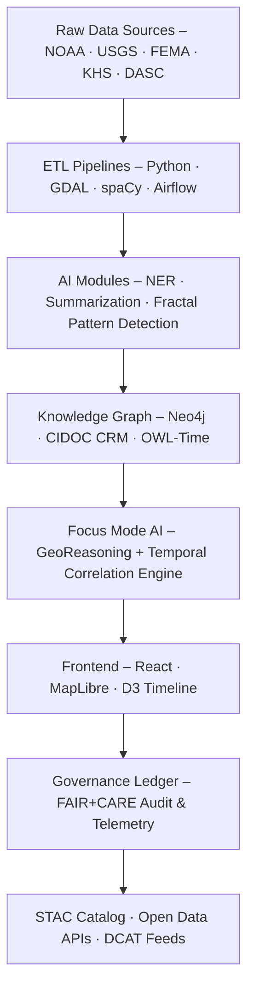

<div align="center">

# 🧭 Kansas Frontier Matrix — **Root Repository Overview**

`/`

**Purpose:** Unified, AI-powered, geospatial-historical knowledge platform for Kansas — integrating environmental data, maps, archives, and reasoning engines into a reproducible, FAIR+CARE-certified graph system.  
This monorepo contains all **source code, AI pipelines, datasets, documentation, and governance ledgers** under the **Master Coder Protocol (MCP-DL v6.4.3 Diamond⁹ Ω)**.

[](docs/architecture/repo-focus.md)
[](LICENSE)
[](docs/standards/faircare-validation.md)
[](./.github/workflows/stac-validate.yml)
[](./.github/workflows/site.yml)

</div>

---

## 📚 Overview

**Kansas Frontier Matrix (KFM)** is an open-science, multi-layered monorepo linking Kansas’s environmental, cultural, and historical records into an interactive spatial-temporal knowledge hub.  
It unites **AI/ML pipelines**, **ETL data processes**, **semantic knowledge graphs**, and a **React + MapLibre timeline UI**, enabling exploration across time and geography.  
Every component is containerized, open-standard, and reproducible—engineered for long-term sustainability, provenance, and ethical transparency.

---

## 🧩 Repository Layout

```plaintext
Kansas-Frontier-Matrix/
├── src/                # Python backend: ETL pipelines, AI/NLP, Neo4j & CIDOC-CRM graph
├── web/                # React + MapLibre frontend (timeline, map, Focus-AI dashboard)
├── data/               # Datasets, schemas, STAC/DCAT catalogs
│   ├── raw/            # Immutable input data
│   ├── work/           # Temporary & validation workspaces
│   ├── stac/           # SpatioTemporal Asset Catalog (STAC 1.0 / DCAT 3.0)
│   └── releases/       # Versioned artifacts & telemetry exports
├── docs/               # Architecture, governance, FAIR+CARE, MCP templates
├── tools/              # CLI utilities, Makefile, validation scripts
├── tests/              # Unit/integration/AI-drift tests
├── .github/            # Workflows · templates · security policies
├── LICENSE             # MIT (code) · CC-BY 4.0 (data/docs)
└── README.md           # This root overview
```

> **Note:** All sub-directories include their own Platinum README (v7.1) with YAML metadata, badges, and governance lineage.

---

## ⚙️ System Architecture



- **ETL:** Normalizes heterogeneous datasets into interoperable GeoTIFF/GeoJSON/CSV formats.  
- **AI Layer:** Performs extraction, summarization, anomaly detection, and spatio-temporal inference.  
- **Graph DB:** Implements semantic linkage using CIDOC CRM + OWL-Time + GeoSPARQL.  
- **Frontend:** Provides timeline playback, spatial overlays, and Focus-Mode navigation.  
- **Governance:** MCP-DL pipelines verify provenance, SBOMs, and checksum integrity.

---

## 🧠 Focus Mode — AI-Assisted Exploration

**Focus Mode v2.0** contextualizes every dataset around a chosen entity (person, tribe, treaty, fort, or event).  

🔹 **Contextual Filtering:** Map & timeline auto-filter to show only linked entities and epochs.  
🔹 **AI Summaries:** GPT-based summarizer aggregates linked documents and spatial patterns.  
🔹 **Causal Chains:** Graph traversal reveals upstream/downstream events and related places.  
🔹 **Explainability Dashboard:** Displays model confidence, drift, and audit logs (`/data/work/tmp/hazards/logs/ai/`).  
🔹 **Ethical Guardrails:** Each inference tagged with provenance & CARE compliance metadata.  

Focus Mode merges **semantic reasoning + geospatial visualization** into a live analytical narrative of Kansas history.

---

## 🧩 Standards & Compliance

| Framework | Scope | Implementation |
|------------|-------|----------------|
| **FAIR Principles** | Data Findability & Reuse | STAC 1.0 + DCAT 3.0 JSON-LD metadata |
| **CARE Principles** | Ethical stewardship & community control | Governance board + CARE flags in metadata |
| **MCP-DL v6.4.3 Diamond⁹ Ω** | Documentation & Reproducibility | Platinum README · self-validation reports |
| **CIDOC CRM / OWL-Time** | Semantic ontology for events & time | Neo4j schema alignment + reasoner rules |
| **STAC ↔ DCAT Bridge** | Geospatial metadata interoperability | `src/pipelines/metadata_bridge/` module |

---

## 🔍 Governance · Ethics · Provenance

KFM enforces transparent, auditable pipelines through an immutable governance chain.

**Core Mechanisms**
- 🧾 Checksum Ledger — All ETL outputs verified via SHA-256.  
- ⚖️ Ethics Council — FAIR+CARE oversight on AI training data.  
- 🔐 Provenance Graph — Each dataset linked to its source manifest & STAC item.  
- 📈 AI Drift Monitor — Tracks model stability & bias metrics.  
- 🧮 Audit Artifacts — `reports/audit/*` & `releases/v9.5.0/focus-telemetry.json`.  

---

## 🚀 Getting Started

### 🛠 Installation
```bash
git clone https://github.com/bartytime4life/Kansas-Frontier-Matrix.git
cd Kansas-Frontier-Matrix
make setup
```
> Requires Python 3.11+, Node 20+, Docker 24+.

### 🧪 Typical Workflows
```bash
make etl-all         # Full ETL run
make validate-all    # Schema + FAIR validation
make focus-ai        # Start Focus-Mode AI reasoning
make serve-web       # Launch React + MapLibre app
```

---

## 🧭 FAIR+CARE Compliance Digest

**FAIR:** Indexed via STAC + DCAT; accessible APIs; interoperable schemas; fully reusable docs.  
**CARE:** Benefits communities; respects data authority; ensures ethical AI and provenance accountability.

---

## 🧾 Version History

| Version | Date | Author | Summary |
|----------|------|---------|----------|
| v9.5.0 | 2025-10-30 | @kfm-architecture | Upgraded to MCP-DL v6.4.3 Diamond⁹ Ω; added STAC↔DCAT bridge & Focus Mode v2.0. |
| v9.4.0 | 2025-10-29 | @bartytime4life | Enhanced AI telemetry and CARE governance logging. |
| v9.3.2 | 2025-10-28 | @kfm-architecture | Baseline FAIR+CARE certification and repository alignment. |

---

<div align="center">

**Kansas Frontier Matrix** · *Geospatial Intelligence × Ethical AI × Open Knowledge*  
[🌐 Repository](https://github.com/bartytime4life/Kansas-Frontier-Matrix) • [📖 Docs Portal](docs/) • [🧭 Governance Dashboard](docs/standards/governance/)

</div>
