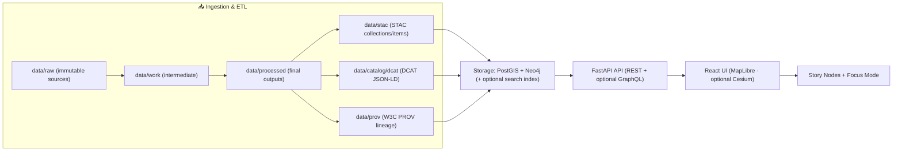

# Kansas Frontier Matrix (KFM)

> **A provenance-first geospatial knowledge system for Kansas.**  
> KFM integrates maps, data, historical narratives, and AI-assisted analysis using a governed “pipeline → catalogs → databases → API → UI” architecture so that every map, story, and answer is traceable back to sources.

[](#ci--quality-gates) <!-- replace with real badge -->
[](#license)
[](#citation)

---

## Start here

- **Architecture & governance (canonical):** `docs/MASTER_GUIDE_v13.md` (see also `docs/architecture/`)
- **Documentation rules (governed):** `docs/standards/` and the KFM Markdown Guide
- **Local dev:** `docker-compose up --build` (see [Quickstart](#quickstart-docker-compose))

> [!NOTE]
> Some paths/endpoints below reflect the **canonical KFM blueprint**. If this repo diverges, update the README and/or the Master Guide so there is one source of truth.

---

## What KFM is

KFM is designed as a **trustworthy, auditable geospatial+historical knowledge system**:

- **Pipeline-first:** raw sources are transformed deterministically into processed datasets.
- **Catalog-first:** every published dataset produces **STAC + DCAT + PROV** records before it becomes visible in the UI.
- **Governed delivery:** the UI and external clients access data **only through the API “trust membrane”** (never by querying databases directly).
- **Narratives as artifacts:** Story Nodes are versioned, machine-ingestible Markdown narratives with evidence linkages.
- **Focus Mode:** a read-only experience that presents Story Nodes with map/timeline context and only provenance-linked content.

---

## Core principles

### Provenance-first (“the map behind the map”)

Every user-facing output (layer, story, chart, AI answer) must be traceable to sources via catalogs and lineage logs.

### Deterministic truth path (fail-closed)

Data must flow through the canonical stages **with no shortcuts**:

- `data/raw/<domain>/` → `data/work/<domain>/` → `data/processed/<domain>/`
- plus catalog outputs: `data/stac/`, `data/catalog/dcat/`, `data/prov/`

If required metadata or provenance is missing, the item is not considered publishable.

### Trust membrane

> [!IMPORTANT]
> **Frontend (React/MapLibre) and external clients never access databases directly.**  
> **Backend core logic never bypasses repository interfaces to talk directly to storage.**  
> All access routes through governed contracts (API + policy checks).

### Contract-first interfaces

APIs, schemas, and templates are first-class versioned artifacts. Breaking changes require explicit versioning and compatibility review.

### FAIR + CARE

KFM aims to be **Findable, Accessible, Interoperable, Reusable** while also honoring **Collective Benefit, Authority to Control, Responsibility, and Ethics**—especially for sensitive or sovereignty-relevant content.

---

## Architecture overview

KFM follows a **Clean Architecture** layering model:

| Layer | Responsibility | Examples |
|---|---|---|
| **Domain** | Pure entities & core concepts, no DB/UI code | `LandParcel`, `HistoricalEvent`, `StoryNode` |
| **Use Case / Service** | Business workflows, policies, orchestration | ingestion, validation, timeline generation |
| **Integration / Interface** | Ports + adapters (interfaces for storage/APIs) | repository interfaces, API presenters |
| **Infrastructure** | Concrete tech implementations | PostGIS, Neo4j, FastAPI, React/MapLibre, CI/CD |

---

## End-to-end system flow



---

## Repository layout (expected)

A canonical KFM monorepo commonly includes:

```text
.
├── api/                     # Backend (FastAPI; clean architecture packages)
├── web/                     # Frontend (React + MapLibre)
├── data/
│   ├── raw/                 # Immutable sources (organized by domain/topic)
│   ├── work/                # Intermediate ETL artifacts (optional)
│   ├── processed/           # Published, cleaned datasets
│   ├── stac/                # STAC records (collections/items)
│   ├── catalog/
│   │   └── dcat/            # DCAT dataset entries (JSON-LD)
│   └── prov/                # PROV lineage logs
├── docs/                    # Governed documentation + narratives
├── policy/                  # Governance policies (e.g., OPA/Rego, AI/data rules)
├── deploy/                  # (Optional) Kubernetes/Helm/etc.
├── .github/                 # CI/CD workflows
├── docker-compose.yml       # Local dev stack (db + api + ui + graph)
├── CONTRIBUTING.md
├── CODE_OF_CONDUCT.md
├── LICENSE
└── CITATION.cff
```

> [!TIP]
> If your repository uses different folder names (e.g., `frontend/` instead of `web/`), keep the **interfaces and invariants** the same—and document the divergence in the Master Guide.

---

## Quickstart (Docker Compose)

### Prerequisites

- Docker + Docker Compose
- Git
- Optional (for running outside containers): Python + Node.js

### Run

```bash
# 1) clone (replace URL with the real repo)
git clone https://github.com/<ORG>/<REPO>.git
cd <REPO>

# 2) configure environment (if provided)
cp .env.example .env  # if present

# 3) start the full stack
docker-compose up --build
```

### Verify (default dev conventions)

- FastAPI docs: `http://localhost:8000/docs`
- (Optional) FastAPI health: `http://localhost:8000/health`
- React UI: `http://localhost:3000`
- Neo4j browser (if enabled): `http://localhost:7474`

> [!WARNING]
> Default dev credentials (e.g., `postgres/postgres`) are for local development only. Use proper secrets management in staging/production.

---

## Working with data (the “truth path”)

### Adding a new dataset (minimum checklist)

- [ ] Place immutable sources under `data/raw/<domain>/` with a manifest (if required by the domain)
- [ ] Run deterministic ETL to produce `data/processed/<domain>/...`
- [ ] Generate boundary artifacts:
  - [ ] STAC collection/item records (`data/stac/...`)
  - [ ] DCAT dataset entry (`data/catalog/dcat/...`)
  - [ ] PROV lineage record (`data/prov/...`)
- [ ] Ensure sensitivity and license fields are present (fail-closed)
- [ ] Run local validation (if provided) and open a PR

> [!IMPORTANT]
> Treat any analysis output (including AI-derived artifacts) as a **first-class dataset**: it must live in `data/processed/...` and have STAC/DCAT/PROV records before it can appear in the UI.

---

## Story Nodes & Focus Mode

Story Nodes are governed narrative artifacts designed to be rendered in the UI with map/timeline choreography.

A typical story may include:

- A **Markdown narrative** (the text + citations)
- A **JSON/YAML script** that binds narrative sections to map state/timeline behavior

See:
- `docs/templates/TEMPLATE__STORY_NODE_V3.md`
- `docs/stories/` (or `docs/reports/<topic>/story_nodes/` depending on Master Guide)

---

## CI & quality gates

KFM treats code, data, and documentation as governed artifacts.

Typical CI checks include:

- Backend tests (unit + integration)
- Frontend tests (where applicable)
- Markdown lint + structure validation + link checks
- Policy checks (e.g., OPA) for:
  - required metadata fields (license/sensitivity)
  - citation requirements for generated answers (where enforced)
  - access controls and publishing gates
- Secret scanning

---

## Security & governance

### Policy enforcement

KFM’s governance membrane can include **Open Policy Agent (OPA)** policies enforced at runtime (API middleware) and in CI (policy test inputs). Policies may cover:

- authentication & authorization
- dataset sensitivity rules
- AI response requirements (e.g., “must include citations”)
- publishing gates for catalogs

### Sensitivity handling

If a dataset or narrative contains culturally sensitive information or precise locations that should not be public, **do not publish raw coordinates**. Use redaction/generalization and flag for governance review.

---

## Contributing

See `CONTRIBUTING.md`.

At a minimum:

1. Make changes in a branch/fork.
2. Ensure data follows the truth path (raw → processed + catalogs + provenance).
3. Ensure docs follow KFM’s Markdown standards (tables, callouts, Mermaid, etc. where appropriate).
4. Open a PR; CI must pass; maintainers review for governance compliance.

---

## Citation

KFM is designed to be citable. If present, use `CITATION.cff` for academic citations.

---

## License

See `LICENSE`.

> [!NOTE]
> Some KFM deployments use split licensing (e.g., code vs. data). Confirm the intended licensing model in this repo.

---

## Maintainers & contact

- Project governance: see `docs/governance/` (if present)
- Issues: use GitHub Issues