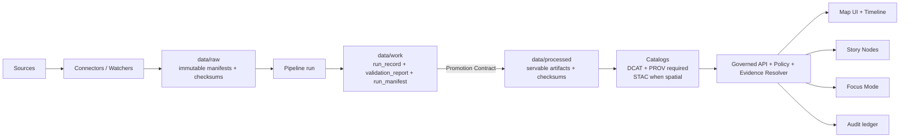
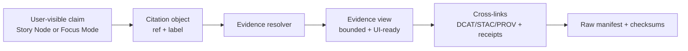

<!--
GOVERNED ARTIFACT NOTICE
FILE: README.md

This README is part of the KFM trust boundary. It defines non‑negotiable invariants, repo boundaries,
and the “truth path” from raw sources to user-facing claims.

If you change meaning (not just phrasing), route through the governance review path:
CODEOWNERS + required CI gates + Promotion Contract checks.

KFM rule: if a guarantee is not machine‑enforced (schemas + validators + CI wiring), treat it as NOT proven.
-->

<div align="center">

# Kansas Frontier Matrix (KFM‑NG) 🧭🗺️  
### A governed, evidence‑first spatiotemporal knowledge system for Kansas

**KFM turns heterogeneous Kansas history + geospatial data into a trustable system:**  
**data → connectors + pipelines → receipts + catalogs → governed APIs → Map UI + Story Nodes + Focus Mode**

<br/>

<!-- Enforcement posture: do not over-claim. -->


<br/>

**KFM Principle:** *If it can’t be traced, it can’t be trusted.* 🔎

</div>

> [!IMPORTANT]
> **Leadership reality check (the “are we moving backwards?” answer):**  
> KFM is intentionally built **contract‑first** so we stop re‑building the same system every time a new dataset, story, or AI feature arrives.  
> Forward progress in KFM is measured by **enforcement loops**—schemas → validators → CI gates → runtime policy—because that is what prevents regression and rework.
>
> **A KFM win is a demo where a claim is clickable and provable:**  
> *Claim → citation → evidence view → (catalog + receipt + checksum) → raw source*.

---

## Governance Header

| Field | Value |
|---|---|
| Document | `README.md` |
| Status | **Governed** |
| Version | `v3.0.0` |
| Effective date | **2026-02-16** (America/Chicago) |
| Applies to | invariants, trust boundary, repo boundaries, truth path, publish rules |
| Owners | `.github/CODEOWNERS` *(required; if missing, governance gap)* |
| Enforcement truth source | `.github/README.md` *(authoritative list of enforced gates)* |
| Change impact | meaning changes are **release‑blocking** until governance review completes |

> [!WARNING]
> **Fail‑closed governance rule:** if a required enforcement surface is missing (policy, receipts, catalogs, contract tests),
> promotion/merge/release must **deny by default**.

---

## Quick Links

- **Repo governance gatehouse (CI + branch protection contract):** `.github/README.md`
- **Security reporting:** `.github/SECURITY.md`
- **Contribution workflow:** `CONTRIBUTING.md`
- **Docs plane:** `docs/README.md`
- **Data plane:** `data/README.md`
- **Policy plane:** `policy/README.md` *(or equivalent)*
- **API plane:** `src/README.md`
- **UI plane:** `web/README.md`
- **Releases (append‑only):** `releases/README.md`

---

## Table of Contents

- [Start Here](#start-here)
- [Enforcement Snapshot](#enforcement-snapshot)
- [What KFM Is Built to Ship](#what-kfm-is-built-to-ship)
- [How We Prove Progress](#how-we-prove-progress)
- [KFM Constitution](#kfm-constitution)
- [Architecture and Boundaries](#architecture-and-boundaries)
- [Truth Path](#truth-path)
- [Evidence and Citation Chain](#evidence-and-citation-chain)
- [Identity and Reference Schemes](#identity-and-reference-schemes)
- [Governed Artifact Inventory](#governed-artifact-inventory)
- [Promotion Contract](#promotion-contract)
- [Story Nodes](#story-nodes)
- [Focus Mode](#focus-mode)
- [Policy and Audit](#policy-and-audit)
- [Security, Rights, and Sensitivity](#security-rights-and-sensitivity)
- [Repo Layout](#repo-layout)
- [Thin-Slice Roadmap](#thin-slice-roadmap)
- [Definition of Done](#definition-of-done)
- [References](#references)
- [Glossary](#glossary)

---

## Start Here

### If you only read one section
Read **[KFM Constitution](#kfm-constitution)**. These are non‑negotiable.

### If you need to judge if we’re moving forward
Read **[Enforcement Snapshot](#enforcement-snapshot)** and **[How We Prove Progress](#how-we-prove-progress)**. That’s the scoreboard.

### If you’re building
Read **[Truth Path](#truth-path)** and **[Promotion Contract](#promotion-contract)**, then implement validators and CI wiring until the repo can **fail closed**.

> [!TIP]
> A governed system without a runnable verification harness is “paper governance.”  
> If there is no CI‑mirrored command like `make verify` (or equivalent), treat that as a **P0 gap**.

---

## Enforcement Snapshot

This section is here to prevent accidental over-claiming.

> [!IMPORTANT]
> **Authoritative enforcement list:** `.github/README.md` controls what is *actually* merge-blocking.
> Anything not listed there is **contract-only** (desired) until wired into CI + branch protection.

### Enforced today (merge-blocking gates)

| Gate / Guarantee | Status | Where enforced |
|---|---|---|
| PR-based workflow + CODEOWNERS review *(repo setting)* | ✅ Required | GitHub branch protection / rulesets (verify in GitHub settings) |
| `build` check | ✅ Required | CI required status check |
| `docs` check | ✅ Required | CI required status check |
| `contracts` check | ✅ Required | CI required status check |

### Contract-only today (planned enforcement)

| Contract area | Status | Becomes “real” when… |
|---|---|---|
| `policy` (default deny regression) | 🧪 Planned | policy tests exist + job is required |
| `receipts` (promotion proof) | 🧪 Planned | receipt schema + validator + required check |
| `catalogs` (DCAT/STAC/PROV) | 🧪 Planned | validators + cross-link tests + required check |
| `stories` (cite-or-abstain publishing) | 🧪 Planned | story schema + citation resolution + required check |
| `security` (SAST/SCA/secrets) | 🧪 Planned | CodeQL/dependency review + required check |
| `supply-chain` (SBOM/attestations) | 🧪 Planned | release pipeline produces + verifies SBOM/provenance |
| `config-drift` (settings integrity) | 🧪 Planned | drift check exists + alerts/fails read-only |

---

## What KFM Is Built to Ship

KFM is built to ship **governed outputs**—not just “data” and not just “a map.”

### 1) Governed datasets (servable truth)
When KFM serves data, it serves:
- `data/processed/**` artifacts that are **promoted**
- checksums for every artifact
- catalogs/provenance that cross‑link: **DCAT + PROV required**, **STAC when spatial** *(contract; enforcement planned)*

### 2) Governed narratives (Story Nodes)
When KFM publishes narratives, they include:
- replayable map/time state
- citations that resolve via evidence resolver
- publish blocked if citations don’t resolve or policy denies *(contract; enforcement planned)*

### 3) Governed Q&A (Focus Mode)
When KFM answers questions, it:
- returns **cited answer or abstains**
- **always** emits `audit_ref`
- uses only policy‑allowed evidence packs (no “free text guesses”) *(contract; enforcement planned)*

---

## How We Prove Progress

This section exists to prevent “moving backwards” narratives. KFM progress is not measured by the number of pages of documentation. It’s measured by how many **closed loops** exist where the system can prove its own claims.

### The KFM proof ladder

| Level | What exists | What it proves | How you demo it |
|---:|---|---|---|
| 0 | Docs only | Intent (no guarantees) | “Here’s what we want” |
| 1 | Schemas + fixtures | Shapes are defined | validate a sample object |
| 2 | Validators + reports | Checks are executable | validator outputs JSON report |
| 3 | CI gates + branch protection | Checks are enforced | PR cannot merge if failing |
| 4 | Runtime policy + audit | Governance is on‑path | request denied/allowed with `audit_ref` |
| 5 | End‑to‑end evidence UX | Trust is user‑visible | click citation → evidence view |

> [!IMPORTANT]
> KFM does **not** claim progress based on “Level 0.”  
> We only claim progress when a guarantee reaches **Level 3+** (merge‑blocking), and ideally **Level 5** (clickable proof).

### Leadership demo script (10 minutes, no hand‑waving)

1) Promote one dataset version (raw → work → processed).  
2) Show the receipt bundle with `spec_hash` and checksums.  
3) Open DCAT (rights + distributions) and PROV (lineage).  
4) In UI/Story/Focus: click a citation and show the evidence view.  
5) Show the audit event referenced by `audit_ref`.

If we cannot do steps 1–5 for at least one domain, the project is incomplete—not failing, just incomplete.

---

## KFM Constitution

These invariants must remain true regardless of implementation details.

### Constitutional contracts (IDs for CI + incidents + ADRs)

| Contract ID | Invariant | Meaning | How it becomes provable |
|---|---|---|---|
| **KFM‑C0** | Trust membrane | UI/external clients never access DBs/object storage directly | architecture tests + runtime network controls |
| **KFM‑C1** | Fail closed | Missing inputs/proofs → deny or abstain | default‑deny policy tests + CI gate |
| **KFM‑C2** | Processed serves truth | Only processed + cataloged artifacts are served | API reads only from processed catalogs |
| **KFM‑C3** | Promotion Contract required | No promotion without receipts/checksums/catalogs | receipts + catalogs validators + CI gate |
| **KFM‑C4** | Deterministic identity | `spec_hash = sha256(JCS(spec))` (RFC 8785) | determinism tests + receipt validator |
| **KFM‑C5** | Evidence refs resolvable | Citations resolve via evidence resolver | resolver contract tests |
| **KFM‑C6** | Cite or abstain + audit_ref | Story/Focus must cite or abstain; always emit `audit_ref` | output validator + policy gate |
| **KFM‑C7** | Audit integrity | Append‑only audit events, integrity verifiable | ledger + checkpoints/hash chain |
| **KFM‑C8** | No silent redaction | Redaction/generalization is provenance‑tracked | derived outputs + PROV lineage |
| **KFM‑C9** | Immutable releases | Releases are append‑only shipping records | release validator + checksum verify |
| **KFM‑C10** | Rights‑first publishing | Missing rights/license/access terms → deny promotion | DCAT required fields + promotion gate |

> [!WARNING]
> If any of these are weakened “for speed,” that is a governance incident—because it creates rework later.

---

## Architecture and Boundaries

KFM is a governed system with clean architecture layers.

### Clean layers (contract)
- **Domain layer:** pure entities/models (no DB/UI dependencies)
- **Use case/service layer:** workflows + business rules; calls only abstract interfaces
- **Integration/interface layer:** ports/contracts + adapters; repository interfaces + API boundaries
- **Infrastructure layer:** concrete implementations (PostGIS, object store, search/vector, graph, FastAPI, React/MapLibre/Cesium)

### Trust membrane (non‑negotiable)
- Frontend and external clients never access databases or object storage directly.
- Backend business logic never bypasses repository interfaces to talk directly to storage.
- All user-visible claims cross a policy decision point.

> [!NOTE]
> “We have a frontend” is not architecture. The trust membrane is architecture.

---

## Truth Path

There is only one allowed route to “servable truth.”



> [!CAUTION]
> Serving from `raw/` or `work/` is a trust failure. KFM serves truth from **processed + catalogs only**.

---

## Evidence and Citation Chain

The truth path explains how data is produced. The evidence chain explains how **claims** are allowed to exist.



**Fail‑closed rule:** if any node in this chain is missing or denied → **do not publish / abstain**.

---

## Identity and Reference Schemes

These conventions are part of the governance contract; enforcement is done via schemas + validators.

### IDs

| Field | Example | Notes |
|---|---|---|
| `dataset_id` | `kfm_example_dataset` | stable snake_case identifier for a dataset family |
| `run_id` | `run_01J0EXAMPLE` | stable run identifier (ULID recommended) |
| `version_id` | `v_2026_02_16_001` | promoted snapshot identifier |
| `spec_hash` | `sha256:<hex>` | `sha256(JCS(spec))` per RFC 8785 |
| `audit_ref` | `audit://event/<id>` | points to an append-only audit record |

### Evidence refs

| Scheme | Meaning | Resolved by |
|---|---|---|
| `prov://...` | lineage proof | evidence resolver |
| `stac://...` | spatiotemporal assets | evidence resolver |
| `dcat://...` | dataset rights + distributions | evidence resolver |
| `doc://...` | governed docs | evidence resolver |
| `graph://...` | graph facts/edges | evidence resolver |

> [!IMPORTANT]
> If a ref scheme is not resolvable, it cannot be used in a published citation.

---

## Governed Artifact Inventory

This table answers: “What must exist for KFM to safely ship anything?”

| Artifact | Purpose | Canonical location | Served to users? | Required validation |
|---|---|---|---:|---|
| Dataset registry entry | license, cadence, sensitivity, contacts | `data/registry/` | ❌ | schema + policy checks |
| Raw manifest + checksums | immutable capture of upstream inputs | `data/raw/<dataset_id>/` | ❌ | checksum validation |
| Run receipts | prove what ran, with which inputs/outputs | `data/work/<dataset_id>/runs/<run_id>/` | ❌ | receipt schema |
| Validation report | quality + geometry + rights checks | same | ❌ | report schema + thresholds |
| Processed artifacts + checksums | publishable truth | `data/processed/<dataset_id>/<version_id>/` | ✅ | checksums + format validators |
| DCAT record | interoperable dataset catalog + rights | `data/catalog/dcat/` | ✅ | DCAT profile validation |
| STAC collections/items | spatiotemporal asset metadata | `data/catalog/stac/` | ✅ | STAC schema validation |
| PROV lineage | trace transformations | `data/catalog/prov/` | ✅ (bounded views) | PROV validation + cross-links |
| Evidence views | UI-ready proof behind citations | API output | ✅ | resolver contract tests |
| Story Nodes | narratives w/ citations + view state | `docs/reports/story_nodes/` | ✅ | schema + citation resolution |
| Focus Mode answers | grounded Q&A | API output | ✅ | cite‑or‑abstain validator |
| Audit events | prove governed actions happened | `audit/` (or external) | ✅ (`audit_ref`) | append‑only + integrity |
| Releases | immutable shipping record | `releases/` | ✅ | immutability + checksums |

---

## Promotion Contract

Promotion is the hard gate between “we processed something” and “we can serve it.”

### Promotion gate checklist (fail closed)

Promotion is denied unless **all** gates pass:

1) Raw capture: manifest + checksums exist  
2) Receipt bundle: `run_record` + `run_manifest` + `validation_report` validate  
3) Determinism: spec hashing + digests are stable  
4) Catalogs: DCAT + PROV exist; STAC exists when spatial  
5) Cross-links: catalogs ↔ receipts ↔ checksums are traversable end‑to‑end  
6) Rights: license/rights/access terms present (deny if missing)  
7) Sensitivity: classification present; generalization outputs exist when required  
8) Audit: promotion event emitted; `audit_ref` recorded  

> [!IMPORTANT]
> Promotion is not “copy a file to processed.” Promotion is **provable publication**.

### Receipt bundle (illustrative minimum)

```json
{
  "dataset_id": "kfm_example_dataset",
  "run_id": "run_01J0EXAMPLE",
  "version_id": "v_2026_02_16_001",
  "spec_hash": "sha256:...",
  "inputs": [{"uri":"raw://.../manifest.yml","sha256":"..."}],
  "outputs": [{"path":"data/processed/.../out.parquet","sha256":"..."}],
  "catalogs": {
    "dcat": "data/catalog/dcat/kfm_example_dataset.json",
    "prov": "data/catalog/prov/kfm_example_dataset/run_run_01J0EXAMPLE.json",
    "stac": "data/catalog/stac/kfm_example_dataset/collection.json"
  },
  "validation_report": "data/work/.../validation_report.json"
}
```

---

## Story Nodes

Story Nodes are governed narrative artifacts that synchronize map/time state and citations.

### Story Node publishing contract
- must validate against schema
- every citation resolves via evidence resolver
- publish blocked on unresolvable citations or policy denial
- includes view/timeline state for replay

### Minimal Story Node (illustrative)

```yaml
story_id: story_kansas_railroads_001
version: 1
status: draft # draft|published
title: "Railroads and Town Growth in Kansas"
summary: "A guided narrative connecting rail lines, settlements, and census change over time."
audience: public # public|classroom|research
steps:
  - id: step_01
    title: "The first corridors"
    view_state:
      time_range: ["1865-01-01", "1875-12-31"]
      bbox: [-102.05, 36.99, -94.59, 40.00]
      layers: ["rail_lines_1870", "towns_1870"]
    narrative_md: |
      Rail expansion accelerated settlement along corridors. [^1]
    citations:
      - ref: "prov://..."
        label: "Rail lines (source + processing lineage)"
```

---

## Focus Mode

Focus Mode is KFM’s grounded Q&A surface.

### Response envelope (required)

```json
{
  "answer_markdown": "…",
  "citations": [{"ref":"prov://…","label":"…"}],
  "audit_ref": "audit://event/…"
}
```

### Cite‑or‑abstain (non‑negotiable)
- If evidence pack is empty → abstain  
- If policy denies required evidence → abstain  
- If citations cannot resolve → abstain  
- If sensitivity requires generalization and it’s not available → abstain  

> [!WARNING]
> Focus Mode must never “fill in” missing evidence with plausible text.

---

## Policy and Audit

### Policy decision point (PDP)
Policy is on‑path in CI and runtime.

Policy must decide (minimum):
- can this actor access this dataset/version?
- can we return precise coordinates (or must we generalize)?
- can Story Nodes be published?
- can Focus Mode answer (or must it abstain)?
- can promotion occur (receipts/catalogs/checksums valid)?

**Default deny** is mandatory.

### Audit ledger
- append‑only writes
- every governed response returns `audit_ref`
- audit events store references, not sensitive payloads

> [!IMPORTANT]
> No audit, no answer.

---

## Security, Rights, and Sensitivity

### Rights‑first publishing (KFM‑C10)
- Missing rights/license/access terms → **deny promotion**
- DCAT must carry rights fields (profiled)

### Sensitivity handling (KFM‑C8)
If a dataset contains sensitive or culturally restricted locations:
- serve generalized representations (coarse grids, heatmaps, region summaries)
- track transforms as provenance (no silent redaction)
- block raw coordinates unless policy explicitly allows

### Repo security baseline (expected)
- secret scanning + push protection enabled
- workflow hardening: pinned actions, least privilege
- dependency review on governance surfaces
- rate limits and non‑leaky errors on evidence resolver and AI endpoints

---

## Repo Layout

> [!IMPORTANT]
> One canonical home per subsystem. If your repo differs, document the mapping and keep the boundary identical.

```text
repo-root/
├─ .github/                     # governance + CI gatehouse (required)
├─ policy/                      # policy-as-code + tests (default deny)
├─ contracts/                   # schemas: receipts, catalogs, citations, APIs (or /schemas)
├─ data/                        # raw/work/processed + catalogs
│  ├─ registry/
│  ├─ raw/
│  ├─ work/
│  ├─ processed/
│  └─ catalog/
│     ├─ dcat/
│     ├─ stac/
│     └─ prov/
├─ docs/                        # standards, runbooks, Story Nodes
├─ src/                         # backend: governed API, pipelines, evidence resolver, audit
├─ web/                         # UI: map + timeline + narratives (no direct DB access)
├─ tools/                       # validators run in CI
├─ tests/                       # contract + regression tests
└─ releases/                    # append-only shipping records
```

---

## Thin-Slice Roadmap

KFM advances by shipping **thin slices** that close enforcement loops.

### Slice 0 — Verification harness (stop paper governance)
- add validators + a single command that mirrors CI (`make verify` or equivalent)
- wire merge‑blocking CI jobs for: docs, contracts, policy, receipts, catalogs

### Slice 1 — One “anchor dataset” end‑to‑end
- pick a dataset with clear rights
- implement raw→work→processed + receipts + DCAT/PROV (STAC if spatial)
- demo click‑through evidence

### Slice 2 — Evidence resolver contract
- implement resolver schemes: `prov://`, `stac://`, `dcat://`, `doc://`, `graph://`
- contract test: resolve in ≤ 2 calls

### Slice 3 — Story Node schema + publish gate
- schema validation + citation resolution in CI
- playback smoke test (minimal)

### Slice 4 — Focus Mode minimal cited Q&A
- evidence packs bounded and auditable
- cite‑or‑abstain output validator
- audit ledger integration

> [!NOTE]
> This ordering is intentionally “boring first” because it prevents rework later.

---

## Definition of Done

### DoD — Add a dataset family
- [ ] registry entry exists (rights + sensitivity + cadence)
- [ ] raw capture produces immutable manifest + checksums
- [ ] pipeline produces receipts + validation report
- [ ] processed outputs have checksums
- [ ] DCAT + PROV validate; STAC validates if spatial
- [ ] cross-links validate end‑to‑end
- [ ] policy classification present; generalization outputs exist if needed
- [ ] evidence resolver resolves representative refs
- [ ] CI gates are merge‑blocking for the above

### DoD — Add/update a Story Node
- [ ] schema validates
- [ ] every citation resolves
- [ ] sensitivity labels correct
- [ ] publish blocked on any citation failure or policy deny
- [ ] playback smoke test exists

### DoD — Change policy
- [ ] change preserves default‑deny safety
- [ ] policy tests updated; at least one new negative test added
- [ ] CI and runtime policy bundle parity preserved (no drift)

---

## References

These are treated as **design authority inputs** for KFM patterns (store as governed references when possible):

- `KFM Data Sources.pdf`
- `Professional Markdown Guide for GitHub Documentation.pdf`
- `KFM_Comprehensive_Data_Source_Integration_Blueprint_v1_massive.pdf`
- `Deep Research Report on Craft KFM Focus Mode.pdf`
- `Crafting a Comprehensive Story Mode for the KFM Spatio-Temporal Mapping Platform.pdf`
- `KFM-Bluprint-&-Ideas.pdf`
- `KFM-Software Support.pdf`

> [!NOTE]
> References must be treated as inputs, not guarantees. Guarantees require schemas + validators + CI enforcement.

---

## Glossary

| Term | Meaning in KFM |
|---|---|
| **Connector / watcher** | governed fetch + normalization boundary for upstream sources |
| **Dataset family** | repeatable ingestion unit with stable `dataset_id` |
| **Dataset version** | promoted “servable truth” snapshot with stable `version_id` |
| **Run** | a pipeline execution with stable `run_id` and receipts |
| **Receipt** | machine‑validated proof of how outputs were produced |
| **Catalog** | dataset metadata and discovery layer (DCAT/STAC) |
| **Provenance (PROV)** | lineage model: entities, activities, agents |
| **Evidence ref** | resolvable reference used in citations (`prov://…`, etc.) |
| **Evidence view** | bounded UI‑ready proof behind a citation |
| **Evidence pack** | policy‑bounded set of evidence refs used to answer a question |
| **Audit ref** | handle proving a governed action/answer was recorded |
| **Fail closed** | deny/abstain if policy cannot prove allow or proofs are missing |
| **Processed serves truth** | only processed outputs with catalogs + receipts are served |

<div align="center">

**KFM Principle:** *Trust is not a vibe. It is enforcement.* ✅

</div>
