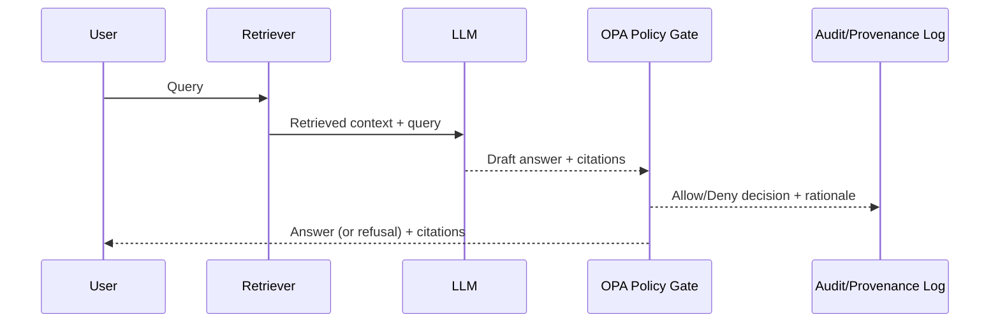

# Kansas Frontier Matrix (KFM)


Kansas Frontier Matrix (KFM) is an **evidence-first geospatial knowledge hub**: datasets, maps, narratives, and AI-assisted analysis — **all provenance-linked**.

> [!IMPORTANT]
> **Non‑negotiable invariant:** KFM enforces a clean layered architecture and a **“trust membrane”** at the API/policy boundary.  
> Frontend and external clients never access data stores directly; backend logic must not bypass repository interfaces.

---

## Table of contents

- [What is KFM](#what-is-kfm)
- [Core principles](#core-principles)
- [Architecture overview](#architecture-overview)
- [Quickstart local](#quickstart-local)
- [Repo layout canonical](#repo-layout-canonical)
- [Data lifecycle truth path](#data-lifecycle-truth-path)
- [Focus Mode governed AI](#focus-mode-governed-ai)
- [Governance FAIR CARE and sensitivity](#governance-fair-care-and-sensitivity)
- [CI quality gates](#ci-quality-gates)
- [Contributing](#contributing)
- [Roadmap](#roadmap)
- [License](#license)

---

## What is KFM

KFM integrates:

- **Data pipelines** and interoperable catalogs (STAC/DCAT/PROV)
- A **knowledge graph** + spatial stores (e.g., PostGIS/Neo4j/search indices)
- A **governed API** (REST + GraphQL)
- A **map + timeline UI** with narrative **Story Nodes**
- A governed AI assistant (“**Focus Mode**”) that must **cite sources or abstain**

> [!NOTE]
> This repository may contain multiple deploy profiles (local Compose vs production Kubernetes).  
> If any paths/commands differ in your repo, treat this README as the **canonical intent** and update it alongside the code.

---

## Core principles

- **Provenance-first:** every map layer, export, and AI answer traces to sources.
- **Governed:** policy checks prevent unsafe/sensitive exposure; defaults are “deny/fail closed.”
- **Standards-aligned:** STAC, DCAT, PROV; FAIR + CARE.
- **Reproducible:** deterministic pipelines; verifiable builds; SBOM + provenance attestations.

---

## Architecture overview

```mermaid
flowchart LR
  subgraph Sources
    S1[Public datasets] --> P
    S2[Archives / records] --> P
    S3[Community contributions] --> P
  end

  subgraph Pipelines
    P[Ingest + Normalize + Validate] --> C[Catalog: STAC/DCAT/PROV]
    C --> I[Index: search + vector + graph]
  end

  subgraph Stores
    DB[(Spatial DB / PostGIS)]
    KG[(Knowledge Graph / Neo4j)]
    IX[(Search / Vector index)]
  end

  I --> DB
  I --> KG
  I --> IX

  subgraph Governed_API
    API[REST + GraphQL]
    OPA[OPA Policy Gate\n(fail closed)]
    API --> OPA
  end

  DB --> API
  KG --> API
  IX --> API

  subgraph UI
    UI1[React + TypeScript + MapLibre]
    UI2[Story Nodes + Provenance Panel]
    UI3[Focus Mode\n(cite or abstain)]
  end

  API --> UI1 --> UI2 --> UI3
```

---

## Quickstart (Local)

### Prereqs

- Docker + Docker Compose
- (Optional) Node.js (LTS) and Python 3.x for running tooling outside containers

### Start the dev stack

```bash
cp .env.example .env
docker compose up --build
```

Open:

- UI: `http://localhost:3000`
- API docs (Swagger/OpenAPI): `http://localhost:8000/docs`

### Common local issues

<details>
<summary><strong>Port conflicts, dependency startup, and volume mounts</strong></summary>

- If a service fails on first start, re-run `docker compose up` (dependency order can matter).
- Common ports that may conflict:
  - `5432` (Postgres/PostGIS)
  - `7474` (Neo4j)
  - `8000` (API)
  - `3000` (Web UI)
- If the UI doesn’t hot-reload, verify the compose file mounts the UI source folder (e.g., `web/src`).
- If the API can’t write into `data/`, ensure mounted directories are writable on your host.

</details>

### Try the API / GraphQL

If enabled in your build:

- REST endpoints are visible in Swagger (`/docs`)
- GraphQL is typically available at `/graphql`

Example GraphQL query:

```graphql
query {
  storyNodes {
    id
    title
    yearRange
  }
}
```

---

## Repo layout (canonical)

> [!TIP]
> If you’re unsure what exists in *your* checkout, run `tree -L 2` and align this table to reality.

| Path | Purpose |
|---|---|
| `data/` | Raw/work/processed data + catalogs (STAC/DCAT/PROV) |
| `docs/` | Governed system docs, standards, templates, runbooks |
| `src/` | Backend services (clean layers: domain/usecases/adapters/infrastructure) |
| `web/` | Frontend UI (React/TS + MapLibre) |
| `policy/` | OPA/Rego policy packages (data access + AI output validation) |
| `.github/` | CI workflows and automation |

---

## Data lifecycle (“truth path”)

KFM treats the catalog as a **first-class contract** between pipelines and runtime services.

```text
Raw → Work → Processed → STAC/DCAT/PROV → (DB / Graph / Search) → API → UI → Story Nodes → Focus Mode
```

Rules of thumb:

- **No shortcutting** the pipeline: anything user-facing should map back to catalog + provenance artifacts.
- Promote data only when validation gates pass (schema, policy, sensitivity, licensing).

---

## Focus Mode (governed AI)

Focus Mode is a **retrieval-augmented generation (RAG)** flow constrained to KFM’s internal knowledge base.

- **No open internet access**
- Must **cite sources or abstain**
- Must run a **policy check** (OPA) before returning answers
- Must write provenance/audit logs for traceability



---

## Governance (FAIR + CARE) and sensitivity

> [!WARNING]
> KFM may handle sensitive information (e.g., culturally restricted sites or precise locations).
> **Do not** publish sensitive coordinates, routes, or details without governance review.

Minimum expectations:

- Apply FAIR + CARE practices to data publishing and narratives.
- Use sensitivity tiers and redaction/generalization when required.
- Trigger governance review for Indigenous-related narratives and sensitive layers.

---

## CI quality gates

CI should treat **docs, data, and policy** as governed artifacts.

Recommended gates:

- **Schema validation**: STAC, DCAT v3, PROV-O (JSON Schema / JSON-LD checks)
- **API contracts**: OpenAPI diff + consumer contract tests (`/api/v1/*`)
- **Policy tests**: OPA unit tests for allow/deny decisions
- **E2E checks**: provenance panel, Story Node citation render, Focus Mode citations resolve
- **Supply chain**: SBOM (SPDX) + build provenance attestations (SLSA/in-toto)

---

## Contributing

1. Create a feature branch and open a PR early.
2. Keep changes small and reviewable; prefer reversible steps.
3. Update governed docs with the correct templates and evidence rules.
4. Ensure CI gates pass (docs + data + policies + contracts).

> [!NOTE]
> Documentation contributions are treated as first-class engineering work.
> If you change behavior, update the doc + schema/policy/contract together.

---

## Roadmap

- [ ] Foundations: repo inventory, lockfiles, CI baseline, doc canonical map
- [ ] Contracts & governance: OpenAPI+GraphQL checks; Story Node schema validation; OPA baseline policies
- [ ] Pipeline hardening: deterministic runs; STAC/DCAT/PROV validators; run-level provenance
- [ ] Focus Mode hardening: cite-or-abstain; audit ledger; evaluation harness
- [ ] UI provenance UX: provenance panel; citation UX; Story Node browsing; export watermarking
- [ ] Productionization: Kubernetes manifests; observability; SBOM/provenance; security verification

---

## License

See `LICENSE`.

If this repo includes third-party datasets or excerpts:
- preserve upstream attribution,
- retain license notices,
- and record provenance in catalog metadata.

---