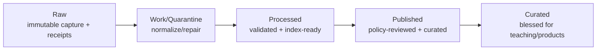
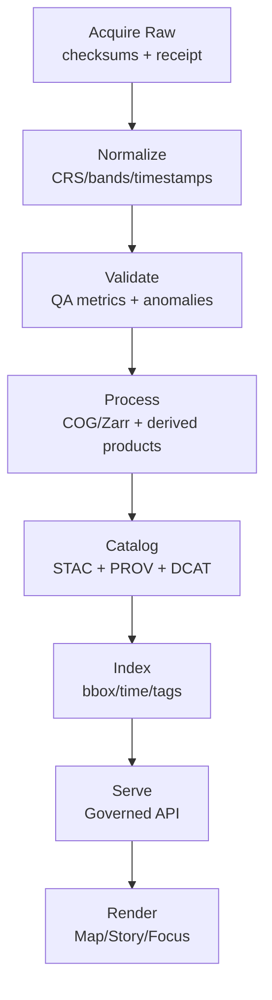

# Kansas-Frontier-Matrix

<details>
<summary><strong>■ Metadata (MetaBlock v2)</strong></summary>

| field | value |
|---|---|
| doc_kind | universal_doc |
| id | kfm.repo.readme |
| title | Kansas-Frontier-Matrix |
| status | draft |
| last_updated | 2026-02-19 |
| owners | kfm:team:core |
| sensitivity | public |
| licenses | CC-BY-4.0 |
| evidence_policy.focus_mode | cite_or_abstain |
| evidence_policy.redaction_profile | public_default |

```kfm-meta
{
  "doc_kind": "universal_doc",
  "id": "kfm.repo.readme",
  "title": "Kansas-Frontier-Matrix",
  "status": "draft",
  "last_updated": "2026-02-19",
  "owners": ["kfm:team:core"],
  "sensitivity": "public",
  "licenses": ["CC-BY-4.0"],
  "repo": {
    "root_name": "Kansas-Frontier-Matrix",
    "product_short_name": "KFM"
  },
  "evidence_policy": {
    "focus_mode": "cite_or_abstain",
    "redaction_profile": "public_default"
  }
}
```

</details>

<!-- Badges: wire these to real workflows once .github/workflows exist -->


**Kansas-Frontier-Matrix** is the repository + system root.  
**KFM** is the product shorthand used in docs, schemas, APIs, and the UI.

Kansas-Frontier-Matrix (KFM) is a **governed spatio‑temporal knowledge platform** that turns Kansas data—remote sensing, hydrology, air quality/smoke, soil, resources, infrastructure (roads/bridges), economy, migration, flora/fauna, weather, disasters, geology (incl. core samples), history/archaeology, education, and science—into:

- 🗺️ **Map layers** that are time-aware and policy-labeled
- 📖 **Story Mode** narratives that show the “why” with auditable evidence
- 🔎 **Focus Mode** answers that are **cite‑or‑abstain**
- 🧪 **What‑if scenarios** with deterministic run receipts and reproducible outputs
- 📦 **Exportable notebooks** (Kaggle-ready) for specific science projects and public demos
- 🗃️ **Past collections** (archives/oral histories/newspapers/scanned documents) treated as **first‑class governed sources**

> [!IMPORTANT]
> **Fail‑closed governance is a feature, not a restriction.**  
> If schema/QA/policy/provenance cannot be verified, the system must **not** publish.

---

## Table of contents

- [Canonical truth path](#canonical-truth-path)
- [Non-negotiable invariants](#non-negotiable-invariants)
- [Data domains](#data-domains)
- [Kansas source registry](#kansas-source-registry)
- [Past collections and archives](#past-collections-and-archives)
- [First-party collections](#first-party-collections)
- [Source coverage gate](#source-coverage-gate)
- [Remote sensing and gridded products](#remote-sensing-and-gridded-products)
- [Connector contract](#connector-contract)
- [Governed API](#governed-api)
- [Notebooks and Kaggle exports](#notebooks-and-kaggle-exports)
- [What-if scenarios](#what-if-scenarios)
- [Repository layout](#repository-layout)
- [Contributing](#contributing)
- [Security and sensitivity](#security-and-sensitivity)
- [Glossary](#glossary)

---

## Canonical truth path

**No bypasses.** Every layer, story, export, and Focus answer follows the same chain:

**Data Sources → Pipelines → Catalogs/Provenance → Storage/Index → Governed API → UI/Story + Focus**

### Data lifecycle zones (append-only promotion)



---

## Non-negotiable invariants

### 1) Trust membrane (hard boundary)
- The browser/UI **never** reads from databases, search, or object storage directly.
- All access flows through the **Governed API** (auth + policy + audit + provenance).
- Presigned URLs (if used) are issued **server-side after policy** and are **short-lived**.

### 2) Promotion gates (CI enforced; fail closed)
Nothing becomes **Published/Curated** unless CI verifies:
- ✅ domain schema validation
- ✅ QA metrics + anomaly report
- ✅ policy labels + redaction rules declared
- ✅ provenance completeness (PROV)
- ✅ catalogs emitted (DCAT always; STAC for spatial assets)
- ✅ deterministic IDs + immutable versions + checksums (and attestations where required)

### 3) Focus Mode is cite-or-abstain
- Every user-visible claim must cite governed evidence.
- If evidence is missing or blocked by policy, Focus Mode must **abstain** or return a “needs verification” response with an audit receipt.

### 4) Deterministic identity & immutability
- Stable dataset IDs
- Immutable/content-addressed dataset versions
- No overwrite; new versions only

---

## Data domains

KFM treats Kansas as a **spatio-temporal fabric**: environment + built systems + people + history + science.

### Domain matrix (how things are governed)

| Domain | Examples | Primary forms | Required catalogs | Typical QA gates | Sensitivity default |
|---|---|---|---|---|---|
| Remote sensing | satellite imagery, land cover, crop vigor, smoke | rasters, grids | DCAT + STAC + PROV | georeg + timestamps + nodata + stats | public/varies |
| Weather & climate | station series, reanalysis, radar composites | time series, grids | DCAT (+STAC if spatial) + PROV | units + continuity + outliers | public |
| Hydrology | streamflow, flood extents, aquifers | time series, vectors, grids | DCAT (+STAC if spatial) + PROV | topology + gauge sanity + CRS | public/varies |
| Soil & agriculture | SSURGO, cropland layers, crop stats | vectors, grids, tables | DCAT (+STAC if spatial) + PROV | range checks + joins | public |
| Geology & resources | mineral layers, induced seismicity, core samples | vectors, tables, scans | DCAT + PROV (+STAC if spatial/scans) | schema + location generalization | **restricted by default** |
| Transportation & infra | **KDOT** roads/bridges/traffic/projects | vectors, tables | DCAT + PROV | network validity + geometry + timestamps | public/varies |
| Economy & migration | census/ACS, NASS, IRS migration | tables | DCAT + PROV | totals + continuity + definitions | public |
| Flora & fauna | GBIF, eBird, iNaturalist, habitats | points, polygons | DCAT + PROV | coordinate plausibility | sensitive species restricted |
| Hazards & disasters | wildfire perimeters, storm events, drought | vectors, rasters, tables | DCAT (+STAC if spatial) + PROV | event integrity + timestamps | public |
| **Past collections & archives** | oral histories, scanned gov docs, historic newspapers, archival photos/letters | text, media, PDFs, scans | **DCAT + PROV** (+STAC if georeferenced) | rights/consent + PII checks + citation completeness + OCR quality | public/varies (often **restricted-by-default**) |
| History & archaeology | figures, facts, KHRI summaries | text, tables, generalized geometry | DCAT + PROV | citation completeness | **restricted by default** |
| Land & ownership | patents, PLSS, parcels (if licensed) | vectors, tables | DCAT + PROV | joins + privacy rules | restricted by default |
| Public safety (stats only) | aggregated crime and justice indicators | tables | DCAT + PROV | suppression thresholds | public stats only |
| Education & discovery | institutions, research outputs | tables, docs | DCAT + PROV | source credibility | public |
| **First‑party collections** | KFM field plots, inspections, photo+GPS, digitized legacy materials | vectors, tables, media | DCAT + PROV (+STAC if spatial assets) | consent + QA + redaction + chain-of-custody | **restricted by default** |

> [!NOTE]
> “Ingested” does not mean “public.” Publication is a **policy decision** plus a successful **gate**.

---

## Kansas source registry

To prevent “we forgot KDOT/core samples/etc.” KFM maintains a **Source Registry**: the canonical list of expected sources and their governance requirements.

**File:** `catalogs/source_registry.json`

Each entry should declare:
- `source_id` (stable)
- domain tags
- priority (P0/P1/P2)
- required stage (processed/published/curated)
- required catalogs (`dcat`, `stac`, `prov`)
- default sensitivity + redaction profile
- QA profile / thresholds
- authoritative upstream and access pattern (API/bulk/service/manual)

### Starter registry (P0 targets)

> This table is a **starter list**. The real source-of-truth is `catalogs/source_registry.json`.

| P | source_id | Domain | What it unlocks | Sensitivity default |
|---:|---|---|---|---|
| P0 | `kdot.transportation.assets` | roads/bridges | statewide infrastructure layers + bridge/road storylines | public/varies |
| P0 | `fhwa.nbi.kansas` | bridges | independent validation of bridge inventory/condition | public |
| P0 | `fhwa.hpms.kansas` | traffic | AADT, functional class, network measures | public |
| P0 | `kgs.geology.maps` | geology | geologic & physiographic maps, stratigraphy context | public |
| P0 | `kgs.core_samples.index` | core samples | core inventory + generalized location summaries | **restricted** |
| P0 | `usgs.nwis.kansas` | hydrology | gauges, streamflow time series, water conditions | public |
| P0 | `kwo.reservoirs.operations` | hydrology | reservoir ops, policy context, drought/flood narratives | public |
| P0 | `usda.nrcs.ssurgo` | soils | soil properties for crop/water/settlement analysis | public |
| P0 | `usda.nass.quickstats` | agriculture | county/commodity ag stats (time series) | public |
| P0 | `usda.nass.cdl` | remote sensing | annual cropland classification rasters | public |
| P0 | `usgs.nlcd` | remote sensing | land cover change baselines | public |
| P0 | `noaa.ncei.climate` | climate | station climate series + extremes | public |
| P0 | `ksu.mesonet` | weather | near real-time weather observations | public |
| P0 | `irs.migration.county` | migration | county-to-county migration patterns | public |
| P0 | `us_census.acs` | demographics/economy | population, housing, income, commuting | public |
| P0 | `ipums.nhgis` | historical demographics | long-range historical GIS/stat context | public |
| P0 | `blm.glo.land_patents` | land ownership (historic) | homesteads/patents mapping + named historic narratives | public/medium (names) |
| P0 | `blm.plss.grid` | land grid | township-range-section joins and patent geocoding | public |
| P0 | `kshs.kansapedia` | history | figures/facts for Story Mode | public |
| P0 | `kshs.kansas_memory` | archives | primary-source scans/photos for stories | public/varies |
| P0 | `khri.inventory` | archaeology/history | historic resources inventory (generalized sites) | **restricted** |
| P0 | `nifc.wildfire.perimeters` | hazards | wildfire perimeters and trends | public |
| P0 | `noaa.storm_events` | hazards | tornado/hail/wind event baselines | public |
| P0 | `gbif.occurrences` | biodiversity | multi-species observations | public/varies |
| P0 | `ebird.observations` | biodiversity | birds observations + seasonality | medium (sensitive species) |
| P0 | `inaturalist.observations` | biodiversity | citizen science occurrences | medium (sensitive species) |
| P0 | `air_quality.fusion.pm25` | smoke/air quality | smoke/PM2.5 narratives + exposure indicators | public/varies |

### P0 add-ons for past collections (archives/oral history/newspapers/gov docs)

These are **past collections** that KFM treats as governed evidence sources (DCAT + PROV always; STAC when georeferenced).

| P | source_id | Domain | What it unlocks | Sensitivity default |
|---:|---|---|---|---|
| P0 | `kshs.state_archives` | archives | authoritative Kansas state records context (catalog-only unless cleared) | restricted by default |
| P0 | `ks.state_library.kgi` | archives | scanned Kansas agency publications (reports, journals, maps, etc.) | public/varies |
| P0 | `loc.chronicling_america.kansas` | newspapers | historic newspapers corpus (OCR text + images) | public/varies |
| P0 | `kohp.oral_history.interviews` | oral_history | interview audio + transcripts for Story Mode grounding | medium (license + PII) |
| P1 | `nara.kansas_city.records` | archives | federal records relevant to Kansas (homestead, courts, military, agencies) | restricted by default |

> [!WARNING]
> **Land ownership, core samples, archaeology site coordinates, protected species locations, and any “criminal history” beyond aggregated stats are restricted by default.**  
> For archives/oral histories: **treat personal info and usage rights as policy-first concerns.**

---

## Past collections and archives

“Past collections” are not an edge case—they are a core input for **Story Mode evidence** and for **Focus Mode citations**.

KFM supports three distinct archival patterns:

1) **Digitized archives** (photos, letters, diaries, maps, PDFs)
2) **Oral history** (audio + transcripts + structured summaries)
3) **Historic newspapers / government docs** (OCR text at scale)

### Why archives need their own governance profile

Archives often contain:
- personal info about living people (or families)
- culturally restricted information (especially around Indigenous history)
- unclear copyright / reuse terms
- precise location details that should not be published (historic sites, sensitive resources)

> [!IMPORTANT]
> Archives must default to **“restricted until cleared”** when licensing, consent, or sensitivity is ambiguous.

### Archive ingestion pattern (evidence-first)

```mermaid
flowchart TD
  A[Acquire\noriginal files + checksums + receipt] --> B[Normalize\nformats + metadata crosswalk]
  B --> C[Extract\ntext (OCR) + thumbnails + audio segments]
  C --> D[Validate\nrights + PII scan + integrity + OCR quality]
  D --> E[Catalog\nDCAT + PROV\n(+STAC if spatial/georef)]
  E --> F[Index\nsearch + embeddings + entity links]
  F --> G[Serve\nGoverned API\n(evidence resolver)]
  G --> H[Use\nStory Nodes + Focus Mode\n(cite-or-abstain)]
```

### Minimum validation gates for past collections

- ✅ file integrity (checksums match, no corruption)
- ✅ rights/licensing declared (even if “unknown → restricted”)
- ✅ PII/sensitive content handling rule declared (redaction profile)
- ✅ provenance: “where did this file come from, when, how transformed?”
- ✅ stable identifiers (collection_id, item_id, version)
- ✅ citation anchors for Focus Mode (page, timestamp, excerpt range)

> [!NOTE]
> For scanned maps: once georeferenced, treat as spatial assets (STAC Items/Collections).

---

## First-party collections

KFM must also represent **our own historical collections** (field work, inspections, photo+GPS, digitized legacy binders, lab results, etc.) as governed sources—**not** as “misc files.”

### Principles

- First-party collections are **restricted by default** until governance review.
- Consent/authority-to-control is required when data involves communities, private land, or sensitive sites.
- Every collection must have an explicit **collection owner**, **purpose**, and **reuse terms**.

### Registering first-party collections

Add entries to `catalogs/source_registry.json` with a stable prefix, e.g.:

- `kfm.first_party.<collection_slug>`
- `kfm.first_party.<project_slug>.<dataset_slug>`

**Required fields (minimum):**
- `source_id`, `owners`, `license`, `sensitivity`, `redaction_profile`
- consent/authority notes (if applicable)
- retention policy (if needed)
- QA profile

### First-party collection connectors

Field-captured datasets (plots/inspections/photo+GPS/offline workflows) should ingest via the standard connector contract, with extra care around form schemas and device sync.

> [!TIP]
> Keep field forms ↔ DB schemas aligned and versioned. Treat “form schema changes” as breaking changes that require a new dataset version.

---

## Source coverage gate

KFM automates “what’s missing?” as a **fail-closed CI gate**.

### Coverage inputs
- `catalogs/source_registry.json` (expected universe)
- `catalogs/dcat/` (what’s governed)
- `catalogs/stac/` (what’s spatial/time-sliced)
- `catalogs/prov/` (what has lineage)

### Coverage rules (examples)
The gate fails if any **P0** source:
- has no DCAT record, or
- lacks required STAC/PROV catalogs, or
- has missing/invalid sensitivity labels, or
- violates publication rules (restricted data marked public), or
- lacks provenance for any promoted artifact.

### Coverage outputs
- `reports/source_coverage.md` (human-friendly)
- `reports/source_coverage.json` (machine)
- non-zero exit code on policy violation

---

## Remote sensing and gridded products

Remote sensing is treated as first-class, STAC-native, and reproducible.

### Preferred asset formats
- **COG GeoTIFF** for imagery and derived index rasters (tile-friendly)
- **Zarr** for large time-series grids (chunked, cloud-friendly)
- **GeoParquet / FlatGeobuf** for vector derivatives (fast analytics)

### Product taxonomy (what KFM expects)

| Product type | Example | Stored as | Catalog | Notes |
|---|---|---|---|---|
| Scene | Sentinel/Landsat scenes | COG | STAC Item | immutable capture + per-scene QA |
| Mosaic / composite | weekly/monthly composites | COG | STAC Item | derived from scenes; PROV required |
| Index raster | NDVI-like, drought proxy | COG | STAC Item | include units/scale in metadata |
| Gridded time series | precip/temp reanalysis | Zarr/NetCDF | STAC Collection (+Items) | chunk strategy matters |
| Event products | flood extent, fire perimeter raster | COG + vectors | STAC + DCAT | event IDs and timestamps required |
| ML inference | building footprints, crop type model | vectors/rasters | STAC + PROV | model card + provenance required |
| Tiles (rendering) | raster tiles for UI | generated cache | not authoritative | derived convenience only |

### Remote sensing “truth flow”



### Minimum QA metrics (recommended)
- Raster: nodata %, min/max, percentiles, band means/stddev, footprint validity
- Temporal: no future timestamps (unless forecast), monotonic time ordering where expected
- Spatial: CRS + bounds within expected region, pixel size consistency
- Joinability: stable IDs and crosswalks (county, watershed, ecoregion, GeoID)

---

## Connector contract

Every connector implements the same contract:

**discover → acquire → normalize → validate → publish**

Each run must generate:
- `run_manifest.json` (inputs, versions, params, environment hashes)
- `qa_report.json` (metrics, anomalies, thresholds)
- immutable artifacts with checksums
- catalogs:
  - DCAT (always)
  - STAC (for spatial assets)
  - PROV (for lineage)

### Definition of Done (DoD) for any new source
- [ ] added to `catalogs/source_registry.json`
- [ ] DCAT record includes license, owners, cadence, sensitivity, policy tags
- [ ] PROV lineage covers acquire→normalize→validate→publish
- [ ] STAC exists for spatial/remote sensing assets (and georeferenced archival maps)
- [ ] QA thresholds defined and met
- [ ] policy tests pass (OPA/Rego)
- [ ] governed API can serve it with provenance + decision IDs
- [ ] UI can render it without direct storage access
- [ ] **archives/oral histories:** rights + consent + citation anchors are explicitly declared

---

## Governed API

The governed API is the enforcement point.

**Must do:**
1) authenticate + authorize
2) evaluate policy (OPA) + apply redactions/aggregation
3) attach provenance + citations
4) log an auditable receipt (request_id + decision_id + evidence bundle hash)

### Response envelope (required)

```json
{
  "data": {},
  "policy": {
    "label": "public",
    "redactions_applied": [],
    "decision_id": "opa:decision:..."
  },
  "provenance": {
    "bundle_ref": "oci://kfm-evidence/dataset@sha256:...",
    "citations": [
      { "dataset_version": "kfm://dataset/ID@sha256:...", "record_id": "..." }
    ]
  },
  "meta": {
    "request_id": "req_...",
    "generated_at": "2026-02-19T12:34:56Z"
  }
}
```

### Minimal endpoint set (starter)
- `GET /api/v1/datasets`
- `GET /api/v1/datasets/{dataset_id}/versions`
- `POST /api/v1/stac/search` (policy-filtered)
- `POST /api/v1/evidence/resolve` (server-side verification)
- `POST /api/v1/focus/query` (evidence → answer; cite-or-abstain)
- `POST /api/v1/exports/notebook` (policy-approved extracts + manifest)

---

## Notebooks and Kaggle exports

Notebooks are treated as **governed artifacts**, not ad-hoc files.

### Notebook project requirements
- immutable dataset version refs (no “latest”)
- pinned dependencies (lockfile)
- export manifest (checksums + provenance)
- explicit policy label for every included dataset/extract

> [!NOTE]
> Notebooks can be public even if source datasets are not—**only if exports are policy-approved and sanitized**.

---

## What-if scenarios

“What if” is a governed workflow:
- scenario spec (inputs + assumptions)
- deterministic run receipt
- derived layers (policy-labeled)
- citations to source dataset versions
- optional Story Node output (“explain this scenario”)

---

## Repository layout

```text
Kansas-Frontier-Matrix/
├── README.md                          # Root overview: invariants, source universe, how to build
├── apps/
│   └── web/                           # Map UI (layers/timeline), Story Mode, Focus Mode
├── services/
│   ├── api/                           # Governed API (auth + OPA policy + evidence resolver)
│   ├── pipelines/                     # Connectors + orchestration (truth path)
│   │   ├── connectors/
│   │   │   ├── remote_sensing/        # satellite/landcover/crops/smoke; STAC-first
│   │   │   ├── hydrology/             # USGS NWIS, aquifers, reservoirs; time series + event layers
│   │   │   ├── air_quality/           # smoke/PM2.5 fusion products; aggregation-aware
│   │   │   ├── soils_ag/              # SSURGO, NASS, CDL; joins to GeoIDs
│   │   │   ├── transportation_kdot/   # KDOT roads/bridges/traffic/projects; network QA
│   │   │   ├── geology_resources/     # KGS maps/resources/seismic; restricted defaults
│   │   │   ├── core_samples/          # core inventory + generalized summaries; restricted
│   │   │   ├── economy_migration/     # Census/ACS, IRS migration, indicators
│   │   │   ├── biodiversity/          # GBIF/eBird/iNaturalist; sensitive species controls
│   │   │   ├── hazards_disasters/     # wildfire/flood/storm event products
│   │   │   ├── land_records/          # BLM GLO/PLSS; ownership rules + redactions
│   │   │   ├── history_archaeology/   # Kansapedia/Kansas Memory/KHRI; generalized locations
│   │   │   │   └── archives_media/    # KOHP, Chronicling America, KGI, scanned collections (DCAT+PROV)
│   │   │   └── first_party/           # KFM-collected data (plots/inspections/photo+GPS/lab); restricted default
│   │   ├── engine/                    # reusable pipeline primitives (ports/adapters)
│   │   └── specs/                     # deterministic connector specs (versioned)
│   ├── policy/                        # OPA/Rego + tests + redaction profiles
│   ├── scenarios/                     # what-if orchestration + receipts + derived products
│   └── search/                        # indexing pipelines + analyzers
├── catalogs/
│   ├── dcat/                          # Dataset governance metadata (license, owners, sensitivity, cadence)
│   ├── stac/                          # Spatial catalogs (rasters/vectors, time slices)
│   ├── prov/                          # Provenance graphs (lineage of transforms)
│   └── source_registry.json           # Expected universe (drives coverage gate)
├── schemas/
│   ├── docs/                          # MetaBlock v2 schemas + doc-lint rules
│   ├── dcat/                          # DCAT profiles/schemas
│   ├── stac/                          # STAC profiles/extensions used by KFM
│   └── prov/                          # PROV profiles
├── notebooks/
│   ├── templates/                     # Kaggle-ready templates (governed)
│   ├── projects/                      # science projects and scenario notebooks
│   └── exports/                       # generated export bundles (append-only + checksums)
├── docs/
│   ├── universal/                     # Universal docs (MetaBlock v2)
│   ├── story_nodes/                   # Story Nodes (MetaBlock v2)
│   ├── runbooks/                      # ops runbooks
│   └── standards/                     # promotion contract, policy standards, schema rules
├── infra/
│   ├── compose/                       # single-host Linux deployment
│   ├── k8s/                           # Kubernetes/OpenShift manifests
│   └── gitops/                        # ArgoCD/Flux environments
└── .github/
   └── workflows/                      # CI: docs-lint, catalog-lint, policy tests, source-coverage gate
```

---

## Contributing

KFM prefers PR-centric promotion:

1) add/modify connector spec(s) in `services/pipelines/specs/`
2) run connector → generate artifacts + receipts + catalogs
3) ensure `catalogs/source_registry.json` is updated (or confirm it already includes the source)
4) open PR containing:
   - catalogs (DCAT/STAC/PROV)
   - QA reports + receipts
   - evidence bundle references (digests)
5) CI enforces gates (fail closed)
6) merge promotes to Published/Curated (per policy)

> [!TIP]
> For past collections: treat the **collection** as a dataset (DCAT), treat each ingest run as provenance (PROV),
> and treat spatially referenced scans/maps as STAC assets.

---

## Security and sensitivity

Some domains are inherently sensitive and default to restricted handling:
- land ownership / parcel-level details
- core sample exact locations and certain resource layers (policy dependent)
- archaeology site coordinates and protected sites
- protected species precise locations
- public safety beyond aggregated statistics
- **archives/oral histories containing PII or culturally restricted narratives**
- critical infrastructure details

Default behavior:
- generalize/redact location where needed
- suppress small counts
- publish summaries/aggregates only unless explicitly cleared
- log policy decisions (decision IDs) for auditability

---

## Glossary

- **DCAT** — dataset governance catalog (license, ownership, cadence, sensitivity)
- **STAC** — SpatioTemporal Asset Catalog (collections/items for spatial assets)
- **PROV** — provenance graph (what transformed what, when, and how)
- **OPA/Rego** — policy engine and policy language
- **COG** — Cloud Optimized GeoTIFF
- **Zarr** — chunked array format for large gridded time series
- **OCR** — Optical Character Recognition (extract text from scans/PDFs; must be quality-checked)
