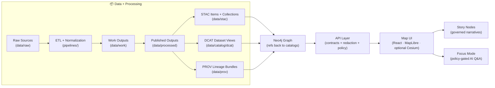
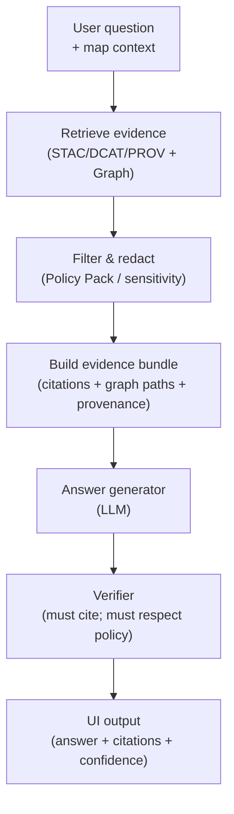

# Kansas Frontier Matrix System (KFM) 🧭🗺️  
> A **provenance-first, evidence-backed** “living atlas” of Kansas — where **data, maps, narratives, and AI** stay traceable to sources.  
> **North Star:** *Every pixel and every sentence has receipts.* 🧾✅


%20%2B%20GraphQL-informational)
-informational)

-informational)


---

## 🧭 Start here (fast orientation)
- 📘 **System + repo blueprint:** `docs/MASTER_GUIDE_v13.md`  
- 🧱 **Architecture decisions & diagrams:** `docs/architecture/`  
- 🧩 **Schemas & contracts (STAC/DCAT/PROV/Story Nodes/UI):** `schemas/`  
- 🗂️ **Catalog outputs:** `data/stac/` · `data/catalog/dcat/` · `data/prov/`  
- 🧠 **AI + Focus Mode design:** see **AI System Overview** doc + `mcp/` for model cards & evaluations  
- 🎬 **Stories:** `story_nodes/` (draft + published)

> 💡 KFM is intentionally **contract-first + policy-gated**: you can’t “ship” a dataset, story, or AI answer unless it validates.

---

## 📌 Table of Contents
- [What this is](#-what-this-is)
- [The Trust Contract](#-the-trust-contract)
- [Core concepts](#-core-concepts)
- [What you can do with KFM](#-what-you-can-do-with-kfm)
- [Architecture at a glance](#-architecture-at-a-glance)
- [Policy + QA gates](#-policy--qa-gates)
- [Repository layout](#-repository-layout)
- [Quickstart](#-quickstart)
- [Data lifecycle](#-data-lifecycle)
- [Story Nodes + Focus Mode](#-story-nodes--focus-mode)
- [AI system + automation](#-ai-system--automation)
- [Simulation & modeling](#-simulation--modeling)
- [APIs](#-apis)
- [Governance, ethics, and safety](#-governance-ethics-and-safety)
- [Tooling](#-tooling)
- [Roadmap](#-roadmap)
- [Contributing](#-contributing)
- [Project library](#-project-library)
- [Citation & reuse](#-citation--reuse)

---

## 🌾 What this is
**Kansas Frontier Matrix (KFM)** is an open-source **geospatial + historical knowledge system** (a “living atlas” of Kansas). It is designed to:

- ingest **heterogeneous sources** (rasters, vectors, documents, time series, sensor/streaming feeds)
- publish governed **metadata catalogs**:
  - **STAC** for spatial assets (COGs, tiles, features, 3D)
  - **DCAT** for dataset discovery (JSON-LD)
  - **PROV** for lineage (how outputs were produced, by whom/what, when)
- build a semantically-structured **Neo4j knowledge graph**  
  *(people ⇄ places ⇄ events ⇄ documents ⇄ datasets ⇄ processing runs)*
- serve evidence through **contracted APIs** into a combined **map + narrative UI**
- support governed storytelling via **Story Nodes**
- enable **Focus Mode**: AI-assisted Q&A that is **citation-backed** and **policy-gated**

> 🧠 KFM is built so **every narrative claim can be traced to versioned evidence**, and **every derived data product has explicit lineage** — even simulation outputs.

---

## 🔒 The Trust Contract
These are the project’s guardrails — if we violate them, we’re not building KFM anymore.

### ✅ Non‑negotiables
- **Pipeline ordering is absolute**  
  **ETL → STAC/DCAT/PROV → Graph → API → UI → Story Nodes → Focus Mode**
- **API boundary rule**  
  The **frontend must never query Neo4j directly** — only through the governed API layer (contracts + redaction).
- **Provenance-first**  
  If it shows up in the UI (or in an AI answer), it must be traceable back to cataloged sources and provable processing — no “mystery layers.”
- **Deterministic, idempotent ETL**  
  Pipelines are config-driven, reproducible, and safe to re-run.
- **Evidence-first narrative**  
  No unsourced content in Story Nodes or Focus Mode. AI-generated text must be clearly labeled and accompanied by provenance/confidence metadata.
- **Policy is enforcement, not a suggestion**  
  A **Policy Pack** (OPA/Rego + checks) can **block** promotion of data, stories, or answers if requirements aren’t met.
- **Governance & sovereignty are explicit**  
  FAIR/CARE principles, licensing clarity, sensitivity flags, and review gates are part of the definition of done.

---

## 🧩 Core concepts
### 🧾 The Catalog Triplet (KFM’s “receipt system”)
Every publishable dataset produces the **Triplet**:

- **STAC** → *what exists as geospatial assets (items/collections)*
- **DCAT** → *how people discover & reuse the dataset (JSON-LD record)*
- **PROV** → *how it was made (lineage + run metadata)*

> If a layer is visible, the system can always answer: **what is it, where did it come from, and how was it made?**

### 🧱 “Contracts first”
Before code ships, KFM expects:
- schemas (JSON Schema / profiles) ✅
- policy rules (OPA/Rego) ✅
- testable invariants ✅

### 🧰 “Runs are first-class”
A pipeline run is treated like a build artifact:
- run config + environment
- checksums / manifests
- output inventory
- PROV bundle
- (optional) release bundle metadata (SBOM/supply chain notes)

---

## ✨ What you can do with KFM
### 🗺️ Map + Timeline exploration
- Toggle datasets like layers in a GIS (vector + raster + tiles)
- Navigate time with a **timeline slider** ⏳
- Click features for details, charts, and provenance
- 2D via **MapLibre**, optional 3D via **Cesium** (including **3D Tiles** streaming)

### 🔎 Evidence discovery (not just keyword search)
- Use the graph to discover related datasets, events, people, places, and documents
- Run relationship-aware queries (e.g., “events involving X near Y during Z”)

### 📖 Story Nodes (governed, machine-ingestible storytelling)
- Narratives authored in **Markdown**, synchronized to map state via **JSON step configs**
- Stories can hyperlink entities (people/places/events) into graph-backed panels
- Designed for educators, historians, researchers, and public storytelling

### 🧠 Focus Mode (AI assistant with receipts)
- Ask questions about the current map view, place, time window, or dataset
- Answers are **graph-grounded**, **catalog-backed**, and **citation-backed**
- If evidence is insufficient, Focus Mode must **ask for refinement or decline** (no hallucinated certainty)

### 📦 Offline “education packs” (planned / evolving)
- Ship curated bundles (datasets + stories + tiles) for classrooms and field use  
  *(PMTiles / COGs / lightweight catalogs + a PWA-style UI)*

---

## 🏗️ Architecture at a glance


> 🧩 Every stage consumes the outputs of the previous stage — so you can trace a public-facing story sentence back to the exact input sources and transformations.

---

## 🛡️ Policy + QA gates
KFM treats data like code: **it must compile** (validate + pass policy) before it can ship.

### ✅ Typical CI “hard gates”
| Gate 🧱 | What it prevents 🚫 | Where it runs ⚙️ |
|---|---|---|
| Schema validation | broken contracts, malformed metadata | CI + local |
| STAC validation | invalid items/collections | CI + local |
| DCAT JSON-LD validation | broken discovery records | CI + local |
| PROV validation | missing lineage / incomplete run trace | CI + local |
| Geometry/CRS checks | invalid geometries, missing CRS | CI + pipelines |
| License + attribution checks | unknown or incompatible licenses | CI + review |
| Sensitivity policy checks | leaking restricted info | CI + API runtime |
| Link integrity checks | dead citations, broken references | CI |
| Security scans (deps/secrets) | supply chain & secret leaks | CI |
| Release manifests/checksums | unverifiable releases | CI + releases |

> 🔐 **Fail-closed** is the default: if a dataset/story/answer can’t prove compliance, it does not promote.

---

## 🗂️ Repository layout
This repo follows a **contract-first + evidence-first** structure (v13 blueprint). One canonical home per subsystem — no duplicate “mystery” folders.

```text
📁 .github/
  └─ 📁 workflows/                        # CI, security scans, validation + policy gates

📁 api/                                   # FastAPI backend + GraphQL (governed boundary)
  ├─ 📁 src/
  │  ├─ 📁 domain/                        # Canonical models (contracts reflected here)
  │  ├─ 📁 services/                      # Use-cases (Focus Mode orchestration lives here)
  │  ├─ 📁 adapters/                      # PostGIS / Neo4j / storage / search adapters
  │  └─ 📁 ...                            # auth, routers, etc.
  └─ 📁 scripts/
     └─ 📁 policy/                        # OPA/Rego policy pack + test harness (Conftest)

📁 web/                                   # Frontend app (React + MapLibre + optional Cesium)
📁 pipelines/                             # ETL jobs, transforms, streaming watchers

📁 data/
  ├─ 📁 raw/                              # Raw source drops (read-only; checksums tracked)
  ├─ 📁 work/                             # Intermediate outputs
  │  └─ 📁 sims/                           # kfm-sim-run scenario work outputs (deterministic)
  ├─ 📁 processed/                        # Published outputs (COG/GeoParquet/PMTiles/3D Tiles)
  ├─ 📁 stac/
  │  ├─ 📁 collections/                   # STAC Collections
  │  └─ 📁 items/                         # STAC Items
  ├─ 📁 catalog/
  │  └─ 📁 dcat/                          # DCAT outputs (JSON-LD)
  ├─ 📁 prov/                              # PROV bundles (per run / per dataset)
  └─ 📁 graph/
     ├─ 📁 csv/                            # Graph import CSV exports
     └─ 📁 cypher/                         # Constraints / post-import scripts

📁 story_nodes/                            # Story Nodes (governed narratives)
  ├─ 📁 draft/
  └─ 📁 published/
     └─ 📁 <story_slug>/
        ├─ 📄 story.md
        ├─ 📄 story.json
        └─ 📁 assets/

📁 schemas/                                # JSON Schemas for STAC/DCAT/PROV/story/ui/telemetry
  ├─ 📁 stac/
  ├─ 📁 dcat/
  ├─ 📁 prov/
  ├─ 📁 storynodes/
  ├─ 📁 ui/
  └─ 📁 telemetry/

📁 tools/
  ├─ 📁 validation/                        # Validators, link checks, policy checks
  └─ 📁 rs/                                # Rust tooling (fast validators/tilers/etc.)

📁 docs/
  ├─ 📄 MASTER_GUIDE_v13.md                # Canonical pipeline & structure reference
  ├─ 📄 glossary.md
  ├─ 📁 architecture/                      # Blueprints, ADRs, diagrams
  ├─ 📁 standards/                         # STAC/DCAT/PROV profiles, repo standards
  ├─ 📁 governance/                        # ethics, sovereignty, review gates
  └─ 📁 guides/                            # pipeline + story node how-tos

📁 mcp/                                    # Methods & Computational Experiments (runs, model cards)
📁 tests/                                  # Unit/integration tests
📁 releases/                               # Versioned bundles, manifests, checksums, SBOMs

📄 README.md                                # You are here 🙂
📄 LICENSE
📄 CITATION.cff
📄 CONTRIBUTING.md
📄 SECURITY.md
📄 CHANGELOG.md
📄 docker-compose.yml
📄 .env.example
```

---

## ⚡ Quickstart
> 🧰 KFM is intentionally modular. Use Docker for dependencies + local dev for API/UI.

### 1) Prerequisites
- **Docker + Docker Compose** (recommended)
- **Python 3.11+** (API + pipelines)
- **Node.js 18+** (web UI)
- **Rust stable** (optional, for `tools/rs`)
- Common in geospatial stacks: **GDAL** + **PostgreSQL/PostGIS** tooling

### 2) Bring up core services
```bash
cp .env.example .env
docker compose up -d
```

### 3) Run the API (example)
```bash
cd api
python -m venv .venv && source .venv/bin/activate
pip install -r requirements.txt
uvicorn kfm_server.main:app --reload
```

### 4) Run the web app (example)
```bash
cd web
npm install
npm run dev
```

### 5) Verify
- API docs (OpenAPI/Swagger): `http://localhost:8000/docs` *(or your configured port)*
- UI: `http://localhost:5173` *(or your configured port)*

---

## 📦 Data lifecycle
KFM treats data like code: **it must compile** before it can ship.

### Required staging (always)
- `data/raw/` → **ingest only** (read-only source drops + checksums)
- `data/work/` → intermediate transforms (re-runnable)
- `data/processed/` → published outputs (what the world can depend on)

### Required boundary artifacts (before “published”)
Every published dataset must generate:
- **STAC** records → `data/stac/collections/` + `data/stac/items/`
- **DCAT** dataset entry (JSON-LD) → `data/catalog/dcat/`
- **PROV** lineage bundle → `data/prov/`

### “No mystery layers”
If it can be toggled in the UI, it must have:
- a dataset contract + discoverability metadata (DCAT)
- spatial asset metadata (STAC)
- lineage (PROV)
- validators + policy checks passing in CI
- provenance visible to users (not hidden behind “trust me”)

---

## 📖 Story Nodes + Focus Mode
### Story Nodes = governed narrative as data
A Story Node is typically:
- `story.md` (Markdown narrative, citations, annotations)
- `story.json` (step-by-step map/timeline instructions)
- `/assets/` (images, figures, supporting media)

**Story Node rules (high level):**
- Every factual claim has a citation to cataloged sources
- Key entities (people/places/events/documents) reference stable graph IDs (or stable dataset IDs)
- Facts vs interpretation are clearly separated

### Focus Mode = AI answers with evidence
Focus Mode:
- relies on the **graph + catalogs** as the contextual knowledge base
- surfaces references and provenance for datasets, events, and documents
- is guarded by **hard-gate rules** to prevent unsourced claims entering the system

> 🧾 Focus Mode is not “chat that guesses.” It’s **retrieval + grounding + receipts + policy**.

---

## 🤖 AI system + automation
KFM’s AI design is intentionally boring in the best way: **auditable, policy-gated, and provenance-linked**.

### 🧠 Focus Mode pipeline (conceptual)


### 🛠️ Watcher → Planner → Executor (W‑P‑E) agents (optional / gated)
The project proposes a structured automation loop:
- **Watcher**: detects stale metadata, broken links, drift, missing provenance, schema changes
- **Planner**: proposes a minimal, reviewable change plan
- **Executor**: opens PRs with deterministic fixes (never silently edits production)

> 🧯 **Kill-switch** is part of the design: if automation becomes risky, it can be disabled globally.

### 🔐 AI safety posture (high level)
- prompt-injection resistant retrieval (policy + allowlists)
- citations required for factual claims
- sensitive data redaction enforced by policy
- telemetry & evals tracked in `mcp/` (model cards, drift monitoring, regression tests)

---

## 🧪 Simulation & modeling
KFM treats simulations the same way it treats datasets: **as publishable, reproducible evidence**.

### `kfm-sim-run` pattern (planned / evolving)
- deterministic simulation runner (inputs + configuration + version pins)
- outputs stored under `data/work/sims/` then promoted to `data/processed/`
- simulation results get STAC/DCAT/PROV like any other dataset
- UI can render outputs as time-aware layers + dashboards

### Why this matters
- scenario planning (hydrology, climate impacts, land use change)
- uncertainty becomes visible (confidence bands, model assumptions)
- “model output” becomes **auditable public knowledge**, not a black box

---

## 🔌 APIs
### REST (FastAPI)
- Contracted endpoints with **OpenAPI/Swagger** schemas
- Intended for both UI consumption and external integrations

### GraphQL
- Best for relationship-heavy queries (people ⇄ events ⇄ places)
- Resolver guardrails: depth limits, pagination, cost controls

### Tiles & assets (common patterns)
- raster via COG (range requests) + optional caching
- vector tiles via PostGIS (MVT) or prebuilt PMTiles
- 3D via 3D Tiles (Cesium)

> 🧱 Boundary reminder: UI uses APIs; APIs talk to PostGIS + Neo4j + storage.

---

## 🛡️ Governance, ethics, and safety
KFM is built to be **adoptable by institutions** (schools, libraries, agencies) without compromising trust:

### 🌿 Governance principles
- **FAIR**: findable, accessible, interoperable, reusable metadata
- **CARE / sovereignty**: explicitly consider sensitive data & community impact
- **Licensing clarity**: dataset licenses are first-class metadata (no ambiguity)
- **Review gates**: contributions validated (schemas, provenance, link integrity, policy)
- **Public trust UX**: provenance isn’t hidden — it’s part of the UI

### 🔐 Security posture
- secrets scanning + dependency scanning
- policy-as-code enforcement (OPA/Rego)
- supply chain posture (manifests, checksums; SBOM concepts included in roadmap)
- responsible disclosure (see `SECURITY.md`)

---

## 🧰 Tooling
### `tools/` (validators + helpers)
Typical responsibilities:
- validate dataset contracts (STAC/DCAT/PROV + KFM extensions)
- run link checks, schema checks, policy checks
- generate graph import artifacts
- produce release manifests + checksums (+ SBOM scaffolding where used)

### `tools/rs/` (Rust tooling 🚀)
Rust is ideal for:
- fast validation on large catalogs
- tiling / packaging utilities
- batch transforms that benefit from speed and memory safety

### `mcp/` (Methods & Computational Experiments)
A governed space for:
- reproducible notebooks
- model cards + eval results
- experiment runs and outputs that must be cataloged + provenanced if promoted to “published”

---

## 🧭 Roadmap
Directionally consistent goals (from current project docs + future proposals):

### Near-term ✅🧱
- ✅ Schema + validator mindset (“metadata must compile”)
- ✅ CI catalog QA gates (broken provenance, missing licenses, invalid geometry/CRS)
- 🧾 Provenance UX hardening (make it impossible to ignore receipts)
- 🛰️ Remote sensing pipeline templates (Earth Engine / COG-first patterns)

### Medium-term 🧩🚀
- 🧱 Story Builder GUI (Story Nodes for non-devs)
- 📦 Offline “education packs” (PWA mode + curated tiles/datasets/stories)
- 🧪 Simulation runner & dashboards (`kfm-sim-run`)
- 🤖 W‑P‑E automation agents (policy-gated PRs only)

### Long-term 🌐✨
- 🌍 Federation (“Frontier Matrix” blueprint for other regions)
- 🧠 GeoXAI / uncertainty-first UI (confidence + completeness as first-class)
- 🥽 AR/VR extensions (museum/field overlays; guided tours)
- 📚 DOI-backed releases for data snapshots + research workflows

---

## 🤝 Contributing
KFM welcomes contributions from **developers and domain experts** (historians, educators, scientists, cartographers).

### Contribution types (how to think about changes)
- **(A) New data / domain**: add raw sources → pipeline → publish STAC/DCAT/PROV
- **(B) Story Nodes**: add or improve narratives with citations + map steps
- **(C) Graph enrichment**: new entity types, ontology bindings, new relationships
- **(D) API endpoint/service**: contract-first (schemas first), then implementation + tests
- **(E) UI layer/feature**: register layers; ensure provenance is visible in UI

### Definition of done ✅
A contribution is “done” when:
- schemas/contracts validate
- provenance is complete (STAC/DCAT/PROV)
- policy pack passes (sensitivity/licensing rules)
- tests pass
- governance requirements addressed (FAIR/CARE, licensing, sensitivity)
- CI is green ✅

---

## 📚 Project library
This repo is deliberately “research-backed.” The PDFs below inform architecture, modeling, geospatial pipelines, UI, governance, security posture, and implementation.

> 🗃️ **Important:** Several files are **PDF portfolios** (they contain embedded PDFs).  
> To extract embedded files on Linux/macOS:  
> `pdfdetach -saveall "<portfolio>.pdf"` *(Poppler)*

<details>
  <summary><b>🧭 Core KFM design docs (project source-of-truth)</b></summary>

- 🌟 **Kansas Frontier Matrix – Latest Ideas & Future Proposals** *(future-facing backlog + QA/security ideas)*
- 📚 **KFM Data Intake – Technical & Design Guide** *(how ingestion, validation, and promotion works)*
- 🧠 **KFM – AI System Overview 🧭🤖** *(Focus Mode + W‑P‑E automation architecture)*
- 🏗️ **KFM – Comprehensive Architecture, Features, and Design** *(end-to-end system blueprint)*
- 🧾 **KFM – Comprehensive Technical Documentation** *(deep technical spec + governance posture)*
- 🖥️ **KFM – Comprehensive UI System Overview** *(map + timeline + story + evidence UX)*
- 💡 **Innovative Concepts to Evolve KFM** *(AR/digital twins/community verification ideas)*

</details>

<details>
  <summary><b>🤖 AI Concepts & more (PDF portfolio: embedded documents)</b></summary>

- A Developer’s Guide to Building AI Applications - English.pdf  
- A Gentle Introduction to Symbolic Computation.pdf  
- AI Foundations of Computational Agents 3rd Ed.pdf  
- Artificial Intelligence & Machine Learning in Health Care & Medical Sciences.pdf  
- Artificial Neural Networks Models & Applications.pdf  
- Artificial-neural-networks-an-introduction.pdf  
- Basics of Linear Algebra for machine Learning  
- Data Science &-  Machine Learning  
- Deep Learning for Coders with fastai and PyTorch - Deep.Learning.for.Coders.with.fastai.and.PyTorchpdf.pdf  
- Deep Learning with Python.pdf  
- Foundations of Machine Learning - Foundations_of_Machine_Learning.pdf  
- Gradient Expectations - Stucture, Origins, & Synthesis Of Predictive Neural Networks.pdf  
- Introduction to Digital Humanism.pdf  
- Introduction to Machine Learning with Python - Introduction to Machine Learning with Python.pdf  
- Neural Network Architectures and Activation Functions_ A Gaussian Process Approach - 106621.pdf  
- Neural Network Toolbox User_s Guide - nnet.pdf  
- Neural Networks Using C# Succinctly - Neural_Networks_Using_C_Sharp_Succinctly.pdf  
- On the path to AI Law’s prophecies and the conceptual foundations of the machine learning age.pdf  
- Pattern Recognition and Machine Learning.pdf  
- Principles of Biological Autonomy - book_9780262381833.pdf  
- Recurrent Neural Networks for Temporal Data Processing.pdf  
- Regression analysis using Python - slides-linear-regression.pdf  
- Volume 1 Machine Learning under Resource Constraints - Fundamentals .pdf  
- Volume 2 Machine Learning under Resource Constraints - Discovery in Physics .pdf  
- Volume 3 Machine Learning under Resource Constraints - Applications.pdf  
- artificial-intelligence-a-modern-approach.pdf  
- artificial-neural-networks-in-real-life-applications.pdf  
- deep-learning-in-python-prerequisites.pdf  
- haykin.neural-networks.3ed.2009.pdf  
- java-artificial-intelligence-made-easy-w-java-programming.pdf  
- neural networks and deep learning.pdf  
- neural-network-design.pdf  
- neural-network-learning-theoretical-foundations.pdf  
- python-machine-learning-a-crash-course-for-beginners-to-understand-machine-learning-artificial-intelligence-neural-networks-and-deep-learning-with-scikit-learn-tensorflow-and-keras.pdf  
- regression-analysis-with-python.pdf  
- understanding-machine-learning-theory-algorithms.pdf  

</details>

<details>
  <summary><b>🗄️ Data management, data science, Bayesian methods (PDF portfolio: embedded documents)</b></summary>

- An Introduction to Statistical Learning.pdf  
- Architecture of Advanced Numerical Analysis Systems - 978-1-4842-8853-5.pdf  
- Bayesian Methods for Hackers Probabilistic Programming and Bayesian Inference.pdf  
- Bayesian computational methods.pdf  
- Bio-Inspired Computational Algorithms & Their Applications.pdf  
- Comprehensive CI_CD Guide for Software and Data Projects.pdf  
- Data Mining Concepts & applictions.pdf  
- Data Science_ Theories, Models, Algorithms, and Analytics - DSA_Book.pdf  
- Data Spaces.pdf  
- Database Performance at Scale.pdf  
- Foundations of Machine Learning - Foundations_of_Machine_Learning.pdf  
- Genetic Programming New Approaches & Successfull Applications.pdf  
- Git Notes for Professionals - GitNotesForProfessionals.pdf  
- Gradient Expectations - Stucture, Origins, & Synthesis Of Predictive Neural Networks.pdf  
- Haskell Notes for Professionals - HaskellNotesForProfessionals.pdf  
- Hibernate Notes for Professionals - HibernateNotesForProfessionals.pdf  
- Recurrent Neural Networks for Temporal Data Processing.pdf  
- Scalable Data Management for Future Hardware.pdf  
- Statistics Done Wrong - Alex_Reinhart-Statistics_Done_Wrong-EN.pdf  
- The Data Engineering Cookbook.pdf  
- The Data Lakehouse Platform For Dummies.pdf  
- The Elements of Statistical Learning.pdf  
- Theory & Practice of Cryptography & Network Security Protocols & Technologies.pdf  
- Understanding Statistics & Experimental Design.pdf  
- an-introduction-to-the-finite-element-method.pdf  
- bayes-rule-a-tutorial-introduction-to-bayesian-analysis.pdf  
- clean-architectures-in-python.pdf  
- haykin.neural-networks.3ed.2009.pdf  
- implementing-programming-languages-an-introduction-to-compilers-and-interpreters.pdf  
- numerical-methods-in-engineering-with-matlab.pdf  
- think-bayes-bayesian-statistics-in-python.pdf  

</details>

<details>
  <summary><b>🛰️ Maps, virtual worlds, archaeology, geospatial WebGL (PDF portfolio: embedded documents)</b></summary>

- Archaeological 3D GIS_26_01_12_17_53_09.pdf  
- Computer Graphics using JAVA 2D & 3D.pdf  
- DesigningVirtualWorlds.pdf  
- Geographic Information System Basics - geographic-information-system-basics.pdf  
- Google Earth Engine Applications.pdf  
- Map Reading & Land Navigation.pdf  
- Spectral Geometry of Graphs.pdf  
- Understanding_Map_Projections.pdf - 710understanding_map_projections.pdf  
- geoprocessing-with-python.pdf  
- google-maps-javascript-api-cookbook.pdf  
- graphical-data-analysis-with-r.pdf  
- making-maps-a-visual-guide-to-map-design-for-gis.pdf  
- python-geospatial-analysis-cookbook-over-60-recipes-to-work-with-topology-overlays-indoor-routing-and-web-application-analysis-with-python.pdf  
- webgl-programming-guide-interactive-3d-graphics-programming-with-webgl.pdf  

</details>

<details>
  <summary><b>🧑‍💻 Various programming languages & engineering references (PDF portfolio: embedded documents)</b></summary>

- Algorithms Notes for Professionals - AlgorithmsNotesForProfessionals.pdf  
- An Introduction to Spatial Data Analysis and Visualisation in R - An Introduction to Spatial Data Analysis in R.pdf  
- Angular 2+ Notes for Professionals - Angular2NotesForProfessionals.pdf  
- AngularJS Notes for Professionals - AngularJSNotesForProfessionals.pdf  
- Bash Notes for Professionals - BashNotesForProfessionals.pdf  
- C Notes for Professionals - CNotesForProfessionals.pdf  
- C# Notes for Professionals - CSharpNotesForProfessionals.pdf  
- C++ Notes for Professionals - CPlusPlusNotesForProfessionals.pdf  
- CSS Notes for Professionals - CSSNotesForProfessionals.pdf  
- Cloud-Based Remote Sensing with Google Earth Engine-Fundamentals and Applications.pdf  
- Comprehensive CI_CD Guide for Software and Data Projects.pdf  
- Crafting a Compiler.pdf  
- Entity Framework Notes for Professionals - EntityFrameworkNotesForProfessionals.pdf  
- Essentials of Compilation - An Incremental Approach  
- Excel VBA Notes for Professionals - ExcelVBANotesForProfessionals.pdf  
- Free Android Development Book.pdf  
- Generalized Topology Optimization for Structural Design.pdf  
- HTML5 Canvas Notes for Professionals - HTML5CanvasNotesForProfessionals.pdf  
- HTML5 Notes for Professionals - HTML5NotesForProfessionals.pdf  
- Handbook Of Applied Cryptography  
- Introduction to Numerical Methods for Variational Problems.pdf  
- Introduction to finite element methods.pdf  
- Introduction-to-Docker.pdf  
- Java Notes for Professionals - JavaNotesForProfessionals.pdf  
- JavaScript Notes for Professionals - JavaScriptNotesForProfessionals.pdf  
- Kotlin Notes for Professionals - KotlinNotesForProfessionals.pdf  
- LaTeX Notes for Professionals - LaTeXNotesForProfessionals.pdf  
- Linux Notes for Professionals - LinuxNotesForProfessionals.pdf  
- MATLAB Notes for Professionals - MATLABNotesForProfessionals.pdf  
- MATLAB Programming for Engineers Stephen J. Chapman.pdf  
- Matlab-Modeling, Programming & Simulations.pdf  
- Microsoft SQL Server Notes for Professionals - MicrosoftSQLServerNotesForProfessionals.pdf  
- MongoDB Notes for Professionals - MongoDBNotesForProfessionals.pdf  
- MySQL Notes for Professionals - MySQLNotesForProfessionals.pdf  
- NET Framework Notes for Professionals - DotNETFrameworkNotesForProfessionals.pdf  
- Node.js Notes for Professionals - NodeJSNotesForProfessionals.pdf  
- OCaml Practice.pdf  
- Objective-C Notes for Professionals - ObjectiveCNotesForProfessionals.pdf  
- Oracle Database Notes for Professionals - OracleDatabaseNotesForProfessionals.pdf  
- PHP Notes for Professionals - PHPNotesForProfessionals.pdf  
- Perl Notes for Professionals - PerlNotesForProfessionals.pdf  
- PostgreSQL Notes for Professionals - PostgreSQLNotesForProfessionals.pdf  
- PowerShell Notes for Professionals - PowerShellNotesForProfessionals.pdf  
- Python Notes for Professionals - PythonNotesForProfessionals.pdf  
- R Notes for Professionals - RNotesForProfessionals.pdf  
- React JS Notes for Professionals - ReactJSNotesForProfessionals.pdf  
- React Native Notes for Professionals - ReactNativeNotesForProfessionals.pdf  
- Ruby Notes for Professionals - RubyNotesForProfessionals.pdf  
- Ruby on Rails Notes for Professionals - RubyOnRailsNotesForProfessionals.pdf  
- SQL Notes for Professionals - SQLNotesForProfessionals.pdf  
- ScipyLectures-simple.pdf  
- Solving Ordinary Differential Equations in Python.pdf  
- Solving PDEs in Python.pdf  
- Spring Framework Notes for Professionals - SpringFrameworkNotesForProfessionals.pdf  
- Swift Notes for Professionals - SwiftNotesForProfessionals.pdf  
- The-Data-Engineers-Guide-to-Apache-Spark.pdf  
- The-web-application-hackers-handbook-finding-and-exploiting-security-flaws.pdf  
- TypeScript Notes for Professionals - TypeScriptNotesForProfessionals.pdf  
- VBA Notes for Professionals - VBANotesForProfessionals.pdf  
- Visual Basic .NET Notes for Professionals - VisualBasic_NETNotesForProfessionals.pdf  
- Xamarin.Forms Notes for Professionals - XamarinFormsNotesForProfessionals.pdf  
- applied-data-science-with-python-and-jupyter.pdf  
- black-hat-python-python-programming-for-hackers-and-pentesters.pdf  
- flexible-software-design-systems-development-for-changing-requirements.pdf  
- iOS Developer Notes for Professionals - iOSNotesForProfessionals.pdf  
- jQuery Notes for Professionals - jQueryNotesForProfessionals.pdf  
- python-machine-learning-a-crash-course-for-beginners-to-understand-machine-learning-artificial-intelligence-neural-networks-and-deep-learning-with-scikit-learn-tensorflow-and-keras.pdf  
- responsive-web-design-with-html5-and-css3.pdf  
- software-architecture-patterns.pdf  

</details>

---

## 🧾 Citation & reuse
- For software citation, use **CITATION.cff** (and consider publishing a DOI for releases).
- For data reuse, always consult:
  - dataset **license** fields in metadata
  - **PROV** lineage bundles for processing steps
  - source attribution requirements (no “unknown provenance” data is accepted)

> 📌 If you’re building research outputs on top of KFM, prefer citing a **versioned data release** (snapshot) so results remain reproducible.

---

### 🧭 Final note
KFM’s goal is bigger than “a map.” It’s a **community knowledge system**: open, evidence-driven, and built to scale across time, disciplines, and data types—without losing trust. 🌾🧠🗺️