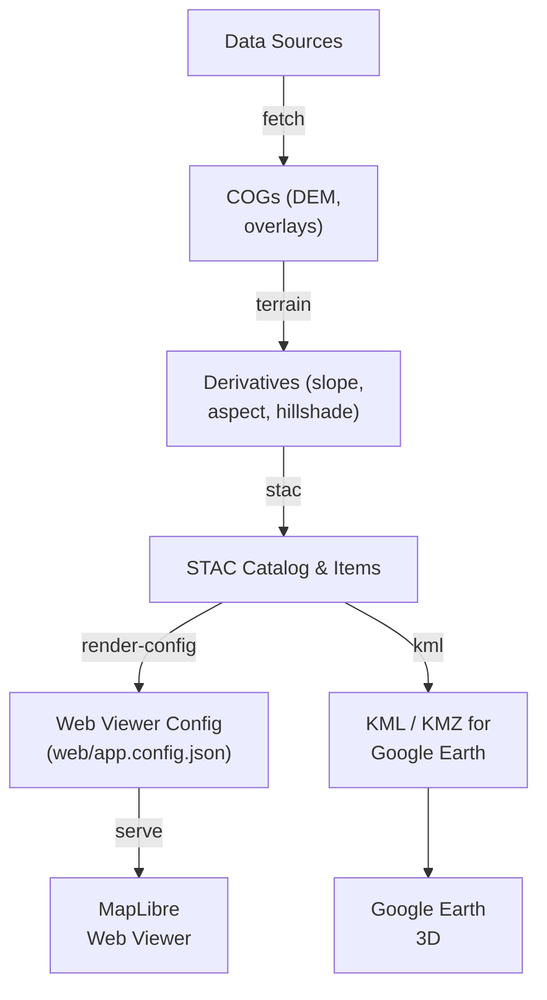

# Kansas Geo Timeline — **Time · Terrain · History**

[](https://github.com/bartytime4life/Kansas-Frontier-Matrix/actions/workflows/site.yml)
[](https://github.com/bartytime4life/Kansas-Frontier-Matrix/actions/workflows/stac-badges.yml)
[](.pre-commit-config.yaml)
[](pyproject.toml)
[](package.json)
[](docker/Dockerfile)
[](stac/catalog.json)
[](web/index.html)
[](LICENSE)

A minimal **Google Earth + Web (GitHub Pages)** mapping system for Kansas elevation and historical layers, built around **STAC 1.0.0** and a reproducible Makefile-driven pipeline.

---

## 📋 Project Metadata

| Component | Minimum / Spec  | Key Files                                                                                                                             | Notes                                      |
| --------- | --------------- | ------------------------------------------------------------------------------------------------------------------------------------- | ------------------------------------------ |
| Python    | **3.10+**       | [`pyproject.toml`](pyproject.toml) · [`requirements.txt`](requirements.txt)                                                           | CLI `kgt`, STAC tools, raster pipeline     |
| Node      | **18+**         | [`package.json`](package.json)                                                                                                        | Optional: docs/dev tooling; web is static  |
| Docker    | Multi-stage     | [`docker/Dockerfile`](docker/Dockerfile) · [`docker/compose.yaml`](docker/compose.yaml)                                               | Reproducible builds; mount data at runtime |
| STAC      | **1.0.0**       | [`stac/catalog.json`](stac/catalog.json) · [`stac/collections/`](stac/collections) · [`stac/items/`](stac/items)                      | Catalog → Collections → Items              |
| Web       | MapLibre viewer | [`web/index.html`](web/index.html) · [`web/app.config.json`](web/app.config.json)                                                     | Time slider; STAC-driven config            |
| CI        | GitHub Actions  | [`.github/workflows/site.yml`](.github/workflows/site.yml) · [`.github/workflows/stac-badges.yml`](.github/workflows/stac-badges.yml) | Build & deploy Pages; STAC checks; badges  |
| Quality   | Hooks & lint    | [`.pre-commit-config.yaml`](.pre-commit-config.yaml)                                                                                  | Ruff, yamllint, prettier, actionlint, etc. |
| License   | MIT             | [`LICENSE`](LICENSE)                                                                                                                  | SPDX-compatible                            |

---

## 🛠 Tech Stack

[](https://rasterio.readthedocs.io/)
[](https://cogeotiff.github.io/rio-cogeo/)
[](https://gdal.org/)
[](https://shapely.readthedocs.io/)
[](https://pystac.readthedocs.io/)
[](https://maplibre.org/)

---

## 📑 Data Sources (tracked in `data/sources/`)

|                                                                           Status                                                                           | ID                    | Title                             | File                                                              | Notes                   |
| :--------------------------------------------------------------------------------------------------------------------------------------------------------: | --------------------- | --------------------------------- | ----------------------------------------------------------------- | ----------------------- |
|                       | `ks_dem_1m`           | Kansas DEM (1 m)                  | [`ks_dem.json`](data/sources/ks_dem.json)                         | ArcGIS ImageServer      |
|  | `usgs_topo_1894_1950` | USGS Historical Topos (KS subset) | [`usgs_historic_topo.json`](data/sources/usgs_historic_topo.json) | HTMC GeoTIFFs           |
|                    | `ks_treaties`         | Kansas Treaties (vectors)         | [`ks_treaties.json`](data/sources/ks_treaties.json)               | Geoparsed treaties      |
|                  | `ks_railroads`        | Kansas Railroads                  | [`ks_railroads.json`](data/sources/ks_railroads.json)             | Historical rail vectors |
|                 | `schema.source`       | Source descriptor schema          | [`schema.source.json`](data/sources/schema.source.json)           | JSON schema             |

✔ = clean STAC validation · ⚠ = warnings · ❌ = failed/missing

---

## 🌐 Live Demo

* **Web Viewer (MapLibre + Time Slider)** → [Demo Site](https://bartytime4life.github.io/Kansas-Frontier-Matrix/web/)
* **Google Earth KMZ (download)** → [Kansas_Terrain.kmz](https://bartytime4life.github.io/Kansas-Frontier-Matrix/earth/Kansas_Terrain.kmz)

---

## 🧭 What this repo delivers

* **Earth deliverables**: regionated **KML/KMZ** (progressive loading via NetworkLinks)
* **Web app**: lightweight **MapLibre** viewer with a **time slider**
* **Catalog**: **STAC 1.0.0** (Catalog → Collections → Items) for clean provenance
* **Pipelines**: `Makefile` targets to **fetch → COG → terrain → STAC → viewer**
* **CLI**: `kgt` (Kansas Geo Timeline) for STAC validation and viewer config rendering

> Start small (one county), then scale out. Keep STAC tight and versioned.

---

## 📊 Pipeline Overview



> Labels are quoted and line-broken (`\n`) so **GitHub’s Mermaid** renders without parser errors.

---

## 📖 Table of Contents

* [Quickstart](#-quickstart)
* [Repository layout](#-repository-layout)
* [Install](#-install)
* [Make targets](#-make-targets)
* [STAC structure](#-stac-structure)
* [Web viewer (MapLibre + time)](#-web-viewer-maplibre--time)
* [Google Earth (KML/KMZ)](#-google-earth-kmlkmz)
* [Checks & reproducibility](#-checks--reproducibility)
* [Collections (Archaeology sites)](#-collections-archaeology-sites)
* [CI: GitHub Pages publish](#-ci-github-pages-publish)
* [Troubleshooting](#-troubleshooting)
* [Roadmap](#-roadmap)
* [Requirements](#-requirements)
* [Status snapshot](#-status-snapshot)

---

## ⚡ Quickstart

```bash
# Python env (3.10+)
python -m venv .venv
. .venv/bin/activate
pip install -r requirements.txt

# 1) Configure sources under data/sources/*.json
make fetch

# 2) Build DEM → COG → terrain
make cogs
make terrain

# 3) Generate and validate STAC
make stac
make stac-validate

# 4) Render viewer config + serve locally
make site-config
python -m http.server -d web 8080
```

---

## 📂 Repository Layout

```
data/                        # inputs/outputs (raw, processed, cogs, derivatives)
  sources/                   # source descriptors (endpoints, CRS, bounds, license)
  processed/                 # vectors rasters post-conversion
stac/                        # STAC 1.0.0: catalog + collections + items
scripts/                     # fetch/convert/derive/validate/index tools
  collections/               # grouped ETL pipelines (e.g., archaeology_sites.sh)
web/                         # static site (MapLibre) for GitHub Pages
earth/                       # KML/KMZ export and NetworkLinks
docker/                      # container env (reproducible build)
```

---

## 🧰 Make targets

Common:

```bash
make fetch             # download per data/sources/*.json
make cogs              # GeoTIFF → COG
make terrain           # hillshade/slope/aspect (COGs)
make stac              # build STAC (auto-patch DEM size/checksum if .sha256 present)
make stac-validate     # validate STAC + sources (scripts or kgt fallback)
make site-config       # render web/app.config.json from STAC items (requires kgt)
```

Optional:

```bash
make validate-cogs     # COG conformance → data/validation/cog_validate.report.json
make regionate         # GeoJSON/KML → regionated KML tree / KMZ
make mosaic-county     # LiDAR mosaic (DEM COG) per county
make dem-checksum      # write+verify .sha256; echo STAC patch lines
```

---

## 📚 STAC Structure

* **Root catalog** → `stac/catalog.json`
* **Collections** → `stac/collections/*.json`
* **Items** → `stac/items/**/*.json`

Validate:

```bash
kgt validate-stac stac/items --no-strict
```

> The Makefile falls back to `kgt validate-stac` when `scripts/validate_stac.py` is not present.

---

## 🖥 Web viewer (MapLibre + time)

* Driven by `web/app.config.json` (generated by `kgt render-config`)
* Time slider: uses `datetime` / `start_datetime` / `end_datetime` on STAC Items
* Thumbnails: for archaeology sites, thumbnails are auto-rendered and linked in STAC items

**Serve locally:**

```bash
make site-config
python -m http.server -d web 8080
```

---

## 🌍 Google Earth (KML/KMZ)

Exports under `earth/`:

```
earth/
  Kansas_Terrain.kmz
  networklinks/
    ks_1m_hillshade.kml
    usgs_topo_1894.kml
```

> Regionation support (KML trees/KMZ) via `scripts/regionate_kml.py` (optional).

---

## ✅ Checks & reproducibility

* `make stac-validate` before commits.
* CI writes `web/badges/*.json` → live ✔/⚠/❌ shields for sources.
* Major artifacts produce `.sha256` + `.meta.json` sidecars.
* `make stac` auto-patches DEM asset size/hash when a `.sha256` sidecar is present (configurable).

---

## 🏺 Collections: Archaeology sites

This collection ingests **site registers** (points/polys), **survey footprints**, and related archaeology vectors.

**End-to-end (Makefile):**

```bash
make arch-sites            # fetch→unpack→process→stac→validate→render (thumbs included)
make arch-sites-validate   # validate + render only
make arch-sites-render     # render only (with thumbs)
```

**Direct (script):**

```bash
bash scripts/collections/archaeology_sites.sh deps    # check deps
bash scripts/collections/archaeology_sites.sh init    # create starter descriptor
bash scripts/collections/archaeology_sites.sh fetch
bash scripts/collections/archaeology_sites.sh unpack
bash scripts/collections/archaeology_sites.sh process
bash scripts/collections/archaeology_sites.sh stac
bash scripts/collections/archaeology_sites.sh validate
bash scripts/collections/archaeology_sites.sh render
```

Outputs:

* Processed GeoJSON → `data/processed/arch_sites/*.geojson`
* STAC Items → `stac/items/archaeology-sites/*.json` (parent: `stac/collections/archaeology-sites.json`)
* Thumbnails (auto) → `web/assets/thumbnails/*.png` (attached to STAC items)

---

## 🤖 CI: GitHub Pages publish

* **Build & Deploy**: `site.yml` builds STAC, validates, renders viewer config, and publishes `web/` to Pages.
* **STAC Badges**: `stac-badges.yml` refreshes status badges in `web/badges/` (used above in *Data Sources* table).

---

## 🧯 Troubleshooting

* **Mermaid fails to render** → ensure labels are **quoted** and multiline uses `\n` (this README already is).
* **`kgt` missing** → install via `pip install -e .` (project) + `pip install jinja2` (if using templates).
* **DEM not found** → pass `DEM=/path/to/dem.tif` to `make terrain` or build the DEM COG first.
* **STAC items unparented** → ensure `stac/collections/<collection>.json` exists (e.g., `archaeology-sites.json`).
* **No thumbnails** (for archaeology sites) → `archaeology_sites.sh thumbs` then `attach-thumbs`, or just run `render`.

---

## 🗺 Roadmap

1. Expand to statewide topo + treaty/rail vectors
2. Time slider v1 (year filter + per-layer opacity)
3. Google Earth polish (per-decade folders, story layers)
4. Auto `_meta.json` + STAC refresh in CI
5. Public viewer presets for classrooms & fieldwork
6. Story stubs (Santa Fe Trail, treaty chronologies)
7. Stretch: CesiumJS 3D terrain + vector tiles

---

## 📦 Requirements

* `rasterio`, `rio-cogeo`, `pyproj`, `shapely`, `pystac`, `jsonschema` (optional), `jinja2` (optional), `Pillow`
* GDAL CLI: `gdal_translate`, `gdaldem`, `gdalwarp`, `gdalinfo`
* `kgt` (viewer config + validation fallback)

---

## 📊 Status Snapshot

| Layer                       | STAC Item                                        | Asset Path                                       |
| --------------------------- | ------------------------------------------------ | ------------------------------------------------ |
| DEM (1 m, 2018–2020)        | `stac/items/elevation/ks_1m_dem_2018_2020.json`  | `data/cogs/dem/ks_1m_dem_2018_2020.tif`          |
| Hillshade (derived)         | same Item (`assets.hillshade`)                   | `data/cogs/hillshade/ks_hillshade_2018_2020.tif` |
| Historic Topo (Larned 1894) | `stac/items/overlays/usgs_topo_larned_1894.json` | `data/cogs/overlays/usgs_topo_larned_1894.tif`   |

---

**PRs welcome!** Please keep STAC 1.0.0, relative links, and validate before commit.
