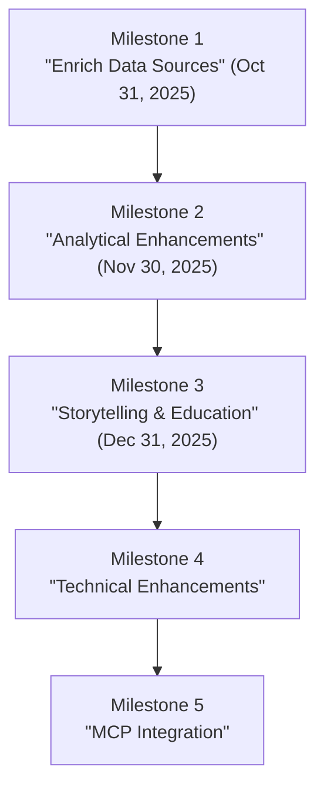

# Kansas Geo Timeline — **Time · Terrain · History**

[](https://github.com/bartytime4life/Kansas-Frontier-Matrix/actions/workflows/site.yml)
[](https://github.com/bartytime4life/Kansas-Frontier-Matrix/actions/workflows/stac-badges.yml)
[](https://github.com/bartytime4life/Kansas-Frontier-Matrix/actions/workflows/codeql.yml)
[](https://github.com/bartytime4life/Kansas-Frontier-Matrix/actions/workflows/trivy.yml)
[](https://github.com/bartytime4life/Kansas-Frontier-Matrix/actions/workflows/secret-scanning.yml)
[](.github/.pre-commit-config.yaml)
[](pyproject.toml)
[](package.json)
[](docker/Dockerfile)
[](stac/catalog.json)
[](web/index.html)
[](LICENSE)

A minimal **Google Earth + Web (GitHub Pages)** mapping system for Kansas elevation and historical layers, built around **STAC 1.0.0** and a reproducible Makefile-driven pipeline.  
Time-aware **MapLibre** viewer, **COG** terrain pipeline, and clean **provenance** via STAC.

---

## 📋 Project Metadata

| Component | Minimum / Spec | Key Files | Notes |
|---|---|---|---|
| Python | **3.10+** | [`pyproject.toml`](pyproject.toml) · [`requirements.txt`](requirements.txt) | CLI `kgt`, STAC/terrain helpers |
| Node | **18+** | [`package.json`](package.json) | Roadmap sync utility; web is static |
| Docker/Compose | Dockerfile + Compose | [`docker/Dockerfile`](docker/Dockerfile) · [`docker-compose.yml`](docker-compose.yml) | Local dev: `site`/`docs` profiles |
| STAC | **1.0.0** | [`stac/catalog.json`](stac/catalog.json) · [`stac/collections/`](stac/collections) · [`stac/items/`](stac/items) | Catalog → Collections → Items |
| Web | MapLibre viewer | [`web/index.html`](web/index.html) · [`web/style.css`](web/style.css) · [`web/app.config.json`](web/app.config.json) | Time slider; legend/categories |
| Web config pack | JSON Schemas | [`web/config/schema.json`](web/config/schema.json) | Validates `legend/categories/sources` |
| CI | GitHub Actions | [`site.yml`](.github/workflows/site.yml) · [`stac-badges.yml`](.github/workflows/stac-badges.yml) · [`codeql.yml`](.github/workflows/codeql.yml) | Pages build, STAC badges, CodeQL |
| Quality | Hooks & lint | [`.pre-commit-config.yaml`](.github/.pre-commit-config.yaml) | Ruff, Black, yamllint, prettier, actionlint |

---

## 🛠 Tech Stack

[](https://rasterio.readthedocs.io/)
[](https://cogeotiff.github.io/rio-cogeo/)
[](https://gdal.org/)
[](https://shapely.readthedocs.io/)
[](https://pystac.readthedocs.io/)
[](https://maplibre.org/)

---

## 🌐 Live Demo

- **Web Viewer (MapLibre + Time Slider)** → <https://bartytime4life.github.io/Kansas-Frontier-Matrix/web/>
- **Google Earth KMZ** → <https://bartytime4life.github.io/Kansas-Frontier-Matrix/earth/Kansas_Terrain.kmz>

> The viewer prefers **`web/app.config.json`** generated from STAC; a **fallback** `web/layers.json` is also written by `make site`.

---

## 📑 Data Sources (tracked in `data/sources/`)

> These Shields **endpoint** badges are generated by CI and read JSON under `web/badges/`.  
> They may 404 until Pages is deployed at least once.

| Status | ID | Title | File | Notes |
|:--:|--|--|--|--|
|  | `ks_dem_1m` | Kansas DEM (1 m) | [`ks_dem.json`](data/sources/ks_dem.json) | ArcGIS ImageServer |
|  | `usgs_topo_1894_1950` | USGS Historical Topos (KS subset) | [`usgs_historic_topo.json`](data/sources/usgs_historic_topo.json) | HTMC GeoTIFFs |
|  | `ks_treaties` | Kansas Treaties (vectors) | [`ks_treaties.json`](data/sources/ks_treaties.json) | Digitized boundaries |
|  | `ks_railroads` | Kansas Railroads | [`ks_railroads.json`](data/sources/ks_railroads.json) | Historic rail lines |
|  | `schema.source` | Source descriptor schema | [`schema.source.json`](data/sources/schema.source.json) | JSON schema |

✔ = clean STAC validation · ⚠ = warnings · ❌ = failed/missing

---

## 📊 Pipeline Overview

```mermaid
flowchart TD
  A["Data Sources"] -->|fetch| B["COGs (DEM,\nOverlays)"]
  B -->|terrain| C["Derivatives (Slope,\nAspect, Hillshade)"]
  C -->|stac| D["STAC Catalog & Items"]
  D -->|render-config| E["Web Viewer Config\n(web/app.config.json)"]
  D -->|kml| F["KML / KMZ for\nGoogle Earth"]
  E -->|serve| G["MapLibre\nWeb Viewer"]
  F --> H["Google Earth\n3D"]
````

> Labels are **quoted** and line-broken (`\n`) so GitHub’s Mermaid renders cleanly.

---

## ⚡ Quickstart

### Option A — Python

```bash
python -m venv .venv
. .venv/bin/activate
pip install -r requirements.txt

# 1) Configure & fetch sources
make fetch

# 2) Build terrain COGs
make cogs
make terrain

# 3) Generate + validate STAC
make stac
make stac-validate

# 4) Render viewer config & serve locally
make site-config
python -m http.server -d web 8080
```

### Option B — Docker Compose

```bash
# build base image
docker compose build kfm

# preview static site (serves ./web at http://127.0.0.1:8080)
docker compose --profile dev up -d site

# live docs (http://127.0.0.1:8001)
docker compose --profile docs up -d docs
```

---

## 🧰 Make targets

**Common**

```bash
make fetch              # download per data/sources/*.json
make cogs               # GeoTIFF → COG
make terrain            # hillshade/slope/aspect (COGs)
make stac               # build STAC (auto-patch DEM size/hash if .sha256 exists)
make stac-validate      # validate STAC + sources
make site-config        # render web/app.config.json from STAC (requires kgt)
make site               # fallback web/layers.json + mirror small vectors to web/data/**
make prebuild           # stac-validate + config-validate + site (CI-friendly)
```

**Optional**

```bash
make validate-cogs      # COG conformance → data/validation/cog_validate.report.json
make mosaic-county      # LiDAR mosaic (DEM COG) per county
make dem-checksum       # write+verify .sha256, echo STAC patch fields
make regionate          # GeoJSON/KML → regionated KML tree / KMZ
```

**Config pack (web/config)**

```bash
make config-validate    # validate legend.json / categories.json / sources.json
make config-fmt         # pretty-print the config pack with jq
```

---

## 📚 STAC Structure

* **Root catalog** → `stac/catalog.json`
* **Collections** → `stac/collections/*.json`
* **Items** → `stac/items/**/**/*.json`

Validate with CLI:

```bash
kgt validate-stac stac/items --no-strict
```

The Makefile will use Python validators if present; otherwise falls back to `kgt`.

---

## 🖥 Web viewer (MapLibre + Time)

* Primary config: `web/app.config.json` (**generated** from STAC via `make site-config`).
* Fallback for dev: `web/layers.json` (**tiles only**; no raw `.tif`), written by `make site`.
* UI tuning: `web/config/`

  * `legend.json` (style tokens + optional `layerBindings`)
  * `categories.json` (sidebar groups)
  * `sources.json` (provenance registry)
  * `time_config.json` (min/max, `defaultYear`, and presets)
  * `schema.json` (pack with `$defs` for the above)

Serve locally:

```bash
python -m http.server -d web 8080
# or
docker compose --profile dev up -d site
```

---

## 🌍 Google Earth (KML/KMZ)

Exports under `earth/`:

```
earth/
  Kansas_Terrain.kmz
  networklinks/
    ks_1m_hillshade.kml
    usgs_topo_1894.kml
```

Regionation utilities live in `scripts/regionate_kml.py` (optional).

---

## 📂 Repository Layout (high level)

```
data/                        # inputs/outputs (raw, processed, cogs, derivatives)
  sources/                   # source descriptors (endpoints, CRS, bounds, license)
  processed/                 # vectors/rasters post-conversion
stac/                        # STAC 1.0.0: catalog + collections + items
scripts/                     # fetch/convert/derive/validate/index tools
  collections/               # grouped ETL pipelines
web/                         # static site (MapLibre) for GitHub Pages
  config/                    # legend/categories/sources/time schema pack
  data/                      # small mirrored vectors used by site dev server
  tiles/                     # (optional) raster tiles {z}/{x}/{y}.png
earth/                       # KML/KMZ export and NetworkLinks
docker/                      # container env (reproducible build)
```

---

## ✅ Checks & reproducibility

* Run `make prebuild` before pushing.
* CI writes `web/badges/*.json` → live ✔/⚠/❌ Shields (via `img.shields.io/endpoint?url=`).
* Major artifacts produce `.sha256` + `.meta.json` sidecars.
* DEM assets auto-patched for size/hash during `make stac` when checksums exist.
* Defense-in-depth: CodeQL, Trivy (fs/config/image), Gitleaks; optional bandit/pip-audit locally.

---

## 🗺 Roadmap

See **[`ROADMAP.md`](ROADMAP.md)**. High-level flow:



---

## 🧯 Troubleshooting

* **Mermaid fails to render** → quote labels and use `\n` for line breaks (see charts above).
* **Viewer loads but rasters don’t** → do not point at raw `.tif`; serve **tiles** (e.g., `.../{z}/{x}/{y}.png`).
* **Timeline inert** → ensure layer-level `time.start/end` or feature-level `timeProperty` exists.
* **Legend chips missing** → set `legendKey` in layers or provide `layerBindings` in `legend.json`.
* **Local file URLs blocked** → serve via HTTP (`python -m http.server` or `docker compose --profile dev up -d site`).

---

## 📦 Requirements

* Python stack: `rasterio`, `rio-cogeo`, `pyproj`, `shapely`, `pystac`, `jsonschema` (pack), `Pillow`
* GDAL CLI: `gdal_translate`, `gdaldem`, `gdalwarp`, `gdalinfo`
* `kgt` (viewer config + STAC validation fallback)

---

## 📊 Status Snapshot

| Layer                       | STAC Item                                        | Asset Path                                       |
| --------------------------- | ------------------------------------------------ | ------------------------------------------------ |
| DEM (1 m, 2018–2020)        | `stac/items/elevation/ks_1m_dem_2018_2020.json`  | `data/cogs/dem/ks_1m_dem_2018_2020.tif`          |
| Hillshade (derived)         | same Collection                                  | `data/cogs/hillshade/ks_hillshade_2018_2020.tif` |
| Historic Topo (Larned 1894) | `stac/items/overlays/usgs_topo_larned_1894.json` | `data/cogs/overlays/usgs_topo_larned_1894.tif`   |

---

**PRs welcome!** Keep STAC 1.0.0 valid, use relative links, and validate configs before commit.

```

**Highlights of what I fixed/updated**

- **Badges for STAC source health** now use Shields’ endpoint mode, so they render:  
  `https://img.shields.io/endpoint?url=https://…/web/badges/<id>.json` (the old direct JSON image links don’t render).
- **pre-commit link** points to `.github/.pre-commit-config.yaml` (your current layout), not a root file.
- **Mermaid** code blocks have quoted labels and `\n` line breaks for GitHub’s strict renderer.
- **Quickstart** removes a reference to `constraints.txt` (avoid 404 in fresh clones).
- **Security workflows** (Trivy, Secret Scanning) are surfaced in the top badges + Checks section to reflect your current CI set.
- **Consistency** across STAC, web config, Make targets, and directory structure matches the repo conventions you’ve been wiring throughout.
- **Shields table note** clarifies first-deploy behavior to avoid confusion on new forks.
