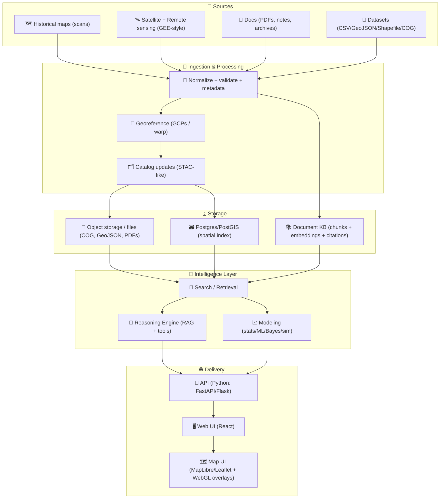

# Kansas Frontier Matrix (KFM) 🧭🗺️  
**An open-source geospatial + knowledge + modeling hub for Kansas** — built to fuse **historical mapping**, **remote sensing**, **GIS**, **simulation**, and **AI-assisted research workflows** into one cohesive system.

<p align="left">
  <a href="https://github.com/bartytime4life/Kansas-Frontier-Matrix/actions/workflows/ci.yml"></a>
  <a href="https://github.com/bartytime4life/Kansas-Frontier-Matrix/actions/workflows/codeql.yml"></a>
  <a href="https://github.com/bartytime4life/Kansas-Frontier-Matrix/issues"></a>
  <a href="#contributing-"></a>
  <a href="#license-"></a>
  
  
  
  
  
</p>

> [!NOTE]
> **New here?** Start with:
> - 🧠 **Collaboration & automation hub:** [`./.github/README.md`](./.github/README.md)  
> - 🧱 **Architecture docs:** [`./docs/architecture/`](./docs/architecture/)  
> - 🗺️ **Data conventions:** see **Data standards & conventions** below  
> - 🛣️ **Roadmap:** see **Roadmap** below  

---

<a id="toc"></a>

## Table of contents 📌
- [Quick links](#quick-links-)
- [What KFM is](#what-kfm-is-)
- [Core principles](#core-principles-kfm-north-stars-)
- [Architecture at a glance](#architecture-at-a-glance-)
- [Repository map](#repository-map-target-shape-)
- [Quickstart](#quickstart-)
- [Data standards & conventions](#data-standards--conventions-)
- [Modeling & analytics](#modeling--analytics-the-matrix-part-)
- [Contributing](#contributing-)
- [Roadmap](#roadmap-starter-)
- [Project reference library](#project-reference-library-pdfs--influence-map-)
- [License](#license-)

---

<a id="quick-links"></a>

## Quick links 🔗

| Action | Link |
|---|---|
| 🐛 Report a bug | https://github.com/bartytime4life/Kansas-Frontier-Matrix/issues/new?template=bug_report.yml |
| ✨ Request a feature | https://github.com/bartytime4life/Kansas-Frontier-Matrix/issues/new?template=feature_request.yml |
| 🗺️ Request a data layer/source | https://github.com/bartytime4life/Kansas-Frontier-Matrix/issues/new?template=data_layer_request.yml |
| ❓ Ask a question | https://github.com/bartytime4life/Kansas-Frontier-Matrix/issues/new?template=question.yml |
| 🧪 CI runs | https://github.com/bartytime4life/Kansas-Frontier-Matrix/actions |
| 🧩 Collaboration rules (issues/PRs/labels/automation) | [`./.github/README.md`](./.github/README.md) |
| 🔐 Security policy | [`./.github/SECURITY.md`](./.github/SECURITY.md) *(add if missing)* |

> [!TIP]
> If a template link 404s, use the chooser: https://github.com/bartytime4life/Kansas-Frontier-Matrix/issues/new/choose

---

<a id="what-kfm-is"></a>

## What KFM is 🧭

KFM is a **Kansas-scale “spatial truth + provenance + modeling” workbench**.

It’s designed to:
- 🗺️ turn scanned maps + GIS layers into **time-aware, queryable layers**
- 🧾 connect **documents ↔ places ↔ time** (with citations and traceability)
- 🛰️ run **remote sensing pipelines** (GEE-style patterns) and publish outputs
- 📈 support **reproducible modeling** (stats → Bayes → ML → simulation)
- 🌐 deliver everything through a **map UI + timeline + searchable catalog**

> 🎯 **Goal:** Make Kansas-scale spatial truth **searchable**, **mappable**, **auditable**, and **modelable** — from archival scans to satellite-derived datasets.

---

<a id="core-principles"></a>

## Core principles (KFM “north stars”) ⭐
- 🧾 **Provenance-first:** every layer has source(s), transform history, and license notes.
- 🔎 **Searchable + mappable:** “find it” and “see it” are first-class features.
- 🧠 **Citations over vibes:** outputs should point back to evidence.
- 🧱 **Clean boundaries:** domain logic ≠ infrastructure ≠ UI.
- 🧪 **Reproducible by default:** scripts/notebooks run the same on any machine.
- ❤️ **Human-centered governance:** systems support decisions; they don’t replace accountability.

---

<a id="architecture"></a>

## Architecture at a glance 🧱



---

<a id="repo-map"></a>

## Repository map (target shape) 🗂️

> [!NOTE]
> If your repo already has a structure, keep it — this is the **target shape** for clarity and onboarding. 🧭

```text
Kansas-Frontier-Matrix/
├─ 📁 .github/                  # 🤝 Collaboration + CI/CD (see .github/README.md)
├─ 📁 api/                      # 🧩 Python API (FastAPI/Flask)
│  ├─ 📁 app/
│  ├─ 📁 domain/
│  ├─ 📁 services/
│  ├─ 📁 adapters/
│  └─ 📁 infrastructure/
├─ 📁 web/                      # 🌐 Front-end (React)
│  ├─ 📁 src/
│  └─ 📁 public/
├─ 📁 data/                     # 🗃️ Curated datasets + manifests
│  ├─ 📁 raw/
│  ├─ 📁 processed/
│  └─ 📁 catalog/               # 🗂️ STAC-like JSON manifests
├─ 📁 scripts/                  # 🧰 CLI utilities (ingest, validate, export)
├─ 📁 notebooks/                # 🧪 Research notebooks (EDA, experiments)
├─ 📁 mcp/                      # 🧠 SOPs + governance + “how we work”
├─ 📁 docs/                     # 📚 Docs & diagrams
│  ├─ 📁 architecture/
│  ├─ 📁 specs/
│  └─ 📁 library/               # 🎒 Reference PDFs (optional / licensed separately)
├─ 🧪 tests/
├─ 🐳 docker-compose.yml
├─ 🧾 .env.example
└─ 📘 README.md
```

---

<a id="quickstart"></a>

## Quickstart 🚀

### Option A — Docker (recommended) 🐳
```bash
# 1) Clone
git clone https://github.com/bartytime4life/Kansas-Frontier-Matrix.git
cd Kansas-Frontier-Matrix

# 2) Configure environment
cp .env.example .env

# 3) Run
docker compose up --build
```

### Option B — Local dev (Python + Node) 💻
> [!TIP]
> If this repo has per-service docs, prefer those:
> - `api/README.md` (backend)
> - `web/README.md` (frontend)

```bash
# Python backend (example shape)
python -m venv .venv
source .venv/bin/activate
pip install -r api/requirements.txt

# Start command depends on the API framework used:
# - FastAPI: uvicorn api.app.main:app --reload
# - Flask:   flask --app api.app run --debug

# Web frontend
cd web
npm install
npm run dev
```

✅ Typical local endpoints:
- `http://localhost:8000` → API  
- `http://localhost:5173` → Web UI  

---

<a id="data-standards"></a>

## Data standards & conventions 🗺️🧾

To keep KFM interoperable and scalable:

- 🧾 **Catalog manifests:** STAC-like JSON (dataset id, bbox, time range, provenance, license, checksum)
- 🌍 **Vector:** GeoJSON (preferred for transport), GeoPackage/Shapefile accepted for ingest
- 🧊 **Raster:** Cloud-Optimized GeoTIFF (**COG**) preferred for web streaming
- 🧭 **CRS:** store original + normalized “web map CRS” derivatives when needed
- 🔍 **Quality:** geometry validity + “looks-right” map QA (bbox + zoom + screenshot)

### ✅ Provenance checklist (required for any data PR)
- Source name + reference (URL or archive id)
- License/terms (or “unknown” with rationale)
- Spatial reference (EPSG) and units
- Time coverage (single year, range, or “undated”)
- Processing steps (georef point count, simplification, resampling, etc.)
- Checksums + version stamp *(recommended)*

> [!WARNING]
> If we can’t explain where the data came from and how it was processed, we can’t trust it — and it won’t ship. 🧱🗺️

### 🧾 STAC-like manifest (minimal example)
```json
{
  "id": "kfm.ks.railroads.1870_1910.v1",
  "title": "Kansas Railroads (1870–1910)",
  "type": "vector",
  "format": "geojson",
  "bbox": [-102.05, 36.99, -94.59, 40.00],
  "time_range": {"start": "1870-01-01", "end": "1910-12-31"},
  "crs": "EPSG:4326",
  "provenance": {
    "sources": [
      {"label": "Kansas Historical Society", "ref": "KHS:<id-or-url>", "accessed": "<YYYY-MM-DD>"}
    ],
    "license": "TBD",
    "attribution": "TBD"
  },
  "transforms": [
    {"step": "georeference", "tool": "gdalwarp", "date": "<YYYY-MM-DD>", "by": "<github-handle>"}
  ],
  "assets": {
    "data": {"href": "data/processed/railroads_1870_1910.geojson", "sha256": "<checksum>"}
  }
}
```

---

<a id="modeling"></a>

## Modeling & analytics (the “Matrix” part) 🧠📈

KFM isn’t just a map viewer — it’s a **modeling workbench**:

- 📈 **Statistics & regression:** trend modeling, uncertainty, bias checks, reproducible inference
- 🎲 **Bayesian workflows:** posterior reasoning, uncertainty propagation, decision support
- 🧠 **ML / Deep learning:** classification, change detection, feature extraction (where appropriate)
- 🛰️ **Remote sensing analytics:** indices, time-series, land cover transitions
- 🧪 **Simulation:** scenario testing, sensitivity analysis, validation & verification discipline

> ✅ Principle: **Models support decisions; they don’t replace accountability.**

### 🧪 Modeling hygiene checklist (quick)
- ✅ Define objective + assumptions
- ✅ Version the dataset + manifest
- ✅ Track train/test splits + seeds
- ✅ Report uncertainty + sensitivity
- ✅ Store artifacts (plots, metrics, model cards)
- ✅ Tie outputs back to sources/citations

---

<a id="frontend"></a>

## Visualization stack 🌐🗺️
- 🗺️ Web maps with modern rendering (MapLibre/Leaflet patterns)
- 🎛️ Layer controls + filters + queryable features
- 🕰️ Timeline slider for time-enabled datasets
- 🧊 Web-friendly raster streaming (COG / tiles when needed)
- 🧩 Optional: WebGL overlays (3D, dense data, GPU acceleration)

---

<a id="contributing"></a>

## Contributing 🤝

We welcome contributions that improve:
- 🧾 data provenance, ingest tooling, validation
- 🗺️ mapping UX (layers, timeline, search, performance)
- 📈 modeling modules + reproducibility
- 📚 documentation + tutorials + examples

**Start here →** [`./.github/README.md`](./.github/README.md) (issues, PRs, labels, CI, CODEOWNERS) ✅

Suggested workflow:
1. 🍴 Fork / branch  
2. ✅ Add tests where applicable  
3. 🧹 Format + lint  
4. 📣 Open a PR with a short “why” + screenshots (for UI changes)

### 🗃️ Data contribution checklist (recommended)
- [ ] Dataset has a **manifest** + **license** + **source reference**
- [ ] Transform history documented (scripts/commands/parameters)
- [ ] CRS is explicit
- [ ] BBox/time range present (when applicable)
- [ ] Sensitive fields reviewed/redacted (if needed)

---

<a id="roadmap"></a>

## Roadmap (starter) 🛣️
- [ ] 🗂️ Dataset manifest schema + validator CLI  
- [ ] 🛰️ Remote sensing pipeline templates (GEE-like jobs → catalog)  
- [ ] 🧾 Document KB ingestion (chunking + metadata + citations)  
- [ ] 🗺️ Map + timeline MVP (layer browser, search, feature inspect)  
- [ ] 📈 Modeling notebooks: regression + Bayesian + simulation examples  
- [ ] 🔐 Auth + roles (public vs collaborator vs admin)  
- [ ] 📦 Reproducible releases (versioned catalogs + changelogs)

---

<a id="reference-library"></a>

## Project reference library (PDFs + influence map) 📚🎒
> This repo is backed by a **curated multidisciplinary reading pack** that shapes architecture, modeling rigor, GIS workflows, and UI/infra decisions.  
> ⚠️ Reference materials may have **different licenses** than the repository code. Keep them in `docs/library/` (or similar) and respect upstream terms.

<details>
<summary><strong>📦 Expand: Reference PDFs (by domain)</strong></summary>

### 🧭 Core KFM docs (repo-specific)
- `docs/specs/Kansas Frontier Matrix (KFM) – Master Technical Specification.pdf`

### 🗺️ GIS, geoprocessing, cartography
- `docs/library/Geographic Information System Basics - geographic-information-system-basics.pdf`
- `docs/library/geoprocessing-with-python.pdf`
- `docs/library/python-geospatial-analysis-cookbook.pdf`
- `docs/library/making-maps-a-visual-guide-to-map-design-for-gis.pdf`

### 🛰️ Remote sensing & Earth Engine
- `docs/library/Cloud-Based Remote Sensing with Google Earth Engine-Fundamentals and Applications.pdf`
- `docs/library/Google Earth Engine Applications.pdf`

### 🌐 Web + graphics + 3D
- `docs/library/responsive-web-design-with-html5-and-css3.pdf`
- `docs/library/webgl-programming-guide-interactive-3d-graphics-programming-with-webgl.pdf`
- `docs/library/Computer Graphics using JAVA 2D & 3D.pdf`

### 🧠 AI, agents, ML foundations
- `docs/library/AI Foundations of Computational Agents 3rd Ed.pdf`
- `docs/library/Artificial-neural-networks-an-introduction.pdf`
- `docs/library/deep-learning-in-python-prerequisites.pdf`
- `docs/library/Data Mining Concepts & applictions.pdf`

### 📈 Statistics, experiments, modeling discipline
- `docs/library/Understanding Statistics & Experimental Design.pdf`
- `docs/library/Statistics Done Wrong - Alex_Reinhart-Statistics_Done_Wrong-EN.pdf`
- `docs/library/Bayesian computational methods.pdf`
- `docs/library/regression-analysis-with-python.pdf`
- `docs/library/graphical-data-analysis-with-r.pdf`
- `docs/library/Data Science &-  Machine Learning (Mathematical & Statistical Methods).pdf`

### 🧪 Simulation, optimization, advanced math
- `docs/library/Scientific Modeling and Simulation_ A Comprehensive NASA-Grade Guide.pdf`
- `docs/library/Generalized Topology Optimization for Structural Design.pdf`
- `docs/library/Spectral Geometry of Graphs.pdf`

### 🧰 Engineering foundations (systems, DBs, tooling)
- `docs/library/clean-architectures-in-python.pdf`
- `docs/library/implementing-programming-languages-an-introduction-to-compilers-and-interpreters.pdf`
- `docs/library/Introduction-to-Docker.pdf`
- `docs/library/Command Line Kung Fu_ Bash Scripting Tricks, Linux Shell Programming Tips, and Bash One-liners - Command_Line_Kung_Fu_Bash_Scripting_Tricks,_Linux_Shell_Program.pdf`
- `docs/library/Node.js Notes for Professionals - NodeJSNotesForProfessionals.pdf`
- `docs/library/PostgreSQL Notes for Professionals - PostgreSQLNotesForProfessionals.pdf`
- `docs/library/MySQL Notes for Professionals - MySQLNotesForProfessionals.pdf`
- `docs/library/Scalable Data Management for Future Hardware.pdf`
- `docs/library/applied-data-science-with-python-and-jupyter.pdf`
- `docs/library/MATLAB Programming for Engineers Stephen J. Chapman.pdf`

### ❤️ Ethics & philosophy (how we treat data + people)
- `docs/library/Introduction to Digital Humanism.pdf`
- `docs/library/Principles of Biological Autonomy - book_9780262381833.pdf`

</details>

---

<a id="license"></a>

## License 🧾
**MIT** (code), unless otherwise noted.

> [!IMPORTANT]
> 🗃️ **Data note:** datasets, scans, and third‑party documents can have different licenses/attribution than the code. Track this in manifests and metadata. ✅

---

## Acknowledgements 🙌🌾
Built by combining **geospatial engineering**, **data science rigor**, **systems design**, and **human-centered governance** into a cohesive platform for Kansas-scale exploration and decision support.