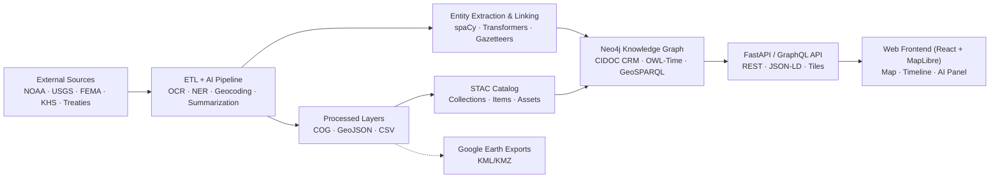

<div align="center">

# 🏗️ **Kansas Frontier Matrix — System Architecture**

### *Time · Terrain · History · Knowledge Graphs*

[](../../actions/workflows/site.yml)
[](../../actions/workflows/stac-validate.yml)
[](../../actions/workflows/codeql.yml)
[](../../actions/workflows/trivy.yml)
[](../docs/)
[](../LICENSE)
[](../docs/standards/)

</div>

---

## 📚 Table of Contents

- [🌾 Mission](#-mission)
- [🏛 Principles](#-principles)
- [🗺 High-Level Diagram](#-high-level-diagram)
- [🧱 Layered Architecture](#-layered-architecture)
- [🗂 Repository & Data Layout](#-repository--data-layout)
- [🧮 AI/ML Pipeline](#-aiml-pipeline)
- [🌐 API & Integration](#-api--integration)
- [🖥 Frontend](#-frontend)
- [🔒 Security, Integrity & Provenance](#-security-integrity--provenance)
- [🚀 CI/CD & Release Management](#-cicd--release-management)
- [⚙️ Environments & Configuration](#️-environments--configuration)
- [🏁 Quickstart](#-quickstart)
- [🤝 Contributing](#-contributing)
- [🧾 Versioning & Metadata](#-versioning--metadata)
- [📎 References](#-references)

---

## 🌾 Mission

**Kansas Frontier Matrix (KFM)** is an open-source, geospatial–historical knowledge system for Kansas that links **people, places, events, and documents** in a **Neo4j** semantic graph, explored through a synchronized **map + timeline** interface. It integrates open datasets (NOAA, USGS, FEMA, KHS, treaties, archives) to deliver verified spatial/temporal context and **AI-assisted narratives**.

**Why it matters:** a living, reproducible atlas of Kansas, where *every* map layer, text fragment, and relationship is documented, versioned, and provenance-checked.

**Core Capabilities**

- **Interactive Timeline Map**
- **AI-Assisted Extraction & Summaries**
- **Knowledge Graph Backend (CIDOC CRM · OWL-Time)**
- **STAC-Indexed Open Data**
- **Standards-Based REST/GraphQL API**

---

## 🏛 Principles

| Principle              | Description                                                                 |
| :--------------------- | :-------------------------------------------------------------------------- |
| Documentation-First    | Every change co-ships with README/ADR/SOP updates and metadata (MCP-DL).    |
| Reproducibility        | Deterministic ETL, pinned envs/containers, SHA-256 checksums, data hashes.  |
| Open Standards         | STAC, DCAT, CIDOC CRM, OWL-Time, GeoSPARQL, JSON-LD, KML/KMZ.              |
| Separation of Concerns | ETL/AI ↔ Graph ↔ API ↔ Web — clean, typed interfaces and schemas.          |
| Defense-in-Depth       | CodeQL, Trivy, signed workflows, artifact retention, audit logs, RBAC.     |

---

## 🗺 High-Level Diagram



---

## 🧱 Layered Architecture

### 1) ETL & Data Processing
- **Extract:** APIs/archives → `data/raw/`
- **Transform:** GIS + tabular → `data/processed/`
- **Catalog:** STAC generation → `data/stac/`
- **Validate:** schema checks + **SHA-256** integrity

### 2) AI/ML Enrichment
- **OCR:** Tesseract/OpenCV (page coordinates)
- **NLP:** spaCy NER + Transformers
- **Linking:** rules + fuzzy + gazetteers
- **Provenance:** PROV-O + confidence scores

### 3) Knowledge Graph (Neo4j)
- **Model:** CIDOC CRM, OWL-Time, GeoSPARQL
- **Relations:** `MENTIONS`, `OCCURRED_AT`, `DERIVED_FROM`, …
- **Exports:** RDF/JSON-LD (optional)

### 4) API Layer (FastAPI + GraphQL)
- **Outputs:** JSON, GeoJSON, STAC, DCAT, JSON-LD
- **Concerns:** auth, rate limits, logs, schema contracts

### 5) Web Frontend (React + MapLibre + Canvas/D3)
- **Sync:** map ↔ timeline single time window
- **Panels:** AI summaries, citations, dossiers
- **A11y:** WCAG 2.1 AA, keyboard-first flows

---

## 🗂 Repository & Data Layout

```text
Kansas-Frontier-Matrix/
├─ src/                    # ETL, AI/ML, graph integration
├─ web/                    # React SPA (map, timeline, AI)
├─ data/
│  ├─ sources/             # Source manifests (provenance)
│  ├─ raw/                 # LFS/DVC tracked inputs
│  ├─ processed/           # GeoTIFF, GeoJSON, CSV
│  └─ stac/                # STAC catalog (collections/items)
├─ docs/                   # Architecture, SOPs, templates, glossary
├─ tools/                  # Importers, scripts, deployment
├─ tests/                  # Unit/integration/e2e
└─ .github/                # CI/CD workflows, PR templates
```

---

## 🧮 AI/ML Pipeline

| Stage         | Tooling               | Output                               |
| :------------ | :-------------------- | :------------------------------------|
| OCR           | Tesseract, OpenCV     | Tokenized text w/ page geometry      |
| NER           | spaCy + rules         | Entity spans (Person, Place, Date…)  |
| Summarization | BART/T5               | Extractive/abstractive summaries     |
| Geocoding     | GeoPy + GNIS          | Disambiguated lat/long               |
| Linking       | Rules + similarity    | Canonical graph entity IDs           |

---

## 🌐 API & Integration

**Key Endpoints**
- `GET /api/events?start=1850&end=1870&bbox=...`
- `GET /api/entity/{id}`
- `GET /api/search?q=...`
- `GET /api/tiles/{layer}/{z}/{x}/{y}.pbf`
- `GET /stac/catalog.json`

**Standards**
- STAC 1.0, DCAT 2.0, JSON-LD
- Ontologies: CIDOC CRM, OWL-Time, GeoSPARQL
- Exports: KML/KMZ, GeoJSON

---

## 🖥 Frontend

| Subsystem     | Stack                  | Features                                         |
| :------------ | :--------------------- | :----------------------------------------------- |
| Map           | MapLibre GL JS         | Custom tiles, COG overlays, vector filters       |
| Timeline      | Canvas + D3            | Smooth zoom/brush, interval filtering            |
| Panels        | React (typed)          | Entity dossiers, citations, AI summaries         |
| Accessibility | WAI-ARIA + CSS tokens  | WCAG 2.1 AA, keyboard & SR compatible            |

---

## 🔒 Security, Integrity & Provenance

| Control               | Mechanism/Tooling                            |
| :-------------------- | :------------------------------------------- |
| Static Analysis       | GitHub **CodeQL**                            |
| Dependency Scanning   | **Trivy** (containers & libs)                |
| Data Integrity        | **SHA-256** checksums (artifacts & assets)   |
| Workflow Governance   | Pinned actions, branch protection, reviewers |
| Provenance Tracking   | PROV-O + CI logs + STAC lineage              |
| Auth/AuthZ            | JWT, RBAC, endpoint scopes                   |

---

## 🚀 CI/CD & Release Management

- Pre-commit hooks (lint, type, tests, docs)
- STAC/schema validation gates
- Test matrix: **pytest** (ETL), **Jest/RTL** (web), **axe/Lighthouse** (a11y)
- Security: CodeQL, Trivy
- **SemVer** for code; **versioned STAC** for data
- GitHub Pages build & deploy from `main`

---

## ⚙️ Environments & Configuration

**Environment Variables (examples)**

```bash
# Backend
NEO4J_URI=bolt://localhost:7687
NEO4J_USER=neo4j
NEO4J_PASS=neo4j

# API
API_PORT=8000
API_LOG_LEVEL=info

# Web
VITE_API_URL=http://localhost:8000
VITE_MAP_STYLE_URL=/tiles/style.json
```

**Make Targets (common)**

```bash
make fetch           # fetch raw datasets
make process         # transform → data/processed
make stac            # build/validate STAC catalog
make serve           # run backend + frontend dev servers
make checks          # lint + tests + security scans
```

---

## 🏁 Quickstart

```bash
# 1) Clone & setup
git clone https://github.com/bartytime4life/Kansas-Frontier-Matrix.git
cd Kansas-Frontier-Matrix

# 2) Backend deps
pip install -r requirements.txt

# 3) Frontend deps
cd web && pnpm install && cd ..

# 4) Start Neo4j (local or docker-compose)
# export NEO4J_URI/USER/PASS as needed

# 5) ETL + STAC
make fetch && make process && make stac

# 6) Launch
make serve
```

Visit **http://localhost:3000** (web) and **http://localhost:7474** (Neo4j, if local).

---

## 🤝 Contributing

- Use templates in `docs/templates/` — **sop.md**, **experiment.md**, **model_card.md**
- For data PRs, include:
  - `data/sources/*.json` (source + license)
  - STAC entries + checksums
  - Validations passing in CI
- Follow PR template, run full test suite, a11y checks, and security scans.

---

## 🧾 Versioning & Metadata

| Field            | Value                                   |
| :--------------- | :---------------------------------------|
| **Doc Version**  | `v6.3.2`                                 |
| **Release Type** | **Stable**                               |
| **Last Updated** | 2025-10-17                               |
| **Maintainers**  | @kfm-architecture · @kfm-data · @kfm-web |
| **Licenses**     | MIT (code) · CC-BY 4.0 (docs/data)       |
| **Alignment**    | STAC 1.0 · DCAT 2.0 · CIDOC CRM · OWL-Time · GeoSPARQL |
| **Checksums**    | Build artifacts carry **SHA-256** sidecars in CI        |

---

## 📎 References

- `docs/architecture/architecture.md`
- `docs/architecture/file-architecture.md`
- `docs/templates/model_card.md`
- `docs/glossary.md`
- `data/sources/*.json`
- `data/stac/*.json`

<div align="center">

🏛 *Document the Frontier · Reconstruct the Past · Illuminate Connections.*  
© 2025 Kansas Frontier Matrix — MIT (code) · CC-BY 4.0 (docs)

</div>
