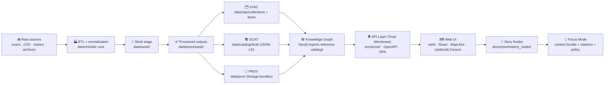
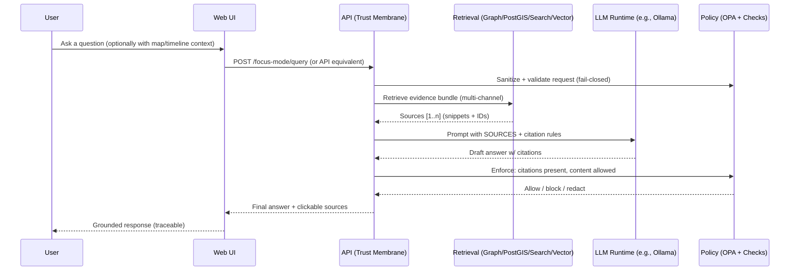

<div align="center">

<picture>
  <source media="(prefers-reduced-motion: reduce)" srcset="docs/assets/kfm-seal-320.png">
  
</picture>

# Kansas Frontier Matrix (KFM) 🗺️🧠

**A provenance-first geospatial knowledge & modeling platform for Kansas**  
<sub><em>“The map behind the map” — every layer, story, and AI answer traces back to evidence.</em></sub>

<br/>


-7c3aed?style=for-the-badge)

<br/>


<br/>

<a href="#-where-to-start-v13-canonical">🧭 Start Here</a> •
<a href="#-quickstart-docker-compose">🚀 Quickstart</a> •
<a href="#-architecture-at-a-glance">🏗️ Architecture</a> •
<a href="#-the-truth-path--governance">🧭 Truth Path</a> •
<a href="#-data--metadata-contracts">🧾 Data Contracts</a> •
<a href="#-repo-layout-v13-canonical">📦 Repo Layout</a> •
<a href="#-focus-mode-ai--grounded-answers">🤖 Focus Mode</a> •
<a href="#-contributing">🤝 Contributing</a> •
<a href="#-roadmap">🗓️ Roadmap</a>

</div>

> [!CAUTION]
> 🚧 **UNDER CONSTRUCTION (Active Development)**  
> This repo is evolving quickly while we harden the **truth path**, **schemas/contracts**, and **governance gates**.  
> **Rule of thumb:** if it can’t be traced, validated, and reproduced… it doesn’t ship. ✅

---

## 🧭 Where to start (v13 canonical)

KFM treats **documentation, schemas, and governance** as *production infrastructure*. If you read only a few files, start here:

- 📘 `docs/MASTER_GUIDE_v13.md` — **canonical pipeline ordering + repo structure** (v13 “source of truth”)  
- 🧱 `docs/architecture/KFM_REDESIGN_BLUEPRINT_v13.md` — rationale + major design decisions  
- ⚖️ `docs/governance/ROOT_GOVERNANCE.md` — what “governed” means in practice  
- 🌿 `docs/governance/ETHICS.md` + `docs/governance/SOVEREIGNTY.md` — FAIR+CARE, stewardship, sensitive data rules  
- 🧾 `docs/standards/` — KFM profiles for **STAC/DCAT/PROV** + repo/work protocols  
- 📝 `docs/templates/` — governed templates (Universal Doc, Story Node, API contract extensions)  
- 📚 `docs/reports/story_nodes/` — curated narratives (draft + published), each provenance-linked

> [!IMPORTANT]
> **One canonical home per subsystem.** v13 explicitly reduces “repo drift” by making contracts and subsystem boundaries first-class. 🧩

---

## ✨ What is KFM?

**Kansas Frontier Matrix (KFM)** is a governed **pipeline → catalogs → graph → API → UI** platform that turns raw historical & geospatial sources into **trustworthy, explorable knowledge about Kansas**.

KFM behaves like a **research librarian + GIS analyst**:
- you discover datasets (search + bbox + time),
- explore maps and time-series views,
- read Story Nodes that cite evidence,
- and use **Focus Mode** for answers that are **retrieval-grounded and citation-enforced** (no black box). 🧭

### What KFM combines 🧩
- 🏭 **Deterministic pipelines** — idempotent jobs, logged runs, stable outputs
- 🧾 **Catalogs & lineage** — STAC + DCAT + PROV are required boundary artifacts
- 🕸️ **Knowledge graph** — relationships over time (entities ↔ events ↔ places ↔ sources)
- 🌎 **GIS serving** — spatial queries + vector/raster tiles via a governed API
- 🤖 **Focus Mode (AI)** — evidence bundles + citations + policy enforcement
- 📝 **Story Nodes** — narratives that are machine-ingestible and provenance-linked

> [!IMPORTANT]
> **No bypasses.** The UI does **not** talk directly to PostGIS/Neo4j. Everything flows through the governed API boundary (“trust membrane”). 🔒

---

## 🧬 Core principles

### The non-negotiables (KFM “constitution”) ⚖️
- 🔍 **Evidence-backed outputs**: maps, datasets, charts, and stories ship with sources + lineage
- 🧬 **Canonical pipeline order** (v13): `raw → work → processed → catalogs → graph → API → UI → narrative`
- 🧾 **Contracts-first**: schemas + API contracts are first-class artifacts; breaking changes require versioning
- 🛑 **Fail-closed governance**: missing license/metadata/classification → blocked (CI + runtime)
- 🔐 **Least privilege by design**: services and users see only what they’re allowed to see
- ♻️ **Reproducibility > convenience**: re-runnable pipelines, checksums, manifests, audit trails

### FAIR + CARE (stewardship-first) 🌱
KFM aims to be **FAIR** (findable, accessible, interoperable, reusable) *and* **CARE** (collective benefit, authority to control, responsibility, ethics)—especially when handling sensitive or community-owned knowledge.

---

## 🧱 Contracts & invariants (do-not-break rules)

These are the project’s stability guarantees (expect CI to enforce them):

- 🏭 **ETL is deterministic**: same inputs + config → same outputs (or differences are logged & explained)
- 🧾 **Catalogs are validated**: STAC/DCAT/PROV must pass schema/profile validation before “publish”
- 🕸️ **Graph is stable**: ontology/schema changes require migrations and coordination
- 🌐 **API is a contract**: OpenAPI/GraphQL are the interface; breaking changes require version bumps
- 🖥️ **UI must not leak data**: must respect classification + redaction rules and accessibility constraints
- 📝 **Story/Focus must be provenance-linked**: no unsourced claims; Focus Mode must not introduce hallucinations

---

## 🏗️ Architecture at a glance



<details>
<summary><strong>🧱 “Trust membrane” API boundary (click)</strong></summary>

The API layer is the governed boundary where contracts and policy live:
- schema validation and request shaping
- RBAC/classification enforcement via policy
- audit logging for data + AI responses
- stable, versioned interfaces (`/api/v1/...`)

No direct UI → DB access. No “special admin bypass.” 🔒

</details>

---

## 🧭 The Truth Path & Governance

KFM’s canonical pipeline is enforced in both data workflows and user-facing features:

```text
raw ➜ work ➜ processed ➜ catalogs (STAC/DCAT/PROV) ➜ graph ➜ API ➜ UI ➜ narrative
```

### What “governed” means in practice ✅
- 🧾 **Provenance is mandatory**: no PROV record → not publishable
- 🏷️ **Metadata is required**: no license/source/classification → blocked
- 🧯 **Policy gates run everywhere**: CI + runtime enforcement (OPA + code checks)
- 🧿 **Audit trails exist for humans and machines**:
  - pipeline runs emit manifests (checksums, timestamps, run IDs, who/what produced it)
  - Focus Mode can log: evidence bundle IDs, model version, policy decision, citations

> [!NOTE]
> KFM treats governance files, templates, standards, and CI rules as **production infrastructure**—small changes can affect every merge.  
> See: `docs/governance/` + `docs/standards/` + `.github/`.

---

## ✅ What you can do with KFM

### Today (foundation) 🧱
- 🗺️ Explore map layers with traceable sources
- 🔎 Search dataset metadata (keyword + bbox + time, where supported)
- 📝 Read/author Story Nodes that cite datasets and archival sources
- 🧪 Run repeatable pipelines that generate processed outputs + catalog/provenance artifacts

### Next (platform) 🚀
- 🧩 Serve tiles + features via a single governed API (vector + raster)
- 🕸️ Traverse knowledge graph relationships (events ↔ places ↔ people ↔ sources)
- 🤖 Ask Focus Mode questions that return answers **with citations**
- 🧭 Time navigation: “then vs now” comparisons, timeline scrub, scenario overlays
- 🛰️ Evidence artifacts: derived/AI-generated layers treated as first-class datasets (with full provenance)

---

## 📌 Project status legend (so this README stays honest)

- ✅ **Stable** — intended behavior, contracts exist, gates enforce it
- 🛠️ **In progress** — implemented but changing quickly
- 🧪 **Experimental** — prototypes / spikes
- 🧭 **Planned** — design intent (not yet guaranteed)

---

## 📦 Repo layout (v13 canonical)

> [!TIP]
> v13 explicitly defines **one canonical home** per subsystem and makes **schemas/contracts first-class**.

```text
📦 Kansas-Frontier-Matrix/
├── 📁 .github/                         # CI workflows, security policies
├── 📁 data/
│   ├── 📁 stac/
│   │   ├── 📁 collections/             # STAC Collections (dataset-level)
│   │   └── 📁 items/                   # STAC Items (asset-level)
│   ├── 📁 catalog/
│   │   └── 📁 dcat/                    # DCAT outputs (JSON-LD)
│   ├── 📁 prov/                        # PROV lineage bundles (per run / dataset)
│   ├── 📁 graph/
│   │   ├── 📁 csv/                     # Neo4j import exports
│   │   └── 📁 cypher/                  # optional post-import scripts
│   ├── 📁 <domain>/                    # e.g. hydrology/, historical/, air-quality/
│   │   ├── 📁 raw/                     # immutable snapshots (source-of-truth)
│   │   ├── 📁 work/                    # intermediate artifacts (rebuildable)
│   │   ├── 📁 processed/               # publishable outputs
│   │   ├── 📁 mappings/                # dataset → STAC/DCAT/PROV mapping notes (optional)
│   │   └── 📄 README.md                # domain runbook (sources, steps, gotchas)
│   └── 📄 README.md                    # data catalog overview
├── 📁 docs/
│   ├── 📄 MASTER_GUIDE_v12.md
│   ├── 📄 MASTER_GUIDE_v13.md
│   ├── 📄 glossary.md
│   ├── 📁 architecture/                # blueprints, ADRs, diagrams
│   ├── 📁 standards/                   # STAC/DCAT/PROV profiles + repo protocols
│   ├── 📁 templates/                   # universal doc / story node / API contract templates
│   ├── 📁 governance/                  # ROOT_GOVERNANCE, ETHICS, SOVEREIGNTY, REVIEW_GATES
│   └── 📁 reports/
│       └── 📁 story_nodes/
│           ├── 📁 templates/
│           ├── 📁 draft/
│           └── 📁 published/
│               └── 📁 <story_slug>/
│                   ├── 📄 story.md
│                   └── 📁 assets/
├── 📁 schemas/                         # JSON Schemas (stac/dcat/prov/storynodes/ui/telemetry)
├── 📁 src/
│   ├── 📁 pipelines/                   # ETL jobs (domain modules)
│   ├── 📁 graph/                       # graph build code (ontology bindings, constraints)
│   └── 📁 server/                      # API boundary + contract definitions
├── 📁 web/                             # React UI (Map + Story + Focus Mode)
├── 📁 mcp/                             # Methods & Computational Experiments (runs, notebooks, model cards)
├── 📁 tools/                           # validators, scripts, utilities
├── 📁 tests/                           # unit + integration tests
├── 📁 releases/                        # versioned release artifacts (bundles, manifests, SBOM)
├── 📄 README.md
├── 📄 CONTRIBUTING.md
├── 📄 SECURITY.md
├── 📄 CHANGELOG.md
├── 📄 LICENSE
├── 📄 CITATION.cff
├── 📄 docker-compose.yml
└── 📄 .env.example
```

---

## 🧾 Data & metadata contracts

### Canonical data flow (do not bypass) 🚦
`data/<domain>/raw/` → `data/<domain>/work/` → `data/<domain>/processed/` → **catalog boundary artifacts** → graph → API → UI/Focus

### Required staging areas ✅
- 📥 `raw/` — immutable snapshots (never overwritten)
- 🧰 `work/` — intermediate outputs (rebuildable)
- ✅ `processed/` — publishable outputs (stable artifacts)

### Required “boundary artifacts” before publish ✅
Every publishable dataset (and every derived evidence artifact) must generate:

- 🗂️ **STAC records**
  - `data/stac/collections/` (collection-level metadata)
  - `data/stac/items/` (item/asset-level metadata)

- 📚 **DCAT dataset entry (JSON-LD)**
  - `data/catalog/dcat/`

- 🧾 **PROV lineage bundle**
  - `data/prov/` (raw inputs → work → processed; agents; activities; parameters)

> [!IMPORTANT]
> These boundary artifacts are the interface to downstream stages (graph, API, UI).  
> If they don’t exist and validate, the dataset is **not** considered published. 🚫✅

### Domain expansion pattern 🧩
When adding a new domain:
1) Create `data/<domain>/{raw,work,processed}/` + `data/<domain>/README.md` (runbook)  
2) Add pipeline code under `src/pipelines/<domain>/`  
3) Emit STAC/DCAT/PROV to canonical locations  
4) Update graph imports (if needed) under `data/graph/`  
5) Integrate into API (`src/server/`) and UI (`web/`) through contracts and policy gates

### Evidence artifacts (AI/analysis outputs) 🧪
KFM treats analysis outputs (simulations, OCR corpora, AI-generated layers) as **first-class datasets**:
- stored in `data/<domain>/processed/…`
- cataloged via STAC/DCAT
- traced via PROV (include method/model + parameters + confidence/quality metrics where applicable)
- exposed only via governed APIs (never hard-coded into UI)

---

## 🧩 API highlights (developer-friendly)

KFM exposes a governed API for datasets, discovery, tiles, and safe-query access.

Examples (illustrative):
```http
GET  /api/v1/datasets/{id}
GET  /api/v1/catalog/search?bbox=...&q=...&time=...
GET  /api/v1/datasets/{id}/data?format=geojson&bbox=...
GET  /api/v1/query?table=...&select=...&where=...
POST /graphql
GET  /tiles/{layer}/{z}/{x}/{y}.pbf
GET  /tiles/{layer}/{z}/{x}/{y}.png
```

> [!TIP]
> Separation of concerns matters:
> - **PostGIS**: spatial queries + tiles  
> - **Neo4j**: relationship traversal + narrative context  
> - **STAC/DCAT/PROV**: discovery + lineage  
> - **OPA**: policy enforcement + fail-closed controls

---

## 🤖 Focus Mode (AI) — grounded answers

Focus Mode is **not** a free-form chatbot. It’s a governed, retrieval-augmented workflow designed to be auditable:



### Retrieval channels (hybrid) 🔎
Focus Mode can pull context from:
- 🕸️ **Graph** (entities/events/relationships)
- 🗺️ **Spatial store** (features + aggregates)
- 📚 **Full-text** (stories/docs)
- 🧠 **Vector search** (semantic chunks via embeddings)

> [!IMPORTANT]
> **Least-privilege AI:** the model sees only retrieved snippets and must cite them.  
> Treat the LLM like an untrusted generator—**policy + contracts do the enforcing**. 🔒

<details>
<summary><strong>🧾 “Show your work” mode</strong> (design target)</summary>

A future-facing option is a “Show evidence path” toggle that reveals:
- which sources were retrieved,
- which gates ran,
- and what was redacted/allowed,

…without leaking restricted content. This supports debugging + community trust.

</details>

---

## 🚀 Quickstart (Docker Compose)

> [!NOTE]
> Exact service names/ports may evolve. When in doubt: open `docker-compose.yml` and `.env.example`.

### ✅ Prerequisites
- 🐳 Docker Engine + Docker Compose
- 🧰 (Optional) Git LFS for large binaries (rasters / scans)

### 1) Configure environment
```bash
cp .env.example .env
```

Set at minimum:
- `KFM_JWT_SECRET` (long random secret)
- database passwords (PostGIS + Neo4j)
- `OLLAMA_API_URL` (if your LLM runtime runs separately)

### 2) Start the stack
```bash
docker compose up -d --build
```

Typical services include:
- `server` / `api` (FastAPI + Uvicorn)
- `db-postgis` (PostgreSQL/PostGIS)
- `db-neo4j` (Neo4j)
- `web` (React UI)
- `ollama` (LLM runtime for Focus Mode) *(optional)*
- `opa` (policy engine sidecar)

### 3) Open the app ✅
- API Swagger: `http://localhost:8000/docs`
- Web UI: `http://localhost:3000`
- Neo4j Browser (if exposed): `http://localhost:7474`

### Common ports 🧯
| Service | Default Port | Notes |
|---|---:|---|
| Postgres/PostGIS | 5432 | port conflicts with local Postgres are common |
| Neo4j | 7474 | browser/UI port (bolt differs) |
| API | 8000 | Swagger at `/docs` |
| Web | 3000 | dev server / mapped port |

---

## 🧪 Developer workflow

### Rebuild after dependency changes
```bash
docker compose up -d --build
```

### Run tests
```bash
docker compose exec api pytest
# or (v13) docker compose exec server pytest
```

### Tail logs
```bash
docker compose logs -f api
docker compose logs -f web
```

---

## 🧪 Validation & CI/CD (v13 expectations)

Minimum gates typically include:
- ✅ schema validation (STAC/DCAT/PROV + Story Node schema)
- ✅ license + attribution checks
- ✅ classification/sensitivity propagation checks
- ✅ policy-as-code tests (OPA/Rego) for fail-closed behavior
- ✅ unit/integration tests for pipelines, API, and UI contracts

> [!TIP]
> If your change touches a **contract artifact** (schema, OpenAPI, GraphQL SDL, UI config):  
> expect **version bumps**, **compat checks**, and **migration notes**.

---

## 📝 Stories & narratives (Story Nodes)

Stories live in-repo and can be reviewed like code. 🧾✅  
They are designed to be:
- human-readable **and** machine-ingestible
- provenance-linked (every claim references catalog evidence)
- safe to render in Focus Mode

Canonical location:
- `docs/reports/story_nodes/draft/` (work-in-progress)
- `docs/reports/story_nodes/published/<story_slug>/story.md` (reviewed + published)

> [!NOTE]
> Use the governed template: `docs/templates/TEMPLATE__STORY_NODE_V3.md`.

Example front matter (illustrative):
```yaml
---
title: "Dust Bowl in Kansas"
status: "draft"
date: "2025-01-01"
time_range: { start: "1930-01-01", end: "1940-12-31" }
datasets:
  - "ks_climate_drought_1930s"
sources:
  - "stac:item:ks_archive_scan_1934_001"
  - "dcat:dataset:ks_climate_drought_1930s"
provenance:
  - "prov:bundle:ks_climate_drought_1930s_v1"
---
```

---

## 🤝 Contributing

We welcome contributions across **code**, **data**, **stories**, and **AI safety**.

### How to contribute (fast path) 🧷
1) Open an issue (use templates in `.github/ISSUE_TEMPLATE/`)  
2) Keep scope tight (one problem per PR)  
3) Include evidence: tests, screenshots, sample outputs, validation logs  
4) If it changes a **contract** (schema/API/UI config), include:
   - ✅ version bump + changelog note
   - ✅ validator updates
   - ✅ migrations (if needed)
   - ✅ updated docs/standards/templates if this becomes the new norm

### Governance rules of thumb ✅
- ✅ Add/Update docs when behavior changes
- ✅ Add tests for new backend logic
- ✅ Include STAC/DCAT/PROV for new data
- 🛑 Expect “fail closed” checks (missing requirements should block merges)

---

## 🛡️ Security, privacy, and sensitive data

- 🚫 Never commit secrets (keys, tokens, private URLs, credentials)
- ✅ Use `.env.example` as the only commit-safe env reference
- 🔐 Use GitHub Secrets + environment protection rules for deployments
- 🧯 If a secret leaks: rotate it immediately + open a security issue/report
- 🧾 Respect sovereignty/ethics governance for sensitive or community-owned knowledge (see `docs/governance/`)

---

## 🗓️ Roadmap

> [!NOTE]
> Roadmap is a living artifact. For v13+ planning, see `docs/architecture/KFM_NEXT_STAGES_BLUEPRINT.md`.

### Foundation (0.x / v13 hardening) 🧱
- ✅ Canonical repo structure (one home per subsystem)
- ✅ Truth Path enforcement (raw → work → processed → catalogs → graph → API → UI)
- 🛠️ STAC/DCAT/PROV profiles + schema validators + CI gates
- 🛠️ Baseline API endpoints (datasets, catalog search, tiles, safe query)
- 🛠️ Web UI skeleton (Map + Story + Timeline)
- 🧪 Focus Mode governance gates (retrieval + citations + policy)

### Platform (1.x) 🚀
- 🧭 Open data portal experience (discover + preview + download)
- 🧭 Tile performance hardening (vector + raster)
- 🧭 Story tooling (authoring, previews, provenance linking)
- 🧭 Multi-modal queries (images/map snapshots) with governance controls
- 🧭 Federation/interoperability exports (where appropriate)

---

## 📚 Reference library (project learning stack)

<details>
<summary><strong>📖 Curated PDFs (mapping • DevOps • data science • governance)</strong></summary>

These references inform implementation choices and standards (cartography, topology, CI/CD, security, reproducibility, and data stewardship).

</details>

---

## 📄 License

License is defined in `LICENSE` (or will be added). Until then, treat as **all rights reserved**.

---

<div align="center">

🧭 <strong>Ad Astra Per Aspera.</strong>  
Evidence-first. Provenance-always. Community-driven. ✅

</div>
