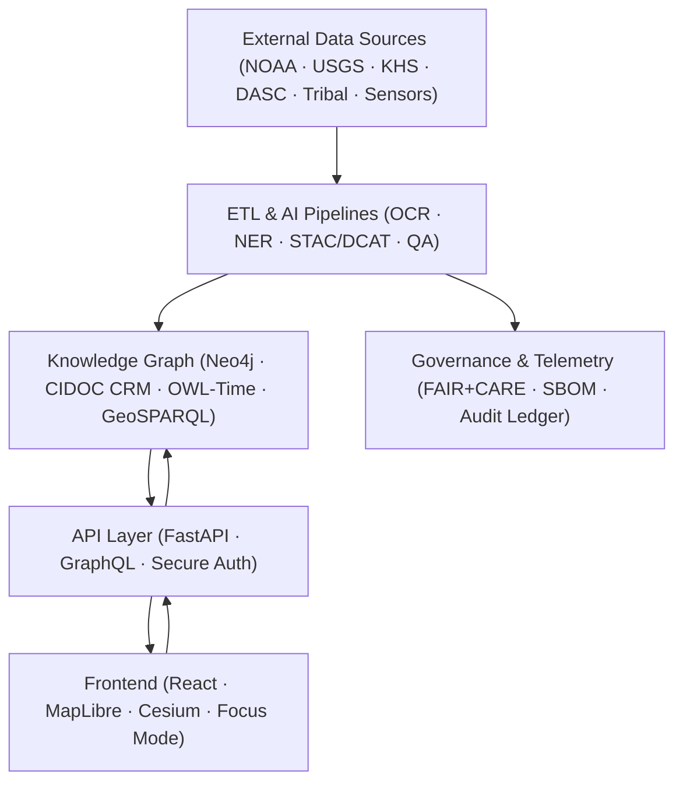

<div align="center">

# 🌾 **Kansas Frontier Matrix — Open-Source Geospatial Historical Mapping Hub**  
`README.md`

**Purpose:**  
Primary entry for developers, historians, scientists, and contributors to explore the mission, architecture, and FAIR+CARE governance of the **Kansas Frontier Matrix (KFM)** — a living semantic atlas of Kansas integrating history, environment, and culture into a reproducible open-data ecosystem.

[](docs/README.md)
[](LICENSE)
[](docs/standards/faircare.md)
[]()

</div>

---

## 📘 Overview

The **Kansas Frontier Matrix (KFM)** is a **semantic geospatial knowledge platform** connecting Kansas’s **cultural, historical, and environmental datasets** into a unified, ethical, and machine-readable system.  
It applies the **Master Coder Protocol v6.3**, **FAIR+CARE principles**, and **Diamond⁹ Ω / Crown∞Ω certification** to guarantee provenance, openness, and scientific reproducibility.

KFM aggregates open-access data from:
- **NOAA**, **USGS**, **Kansas DASC**, **Kansas Historical Society**
- **Tribal archives**, **BLM GLO patents**, **local museums & libraries**

Each dataset is versioned, checksum-verified, and linked to the **Neo4j knowledge graph**, ensuring data lineage, integrity, and long-term sustainability.

---

## 🎯 Mission

> *“Weave Kansas’s past into a living digital landscape where history, geography, and ecology converge.”*

The project unites data science and human heritage to:
- Enable **interdisciplinary research** on ecological and social transformation  
- Empower **citizens, educators, and historians** with accessible data visualizations  
- Protect **Indigenous knowledge** through **CARE-based data governance**  

---

## ✨ Key Features (v10.2)

| Feature | Description |
|---|---|
| 🗺️ **Interactive Map & Timeline** | Linked MapLibre + D3 visual system integrating space and time. |
| 🧠 **Focus Mode v2.1** | AI-powered narrative synthesis with SHAP explainability and ethical flagging. |
| 🧩 **Knowledge Graph (Neo4j)** | CIDOC CRM + GeoSPARQL + OWL-Time + PROV-O schema for entity linking. |
| ⚙️ **ETL & AI Pipelines** | Automated ingestion (OCR, NER, geocoding, summarization) under FAIR+CARE data contracts. |
| 📚 **FAIR+CARE Governance** | Transparent Council-led oversight, Indigenous data consent ledger. |
| 🌐 **STAC/DCAT Catalogs** | STAC 1.0 + DCAT 3.0 datasets with live stream bridge for real-time telemetry. |
| 🛰️ **3D + Temporal Layers** | Cesium 3D viewer for deep-time paleogeography and predictive climate futures. |
| 🧮 **Reproducible Infrastructure** | SPDX SBOMs, SLSA attestations, full CI/CD and governance validation. |

---

## 🏗️ System Architecture



All components exchange **open standards** (GeoJSON, COG, JSON-LD, RDF) and continuously emit **MCP telemetry** for validation and ethics compliance.

---

## 🗂️ Repository Layout

```
KansasFrontierMatrix/
├── src/
│   ├── ai/                 # Focus AI, model training, explainability
│   ├── api/                # FastAPI/GraphQL endpoints
│   ├── graph/              # Neo4j schema, queries, and federation
│   ├── pipelines/          # ETL, validation, FAIR+CARE contracts
│   └── telemetry/          # System-wide observability + metrics
│
├── web/
│   ├── src/                # React components: Map, Timeline, Focus Panel
│   └── public/             # Icons, fonts, assets, A11Y resources
│
├── data/
│   ├── sources/            # STAC/DCAT manifests for data origins
│   ├── raw/                # Source data (DVC/LFS-managed)
│   ├── processed/          # Cleaned GeoJSON, GeoTIFF, CSV
│   └── stac/               # SpatioTemporal Asset Catalog (STAC)
│
├── docs/                   # Documentation, governance, standards
│   ├── standards/          # FAIR+CARE & MCP guidelines
│   ├── analyses/           # Domain-specific research modules
│   ├── templates/          # SOPs, model cards, contribution formats
│   └── guides/             # Developer and governance guides
│
├── tools/                  # CLI utilities (ingest, validate, publish)
├── tests/                  # Unit/integration tests
├── .github/                # CI/CD workflows, issue/PR templates
├── LICENSE                 # MIT (code) / CC-BY 4.0 (docs & data)
├── CONTRIBUTING.md         # MCP-DL v6.3 contribution guide
└── Makefile                # Build, validate, deploy automation
```

---

## 🧱 Data & Ontology Standards

| Standard | Purpose |
|---|---|
| **STAC 1.0 / DCAT 3.0** | Geospatial and semantic dataset discovery |
| **CIDOC CRM** | Cultural heritage ontology for people, places, and events |
| **OWL-Time / GeoSPARQL** | Temporal and spatial reasoning |
| **PROV-O / JSON-LD** | Provenance and linked-data context |
| **SPDX / SLSA** | Software Bill of Materials and security attestations |

---

## 🧠 Focus Mode (AI Context Engine)

| Component | Function |
|---|---|
| **Backend** | `focus_transformer_v2.1` combines graph embeddings and text context for adaptive historical insights. |
| **Frontend** | Interactive panel highlighting linked people, places, events, and documents with AI summaries. |
| **Governance** | CARE filters and provenance tracking in telemetry logs. |

**Example Query:**
```http
GET /api/focus/Medicine_Lodge_Treaty
```
**Response:**  
Linked entities + AI narrative + data lineage + ethics status.

---

## ⚙️ Quickstart

```bash
git clone https://github.com/bartytime4life/Kansas-Frontier-Matrix.git
cd Kansas-Frontier-Matrix
docker-compose up --build
# or run locally
make setup
npm --prefix web start &
uvicorn src.api.main:app --reload
```

Web UI: http://localhost:3000  
API Docs: http://localhost:8000/docs

---

## 🤝 Contributing (MCP v6.3)

Follow the **Documentation-First Principle**.

1. Update relevant Markdown and metadata before coding.  
2. Run:
   ```bash
   make validate
   make test
   ```
3. Submit a pull request with clear changelog, commit scope, and reviewer tags.  
4. CI/CD enforces linting, FAIR+CARE compliance, and full SBOM validation.

---

## ⚖️ Licensing

| Component | License | Description |
|---|---|---|
| **Source Code** | MIT | Core repository logic and ETL pipelines |
| **Docs & Data** | CC-BY 4.0 | Knowledge artifacts and datasets |
| **SBOM / Security Artifacts** | SPDX | Supply chain provenance |

---

## 🧮 FAIR+CARE Governance

| Principle | Implementation |
|---|---|
| **Findable** | STAC/DCAT metadata with DOIs |
| **Accessible** | Public datasets, open APIs |
| **Interoperable** | Semantic ontologies and linked formats |
| **Reusable** | Versioned releases, provenance tracking |
| **CARE** | Council-reviewed governance ledger and ethical access controls |

---

## 🕰️ Version History

| Version | Date | Author | Summary |
|---|---|---|---|
| v10.2.2 | 2025-11-12 | A. Barta & FAIR+CARE Council | Aligned repository to v10.2 infrastructure: expanded telemetry, Focus v2.1, and audit-ready governance. |
| v10.0.0 | 2025-11-09 | A. Barta | First stable release of v10 framework: federated graph, AI explainability, FAIR+CARE v2 alignment. |
| v9.7.0 | 2025-11-05 | A. Barta | Introduced MCP v6.3 compliance and automated documentation pipelines. |

---

<div align="center">

**© 2025 Kansas Frontier Matrix — MIT / CC-BY 4.0**  
Maintained under **Master Coder Protocol v6.3** · **FAIR+CARE Certified** · **Diamond⁹ Ω / Crown∞Ω Ultimate Certified**  
[Back to Documentation Index](docs/README.md) · [Governance Charter](docs/standards/governance/ROOT-GOVERNANCE.md)

</div>