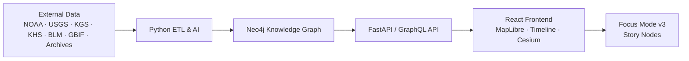

# 🌾 **Kansas Frontier Matrix**

`README.md`

**A semantic historical–geospatial platform blending Kansas data into an interactive map, timeline, and narrative knowledge graph.**

  
  
  
  

---

## 🧭 Overview

Kansas Frontier Matrix (KFM) is an open-source semantic geospatial–historical platform that fuses Kansas’s environmental, cultural, and historical data into a unified interactive experience. It combines:

- A **map** (MapLibre GL) synchronized with a **timeline**  
- An **AI-enriched ETL pipeline** that turns raw archives into structured facts  
- A **Neo4j knowledge graph** aligned with CIDOC-CRM, OWL-Time, GeoSPARQL, and PROV-O  
- A **React frontend** with **Focus Mode v3** and **Story Nodes** for narrative exploration  
- A **predictive analytics layer** extending from deep past to future scenarios  

The goal is a “living atlas” of Kansas: a place where you can see wagon trails, treaties, floods, railroads, prairies, fossils, and future climate projections in one coherent, explorable system.

---

## 🧱 Architecture Overview

KFM follows a layered, metadata-driven architecture:

- **Data Sources**  
  Historical documents, maps, Kansas GIS archives, climate and hydrology datasets, BLM land patents, biodiversity and archaeology data, local and tribal archives.

- **Backend ETL & AI Pipeline (Python)**  
  Deterministic ETL workflows that:
  - Fetch raw data (files, APIs, GIS services)  
  - OCR and parse text  
  - Run NLP (NER, geoparsing, summarization)  
  - Normalize dates, places, people, and events  
  - Upsert entities and relationships into Neo4j  

- **Knowledge Graph (Neo4j)**  
  A semantic graph of:
  - **Entities**: `Person`, `Place`, `Event`, `Document`, `Dataset`, `StoryNode`  
  - **Relationships**: `ATTENDED`, `LOCATED_AT`, `MENTIONS`, `CITED_BY`, `PART_OF`, etc.  
  - Temporal and spatial properties wired to OWL-Time and GeoSPARQL  

- **API Layer (FastAPI / GraphQL)**  
  Well-defined queries to:
  - Pull subgraphs around entities (used by Focus Mode)  
  - Power the map and timeline  
  - Serve Story Nodes and site dossiers  

- **Frontend (React + MapLibre + Cesium)**  
  - 2D map (MapLibre) with synchronized timeline  
  - 3D globe (Cesium) for time-layered visualization  
  - Focus Mode panel, Story Node viewer, filters and legends  

High-level flow:

---

## 🗺 Interactive Map & Timeline

At the heart of KFM is the **linked map + timeline interface**:

- **Map (MapLibre GL)**  
  - Base layers: modern basemaps, Kansas boundaries, elevation, hydrology  
  - Historical overlays: topographic maps, county atlases, treaty boundaries, trails, land surveys  
  - Themed layers: forts, towns, reservations, railroads, archaeological sites, wildlife distributions  

- **Timeline**  
  - Scrollable, zoomable time axis (deep past → present → future)  
  - Events grouped and color-coded by theme (political, environmental, cultural, hazards, etc.)  
  - Tight synchronization:
    - Moving the timeline filters visible layers on the map  
    - Selecting an event highlights its geographic footprint  

Examples of interactive views:

- Drag across **1854–1861** → see Kansas Territory drawn, forts and early towns appear, “Bleeding Kansas” conflicts cluster in time and space.  
- Enable “Dust Bowl” layer and drag through the 1930s → vegetation indices and dust-storm reports animate across western Kansas.  
- Jump to **Cretaceous** → see ancient shorelines of the Western Interior Seaway and fossil discovery sites from Niobrara Chalk.  

The map and timeline are designed to be **WCAG 2.1 AA+** accessible, with keyboard navigation, descriptive labels, and high-contrast options.

---

## 🎯 Focus Mode (AI-Powered Context View)

**Focus Mode v3** is an AI-assisted, entity-centric view that pivots the entire interface around a single focus:

- **Choose a focus**: a `Person`, `Place`, `Event`, `Tribe`, `Treaty`, `Trail`, `Town`, or `StoryNode`.  
- **Graph-driven subgraph**: backend Cypher queries fetch the neighborhood around that entity:
  - Events involving this person or place  
  - Linked documents (letters, newspapers, treaties)  
  - Related people, groups, datasets, and Story Nodes  

- **The UI reconfigures**:
  - Timeline zooms to the relevant lifespan or event window  
  - Map recenters and highlights associated locations  
  - A right-hand **Focus Panel** shows:
    - AI summary (data-grounded, source-aware)  
    - Lists of related events, places, people, and documents  
    - Suggested navigation: “Before/after”, “Nearby places”, “Related stories”  

Focus Mode behaves like an intelligent lens:

- Focusing on **“1867 Medicine Lodge Treaty”**:
  - Timeline tightens around the 1860s–1870s  
  - Map highlights treaty sites and tribal homelands  
  - Panel summarizes the treaty, participating nations, and downstream consequences  

- Focusing on **“Fort Larned”**:
  - Map zooms to the fort and trails converging there  
  - Timeline surfaces events and treaties linked to the fort  
  - Panel links to Story Nodes about the Santa Fe Trail and Indian Wars  

All Focus Mode narratives are treated as **first-class data**: versioned, schema-validated, and tied to underlying sources via PROV-O provenance chains.

---

## 🧬 AI/ML Data Pipeline & Knowledge Graph

The backend pipeline converts messy archives into graph-ready facts:

- **Extract**
  - Download GIS layers (ArcGIS REST, GeoTIFF, Shapefiles)  
  - Ingest CSV, JSON, and NetCDF data from NOAA, USGS, FEMA, Census, GBIF, etc.  
  - Fetch scanned maps and documents (PDF, TIFF, JPEG) from Kansas archives and libraries  

- **Transform**
  - **OCR** on scanned documents and maps  
  - **NLP (spaCy + transformers)**:
    - Named Entity Recognition (PERSON, GPE, ORG, EVENT, DATE, TRIBE, FORT, TREATY…)  
    - Geoparsing and geocoding via GNIS / GeoNames / OSM  
    - Temporal normalization: “Spring 1850s” → approximate date range with precision tags  
    - Summarization of long texts into Focus Mode-friendly abstracts  
  - **Data normalization**:
    - Standard IDs for entities (UUIDs, ARKs, or URNs)  
    - Cleaned schemas for climate, hydrology, hazards, demographics  

- **Load**
  - Upsert nodes and relationships into Neo4j  
  - Attach provenance (`prov:wasDerivedFrom`, `prov:used`) and confidence scores  
  - Generate STAC Items for maps and rasters, and DCAT entries for tabular datasets  

The knowledge graph lets KFM answer rich questions:

- “Show all events involving the Cheyenne within 50 km of this point between 1850 and 1875.”  
- “List all documents that mention ‘Arkansas River’ AND overlap with known flood events.”  
- “What treaties are linked to the shrinking of this reservation polygon over time?”  

---

## 🌐 Data Integration & Open Standards

KFM is built on **open data and open standards** so that everything is reusable and interoperable:

- **SpatioTemporal Asset Catalog (STAC)**  
  - `data/stac/` describes all geospatial assets (raster and vector).  
  - Each Item has spatial extent, temporal range, license, and links back to source manifests.  

- **DCAT & schema.org**  
  - Dataset-level metadata uses DCAT 3.0 fields (title, description, publisher, license, keywords).  

- **CIDOC-CRM, OWL-Time, GeoSPARQL, PROV-O**  
  - Graph schema modeled to support cultural heritage, temporal modeling, spatial relations, and provenance.  

- **FAIR + CARE**  
  - FAIR: Findable, Accessible, Interoperable, Reusable.  
  - CARE: Collective benefit, Authority to control, Responsibility, Ethics.  
  - Sensitive locations (e.g., sacred sites, archaeological coordinates) can be generalized or withheld in accordance with ethical and tribal guidance.  

---

## 📚 Story Nodes & Narrative Layer

**Story Nodes** are curated narrative “tracks” that live alongside the raw data:

- Each Story Node:
  - Has an ID, title, summary, and full narrative (Markdown)  
  - Includes a spacetime footprint (GeoJSON geometry + temporal range)  
  - Lists related entities (people, places, events, datasets)  

Examples:

- **“The Santa Fe Trail”** Story Node  
- **“Bleeding Kansas”** Story Node  
- **“Ecological Change on the Plains”** Story Node  

In the UI, choosing a Story Node runs a guided tour where map, timeline, and narrative are synchronized.

---

## 🔮 Predictive Analytics & Change Detection

KFM includes:

- **Predictive Modeling v2**  
  - Historical + climate models for Kansas up to 2100.  

- **Change Detection**  
  - Compares land cover, river courses, urban expansion, and other layers through time.  

All projections are clearly labeled, with model cards and assumptions documented.

---

## 🌏 3D Time-Layered Visualization

A **Cesium-based 3D globe**:

- Shows terrain, historical overlays, and climate or land-cover fields through time.  
- Synchronizes with the timeline and Focus Mode.  

---

## 🤝 Open-Source Ethos & Contribution

- Code: **MIT-licensed**.  
- Docs: **CC-BY 4.0**.  
- Data: respect source licenses and FAIR+CARE.  

Monorepo structure:

- `src/` — ETL, AI, graph, API  
- `web/` — React, MapLibre, Cesium  
- `data/` — external source manifests, processed outputs, STAC catalogs  
- `docs/` — standards, architecture, guides, Story Node schemas  
- `tests/` — unit/integration tests  
- `tools/` — support scripts  

Contributions follow `CONTRIBUTING.md` and must pass CI (lint, tests, schema, FAIR/CARE, security).

---

## 🗓 Version History

| Version | Date       | Notes                                                                                  |
|--------:|-----------:|----------------------------------------------------------------------------------------|
| v11.0.0 | 2025-11-18 | Upgraded root README to KFM-MDP v11.0; added extended metadata and clarified overview. |
| v10.x   | 2024–2025  | Earlier root README versions aligned to prior architecture iterations.                 |

---

**Kansas Frontier Matrix — Monorepo Overview v11**  
© 2025 Kansas Frontier Matrix — MIT (code) · CC-BY 4.0 (docs)  

[Docs Hub](docs/README.md) · [Master Guide v11](docs/MASTER_GUIDE_v11.md) · [Standards](docs/standards/README.md)

