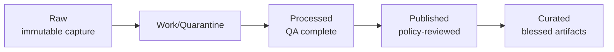
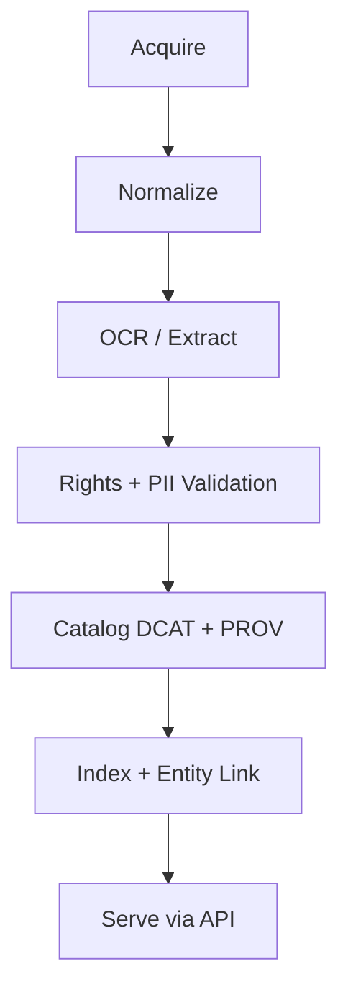

# Kansas-Frontier-Matrix

<details>
<summary><strong>■ Metadata (MetaBlock v2)</strong></summary>

| field | value |
|---|---|
| doc_kind | universal_doc |
| id | kfm.repo.readme |
| title | Kansas-Frontier-Matrix |
| status | draft |
| last_updated | 2026-02-19 |
| owners | kfm:team:core |
| sensitivity | public |
| licenses | CC-BY-4.0 |
| evidence_policy.focus_mode | cite_or_abstain |
| evidence_policy.redaction_profile | public_default |

```kfm-meta
{
  "doc_kind": "universal_doc",
  "id": "kfm.repo.readme",
  "title": "Kansas-Frontier-Matrix",
  "status": "draft",
  "last_updated": "2026-02-19",
  "owners": ["kfm:team:core"],
  "sensitivity": "public",
  "licenses": ["CC-BY-4.0"],
  "repo": {
    "root_name": "Kansas-Frontier-Matrix",
    "product_short_name": "KFM"
  },
  "evidence_policy": {
    "focus_mode": "cite_or_abstain",
    "redaction_profile": "public_default"
  }
}
```

</details>


---

# 1. System Identity

**Kansas-Frontier-Matrix (KFM)** is a governed, bi-temporal, spatio-temporal knowledge system for Kansas.

It integrates:

- Remote sensing  
- Hydrology & climate  
- Air quality & smoke  
- Soil & agriculture  
- Infrastructure (roads/bridges/traffic)  
- Geology & core samples  
- Economy & migration  
- Biodiversity  
- Hazards & disasters  
- Archives, oral histories, newspapers  
- Archaeology & historic resources  
- First-party field collections  

Into:

- 🗺 Policy-labeled, time-aware map layers  
- 📖 Story Mode (auditable narrative graphs)  
- 🔎 Focus Mode (cite-or-abstain answers)  
- 🧪 Deterministic scenario simulations  
- 📦 Governed research notebook exports  
- 🗃 Evidence bundles with immutable lineage  

> [!IMPORTANT]
> **Fail-closed governance is a feature.**  
> If schema, QA, policy, or provenance cannot be verified, publication MUST NOT occur.

---

# 2. Canonical Truth Path

No bypasses.

```mermaid
flowchart LR
  A[Data Sources] --> B[Connector<br/>discover → acquire]
  B --> C[Normalize & Validate]
  C --> D[Immutable Artifacts]
  D --> E[Catalogs<br/>DCAT + STAC + PROV]
  E --> F[Storage & Index]
  F --> G[Governed API<br/>Auth + OPA + Redaction]
  G --> H[UI<br/>Map | Story | Focus]
```

---

# 3. Lifecycle Zones (Append-Only)



Rules:

- Raw is immutable.
- Promotions are append-only.
- Each stage requires catalogs + QA + policy pass.
- CI gates enforce fail-closed promotion.

---

# 4. Non-Negotiable Invariants

## 4.1 Trust Membrane

- UI never accesses databases or object storage directly.
- All access flows through the Governed API.
- Policy evaluation precedes data access.
- Presigned URLs are server-issued and short-lived.

## 4.2 Deterministic Identity

- Stable dataset IDs.
- Content-addressed versions (SHA256).
- Immutable artifacts.
- Signed evidence bundles (OCI + Cosign).

## 4.3 Focus Mode Rule

Every claim must:

- Cite governed evidence  
OR  
- Abstain with audit receipt  

No silent inference.

---

# 5. Bi-Temporal Data Model

All datasets support:

| Dimension | Meaning |
|------------|---------|
| valid_time | Real-world time represented |
| transaction_time | System ingestion/promotion time |

Queries support:

- as_of(timestamp)
- between(t1, t2)
- version_at(sha256)

Partitioning strategy:
- Year-based partitions
- Archive tier after N years

---

# 6. Data Domains

KFM treats Kansas as an integrated spatio-temporal fabric.

| Domain | Required Catalogs | Sensitivity Default |
|--------|-------------------|--------------------|
| Remote sensing | DCAT + STAC + PROV | public |
| Weather & climate | DCAT (+STAC) + PROV | public |
| Hydrology | DCAT (+STAC) + PROV | public/varies |
| Soil & agriculture | DCAT (+STAC) + PROV | public |
| Geology | DCAT + PROV | public |
| Core samples | DCAT + PROV | restricted |
| Transportation (KDOT) | DCAT + PROV | public/varies |
| Economy & migration | DCAT + PROV | public |
| Biodiversity | DCAT + PROV | sensitive species restricted |
| Hazards | DCAT (+STAC) + PROV | public |
| Archives | DCAT + PROV (+STAC if spatial) | restricted-by-default |
| Archaeology | DCAT + PROV | restricted |
| First-party collections | DCAT + PROV (+STAC) | restricted |

---

# 7. Kansas Source Registry

Authoritative registry:

```
catalogs/source_registry.json
```

Each source declares:

- source_id
- domain tags
- priority (P0/P1/P2)
- required catalogs
- QA profile
- sensitivity default
- authoritative upstream
- access pattern

## Priority P0 Universe (Excerpt)

| source_id | Domain | Sensitivity |
|-----------|--------|------------|
| kdot.transportation.assets | Infrastructure | public/varies |
| kgs.core_samples.index | Geology | restricted |
| usgs.nwis.kansas | Hydrology | public |
| usda.nass.cdl | Remote sensing | public |
| noaa.ncei.climate | Climate | public |
| us_census.acs | Demographics | public |
| blm.glo.land_patents | Historic land | medium |
| kshs.kansas_memory | Archives | varies |
| khri.inventory | Archaeology | restricted |
| gbif.occurrences | Biodiversity | varies |

CI fails if P0 coverage incomplete.

---

# 8. Past Collections & Archives

Archives are first-class governed sources.

### Archive Ingestion



### Archive Gates

- File integrity (checksum)
- Rights declared
- PII scan
- Cultural sensitivity review
- Citation anchors defined
- Stable identifiers
- Provenance complete

> [!WARNING]
> Ambiguous rights → restricted by default.

---

# 9. Indigenous Data Governance

KFM aligns with CARE:

- Collective Benefit  
- Authority to Control  
- Responsibility  
- Ethics  

Implementation:

- Community-scoped redaction profiles
- Policy-based access restrictions
- Explicit authority notes in DCAT
- Audit logs retained

---

# 10. Ontology & Semantic Layer

KFM maintains:

- Versioned domain ontologies
- Controlled vocabularies (hazards, crops, formations, species status)
- SKOS concept registry
- Entity normalization layer

Purpose:

- Prevent semantic drift
- Enable cross-domain joins
- Power Story Mode narrative graph

---

# 11. Knowledge Graph

Graph layer includes:

- Canonical entity IDs
- Relationship edges
- Provenance links

Cross-domain join keys:

- GEOID
- HUC watershed
- FIPS
- PLSS
- Ecoregion
- Tribal boundary

Entity resolution rules versioned.

---

# 12. Remote Sensing Standards

Preferred formats:

- COG (imagery)
- Zarr (time-series grids)
- GeoParquet (vectors)

Minimum QA:

- nodata %
- min/max
- percentile stats
- CRS validity
- timestamp sanity

All spatial assets require STAC.

---

# 13. ML / Model Governance

Models are governed artifacts.

Required:

- Model card
- Training dataset versions
- Feature store reference
- Bias evaluation report
- Reproducibility hash
- Inference audit log

---

# 14. Redaction Framework

Sensitivity classes:

| Class | Action |
|--------|--------|
| Public | none |
| Medium | aggregate/fuzz |
| Restricted | generalize |
| Sensitive | deny |

Methods:

- Coordinate fuzz radius
- Small count suppression
- K-anonymity thresholds
- Optional differential privacy

---

# 15. Scenario Engine

Scenarios defined via deterministic DSL:

```text
scenario "example" {
  inputs { dataset = "id@sha256:..." }
  assumptions { variable = value }
  horizon = "12 months"
}
```

Outputs:

- Derived artifacts
- Evidence bundle
- Story Node explanation
- Policy labels

---

# 16. Governed API Contract

All responses must include:

```json
{
  "data": {},
  "policy": {
    "label": "public",
    "redactions_applied": [],
    "decision_id": "opa:decision:..."
  },
  "provenance": {
    "bundle_ref": "oci://kfm-evidence/dataset@sha256:...",
    "citations": []
  },
  "meta": {
    "request_id": "req_...",
    "generated_at": "ISO8601"
  }
}
```

---

# 17. CI Promotion Gates

Fail closed if:

- Missing DCAT
- Missing PROV
- Missing STAC (if spatial)
- QA thresholds unmet
- Policy tests fail
- Source coverage incomplete
- Signature missing

---

# 18. Supply Chain Security

- SBOM per service
- Cosign artifact signatures
- SLSA provenance target
- Immutable OCI bundles
- CI attestation verification

---

# 19. Observability & SLOs

Metrics registry:

- API latency p95
- Policy evaluation time
- Dataset freshness
- QA failure rate

Example SLOs:

- 99% API uptime
- <500ms policy evaluation
- <24h ingestion lag for daily feeds

---

# 20. Disaster Recovery

- Multi-region replication
- Nightly metadata snapshot
- Cold archive tier
- RPO: 24h
- RTO: 4h target

---

# 21. Cost Governance

Tracked per dataset:

- Storage
- Compute
- API usage
- Inference cost

Budget thresholds enforce alerts.

---

# 22. Interoperability Crosswalk

| DCAT | STAC | PROV | ISO19115 |
|------|------|------|----------|
| dataset | collection | entity | MD_Metadata |
| distribution | asset | used | CI_OnlineResource |
| publisher | provider | agent | CI_ResponsibleParty |

---

# 23. Notebook Governance

Requirements:

- Pinned dataset versions
- Pinned dependencies
- Export manifest
- Policy labels
- Container sandbox
- Resource quotas

---

# 24. Repository Layout

```text
Kansas-Frontier-Matrix/
├── README.md
├── apps/
│   └── web/                # Map, Story, Focus UI
├── services/
│   ├── api/                # Governed API
│   ├── pipelines/          # Connectors
│   ├── policy/             # OPA/Rego
│   ├── scenarios/          # What-if engine
│   ├── graph/              # Knowledge graph
│   ├── ontology/           # Semantic layer
│   ├── feature_store/      # ML features
│   └── observability/      # Metrics & SLOs
├── catalogs/
│   ├── dcat/
│   ├── stac/
│   ├── prov/
│   └── source_registry.json
├── schemas/
├── notebooks/
├── docs/
├── infra/
└── .github/workflows/
```

---

# 25. Definition of Done (Dataset)

- [ ] Added to source_registry.json  
- [ ] DCAT record complete  
- [ ] STAC record (if spatial)  
- [ ] PROV lineage complete  
- [ ] QA thresholds met  
- [ ] Policy tests pass  
- [ ] Evidence bundle signed  
- [ ] API serves with provenance  
- [ ] UI renders via governed API  

---

# 26. System Identity

KFM is:

- Deterministic  
- Bi-Temporal  
- Policy-Enforced  
- Evidence-First  
- Archive-Aware  
- Ontology-Grounded  
- Graph-Connected  
- Supply-Chain Secured  
- Fail-Closed  

If invariants cannot be verified, publication must not occur.
