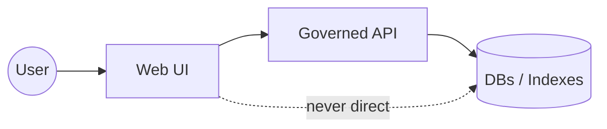

# Kansas Frontier Matrix (KFM) 🌾🗺️

> A “living atlas” of Kansas—maps + timelines backed by governed catalogs, a knowledge graph, and provenance-linked Story Nodes.


---

## Table of contents

- [What KFM is](#what-kfm-is)
- [What KFM is not](#what-kfm-is-not)
- [System overview](#system-overview)
- [Repository layout](#repository-layout)
- [Quickstart](#quickstart)
- [Ports and environment variables](#ports-and-environment-variables)
- [Data pipeline and provenance](#data-pipeline-and-provenance)
- [Documentation and Story Nodes](#documentation-and-story-nodes)
- [Governance and safety](#governance-and-safety)
- [Contributing](#contributing)
- [License and citation](#license-and-citation)

---

## What KFM is

KFM is a **pipeline → catalog → databases → API → UI** system that transforms raw historical/spatial sources into **trustworthy, explorable knowledge**:

- 🧾 **Provenance-first**: maps, narratives, and even AI-assisted outputs are traceable to sources (“the map behind the map”).
- 🗃️ **Structured storage**: spatial data in a relational store (e.g., PostGIS) plus a knowledge graph (e.g., Neo4j), with optional search/vector indexing.
- 🌐 **Governed access**: the UI and external clients consume **governed APIs**, not direct database connections.
- 📚 **Story Nodes + Focus Mode**: narrative Markdown that links evidence + context, rendered in a read-only “Focus Mode” to keep stories and citations together.

> [!NOTE]
> KFM treats documentation, datasets, schemas, and governance rules as **system contracts**—not “extra docs.” Changes are expected to be reviewable, traceable, and CI-checkable.

---

## What KFM is not

- ❌ Not a “upload-and-forget” data portal.
- ❌ Not a black-box GIS.
- ❌ Not an ungoverned chatbot. Any AI experience is constrained by project policies and must cite project evidence.

---

## System overview

### End-to-end flow

```mermaid
flowchart LR
  raw[Raw inputs] --> etl[ETL / pipelines]
  etl --> processed[Processed datasets]
  etl --> catalog[Catalog metadata (STAC/DCAT)]
  etl --> prov[Provenance logs (PROV)]

  processed --> stores[(Stores)]
  stores --> postgis[(PostGIS)]
  stores --> neo4j[(Neo4j)]
  stores --> search[(Search / Vector Index)]

  postgis --> api[API Gateway (FastAPI / GraphQL)]
  neo4j --> api
  search --> api

  api --> ui[Web UI (React + MapLibre)]
  ui --> focus[Focus Mode (Story Nodes)]
```

### Trust membrane (non-negotiable boundary)



**Trust membrane rule:** the browser UI never talks directly to databases; all access is mediated by the API layer, which enforces validation, provenance requirements, and governance policies.

---

## Repository layout

Top-level directories visible in this repo include:

```text
.
├── .github/              # Repo governance & automation control plane
├── api/                  # Backend API surface (implementation details inside)
├── web/                  # Frontend UI surface (implementation details inside)
├── data/                 # Versioned datasets (and typically metadata/provenance)
├── docs/                 # Governed documentation (templates, standards, story nodes)
├── mcp/                  # Tooling integration (not confirmed; see directory)
├── pipelines/            # ETL + validation pipelines
├── policy/               # Governance/policy rules (not confirmed; see directory)
├── releases/             # Release packaging + release notes
├── schemas/              # Schemas/contracts for validation (datasets/docs/APIs)
├── tests/                # Tests
├── tools/                # Dev tools (linters/generators/scripts)
├── .env.example
├── docker-compose.yml
├── CONTRIBUTING.md
├── CITATION.cff
└── CHANGELOG.md
```

> [!IMPORTANT]
> Some subpaths referenced below (especially under `docs/` and `data/`) may be **intended baseline** even if your snapshot differs. If a required folder/file is missing, treat that as a convergence task—not a reason to bypass governance.

---

## Quickstart

### Option A: Local dev with Docker Compose (recommended)

```bash
cp .env.example .env
docker compose up -d --build
```

Typical local dev pattern:

- API and DB services start via Compose.
- Web UI runs either in Compose or via a local dev server (depends on repo configuration).

> [!NOTE]
> Compose is the source of truth for what runs, what builds, and how services connect. If anything below differs from your environment, **defer to `docker-compose.yml` + `.env`**.

### Option B: Develop from source (advanced)

<details>
<summary><strong>Show a typical from-source flow (verify in-repo before using)</strong></summary>

**Backend (typical FastAPI):**
- Create a Python venv
- Install dependencies
- Run an ASGI server (e.g., `uvicorn`)

**Frontend (typical React):**
- Install Node dependencies
- Run dev server (`npm start` / `pnpm dev`)

Because KFM is governed, from-source setups should still point at the same governed services and honor the trust membrane (UI → API → stores).
</details>

---

## Ports and environment variables

Below is a **typical** KFM service map (verify in `.env` + Compose):

| Component | Default port(s) | Notes |
|---|---:|---|
| PostGIS (PostgreSQL) | 5432 | `POSTGRES_USER`, `POSTGRES_PASSWORD`, `POSTGRES_DB` |
| Neo4j (HTTP UI) | 7474 | Admin UI |
| Neo4j (Bolt) | 7687 | Driver protocol |
| Backend API (FastAPI) | 8000 | `DATABASE_URL`, `NEO4J_URL`, optional search URL |
| Frontend (React dev) | 3000 | `REACT_APP_API_URL` (or equivalent) |
| Elasticsearch (optional) | 9200 / 9300 | Often dev uses single-node mode |

> [!WARNING]
> Do **not** commit secrets to the repo. Use `.env` locally and keep production secrets in your deployment platform (Kubernetes Secrets / vault / etc.).

---

## Data pipeline and provenance

KFM’s canonical “truth path” is:

**Raw Inputs → Pipelines → Processed Data (+ Metadata + Provenance) → Stores → API → UI**

### Expected data substructure

Inside `data/`, KFM’s blueprints assume (or strongly recommend) a structure like:

- `data/raw/` — immutable source artifacts (downloaded files, scans, originals)
- `data/processed/` — cleaned/standardized outputs used by the API/UI
- `data/catalog/` — dataset metadata (e.g., STAC/DCAT)
- `data/provenance/` — lineage logs (e.g., PROV)

> [!TIP]
> Treat `data/raw/` as evidence. Pipelines read from it; they should not rewrite it in-place.

### Dataset change workflow (PR-driven)

When adding or updating a dataset:

- [ ] Add/refresh source artifacts under `data/raw/...`
- [ ] Run the relevant pipeline under `pipelines/...`
- [ ] Commit outputs under `data/processed/...`
- [ ] Add/update catalog entry under `data/catalog/...`
- [ ] Add/update provenance log under `data/provenance/...`
- [ ] Open a PR; CI and reviewers validate that **processed data** is matched with **metadata + provenance**

---

## Documentation and Story Nodes

All official KFM documentation is governed Markdown under `docs/`.

### What “governed docs” means

A governed doc is a Markdown file that:

- follows an approved template structure,
- links substantive claims to evidence (dataset IDs, doc URNs, commit hashes),
- passes lint + structure validation + link checks.

### Templates you’re expected to use

These are the canonical entry points for new documentation (paths shown as the intended baseline):

- `docs/templates/TEMPLATE__KFM_UNIVERSAL_DOC.md`
- `docs/templates/TEMPLATE__STORY_NODE_V3.md`
- `docs/templates/TEMPLATE__API_CONTRACT_EXTENSION.md`

### Story Nodes + Focus Mode

**Story Nodes** are narrative Markdown artifacts that bind:

- narrative structure,
- citations and evidence links,
- entities/relationships suitable for knowledge graph linking.

They are designed to render cleanly in **Focus Mode** so users can explore stories and sources together without hallucinated context.

---

## Governance and safety

### FAIR + CARE (and why it matters here)

KFM’s platform posture assumes:

- **FAIR**: Findable, Accessible, Interoperable, Reusable
- **CARE**: Collective Benefit, Authority to Control, Responsibility, Ethics

### Sensitive data handling (default-safe)

KFM may touch culturally sensitive, vulnerable, or restricted information.

- Do not publish precise locations of sensitive sites in public docs.
- Generalize/redact and flag for governance review when uncertain.
- Prefer “least detail necessary” for public artifacts.

> [!IMPORTANT]
> If you’re unsure whether a detail is permissible, omit it and open a governance issue/PR discussion. Safe-by-default beats completeness.

---

## Contributing

Start with:

- `CONTRIBUTING.md`
- `.github/` (repo governance and CI expectations)
- `docs/standards/` and `docs/templates/`

### Contribution principles

- ✅ Evidence-first: every substantive claim should be backed by a source reference.
- ✅ Fail-closed: missing required metadata/provenance should block merge.
- ✅ Respect boundaries: UI → API → stores; core logic via interfaces, not direct DB calls.

### A practical “Definition of Done” checklist (docs/data changes)

- [ ] Used the correct template (or documented why not)
- [ ] Added provenance links for substantive claims
- [ ] Updated catalog/provenance alongside processed outputs
- [ ] No broken links/images
- [ ] Lint/CI checks pass
- [ ] Sensitive content handled (generalize/redact + governance notes)

---

## License and citation

- **License:** Apache-2.0 (see `LICENSE`)
- **How to cite KFM:** see `CITATION.cff`

---

### Footnotes

[^1]: If a path or file name in this README differs from your repo snapshot, treat the README as the intended governed baseline and align via PR (rather than bypassing governance).