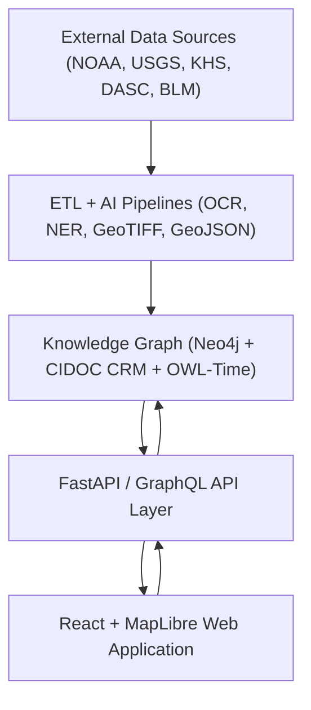

<div align="center">

# 🌾 **Kansas Frontier Matrix — Open-Source Geospatial Historical Mapping Hub**
`README.md`

**Purpose:** Serve as the primary entry point for developers, historians, scientists, and contributors to understand the mission, architecture, governance model, and data framework of the Kansas Frontier Matrix (KFM).  
KFM unites Kansas’s historical, environmental, and cultural data into a **FAIR+CARE-certified**, **MCP-compliant**, and **reproducible open data ecosystem**.

[](docs/README.md)
[](LICENSE)
[](docs/standards/faircare.md)
[]()

</div>

---

## 📘 Overview

The **Kansas Frontier Matrix (KFM)** is a **semantic geospatial knowledge hub** integrating Kansas’s **environmental, cultural, and historical archives** into an **open-source digital infrastructure**.  
Built under **Master Coder Protocol v6.3** and aligned with **FAIR+CARE** data ethics, it enables **traceable**, **reproducible**, and **machine-readable** data publication.

The system brings together **maps, archives, and datasets** from:
- **NOAA**, **USGS**, **Kansas Historical Society**, **Kansas DASC Geoportal**
- **Tribal archives**, **BLM GLO Records**, and **local museums**

Each artifact is versioned, checksum-verified, and governed through transparent FAIR+CARE workflows.

---

## 🎯 Mission

> *“To weave Kansas’s past into a living digital landscape where history, geography, and ecology converge.”*

KFM connects **historical context**, **ecological data**, and **cultural geography** by:
- Supporting **interdisciplinary research** on environmental and societal change.  
- Empowering **communities and educators** with visual and analytical storytelling.  
- Preserving **Indigenous knowledge and heritage** through ethical open data.  

---

## ✨ Key Features

| Feature | Description |
|----------|-------------|
| 🗺️ **Interactive Map & Timeline** | Explore Kansas data through a synchronized MapLibre + D3 visualization linked to temporal data. |
| 🧠 **AI-Powered Focus Mode** | Analyze entity relationships (People, Places, Events) using `focus_transformer_v1`. |
| 🧩 **Knowledge Graph** | Neo4j-based semantic graph aligned with CIDOC CRM, OWL-Time, and PROV-O. |
| ⚙️ **ETL & AI Pipelines** | Automated ingestion, OCR, NLP, and validation pipelines. |
| 📚 **FAIR+CARE Compliance** | Governance automation for Indigenous and cultural datasets. |
| 🌐 **STAC/DCAT Metadata** | STAC 1.0.0 and DCAT 3.0 catalogs ensure global dataset discoverability. |
| 🧮 **Governed Open Source** | Validated through SPDX SBOMs, FAIR+CARE audits, and GitHub CI/CD pipelines. |

---

## 🏗️ System Architecture

The KFM system architecture unites **data pipelines**, **AI reasoning**, and **interactive visualization**:



Each layer communicates via **open schemas (GeoJSON, STAC, DCAT, JSON-LD)** with **MCP telemetry**, enabling cross-layer validation and reproducibility.

---

## 🗂️ Directory Layout

```
KansasFrontierMatrix/
├── src/                     # Application logic & pipelines
│   ├── ai/                  # AI models, explainability, focus engine
│   ├── api/                 # FastAPI / GraphQL backend
│   ├── graph/               # Neo4j schema & ontology mapping
│   └── pipelines/           # ETL, validation, FAIR+CARE workflows
│
├── web/                     # React + MapLibre web client
│   ├── src/                 # Components (MapView, TimelineView, FocusPanel)
│   └── public/              # Icons, fonts, and accessibility assets
│
├── data/                    # Raw → processed datasets and metadata
│   ├── sources/             # External source manifests (DCAT/STAC)
│   ├── raw/                 # Downloaded datasets (LFS-tracked)
│   ├── processed/           # Validated GeoJSON, GeoTIFF, CSVs
│   └── stac/                # STAC catalog metadata
│
├── docs/                    # Documentation, governance, and templates
│   ├── standards/           # FAIR+CARE, licensing, governance
│   ├── templates/           # Issue forms, SOPs, model cards
│   └── architecture.md      # Extended system design overview
│
├── tools/                   # CLI utilities (ingest, generate, validate)
│   ├── ingest_data.py
│   ├── generate_stac.py
│   └── validate_data.py
│
├── tests/                   # Unit/integration tests for ETL, AI, and APIs
├── .github/                 # CI/CD pipelines, issue templates
├── LICENSE                  # MIT License for code / CC-BY 4.0 for data
├── CONTRIBUTING.md           # Developer contribution protocol
└── Makefile                  # Entry point for build & validation
```

---

## 🧱 Data Standards

| Standard | Purpose |
|-----------|----------|
| **STAC 1.0.0** | Geospatial indexing and time-series dataset linkage |
| **DCAT 3.0** | Metadata catalog interoperability |
| **CIDOC CRM** | Cultural heritage ontology for provenance and relationships |
| **OWL-Time** | Temporal modeling and chronology of events |
| **GeoJSON / GeoTIFF** | Geospatial formats for layers and raster data |
| **JSON-LD / RDF** | Semantic web integration for linked data publication |

---

## 🧠 Focus Mode (AI Context Engine)

**Purpose:** Enhance user exploration through AI-driven narrative synthesis.

| Layer | Function |
|--------|----------|
| **Backend** | `focus_transformer_v1` model identifies entity connections and relationships. |
| **Frontend** | Displays summaries, maps, and event relationships contextually. |
| **Governance** | Outputs FAIR+CARE metadata to `focus-telemetry.json` for audit review. |

**Example Query:**
```bash
GET /api/focus/Fort_Larned
```
**Response:** Graph subgraph + AI summary + provenance entries.

---

## ⚙️ Installation & Usage

```bash
# Clone the repository
git clone https://github.com/bartytime4life/Kansas-Frontier-Matrix.git
cd Kansas-Frontier-Matrix

# Build and run
docker-compose up --build
# OR local environment
make setup
npm start        # frontend
python main.py   # backend
```

**Default Local URLs**
- 🌐 Web App → `http://localhost:3000`  
- 🧠 API Docs → `http://localhost:8000/docs`  

---

## 🤝 Contributing (MCP v6.3)

KFM follows **“Documentation First, Code Second.”**  

1. Add or modify documentation in `docs/` or dataset manifests in `data/sources/`.  
2. Validate using:  
   ```bash
   make validate
   ```
3. Ensure YAML front-matter and metadata include:
   - License, checksum, version, and FAIR+CARE compliance
4. Submit a PR with updated metadata and validation results.

All contributions must pass **STAC/DCAT**, **FAIR+CARE**, and **docs-lint** checks via CI/CD.

---

## ⚖️ License

| Asset | License | Description |
|--------|----------|--------------|
| **Codebase** | MIT | Reusable with attribution |
| **Documentation / Data** | CC-BY 4.0 | FAIR-aligned open data reuse |
| **Metadata** | SPDX SBOM | Machine-verifiable manifest (`releases/v9.7.0/sbom.spdx.json`) |

---

## 🧮 FAIR+CARE & Governance Integration

| Principle | Implementation |
|------------|----------------|
| **Findable** | STAC/DCAT catalogs with UUID metadata |
| **Accessible** | Public GitHub repository with open licenses |
| **Interoperable** | JSON-LD schemas and ontologies (CIDOC CRM, OWL-Time) |
| **Reusable** | Versioned, checksum-verified datasets |
| **CARE** | Council-reviewed ethical governance for sensitive content |

---

## 🕰️ Version History

| Version | Date | Author | Summary |
|----------|------|---------|----------|
| v9.7.0 | 2025-11-05 | A. Barta | Full rebuild for MCP 6.3 + FAIR+CARE; added AI telemetry and governance linkages. |
| v9.5.0 | 2025-10-20 | A. Barta | Added Focus Mode integration and DCAT 3.0 alignment. |
| v9.3.0 | 2025-08-12 | KFM Core Team | Improved ETL and knowledge graph schema. |
| v9.0.0 | 2025-06-01 | KFM Core Team | Initial MCP-compliant public release. |

---

<div align="center">

**© 2025 Kansas Frontier Matrix — MIT / CC-BY 4.0**  
Maintained under **Master Coder Protocol v6.3** · FAIR+CARE Certified · Diamond⁹ Ω / Crown∞Ω Ultimate Certified  
[Back to Documentation Index](docs/README.md) · [Governance Charter](docs/standards/governance/ROOT-GOVERNANCE.md)

</div>
