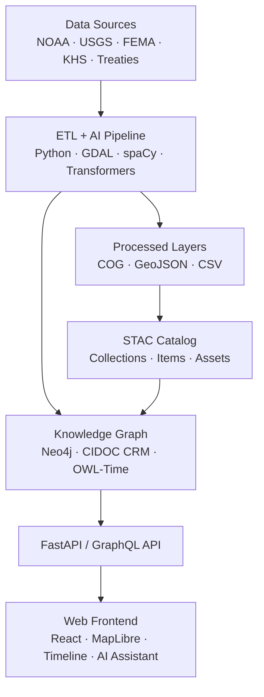

<div align="center">

# 🧭 **Kansas Frontier Matrix — Root Repository Overview**

### *“Time · Terrain · History · Knowledge Graphs”*

[](./.github/workflows/site.yml)
[](./.github/workflows/stac-validate.yml)
[](./.github/workflows/codeql.yml)
[](./.github/workflows/trivy.yml)
[](./docs/)
[](./LICENSE)

</div>

---

## 🌾 Mission

The **Kansas Frontier Matrix (KFM)** is an open-science platform that connects **time, terrain, and history** across Kansas.  
It integrates climate, land, treaty, and historical archives into a **semantic knowledge graph** (Neo4j + CIDOC CRM) visualized via an **interactive React + MapLibre timeline-map interface**.

> *Every dataset tells a story; every story is mapped, cited, and reproducible.*

---

## 🧠 Core Concepts

| Layer                 | Purpose                                                     |
| :-------------------- | :---------------------------------------------------------- |
| **ETL / Processing**  | Extract, transform, and validate data into geospatial layers |
| **AI / ML Enrichment**| OCR, NLP, and summarization to link entities and events     |
| **Knowledge Graph**   | Semantic model (CIDOC CRM · OWL-Time · GeoSPARQL)          |
| **API Layer**         | FastAPI + GraphQL endpoints for entities, events, tiles     |
| **Web Frontend**      | React + MapLibre + D3 Timeline for interactive exploration  |

---

## 🏛 Architecture Snapshot



---

## 🧱 Repository Structure

```text
Kansas-Frontier-Matrix/
├─ src/                # ETL, AI/ML, graph integration
├─ web/                # React + MapLibre frontend
├─ data/
│  ├─ sources/         # Source manifests (license, provenance)
│  ├─ raw/             # Input datasets (LFS/DVC pointers)
│  ├─ processed/       # GeoJSON, COGs, CSVs
│  └─ stac/            # STAC catalogs & metadata
├─ docs/               # Architecture, SOPs, design, glossary
├─ tools/              # CLI scripts, deploy configs
├─ tests/              # Unit + integration tests
└─ .github/            # Workflows, issue templates, PR pipelines
```

---

## ⚙️ Quickstart

### 🧰 Prerequisites
- **Python 3.11+**
- **Node.js 20+**
- **Neo4j 5.x**
- **GDAL / Rasterio**
- **pnpm / Make**

### 🚀 Setup

```bash
git clone https://github.com/bartytime4life/Kansas-Frontier-Matrix.git
cd Kansas-Frontier-Matrix

# Backend
pip install -r requirements.txt

# Frontend
cd web && pnpm install && cd ..

# Environment Variables
export NEO4J_URI=bolt://localhost:7687
export NEO4J_USER=neo4j
export NEO4J_PASS=neo4j
export VITE_API_URL=http://localhost:8000
```

### 🧮 Run Pipeline

```bash
make fetch         # Download raw datasets
make process       # Transform → processed/
make stac          # Generate & validate STAC catalog
make serve         # Start backend + frontend dev servers
```

Open **http://localhost:3000** to explore the timeline map.

---

## 🧩 Major Components

| Component     | Location               | Description                                      |
| :-------------| :--------------------- | :----------------------------------------------- |
| **ETL Engine**| `src/etl/`             | Data ingestion and transformation scripts        |
| **AI Pipeline**| `src/ai/`             | NLP, OCR, summarization modules                 |
| **API Server**| `src/api/`             | FastAPI + GraphQL schema definitions             |
| **Frontend**  | `web/src/`             | React components (Map, Timeline, AI Assistant)   |
| **STAC Data** | `data/stac/`           | JSON metadata for each dataset & asset           |
| **Docs**      | `docs/`                | Standards, workflows, and design assets          |

---

## 🔒 Security & Provenance

- CodeQL: static analysis  
- Trivy: container & dependency scans  
- SHA-256: data integrity  
- PROV-O: dataset provenance graph  
- Signed CI workflows  
- Audit trails stored in build logs  

---

## 🧾 Versioning & Governance

| Domain | Versioning | Standard |
| :------| :---------- | :--------|
| **Code** | SemVer | MCP-DL v6.3 |
| **Data** | STAC versioning | STAC 1.0 |
| **Docs** | MCP metadata | CC-BY 4.0 |
| **Models** | Model cards | FAIR/MCP |

---

## 🤝 Contributing

1. Fork & branch (`feature/*`)
2. Add/update documentation (README or SOP)
3. Validate STAC (`make stac-validate`)
4. Run tests and lints
5. Submit PR with summary of changes and provenance logs

**Templates:**
- `docs/templates/sop.md`
- `docs/templates/experiment.md`
- `docs/templates/model_card.md`

---

## 🧠 Standards & Alignment

- **MCP-DL v6.3** — Documentation Language & Provenance Framework  
- **STAC 1.0 / DCAT 2.0** — Dataset metadata  
- **CIDOC CRM / OWL-Time / GeoSPARQL** — Semantic interoperability  
- **WCAG 2.1 AA** — Accessibility compliance  
- **FAIR Principles** — Findable, Accessible, Interoperable, Reusable  

---

## 📚 References

- [`docs/architecture/system-architecture-overview.md`](docs/architecture/system-architecture-overview.md)
- [`docs/architecture/file-architecture.md`](docs/architecture/file-architecture.md)
- [`docs/kansas-frontier-matrix-web-ui-design-document.pdf`](docs/kansas-frontier-matrix-web-ui-design-document.pdf)
- [`data/stac/`](data/stac/)
- [`tests/`](tests/)

---

<div align="center">

🏛 *Document the Frontier · Reconstruct the Past · Illuminate Connections*  
© 2025 Kansas Frontier Matrix — MIT (code) · CC-BY 4.0 (data/docs)

</div>
