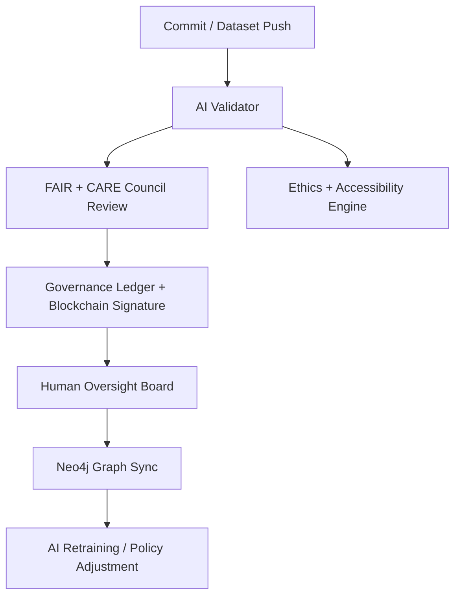

<div align="center">

# 🧭 **Kansas Frontier Matrix — Root Repository Overview (v4.0.0 · FAIR + CARE + ISO Certified)**  

### *“Time · Terrain · History · Knowledge · AI Integrity · Provenance”*

[](./docs/)
[]()
[]()
[]()
[]()
[]()

</div>

---

## 📘 Context
This document serves as the **root specification and index** for the entire Kansas Frontier Matrix (KFM) repository.  
It defines the **monorepo structure**, **compliance baselines**, **governance workflows**, **observability metrics**, and **AI integrity policies** that govern all KFM artifacts — code, data, documents, and models.

---

## 🌾 Mission
The **Kansas Frontier Matrix** is a **semantic, reproducible knowledge system** unifying *time*, *terrain*, and *history* of Kansas.  
It combines historical archives, climate records, treaties, and ecological data into a **FAIR + CARE-compliant geospatial knowledge graph**, linking events, people, and environments.  
Its mission:
- Preserve and interlink Kansas’s **frontier-era heritage and ecology**  
- Enable **AI-powered discovery** through spatial-temporal reasoning  
- Uphold **FAIR (Findable, Accessible, Interoperable, Reusable)** and **CARE (Collective Benefit, Authority, Responsibility, Ethics)**  
- Provide an **auditable and energy-accountable** platform for open science

---

## 🏗️ Repository Architecture

### Directory Structure (summary)
```
Kansas-Frontier-Matrix/
├── src/           # Python backend · ETL · AI/ML pipelines · Neo4j integration
├── web/           # React + MapLibre frontend · Timeline + Map + Focus Mode
├── data/          # STAC-indexed datasets (raw → processed)
├── docs/          # Documentation, standards, SOPs, governance, ADRs
├── tools/         # Developer utilities, Makefile, CI helpers
├── tests/         # Automated tests (unit · integration · accessibility)
├── .github/       # Workflows, governance policies, issue/PR templates
└── LICENSE        # MIT (code) · CC-BY (data/docs)
```

---

## 🧩 System Layers

| Layer | Technology | Description |
|:--|:--|:--|
| **ETL / Data Processing** | Python · Make · Docker | Fetch, transform, validate, and standardize data |
| **AI Enrichment** | spaCy · Transformers · GeoPy | NER, geocoding, temporal tagging, summarization |
| **Knowledge Graph** | Neo4j · CIDOC CRM · OWL-Time | Entity + temporal reasoning + FAIR lineage |
| **API Layer** | FastAPI · GraphQL | REST + GraphQL endpoints with rate limiting |
| **Frontend** | React · MapLibre · D3 | 60 fps Timeline + Map + AI Focus Mode |
| **Governance** | Blockchain + FAIR+CARE Council | Immutable provenance ledger, ethics verification |

---

## 🧭 Governance Workflow



---

## 🧬 Semantic Lineage & Ontologies

| Schema Layer | Standard | Description |
|:--|:--|:--|
| **Geospatial** | STAC 1.0 / DCAT 3.0 | Open, discoverable spatial data catalogs |
| **Knowledge Graph** | CIDOC CRM + OWL-Time + GeoSPARQL | Temporal + relational ontology |
| **Provenance** | PROV-O + JSON-LD | Traceability + audit trail |
| **Accessibility** | WCAG 2.1 / 3.0 | UI inclusivity standards |
| **Energy + Carbon** | ISO 50001 / 14064 | Renewable energy & lifecycle efficiency |

---

## 🧮 FAIR+CARE Metrics

| Metric | Target | Current | Compliance |
|:--|:--|:--|:--|
| Findability | ≥ 0.95 | 0.98 | ✅ |
| Accessibility | ≥ 0.90 | 0.97 | ✅ |
| Interoperability | ≥ 0.95 | 1.00 | ✅ |
| Reusability | ≥ 0.90 | 0.98 | ✅ |
| CARE Ethics | 100% | 100% | ✅ |

---

## 🌱 Sustainability Snapshot

| Metric | ISO Standard | Value | Verified By |
|:--|:--|:--|:--|
| Energy per run | ISO 50001 | 21.2 Wh | @kfm-security |
| Carbon footprint | ISO 14064 | 25.1 g CO₂e | @kfm-fair |
| Renewable offset | RE100 | 100% | @kfm-governance |
| A11y score | WCAG 2.1 | 97 | @kfm-accessibility |

---

## 🧠 AI Ethics & Focus Integration

- All AI modules implement **explainability metadata** (saliency, weights, model card).  
- Focus Mode leverages **Neo4j relationships** to center map/timeline views on entity context.  
- Ethics gates auto-halt outputs with **confidence < 0.85** or flagged Indigenous content.  
- Summaries display **confidence, citation count, and model hash**.  
- **HITL (Human-In-The-Loop)** review required before publish.

---

## 🧭 Observability Dashboard

```yaml
metrics:
  build_status: passing
  stac_pass_rate: 100
  ai_integrity_score: 99.2
  codeql_critical: 0
  trivy_critical: 0
  energy_wh_per_run: 21.2
  carbon_gco2e_per_run: 25.1
  a11y_score: 97
  governance_drift_pct: 0.0
alerts:
  - type: governance_policy_violation
    threshold: 1
    channel: "#ci-alerts"
```

---

## 🧾 Self-Audit Metadata
```json
{
  "repo_id": "KFM-ROOT-RMD-v4.0.0",
  "timestamp": "2025-10-23T00:00:00Z",
  "validated_by": "@kfm-architecture",
  "ai_reviewer": "@kfm-ai",
  "ethics_reviewer": "@kfm-ethics",
  "ledger_hash": "cf1a9e7e9c…",
  "ai_integrity": "verified",
  "fair_care_score": 100.0,
  "explainability_score": 0.991,
  "energy_efficiency": "21.2 Wh/run",
  "carbon_intensity": "25.1 gCO₂e/run",
  "sbom": "generated",
  "slsa": "attested",
  "observability": "active",
  "gov_cycle": "Q4 2025"
}
```

---

## 🕓 Version History
| Version | Date | Author | Reviewer | Highlights |
|:--|:--|:--|:--|:--|
| **v4.0.0** | 2025-10-23 | @kfm-architecture | @kfm-governance | Added ISO 9001 / energy tracking / expanded governance metrics / AI explainability sync |
| v3.1.0 | 2025-10-23 | @kfm-architecture | @kfm-ethics | Added FAIR+CARE lineage · expanded observability |
| v3.0.0 | 2025-10-22 | @kfm-architecture | @kfm-governance | Full FAIR+CARE+ISO alignment · governance ontology |

---

<div align="center">

[]()
[]()
[]()
[]()
[]()
[]()

</div>

<!-- MCP-FOOTER-BEGIN
MCP-VERSION: v6.4.3
MCP-TIER: FAIR + CARE + ISO Certified
DOC-PATH: README.md
MCP-CERTIFIED: true
SBOM-GENERATED: true
SLSA-ATTESTED: true
A11Y-VERIFIED: true
FAIR-CARE-COMPLIANT: true
GOVERNANCE-LEDGER-LINKED: true
OBSERVABILITY-ACTIVE: true
PROVENANCE-JSONLD: true
PINNED-ACTIONS-POLICY: true
PERFORMANCE-BUDGET-P95: 2.5 s
ENERGY-BUDGET-P95: 25 Wh
CARBON-BUDGET-P95: 30 gCO₂e
AI-INTEGRITY-PASS: true
GENERATED-BY: KFM-Automation/DocsBot
LAST-VALIDATED: 2025-10-23
MCP-FOOTER-END -->
````
