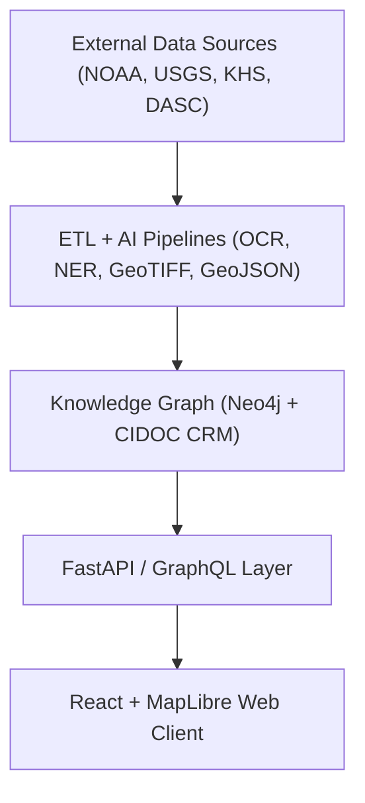

<div align="center">

# 🌾 **Kansas Frontier Matrix — Open-Source Geospatial Historical Mapping Hub**
`README.md`

**Purpose:** Provide an overview of the Kansas Frontier Matrix (KFM), its mission, architecture, directory structure, and contribution framework — serving as the entry point for developers, researchers, and collaborators.

[](docs/README.md)
[](LICENSE)
[](docs/standards/faircare.md)
[](https://stacspec.org)
[]()

</div>

---

## 📖 Table of Contents
- [Overview](#-overview)
- [Mission](#-mission)
- [Key Features](#-key-features)
- [System Architecture](#-system-architecture)
- [Directory Layout](#-directory-layout)
- [Data Standards](#-data-standards)
- [Focus Mode](#-focus-mode)
- [Installation & Usage](#-installation--usage)
- [Contributing](#-contributing)
- [License](#-license)
- [Version History](#-version-history)

---

## 🌍 Overview

**Kansas Frontier Matrix (KFM)** is an **open-source, multi-disciplinary knowledge system** that unifies Kansas’s environmental, cultural, and historical data into a cohesive digital atlas.  
It merges **maps, documents, and datasets** from sources like NOAA, USGS, Kansas Historical Society, and tribal archives into a semantic knowledge graph with a map–timeline interface.

Built under the **Master Coder Protocol (MCP)** and **FAIR+CARE** principles, KFM ensures all research artifacts are transparent, reproducible, and openly licensed for community collaboration.

---

## 🎯 Mission

> *“To weave Kansas’s past into a living digital landscape where history, geography, and ecology converge.”*

KFM’s mission is to **connect historical narratives with geospatial and environmental context**, enabling:
- Researchers to analyze historical and ecological change.
- Educators to visualize Kansas’s transformation through time.
- Communities to preserve and share local heritage and oral histories.

---

## ✨ Key Features

| Feature | Description |
|----------|-------------|
| 🗺️ **Interactive Map & Timeline** | Explore historical events and layers through a synchronized temporal–spatial interface built with MapLibre GL. |
| 🧠 **AI-Powered Focus Mode** | Center analysis on an entity (person, place, event) and dynamically filter related graph data. |
| 🧩 **Knowledge Graph** | Neo4j graph linking entities via CIDOC CRM and OWL-Time ontologies. |
| ⚙️ **ETL & AI Pipelines** | Automated ingestion, OCR, NLP, and geospatial standardization for reproducible data processing. |
| 📚 **FAIR+CARE Compliance** | Implements Findable, Accessible, Interoperable, Reusable principles and ethical governance for Indigenous data. |
| 🌐 **STAC/DCAT Metadata** | Each dataset follows open catalog standards for global interoperability. |
| 🧮 **Governed Open Source** | All workflows are validated through CI/CD, SPDX SBOMs, and reproducible logs. |

---

## 🏗️ System Architecture

KFM’s architecture links data processing, AI reasoning, and visualization:



Each layer communicates through open formats — GeoJSON, STAC, DCAT, and JSON-LD — ensuring seamless data interoperability and transparency.

---

## 🗂️ Directory Layout

The **monorepo** structure follows **MCP v6.3** and **Platinum README v7.1** principles for clarity and modularity:

```
KansasFrontierMatrix/
├── src/                     # Core application source
│   ├── ai/                  # AI/ML modules (NLP, summarization, explainability)
│   │   ├── focus/           # AI Focus Mode implementation
│   │   ├── models/          # Trained NLP/ML models
│   │   └── training/        # Model fine-tuning & governance
│   ├── api/                 # FastAPI/GraphQL API backend
│   │   ├── routes/          # Endpoint definitions
│   │   ├── services/        # Graph/DB access logic
│   │   └── models/          # Pydantic schemas
│   ├── graph/               # Knowledge graph & ontology integration
│   │   ├── schema/          # CIDOC CRM & OWL-Time mapping
│   │   ├── queries/         # Cypher templates
│   │   └── ingest/          # Graph data loaders
│   └── pipelines/           # ETL & AI data workflows
│       ├── etl/             # Extract/Transform/Load processes
│       ├── validation/      # FAIR+CARE and data-quality checks
│       ├── ai/              # AI enrichment modules
│       └── utils/           # Shared pipeline utilities
│
├── web/                     # React + MapLibre web frontend
│   ├── src/                 # Components and views
│   │   ├── MapView/         # Interactive map
│   │   ├── TimelineView/    # Temporal visualization
│   │   ├── FocusPanel/      # AI-powered detail interface
│   │   └── LayerControls/   # Overlay toggles & settings
│   ├── public/              # Static assets (icons, images, fonts)
│   └── package.json         # Frontend dependencies
│
├── data/                    # All datasets and metadata
│   ├── sources/             # JSON manifests for external sources
│   ├── raw/                 # Unprocessed downloads (DVC/LFS-tracked)
│   ├── processed/           # GeoJSON, CSV, GeoTIFF outputs
│   └── stac/                # STAC catalog JSON files
│
├── docs/                    # Documentation (MCP-compliant)
│   ├── standards/           # FAIR+CARE, governance, style guides
│   ├── templates/           # Issue forms, SOPs, model cards
│   └── architecture.md      # Detailed architecture diagrams
│
├── tools/                   # CLI utilities & build scripts
│   ├── ingest_data.py       # Fetch external datasets
│   ├── generate_stac.py     # Build SpatioTemporal Asset Catalog
│   └── validate_data.py     # FAIR+CARE checks
│
├── tests/                   # Unit & integration tests
│   ├── api/                 # Backend tests
│   ├── ai/                  # Model validation tests
│   └── pipelines/           # ETL test suites
│
├── .github/                 # CI/CD workflows & issue templates
│   ├── workflows/           # Automated build, validation, deploy pipelines
│   └── ISSUE_TEMPLATE/      # Contribution and governance forms
│
├── LICENSE                  # MIT license for code; CC-BY 4.0 for docs/data
├── CONTRIBUTING.md           # Contribution guidelines
├── Makefile                  # Orchestrates builds, validation, and deployment
└── README.md                 # This file
```

This layout enables **transparent traceability** and **reproducible execution**. Every module is documented and validated within the CI/CD pipeline.

---

## 🧱 Data Standards

| Standard | Function |
|-----------|-----------|
| **STAC 1.0.0** | Geospatial asset indexing and time-series linkage |
| **DCAT 3.0** | Dataset catalog for discovery and metadata interoperability |
| **CIDOC CRM** | Cultural heritage and provenance relationships |
| **OWL-Time** | Temporal modeling of events and intervals |
| **GeoJSON / GeoTIFF** | Open geospatial data formats for maps and layers |
| **JSON-LD / RDF** | Semantic interoperability with linked data ecosystems |

---

## 🧠 Focus Mode

AI-assisted context engine for narrative and data exploration.

- Highlights entities and events linked through Neo4j relationships.  
- Dynamically filters map and timeline content.  
- Generates summaries and patterns via `focus_transformer_v1`.  
- Uses **semantic linking** to navigate between people, places, and documents.

Example query:
```bash
GET /api/focus/Fort_Larned
```
Returns a subgraph of related treaties, events, and entities for visualization.

---

## ⚙️ Installation & Usage

```bash
# Clone repo
git clone https://github.com/bartytime4life/Kansas-Frontier-Matrix.git
cd Kansas-Frontier-Matrix

# Build and start with Docker
docker-compose up --build

# OR run locally
make setup
npm start        # launch web app
python main.py   # start FastAPI backend
```

The application runs on:
- 🌐 **Frontend:** `http://localhost:3000`
- 🧠 **Backend API:** `http://localhost:8000/docs`

---

## 🤝 Contributing

We follow the **Master Coder Protocol v6.3** — “Documentation First, Code Second.”

1. Document your change under `docs/` or `data/sources/`.  
2. Ensure metadata includes license, checksum, and version.  
3. Run:
   ```bash
   make validate
   ```
   to execute all FAIR+CARE and STAC schema checks.
4. Submit a PR with clear commit messages and updated READMEs.

---

## ⚖️ License

- **Code:** MIT License  
- **Documentation & Data:** CC-BY 4.0  
- SPDX-compliant SBOMs provided under `releases/v9.7.0/`

---

## 🕰️ Version History

| Version | Date | Author | Summary |
|----------|------|---------|----------|
| v9.7.0 | 2025-11-05 | A. Barta | Added full directory layout, STAC/DCAT mapping, and governance automation. |
| v9.5.0 | 2025-10-20 | A. Barta | FAIR+CARE verification, AI explainability integration. |
| v9.3.2 | 2025-08-12 | KFM Core Team | Enhanced ETL and Focus Mode pipelines. |
| v9.0.0 | 2025-06-01 | KFM Core Team | Initial public release. |

---

<div align="center">

**© 2025 Kansas Frontier Matrix — MIT / CC-BY 4.0**  
Built under **Master Coder Protocol v6.3** · FAIR+CARE Certified · “Diamond⁹ Ω / Crown∞Ω Ultimate Certified”  
[Website](https://github.com/bartytime4life/Kansas-Frontier-Matrix) · [Documentation](docs/README.md)

</div>
