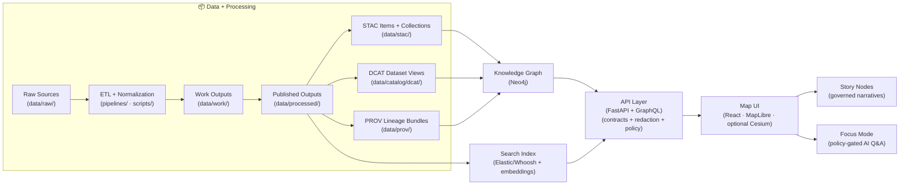
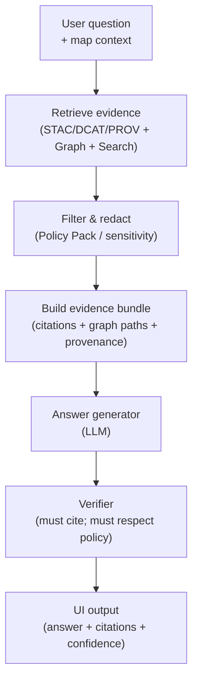

# Kansas Frontier Matrix (KFM) 🧭🗺️  
> A **provenance-first, evidence-backed** “living atlas” of Kansas — where **data, maps, narratives, and AI** stay traceable to sources.  
> **North Star:** *Every pixel and every sentence has receipts.* 🧾✅


%20%2B%20GraphQL-informational)
-informational)


-informational)


---

## 🧭 Start here (fast orientation)
- 📘 **System + repo blueprint:** `docs/MASTER_GUIDE_v13.md`  
- 🏗️ **Platform overview + roadmap:** `docs/` *(see Architecture / UI / AI system docs)*  
- 🧱 **Architecture decisions & diagrams:** `docs/architecture/`  
- 🧩 **Schemas & contracts (STAC/DCAT/PROV/Story/UI/Telemetry):** `schemas/`  
- 🗂️ **Catalog outputs:** `data/stac/` · `data/catalog/dcat/` · `data/prov/`  
- 🧠 **AI + Focus Mode + evals/model cards:** `mcp/`  
- 📖 **Stories (governed narratives):** `story_nodes/`  
- 🧪 **Notebooks/tutorials (repro capsules):** `notebooks/` *(optional)*  

> [!IMPORTANT]  
> KFM is **contract-first + policy-gated**: you can’t “ship” a dataset, story, or AI answer unless it validates ✅

---

## 📌 Table of Contents
- [What this is](#-what-this-is)
- [The Trust Contract](#-the-trust-contract)
- [Receipts model](#-receipts-model)
- [Architecture at a glance](#-architecture-at-a-glance)
- [What you can do with KFM](#-what-you-can-do-with-kfm)
- [Policy, QA, and security gates](#-policy-qa-and-security-gates)
- [Repository layout](#-repository-layout)
- [Quickstart](#-quickstart)
- [Golden paths](#-golden-paths)
- [Data lifecycle](#-data-lifecycle)
- [Story Nodes and Focus Mode](#-story-nodes-and-focus-mode)
- [AI system and automation](#-ai-system-and-automation)
- [Simulation and modeling](#-simulation-and-modeling)
- [APIs](#-apis)
- [Governance, ethics, and safety](#-governance-ethics-and-safety)
- [Tooling](#-tooling)
- [Roadmap](#-roadmap)
- [Contributing](#-contributing)
- [Project library](#-project-library)
- [Citation and reuse](#-citation-and-reuse)

---

## 🌾 What this is
**Kansas Frontier Matrix (KFM)** is an open-source **geospatial + historical knowledge system** (a “living atlas” of Kansas) designed to:

- ingest **heterogeneous sources** (rasters, vectors, documents, time series, streaming feeds)
- publish governed **metadata catalogs**:
  - **STAC** for spatial assets (COGs, tiles, features, 3D)
  - **DCAT** for dataset discovery (JSON-LD)
  - **PROV** for lineage (how outputs were produced, by whom/what, when)
- maintain a semantically-structured **knowledge graph (Neo4j)**  
  *(people ⇄ places ⇄ events ⇄ documents ⇄ datasets ⇄ processing runs)*
- power a hybrid query fabric:
  - **PostGIS** for geospatial + tabular truth
  - **Neo4j** for relationship-first discovery
  - **Search index** (e.g., Elasticsearch/Whoosh + embeddings) for document retrieval
- serve everything through a governed **API boundary** (FastAPI + GraphQL)
- deliver a combined **map + narrative UI** (MapLibre; optional Cesium for 3D)
- enable **Focus Mode**: AI-assisted Q&A that is **citation-backed** and **policy-gated**

> [!NOTE]  
> KFM’s promise is simple: **if it appears on the map or in text, the system can show the receipts.** 🧾

---

## 🔒 The Trust Contract
These are the guardrails — if we violate them, we’re not building KFM anymore.

### ✅ Non‑negotiables
- **Pipeline ordering is absolute**  
  **ETL → STAC/DCAT/PROV → Graph → API → UI → Story Nodes → Focus Mode**
- **API boundary rule**  
  The **frontend must never query Neo4j/PostGIS directly** — only through the governed API layer (contracts + redaction).
- **Provenance-first**  
  If it shows up in the UI (or in an AI answer), it must be traceable back to cataloged sources and provable processing — no “mystery layers.”
- **Deterministic, idempotent ETL**  
  Pipelines are config-driven, reproducible, safe to re-run (random seeds pinned; environments recorded).
- **Evidence-first narrative**  
  No unsourced content in Story Nodes or Focus Mode. AI-generated text must be labeled and accompanied by provenance/confidence metadata.
- **Policy is enforcement, not a suggestion**  
  A **Policy Pack** (OPA/Rego + checks) can **block** promotion of data, stories, or answers if requirements aren’t met.
- **Governance & sovereignty are explicit**  
  FAIR/CARE principles, licensing clarity, sensitivity flags, and review gates are part of “done.”

---

## 🧾 Receipts model
KFM’s “receipt system” is a **catalog triplet** plus a **bundle**.

### 🧾 The Catalog Triplet (the minimum receipts)
Every publishable dataset produces:

- **STAC** → what exists as geospatial assets (items/collections)
- **DCAT** → how people discover & reuse the dataset (JSON-LD record)
- **PROV** → how it was made (lineage + run metadata)

### 📦 Evidence Bundle (what powers UI + AI)
When KFM answers a question or renders a layer, it assembles an **Evidence Bundle** that typically includes:

- dataset IDs (STAC/DCAT) + asset URIs  
- PROV run ID(s) + environment/config pins  
- checksums / manifests (content-addressable where possible)  
- license + attribution requirements  
- sensitivity classification + redaction rules applied  
- policy decision metadata (policy version/hash + allow/deny outcome)  
- citations back to documents/datasets

> [!TIP]  
> The Evidence Bundle is what makes **“inspect source”** possible in the UI — and what makes Focus Mode *refuse* when evidence is insufficient.

---

## 🏗️ Architecture at a glance


### 🧠 Why hybrid?
- **PostGIS** is the system of record for geospatial features + analytics
- **Neo4j** encodes relationships (entity discovery, provenance traversal, narrative context)
- **Search** powers document retrieval (keyword + semantic similarity)

> 🧩 Everything is stitched via catalogs and IDs — no hidden facts.

---

## ✨ What you can do with KFM
### 🗺️ Map + timeline exploration
- Toggle datasets like layers in a GIS (vector + raster + tiles)
- Navigate time with a **timeline slider** ⏳
- Click features for details, charts, and provenance
- 2D via **MapLibre**, optional 3D via **Cesium** (including **3D Tiles** streaming; CZML for time-dynamic scenes)

### 🔎 Evidence discovery (not just keyword search)
- Discover related datasets, events, people, places, and documents via the graph
- Search text archives by **keywords + semantic similarity** (embeddings), then jump to map context

### 📖 Story Nodes (governed storytelling as data)
- Narratives authored in **Markdown**, synchronized to map state via **JSON step configs**
- Stories can deep-link entities (people/places/events) into graph-backed panels
- Suitable for educators, historians, researchers, and public storytelling

### 🧠 Focus Mode (AI assistant with receipts)
- Ask questions about the current map view, place, time window, or dataset
- Answers are **graph-grounded**, **catalog-backed**, and **citation-backed**
- If evidence is insufficient, Focus Mode must **ask for refinement or decline**

### 📦 Offline “education packs” (evolving)
- Curated bundles (datasets + stories + tiles) for classrooms and field use  
  *(PMTiles / COGs / lightweight catalogs + a PWA-style UI)*

### 🧪 Reproducible “what-if” work
- Deterministic sandbox runs (simulation + scenario testing) with the same receipts discipline as “real” data

---

## 🛡️ Policy, QA, and security gates
KFM treats data like code: **it must compile** (validate + pass policy) before it can ship.

### ✅ Typical hard gates (CI + local)
| Gate 🧱 | What it prevents 🚫 |
|---|---|
| Schema validation (contracts) | broken metadata / malformed content |
| STAC validation | invalid items/collections |
| DCAT JSON-LD validation | broken discovery records |
| PROV validation | missing lineage / incomplete run trace |
| Geometry/CRS checks | invalid geometries, missing CRS |
| License + attribution checks | unknown / incompatible licensing |
| Sensitivity policy checks | leaking restricted info (redaction failures) |
| Link integrity checks | dead citations, broken references |
| AI answer policies | uncited assertions, hallucinated entities |
| Security scans (deps/secrets) | supply chain risks and secret leaks |
| Release manifests + checksums | unverifiable releases |

> [!IMPORTANT]  
> **Fail-closed is the default**: if a dataset/story/answer can’t prove compliance, it does not promote.

---

## 🗂️ Repository layout
One canonical home per subsystem — no duplicate “mystery” folders. 🧹✨

```text
📁 .github/
  └─ 📁 workflows/                      # CI, security scans, validation + policy gates

📁 api/                                 # Governed boundary (FastAPI + GraphQL)
  ├─ 📁 src/
  │  ├─ 📁 domain/                      # Canonical models (contracts reflected here)
  │  ├─ 📁 services/                    # Use-cases (Focus Mode orchestration lives here)
  │  ├─ 📁 adapters/                    # PostGIS / Neo4j / storage / search adapters
  │  └─ 📁 routers/                     # REST + GraphQL routers
  └─ 📁 scripts/
     └─ 📁 policy/                      # OPA/Rego policy pack + Conftest harness

📁 web/                                 # Frontend (React + MapLibre + optional Cesium)
  ├─ 📁 src/
  └─ 📁 public/

📁 pipelines/                           # ETL jobs, transforms, streaming watchers
📁 scripts/                             # Small CLI utilities (fetch/georef/pack/validate helpers)

📁 data/
  ├─ 📁 sources/                        # Source registries (JSON): URLs, extents, licenses, notes
  ├─ 📁 raw/                            # Raw source drops (read-only; checksums tracked)
  ├─ 📁 work/                           # Intermediate outputs (re-runnable)
  │  └─ 📁 sims/                        # kfm-sim-run scenario outputs (deterministic)
  ├─ 📁 processed/                      # Published outputs (COG/GeoParquet/PMTiles/3D Tiles)
  ├─ 📁 stac/                           # STAC collections/items (static JSON)
  ├─ 📁 catalog/
  │  └─ 📁 dcat/                        # DCAT outputs (JSON-LD)
  ├─ 📁 prov/                           # PROV bundles (per run / per dataset)
  └─ 📁 graph/
     ├─ 📁 csv/                         # Graph import CSV exports
     └─ 📁 cypher/                      # Constraints / post-import scripts

📁 story_nodes/                         # Governed narratives
  ├─ 📁 draft/
  └─ 📁 published/
     └─ 📁 <story_slug>/
        ├─ 📄 story.md                  # narrative + citations
        ├─ 📄 story.json                # step-by-step map/timeline instructions
        └─ 📁 assets/

📁 schemas/                             # JSON Schemas (STAC/DCAT/PROV/story/ui/telemetry)
  ├─ 📁 stac/
  ├─ 📁 dcat/
  ├─ 📁 prov/
  ├─ 📁 storynodes/
  ├─ 📁 ui/
  └─ 📁 telemetry/

📁 tools/
  ├─ 📁 validation/                     # Validators, link checks, policy checks
  └─ 📁 rs/                             # Rust tooling (fast validators/tilers/etc.)

📁 mcp/                                 # Methods & Computational Experiments (MCP)
  ├─ 📁 model_cards/                    # Model cards + evaluation summaries
  ├─ 📁 evals/                          # Regression tests for Focus Mode
  ├─ 📁 experiments/                    # Reproducible experiments (notebooks, reports)
  └─ 📁 sops/                           # Standard operating procedures

📁 notebooks/                           # Tutorials / reproducible research capsules (optional)
📁 releases/                            # Versioned bundles, manifests, checksums, attestations

📄 README.md                            # You are here 🙂
📄 LICENSE
📄 CITATION.cff
📄 CONTRIBUTING.md
📄 SECURITY.md
📄 CHANGELOG.md
📄 docker-compose.yml
📄 .env.example
```

---

## ⚡ Quickstart
> 🧰 KFM is intentionally modular. Use Docker for dependencies + local dev for API/UI.

### 1) Prerequisites
- **Docker + Docker Compose** (recommended)
- **Python 3.11+** (API + pipelines)
- **Node.js 18+** (web UI)
- **GDAL** tooling (highly recommended for geospatial ETL)
- Optional but helpful:
  - **Rust stable** (for `tools/rs`)
  - **DVC** (for large artifacts)
  - **QGIS / Google Earth** (optional validation/inspection tools)

### 2) Bring up core services
```bash
cp .env.example .env
docker compose up -d
```

### 3) Run the API (example)
```bash
cd api
python -m venv .venv && source .venv/bin/activate
pip install -r requirements.txt
uvicorn kfm_server.main:app --reload
```

### 4) Run the web app (example)
```bash
cd web
npm install
npm run dev
```

### 5) Verify
- API docs (OpenAPI/Swagger): `http://localhost:8000/docs`
- UI: `http://localhost:5173`

> [!TIP]  
> If your repo includes a `Makefile`, aim for “one command” dev flows like `make dev`, `make validate`, `make publish` ✅

---

## 🧭 Golden paths
These are the “happy paths” that keep KFM consistent and auditable.

### (A) Add a new dataset (end-to-end)
1) **Register the source**  
   Add a JSON entry under `data/sources/` describing:
   - source URL(s)
   - license + attribution requirements
   - spatial/temporal extent
   - sensitivity flags (if any)
2) **Ingest + normalize**  
   Run a pipeline in `pipelines/` (or a `scripts/` helper) that:
   - fetches raw → writes to `data/raw/` (checksums recorded)
   - normalizes → writes intermediates to `data/work/`
   - publishes → writes outputs to `data/processed/` (versioned filenames; no silent overwrites)
3) **Generate receipts (Triplet)**  
   Produce:
   - STAC item/collection → `data/stac/`
   - DCAT JSON-LD → `data/catalog/dcat/`
   - PROV bundle → `data/prov/`
4) **Index + graph link**
   - ensure graph nodes/edges reference catalog IDs (no “mystery nodes”)
   - update search indices for documents/text (if applicable)
5) **Expose via API + UI**
   - add governed endpoints (REST/GraphQL)
   - register UI layer configuration (style + legend + provenance panel integration)

### (B) Add a Story Node
1) Create `story_nodes/draft/<story_slug>/`
2) Add:
   - `story.md` (narrative + citations)
   - `story.json` (map/timeline steps)
   - `assets/` (figures/media)
3) Run story validation (schema + link integrity)
4) Promote to `published/` once policy gates pass

> [!NOTE]  
> Story Nodes should clearly separate **facts** (with citations) from **interpretation** (explicitly labeled).

### (C) Add/modify Focus Mode behavior safely
- Add regression tests to `mcp/evals/`
- Update model cards / behavior notes in `mcp/model_cards/`
- Ensure policy checks still pass (citations required; sensitive content guarded)

### (D) Run a what‑if scenario (`kfm-sim-run`)
- Define a scenario patch/config (inputs, assumptions, constraints)
- Run deterministic sandbox pipeline → outputs to `data/work/sims/`
- Promote only if the scenario is meant to be publishable evidence (Triplet + policy applies)

---

## 📦 Data lifecycle
KFM treats data like code: **it must compile** before it can ship.

### Required staging (always)
- `data/raw/` → ingest only (read-only source drops + checksums tracked)
- `data/work/` → intermediate transforms (re-runnable)
- `data/processed/` → published outputs (what the world can depend on)

### Dual-format outputs (recommended)
Many datasets should publish:
- **analysis-friendly** format (e.g., **GeoParquet**)
- **UI-friendly** format (e.g., **PMTiles** for vector tiles; **COG** for rasters)

> [!TIP]  
> This keeps the UI fast **without sacrificing provenance**: both artifacts share the same STAC/DCAT/PROV receipts.

### “No mystery layers”
If it can be toggled in the UI, it must have:
- discoverability metadata (DCAT)
- spatial asset metadata (STAC)
- lineage (PROV)
- passing validators + policy checks
- provenance visible to users (not hidden behind “trust me”)

---

## 📖 Story Nodes and Focus Mode
### Story Nodes = governed narrative as data
A Story Node is typically:
- `story.md` (Markdown narrative, citations, annotations)
- `story.json` (step-by-step map/timeline instructions)
- `/assets/` (images, figures, supporting media)

#### Optional doc metadata (recommended)
For docs and stories, consider adding **YAML front matter** for:
- license, sensitivity, version, governance references, integrity checksum, etc.

```yaml
---
title: "Dust Bowl in Kansas"
status: "draft"
license: "CC-BY-4.0"
sensitivity: "public"
governance_ref: "docs/governance/GOVERNANCE_POLICY.md"
---
```

### Focus Mode = AI answers with evidence
Focus Mode:
- retrieves evidence from **catalogs + graph + search**  
- filters/redacts through **policy**
- generates answers that **must cite sources**
- refuses if evidence is missing or policy is violated

> 🧾 Focus Mode is not “chat that guesses.” It’s **retrieval + grounding + receipts + policy**.

---

## 🤖 AI system and automation
KFM’s AI design is intentionally boring (in the best way): **auditable, policy-gated, provenance-linked**.

### 🧠 Focus Mode pipeline (conceptual)


### 🛡️ Policy mechanics (why OPA matters)
- **Runtime policies** can be updated without changing application code (agile governance)
- **Policy versioning** enables auditability (“what rule was in effect then?”)
- **Decision logs** can record policy hash + allow/deny outcomes for sensitive cases

### 🔐 AI safety posture (high level)
- prompt-injection resistant retrieval (allowlists + redaction)
- citations required for factual claims (“no uncited assertions”)
- sensitive data handling (classification + aggregation/anonymization as needed)
- sandbox + least-privilege execution for AI components
- telemetry + evals tracked in `mcp/` (drift, bias checks, regressions)

### 🤖 Watcher → Planner → Executor (W‑P‑E) agents (optional / gated)
- **Watcher**: detects stale metadata, broken links, drift, missing provenance, schema changes
- **Planner**: proposes minimal, reviewable change plans
- **Executor**: opens PRs with deterministic fixes (never silently edits production)

> 🧯 **Kill-switch** is part of the design: if automation becomes risky, it can be disabled globally.

---

## 🧪 Simulation and modeling
KFM treats simulations the same way it treats datasets: **publishable, reproducible evidence**.

### `kfm-sim-run` pattern (evolving)
- deterministic simulation runner (inputs + configuration + version pins)
- outputs stored under `data/work/sims/` then promoted to `data/processed/`
- simulation results get STAC/DCAT/PROV like any other dataset
- UI can render outputs as time-aware layers + dashboards

### Why this matters
- scenario planning (hydrology, climate impacts, land use change)
- uncertainty becomes visible (confidence bands, model assumptions)
- “model output” becomes **auditable public knowledge**, not a black box

---

## 🔌 APIs
### REST (FastAPI)
- Contracted endpoints with OpenAPI schemas
- Used by UI and external integrations

### GraphQL
- Great for relationship-heavy queries (people ⇄ events ⇄ places)
- Guardrails: pagination, depth limits, cost controls

### Tiles & assets
- **COG** rasters (range requests; optional caching)
- vector tiles via **PMTiles** or PostGIS MVT
- 3D streaming via **3D Tiles** (Cesium)
- lightweight 3D via **KML/KMZ** (Google Earth) where appropriate

### Standards-forward (optional)
- OGC API patterns (Features/Tiles) where they improve interoperability

---

## 🛡️ Governance, ethics, and safety
KFM is built to be adoptable by institutions (schools, libraries, agencies) **without compromising trust**.

### 🌿 Governance principles
- **FAIR**: findable, accessible, interoperable, reusable metadata
- **CARE / sovereignty**: consider sensitive data + community impact
- **Licensing clarity**: dataset licenses are first-class metadata (no ambiguity)
- **Review gates**: contributions validated (schemas, provenance, link integrity, policy)
- **Public trust UX**: provenance isn’t hidden — it’s part of the UI

### 🔐 Security posture
- secrets scanning + dependency scanning
- policy-as-code enforcement (OPA/Rego)
- supply chain posture (manifests, checksums; SBOM concepts; signed attestations)
- responsible disclosure (see `SECURITY.md`)

---

## 🧰 Tooling
### `tools/` (validators + helpers)
Typical responsibilities:
- validate dataset contracts (STAC/DCAT/PROV + KFM extensions)
- run link checks, schema checks, policy checks
- generate graph import artifacts
- produce release manifests + checksums (+ SBOM scaffolding)

### `tools/rs/` (Rust tooling 🚀)
Rust is ideal for:
- fast validation on large catalogs
- tiling / packaging utilities
- batch transforms that benefit from speed and memory safety

### Data artifact versioning (recommended)
- **DVC** for large rasters/models without bloating Git
- content-addressable outputs (file hashes) for integrity and reproducibility

### Release integrity (recommended)
- signed attestations (e.g., Sigstore/Cosign) for published artifacts
- reproducible builds + environment pinning

---

## 🧭 Roadmap
Directionally consistent goals (current docs + future proposals):

### Near-term ✅🧱
- ✅ Schema + validator mindset (“metadata must compile”)
- ✅ CI catalog QA gates (broken provenance, missing licenses, invalid geometry/CRS)
- 🧾 Provenance UX hardening (make it impossible to ignore receipts)
- 🛰️ Remote sensing pipeline templates (COG-first patterns)

### Medium-term 🧩🚀
- 🧱 Story Builder GUI (Story Nodes for non-devs)
- 📦 Offline “education packs” (PWA mode + curated tiles/datasets/stories)
- 🧪 Simulation runner & dashboards (`kfm-sim-run`)
- 🤖 W‑P‑E automation agents (policy-gated PRs only)
- 🔏 Artifact signing + attestations for releases

### Long-term 🌐✨
- 🌍 Federation (“Frontier Matrix” blueprint for other regions)
- 🧠 GeoXAI / uncertainty-first UI (confidence + completeness as first-class)
- 🥽 AR/VR extensions (museum/field overlays; guided tours)
- 📚 DOI-backed releases for data snapshots + research workflows

---

## 🤝 Contributing
KFM welcomes contributions from developers **and** domain experts (historians, educators, scientists, cartographers). 🌾

### Contribution types
- **(A) New data/domain**: raw sources → pipeline → publish STAC/DCAT/PROV
- **(B) Story Nodes**: narratives with citations + map steps
- **(C) Graph enrichment**: entity types, ontology bindings, relationships
- **(D) API endpoints/services**: contract-first, then implementation + tests
- **(E) UI features**: layer registration; provenance always visible

### Definition of done ✅
A contribution is “done” when:
- [ ] schemas/contracts validate
- [ ] provenance is complete (STAC/DCAT/PROV)
- [ ] policy pack passes (sensitivity/licensing rules)
- [ ] tests pass
- [ ] governance requirements addressed (FAIR/CARE, licensing, sensitivity)
- [ ] CI is green ✅

> [!TIP]  
> For AI or research changes: add/update `mcp/evals/`, `mcp/model_cards/`, and (if needed) `mcp/experiments/` so behavior stays measurable and reviewable.

---

## 📚 Project library
This repo is deliberately research-backed. The PDFs in the project library inform architecture, modeling, geospatial pipelines, UI, governance, security posture, and implementation.

> [!NOTE]  
> Several files are **PDF portfolios** (they contain embedded PDFs).  
> To extract embedded files on Linux/macOS:  
> `pdfdetach -saveall "<portfolio>.pdf"` *(Poppler)*

<details>
  <summary><b>🧭 Core KFM design docs (source of truth)</b></summary>

- 🏗️ **KFM – Comprehensive Architecture, Features, and Design**
- 🧾 **KFM – Comprehensive Technical Documentation**
- 🖥️ **KFM – Comprehensive UI System Overview**
- 🧠 **KFM – AI System Overview 🧭🤖**
- 🗺️ **KFM – Platform Overview and Roadmap**
- 📚 **KFM – Expanded Technical & Design Guide**

</details>

<details>
  <summary><b>📦 Supporting portfolios (AI · data management · mapping · programming)</b></summary>

- 🤖 AI Concepts & more *(embedded books/papers)*
- 🗄️ Data management, data science, Bayesian methods *(embedded books/papers)*
- 🛰️ Maps, virtual worlds, archaeology, geospatial WebGL *(embedded books/papers)*
- 🧑‍💻 Various programming languages & engineering references *(embedded books/papers)*

</details>

---

## 🧾 Citation and reuse
- For software citation, use **CITATION.cff** (consider DOI-backed releases for snapshots).
- For data reuse, always consult:
  - dataset **license** fields in metadata
  - **PROV** lineage bundles for processing steps
  - source attribution requirements

> 📌 If you’re building research outputs on top of KFM, prefer citing a **versioned data release** so results remain reproducible.

---

### 🧭 Final note
KFM’s goal is bigger than “a map.” It’s a **community knowledge system**: open, evidence-driven, and built to scale across time, disciplines, and data types—without losing trust. 🌾🧠🗺️