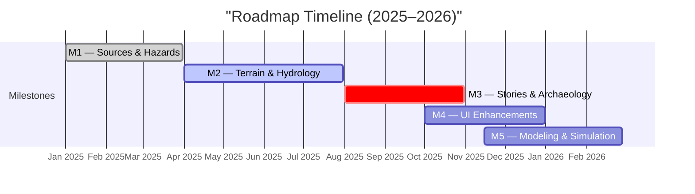

<div align="center">

# 🌾 Kansas Geo Timeline

### **Time · Terrain · History**

**An interactive, reproducible knowledge hub for Kansas’s layered history**  
Where **terrain, climate, culture, and events** intersect across centuries.

[](https://github.com/bartytime4life/Kansas-Frontier-Matrix/actions/workflows/site.yml)  
[](https://github.com/bartytime4life/Kansas-Frontier-Matrix/actions/workflows/stac-validate.yml)  
[](https://github.com/bartytime4life/Kansas-Frontier-Matrix/actions/workflows/codeql.yml)  
[](https://github.com/bartytime4life/Kansas-Frontier-Matrix/actions/workflows/trivy.yml)  
[](.pre-commit-config.yaml)  
[](stac/)  
  
  
  
  


</div>

---

## 🚀 Overview

Kansas’s history is **fragmented** — treaties, disasters, railroads, floods, climate, and oral histories are scattered across archives.  
This project rebuilds that story into a **time-aware atlas + knowledge graph**, linking data and narrative.

✨ **Core Deliverables**

* 📂 **STAC Catalogs** → provenance & temporal coverage  
* 🗺️ **COGs & GeoJSON** → terrain + historic rasters  
* 🧩 **Knowledge Graphs** → people ↔ places ↔ events  
* 🖥️ **MapLibre Viewer** → timeline slider + dynamic layers  
* 🌍 **Google Earth KMZ/KML** → immersive 3D exploration  

---

## 🌐 Live Demos & Previews

* 🖥️ **Web Viewer (MapLibre)** → [Interactive Atlas](https://bartytime4life.github.io/Kansas-Frontier-Matrix/web/)  
* 🌍 **Google Earth (KMZ)** → [Download KMZ](https://github.com/bartytime4life/Kansas-Frontier-Matrix/releases/latest)  
* 📊 **STAC Catalog** → [Browse STAC JSON](https://bartytime4life.github.io/Kansas-Frontier-Matrix/stac/)  

---

## 🏗 System Architecture

```mermaid
flowchart TD
  A["Sources\nscans · rasters · vectors · documents"] --> B["ETL Pipeline\nMakefile · Python · checksums"]
  B --> C["COGs & Processed Layers\nraster COGs · GeoJSON"]
  C --> D["STAC Catalog\ncollections · items · assets"]
  D --> E["Config Build\napp.config.json · layers.json"]
  E --> F["Web Viewer (MapLibre)\ntimeline · legend · popups"]
  E --> G["Google Earth Exports\nKML · KMZ"]
  D --> H["Knowledge Graph\nNeo4j · CIDOC CRM · OWL-Time"]
  H --> F
````

<!-- END OF MERMAID -->

* **ETL pipeline**: Makefile + Python ingestion
* **Validation**: JSON Schema + STAC compliance
* **Knowledge graph**: Neo4j, CIDOC CRM + OWL-Time
* **UI**: MapLibre timeline, legends, popups

---

## ⚡ Quickstart

### 🐍 Local Development

```bash
python -m venv .venv
. .venv/bin/activate
pip install -r requirements.txt

# Build data + site
make fetch cogs terrain stac stac-validate site

# Serve locally
python -m http.server -d web 8080
```

### 🐳 Docker

```bash
docker compose up -d site
```

---

## 📂 Repository Layout

```
data/        # sources, cogs, processed vectors/rasters
stac/        # STAC 1.0.0 catalog, collections, items
web/         # MapLibre viewer, configs, legends
earth/       # Google Earth exports (KML/KMZ)
scripts/     # ETL, STAC tools, validators
docker/      # reproducible containers
.github/     # CI/CD workflows, roadmap, pre-commit
```

---

## 📊 Coverage Status (Root Catalog)

| Domain / Layer            | Sources                         | Status                                                                  |
| ------------------------- | ------------------------------- | ----------------------------------------------------------------------- |
| 🏔 DEM & Terrain          | USGS LiDAR, KGS, 3DEP           |    |
| 🗺 Hillshade/Derivatives  | LiDAR COGs → slope, aspect      |    |
| 🌊 Hydrology              | NHD, Kansas River floods        |  |
| 🌱 Land Cover             | NLCD 1992–2021                  |    |
| 🧭 Soils / PLSS / Parcels | NRCS SSURGO, KS GIS Hub         |  |
| 🪶 Treaties & Lands       | Boundary polygons, cession maps |  |
| 🚂 Railroads & Trails     | 1850–1920 GIS                   |        |
| 🗺 Historic Topos         | USGS, UT PCL                    |  |
| 🌡 Climate Normals        | NOAA 1991–2020, Daymet          |    |
| 🌪 Hazards — Tornado      | NOAA SPC 1950–2024              |    |
| 🌊 Hazards — Floods       | FEMA, USGS                      |  |
| 🔥 Hazards — Wildfire     | NIFC, KS Forest Service         |  |
| 🪨 Paleoclimate / Fire    | NOAA cores, charcoal            |        |
| 🪶 Oral Histories & Arch. | Tribal narratives, archaeology  |        |
| ⛏ Geology / Core Samples  | KGS drill cores, stratigraphy   |  |

---

## 🎯 Roadmap

| Milestone | Goal                                                 | Status         |
| --------- | ---------------------------------------------------- | -------------- |
| 📌 M1     | Expand sources (treaties, hazards, topographic maps) | ✅              |
| 📌 M2     | Terrain & hydrology modeling (flowdir, floodplains)  | 🟡 in progress |
| 📌 M3     | Storytelling layers (oral histories, archaeology)    | ⏳ planned      |
| 📌 M4     | UI enhancements (story maps, vector tiles)           | ⏳ planned      |
| 📌 M5     | Predictive modeling & NASA-grade simulations         | ⏳ planned      |



<!-- END OF MERMAID -->

---

## ✅ Reproducibility & CI

* 🔐 **SHA-256 checksums** for all artifacts
* 📏 **STAC + JSON Schema validation** in CI
* 🛠 **Pipelines**:

  * `site.yml` → build & deploy
  * `stac-validate.yml` → dataset health shields
  * `codeql.yml` + `trivy.yml` → security checks

---

## 🤝 Contributing

* ✔️ Validate with STAC + JSON Schema
* ✔️ Follow MCP templates (`experiment.md`, `sop.md`, `model_card.md`)
* ✔️ Submit PRs with clear commits & passing CI

---

## 📚 Citation

```bibtex
@software{kansas_geo_timeline_2025,
  title  = {Kansas Geo Timeline — Frontier Matrix},
  author = {Barta, Andy and contributors},
  year   = {2025},
  url    = {https://github.com/bartytime4life/Kansas-Frontier-Matrix}
}
```

---

## ⚖️ License

MIT © 2025 — Kansas Frontier Matrix
