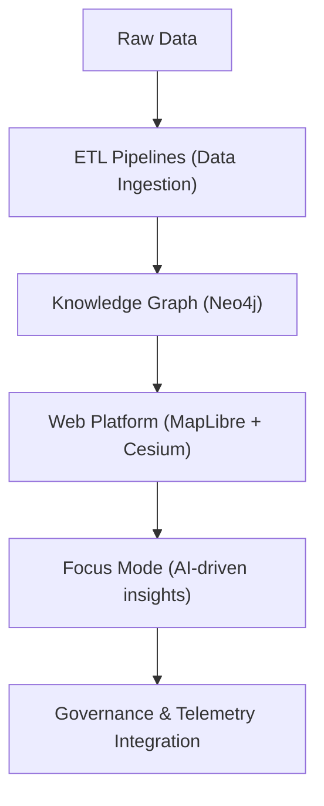

<div align="center">

# 🗺️ **Kansas Frontier Matrix — System Architecture Overview**  
`docs/architecture/system_overview.md`

**Purpose:**  
Provide a unified, FAIR+CARE-aligned, and reproducible overview of the entire **Kansas Frontier Matrix (KFM)** system architecture, including data pipelines, knowledge graph, web platform, and governance model.

[](../README.md)
[](../../../LICENSE)
[](../faircare.md)
[](../../../releases/)

</div>

---

## 📘 Overview

The **Kansas Frontier Matrix (KFM)** is a complex, multi-layered system that integrates **spatiotemporal data**, **AI models**, **ETL pipelines**, and **interactive visualization** platforms.  
This document provides an overview of the key subsystems, the data flows between them, and how they are governed under the **FAIR+CARE** principles.  

**Key Features:**
- **Geospatial + temporal data** integrated with Neo4j
- **ETL and AI pipelines** for data enrichment and predictive modeling
- **Interactive web platform** built with MapLibre and Cesium
- **Sustainability monitoring** aligned with ISO 50001 and 14064

---

## 🗂️ Directory Layout

```text
docs/
├── architecture/
│   ├── system_overview.md                # System design overview
│   ├── data_pipelines.md                 # Data flow and ETL design
│   └── governance.md                     # FAIR+CARE and governance architecture
src/
├── pipelines/
│   ├── etl/
│   ├── ai/
│   └── web/
├── graph/
├── telemetry/
└── tests/
````

---

## 🧩 System Architecture



---

## ⚙️ Key Components

1. **Data Pipelines**: Responsible for raw data ingestion, transformation, and integration into the knowledge graph.
2. **Knowledge Graph**: Stores spatiotemporal data and enriches it with AI-driven insights and metadata.
3. **Web Platform**: Visualizes geospatial data and provides interactive interfaces for users.
4. **Focus Mode**: Generates adaptive, context-aware narratives based on data in the knowledge graph.
5. **Governance & Telemetry**: Ensures that data and AI models adhere to **FAIR+CARE** standards and track performance, sustainability, and ethics.

---

## 🧭 Key Features of KFM Architecture

1. **Modular Data Pipelines**

   * Supports batch and streaming data ingestion
   * Integration with **STAC** and **DCAT** for metadata interoperability

2. **AI and Predictive Models**

   * Integrates with **Focus Mode** for context-aware summaries
   * Predictive modeling for spatiotemporal simulations

3. **Interactive 2D/3D Web Interface**

   * Uses **MapLibre** and **Cesium** for spatial visualization
   * Supports both desktop and mobile interfaces

4. **Governance and Compliance**

   * **FAIR+CARE** integration for all datasets and AI outputs
   * Real-time governance and ethics validation

---

## 📊 Telemetry & Observability

Telemetry is used to track system performance, energy usage, and governance compliance:

* **Focus Telemetry**: Captures performance metrics, carbon footprint, and sustainability compliance.
* **Governance Ledger**: Records dataset provenance, AI model outputs, and ethical compliance.

---

## 🕰️ Version History

| Version | Date       | Author    | Summary                                                        |
| ------- | ---------- | --------- | -------------------------------------------------------------- |
| v10.4.0 | 2025-11-15 | Core Team | Monorepo structure update with KFM v10 architecture overview   |
| v10.3.2 | 2025-11-14 | Core Team | Expanded architecture details and added governance integration |
| v10.3.1 | 2025-11-13 | Core Team | Added documentation for new predictive modeling pipelines      |

---

<div align="center">

**© 2025 Kansas Frontier Matrix Project**
Master Coder Protocol v6.3 · FAIR+CARE Certified · Diamond⁹ Ω / Crown∞Ω Ultimate Certified

[Back to Docs Index](README.md) · [Governance Charter](../../../docs/standards/governance/ROOT-GOVERNANCE.md)

</div>
