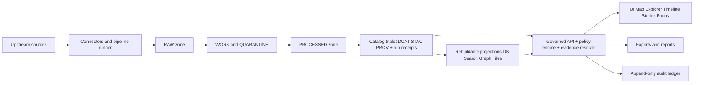
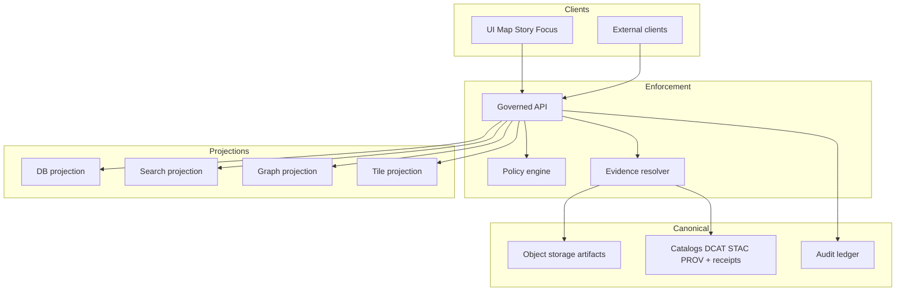
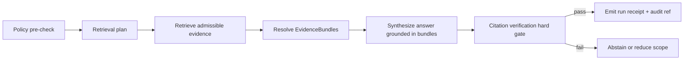

<!-- [KFM_META_BLOCK_V2]
doc_id: kfm://doc/0c6f7a9b-0f6b-4d7d-8d6d-8d70f5c85d20
title: Kansas Frontier Matrix
type: standard
version: vNext
status: draft
owners: TBD
created: 2026-02-22
updated: 2026-02-27
policy_label: public
related:
  - README.md
tags:
  - kfm
notes:
  - Repository README describing the vNext operating model and governance posture.
  - Alignment pass to vNext Definitive Design & Governance Guide (2026-02-20).
  - Alignment pass to Architecture, Governance, and Delivery Plan briefing (2026-02-27).
[/KFM_META_BLOCK_V2] -->

<a id="top"></a>

# Kansas Frontier Matrix

> **Map-first • Time-aware • Governed • Evidence-first • Cite-or-abstain**  
> **Core posture:** default-deny • fail-closed • reproducible by digest • policy enforced in CI + runtime

**Status:** vNext (blueprint-driven build)  
**Owners:** _TBD_ (add repo teams / stewards; required for CODEOWNERS + review routing)  
**Primary spec:** _KFM — Definitive Design & Governance Guide (vNext, 2026-02-20)_ (treat as authoritative)  
**Core promise:** anything you can see, cite, export, or ask KFM to explain is traceable to an immutable **DatasetVersion** + resolvable **EvidenceBundle**, with policy enforced consistently in CI and at runtime.  
**Primary experiences:** **Map Explorer** + **Timeline** + **Stories** + **Catalog** + **Focus Mode**.

[](#roadmap)
[](#governance)
[](#evidence-and-citations)
[](#core-invariants)
[](#truth-path-and-promotion-contract)
[](#contributing)
[](#)

---

## Start here

Pick the path that matches what you’re doing:

- **Contributing code/docs/data**
  - Read: [`CONTRIBUTING.md`](CONTRIBUTING.md) (workflow, if present), [`.github/README.md`](.github/README.md) (CI gates + CODEOWNERS, if present), [`SECURITY.md`](SECURITY.md) (reporting, if present), [`CODE_OF_CONDUCT.md`](CODE_OF_CONDUCT.md) (community standards)
  - Know: changes to `.github/`, `policy/`, `contracts/`, and promotion tooling are **governance-critical**

- **Stewardship and governance**
  - Read: `docs/governance/` (labels, obligations, review triggers), `policy/` (policy-as-code + fixtures), `contracts/` (schemas/profiles/vocab)

- **Operating pipelines and runtime**
  - Read: `docs/runbooks/` and `infra/`
  - Know: DB/search/tiles are rebuildable projections; **canonical truth is processed artifacts + catalogs + receipts + audit**

> [!IMPORTANT]
> **Tagging discipline:**  
> - **CONFIRMED** = invariants/contracts that must hold (truth path, trust membrane, promotion gates, cite-or-abstain).  
> - **PROPOSED** = recommended defaults/templates/build plan.  
> - **UNKNOWN / DECISION NEEDED** = unverified; treat as fail-closed until verified. Every **UNKNOWN** MUST include: (a) the recommended default path, and (b) the minimum verification step to convert UNKNOWN → CONFIRMED.

> [!NOTE]
> This README describes the **target operating model** for vNext. If some files/directories are not present on your branch, treat those references as **PROPOSED** and reconcile with repo reality before enforcing gates.

[↑ Back to top](#kansas-frontier-matrix)

---

## Quick navigation

[What this repo is](#what-this-repo-is) •
[Repo entrypoints](#repo-entrypoints) •
[Reality check](#reality-check) •
[Quick start](#quick-start) •
[System overview](#system-overview) •
[Minimum build order](#minimum-build-order) •
[Core invariants](#core-invariants) •
[Key concepts and glossary](#key-concepts-and-glossary) •
[Architecture](#architecture) •
[Governed API](#governed-api) •
[Truth path and promotion contract](#truth-path-and-promotion-contract) •
[Deterministic identity and versioning](#deterministic-identity-and-versioning) •
[Catalog triplet and profiles](#catalog-triplet-and-profiles) •
[Evidence and citations](#evidence-and-citations) •
[Map and story UX](#map-and-story-ux) •
[Focus Mode AI](#focus-mode-ai) •
[Discover Mode](#discover-mode) •
[Governance](#governance) •
[Datasets and sources](#datasets-and-sources) •
[Repository layout](#repository-layout) •
[Contributing](#contributing) •
[Security](#security) •
[Roadmap](#roadmap) •
[References](#references)

---

## What this repo is

KFM is a governed knowledge system where the **map + timeline** are the primary interface. The system is trustworthy because every user-visible claim is grounded in:

- immutable **DatasetVersions** (digest-addressed)
- policy-evaluated, resolvable **EvidenceBundles**
- reproducible **run receipts** + append-only **audit logging**
- strict catalogs (**DCAT + STAC + PROV**) that form the “anti-hallucination substrate”

KFM is also a **system of governed artifacts**:

- **Data artifacts** (raw/work/quarantine/processed) and their catalogs
- **Docs and narratives** (Story Nodes, ADRs, runbooks) with policy labels
- **Contracts** (OpenAPI, schemas, catalog profiles, vocabularies) enforced in CI
- **Policy-as-code** (default deny) enforced in CI + runtime

### What KFM is not

- Not an ungoverned GIS file dump.
- Not a “trust me” narrative system (stories must cite resolvable evidence).
- Not a general chatbot (Focus Mode is a governed workflow that must cite-or-abstain).
- Not “whatever the database says” (DB/search/tiles are projections; catalogs + processed artifacts are canonical).

### Non-goals (keep vNext buildable)

- **Do not** try to model every historical interpretation as “fact.” Stories must separate **evidence** from **interpretation** and keep uncertainty explicit.
- **Do not** mirror/redistribute content (especially media) when licensing is unclear. Prefer **metadata-only references** until rights are cleared.
- **Do not** make a full 3D globe the primary surface for vNext. Map-first for vNext can remain **2D + time**, with 3D reserved for later, scoped use cases.
- **Do not** ship “general chatbot” behavior. Focus Mode remains a **governed run** that must cite-or-abstain.

[↑ Back to top](#kansas-frontier-matrix)

---

## Repo entrypoints

If you only read three things first:

1. `README.md` — this operating model and where to find things.
2. `.github/README.md` — governance and automation (CI gates, CODEOWNERS posture) (if present).
3. `contracts/` + `policy/` — the machine-enforced truth: schemas/profiles/vocab + policy tests (if present).

### Governance-critical surfaces

These paths change enforcement behavior. Treat changes here as production configuration:

> [!WARNING]
> A PR that modifies any of the below MUST have explicit owners + required checks, and SHOULD be reviewed like production config.

| Path | Why it’s critical | Expected controls |
|---|---|---|
| `.github/` | merge-time enforcement | CODEOWNERS + required checks |
| `policy/` | default-deny semantics + obligations | fixtures-driven tests in CI |
| `contracts/` | runtime boundaries + schemas | schema/profile validation in CI |
| `tools/` | validators and hash/link tooling | deterministic tests + golden fixtures |
| `data/registry/` | what can be promoted and shown | lint + validation + steward review |
| `data/specs/` | canonical dataset specs that drive `spec_hash` and pipeline behavior | schema validation + drift tests + steward review |
| `apps/api/` | the trust membrane enforcement point | security review + integration tests |
| `infra/` | runtime posture | operator review + policy alignment |

### Expected top-level governance files

Recommended for a governed system; if missing on your branch, add them early:

- `LICENSE` (SPDX-friendly; TBD)
- `CONTRIBUTING.md` (contributor workflow + CI gates)
- `SECURITY.md` (vulnerability reporting + posture)
- `CODE_OF_CONDUCT.md` (optional but recommended)
- `CHANGELOG.md` (optional early; valuable later)

[↑ Back to top](#kansas-frontier-matrix)

---

## Reality check

Before implementing or “fixing” anything, verify what exists **on your branch**. This prevents governance failures caused by assumptions.

### Minimum verification steps

- Confirm whether this is a monorepo (`apps/` + `packages/`) or a different layout.
- Confirm the policy engine choice and how it is executed in CI and runtime.
- Confirm what is canonical (object storage + catalogs + audit ledger) vs rebuildable (DB/search/tiles).
- Confirm how documents are treated: served via governed APIs (policy-labeled) or only via Git.
- Confirm the UI stack and how map state is represented and persisted (Story Node sidecars, view-state tokens).
- Confirm how secrets are managed (must not live in repo; injected via CI/runtime secret stores).

> [!IMPORTANT]
> **Fail-closed rule:** if any of the above is unclear, default-deny and treat the feature as **UNKNOWN / DECISION NEEDED** until verified.

### Verification checklist (minimum steps; attach outputs to the next revision)

- [ ] Capture repo commit hash and root directory tree: `git rev-parse HEAD` and `tree -L 3`.
- [ ] Confirm which work packages already exist: locate `spec_hash`, policy tests (OPA/Conftest), catalog validators/link-check, evidence resolver route, and dataset registry schema.
- [ ] Extract CI gate list from `.github/workflows/` and document which checks are **merge-blocking**.
- [ ] Choose **one** MVP dataset (e.g., NLCD land cover or NOAA storm events) and verify it can be promoted through all gates with receipts + catalogs.
- [ ] Validate UI cannot bypass the PEP (static analysis + network policy) and EvidenceRefs resolve end-to-end in Map Explorer + Story publishing.
- [ ] For Focus Mode: run the evaluation harness and store golden outputs + diffs as artifacts.

[↑ Back to top](#kansas-frontier-matrix)

---

## Quick start

> [!NOTE]
> Exact commands / package managers / service topology vary by branch.  
> Prefer `make help` or `scripts/dev/*` if present.

### 1) Get oriented

```bash
git clone <REPO_URL>
cd Kansas-Frontier-Matrix

ls
```

### 2) Try the “common entrypoints” (if present)

```bash
# If a Makefile exists
make help

# If it’s a Node/TypeScript workspace
node -v
npm -v
npm install
npm test

# If it’s a Python workspace
python --version
python -m venv .venv
source .venv/bin/activate
pip install -r requirements.txt
pytest
```

### 3) First principle while exploring

> [!TIP]
> **Rule of thumb:** if a thing is user-visible, it must be **promotable** and **citable**.  
> If it cannot be cataloged and cited, it does not belong on the map.

[↑ Back to top](#kansas-frontier-matrix)

---

## System overview

KFM is map-first, but the map is only as trustworthy as the lifecycle behind it.

### High-level flow



### Trust membrane

- **Clients MUST NOT** access object storage / DB directly.
- Access flows through a **governed API** that applies **policy**, **evidence resolution**, **obligations**, and **audit logging** consistently.
- Backend domain logic **MUST NOT** bypass repository interfaces to talk directly to infrastructure.

### Canonical vs rebuildable

- **Canonical:** processed artifacts in object storage, catalogs (DCAT/STAC/PROV), run receipts, and audit ledger.
- **Rebuildable projections:** PostGIS tables, search indexes, graph views, and tile bundles.

> [!IMPORTANT]
> **Rule:** if a projection and a catalog disagree, the catalog + processed artifacts win.

[↑ Back to top](#kansas-frontier-matrix)

---

## Minimum build order

KFM’s safest path is to build trust primitives first, UI last.

### Minimum viable trust

- [ ] **Contracts**: schemas/profiles/vocab exist and validate in CI (`contracts/`)
- [ ] **Policy**: default-deny rules + fixtures-driven tests (`policy/`)
- [ ] **Deterministic identity**: canonical `spec_hash` + drift tests (`tools/hash/`)
- [ ] **Anchor register**: machine-readable anchor list validated against source registry + dataset specs (`data/registry/anchors/`)
- [ ] **Catalog triplet**: DCAT/STAC/PROV generation + validators + cross-link checks
- [ ] **Evidence resolver**: EvidenceRef → EvidenceBundle; policy applied; fail-closed
- [ ] **Run receipts + audit**: immutable receipts emitted for pipeline + Focus answers
- [ ] **Promotion gate**: no publish without manifests, validation, rights, and policy checks
- [ ] **Rebuildable projections**: DB/search/tiles built from canonical artifacts
- [ ] **UI surfaces**: Map Explorer/Stories/Focus render governed API results + evidence drawer

> [!NOTE]
> **Reasoning:** if EvidenceRef cannot resolve deterministically, “map-first” becomes “trust me.”

### Work packages (WP-01…WP-08) (PROPOSED build plan; keeps increments reversible)

| WP | Ships (what you commit) | Merge-gate “done when…” |
|---:|---|---|
| **WP-01** | `spec_hash` + dataset spec schema + controlled-vocab validation | Hash stable across OS/JSON emitters; CI blocks drift; vocab validation blocks unknown labels |
| **WP-02** | DCAT/STAC/PROV validators + cross-link checker | CI fails if catalogs invalid or links don’t resolve; “no ghost links” invariant |
| **WP-03** | Policy pack (OPA/Rego) + Conftest + fixtures-driven tests | Same semantics in CI and runtime; default-deny proven by fixtures |
| **WP-04** | Evidence resolver service + EvidenceBundle contract | `POST /api/v1/evidence/resolve` fails closed; bundles include digests + policy decision + obligations |
| **WP-05** | Dataset registry + discovery endpoints (`/datasets` + `/stac`) | Policy-filtered discovery; responses include `dataset_version_id` + digests; contract tests pass |
| **WP-06** | Map Explorer baseline UI + Evidence Drawer | Evidence drawer shows license + version; keyboard navigation works; E2E tests cover evidence open/resolve |
| **WP-07** | Story Node v3 publish workflow | Publishing requires review state + resolvable citations; citations open Evidence Drawer |
| **WP-08** | Focus Mode MVP + evaluation harness | Cite-or-abstain; golden queries; merges blocked on regressions/leakage failures |

[↑ Back to top](#kansas-frontier-matrix)

---

## Core invariants

These are KFM’s non-negotiables. Violating these breaks governance, not “just code.”

### Invariants

| Invariant | Meaning | How it’s enforced |
|---|---|---|
| **Truth path** | Data moves through zones (Raw → Work/Quarantine → Processed → Catalog → Published) with promotion gates | Promotion Contract gates (CI + pipeline) |
| **Trust membrane** | No direct client-to-storage/DB; domain logic never bypasses interfaces | Network controls + code structure + tests |
| **Evidence-first UX** | Evidence is not optional “details” — it’s a primary interaction everywhere | Evidence Drawer required + UI gating |
| **Cite-or-abstain Focus Mode** | If citations cannot be verified, Focus Mode abstains | Citation verification hard gate + eval harness |
| **Canonical vs rebuildable** | Object storage + catalogs + audit ledger are canonical; DB/search/tiles are projections | Rebuild scripts + “source of truth” discipline |
| **Deterministic identity** | DatasetVersion IDs and artifact addresses are stable and digest-based | Canonical hashing + “hash drift” checks |
| **Row-level traceability** | Every feature row in projections carries `dataset_version_id` + an `evidence_ref` | Projection schema + integration tests |
| **Policy-safe errors** | Public users must not infer restricted dataset existence via error differences | API error model + tests + monitoring |

> [!NOTE]
> **Norms used in docs:** MUST / MUST NOT / SHOULD / MAY (RFC-style).  
> **Section tags:** CONFIRMED / PROPOSED / UNKNOWN / DECISION NEEDED.  
> Use **CONFIRMED** only when backed by in-repo artifacts; otherwise use **PROPOSED**.

[↑ Back to top](#kansas-frontier-matrix)

---

## Key concepts and glossary

Use these terms consistently in code, schemas, tests, and documentation.

| Term | Definition |
|---|---|
| **Dataset** | A logical dataset identity (e.g., “NOAA Storm Events”) |
| **DatasetVersion** | An immutable version corresponding to a specific promoted output set |
| **Spec hash** | Deterministic hash derived from a canonical dataset spec; used to identify versions |
| **Artifact** | A concrete file/object produced by a run (GeoParquet, PMTiles, COG, JSONL, PDF…) |
| **EvidenceRef** | A stable reference to evidence using explicit schemes (dcat://, stac://, prov://, doc://, graph://, url://) |
| **EvidenceBundle** | Resolved evidence view returned by the evidence resolver (human card + machine metadata + digests + policy results) |
| **Policy label** | Primary sensitivity/access input used in authorization and obligations |
| **Obligation** | A required transformation or UX notice (e.g., geometry generalized; suppress export; show notice) |
| **Run receipt** | Immutable record of an operation (pipeline run / Focus query / publish event) with environment capture |
| **Audit ledger** | Append-only governed record of operations and approvals |
| **Quarantine** | Zone/state for artifacts that cannot be promoted (validation, rights, sensitivity issues) |
| **Event time** | The time a real-world event occurred or was observed (often the primary “timeline” axis) |
| **Valid time** | The time period when an assertion is true (e.g., a boundary exists) |
| **Transaction time** | The time when KFM recorded/published data (system time) |
| **Story Node** | Versioned narrative bound to map state + citations + policy label + review state |

### KFM URI patterns

KFM uses resolvable, stable identifiers. Examples:

```text
kfm://dataset/<dataset_slug>
kfm://dataset/<dataset_slug>@<dataset_version_id>
kfm://artifact/sha256:<digest>
kfm://evidence/<bundle_id>
kfm://run/<timestamp>.<slug>.<hash>
kfm://audit/entry/<id>
dcat://...
stac://...
prov://...
doc://...
graph://...
url://...
```

> [!IMPORTANT]
> **Rule:** user-visible claims should reference evidence through an EvidenceRef resolvable to an EvidenceBundle.

[↑ Back to top](#kansas-frontier-matrix)

---

## Architecture

KFM keeps layers clean and enforces governance at boundaries.

### Clean layering

- **Domain:** pure domain models and invariants
- **Use cases:** workflows (ingest dataset, promote dataset version, publish story node, answer focus query)
- **Interfaces:** contracts (OpenAPI DTOs, schema registries, policy adapters, repository interfaces)
- **Infrastructure:** PostGIS, search, graph, object storage, CI, deployment

### Starting posture

Recommended: start as a modular monolith (plus worker processes) so invariants are easier to enforce and test; split into services only when isolation/scaling demands it.

Core components:

1. Pipeline runner + connectors
2. Catalog generator (DCAT/STAC/PROV + run receipts + profile validation + cross-link enforcement)
3. Policy engine (policy-as-code; same semantics in CI and runtime)
4. Evidence resolver (EvidenceRef → EvidenceBundle; policy + obligations applied; fail-closed)
5. Governed API (discovery, queries, tiles, stories, Focus Mode, lineage)
6. UI (Map Explorer + Story Mode + Focus Mode; evidence drawer; policy notices; version badges)
7. Index builders (rebuildable projections: DB/search/graph/tiles)

> [!NOTE]
> UI map engine is **PROPOSED** as MapLibre GL; treat as a replaceable implementation detail.

### Architecture diagram



[↑ Back to top](#kansas-frontier-matrix)

---

## Governed API

The governed API is the only supported way for clients to access data, evidence, and narratives.

### Design requirements

- Policy is enforced before data leaves the backend.
- Every response includes enough metadata to be traceable:
  - `dataset_version_id` (where relevant)
  - `audit_ref` (for governed operations)
  - policy decision summary where appropriate
- Errors must be policy-safe and consistent so users cannot infer restricted existence.

### Illustrative endpoint surfaces (contract targets)

> [!NOTE]
> Endpoint naming is **PROPOSED** and may vary by branch. Preserve the behaviors (policy, evidence, audit) even if routes differ.

| Endpoint | Purpose | Policy posture |
|---|---|---|
| `GET /api/v1/datasets` | Dataset discovery (DCAT summary + policy labels) | Hide restricted by default; filter by role |
| `GET /api/v1/stac/collections` | STAC browse (collections) | Policy-filtered; redact/omit restricted |
| `GET /api/v1/stac/collections/{collection_id}/items` | STAC browse (items/assets) | Apply obligations (generalize geometry, suppress exports) |
| `POST /api/v1/evidence/resolve` | Resolve EvidenceRef → EvidenceBundle | **Fail closed** if unresolvable/unauthorized/policy error |
| `GET /api/v1/tiles/{layer_id}/{z}/{x}/{y}` | (Optional) tile delivery | Only policy-safe tiles; cache varies by policy/auth |
| `GET /api/v1/story/{story_id}` | Read Story Node | Must enforce story `policy_label` + citation resolvability |
| `POST /api/v1/story/publish` | Publish Story Node | Block publish if citations/rights/policy checks fail |
| `POST /api/v1/focus/ask` | Focus Mode Q&A with citations | Must cite or abstain; emit run receipt + audit ref |
| `GET /api/v1/lineage/{dataset_id}` | (Optional) lineage graph + receipts | Redact sensitive fields; policy-safe errors |

### Error model

Starter error shape:

```json
{
  "error": {
    "code": "NOT_FOUND|FORBIDDEN|VALIDATION_FAILED|POLICY_DENY",
    "message": "Policy-safe message",
    "request_id": "<trace id>",
    "audit_ref": "kfm://audit/entry/..."
  }
}
```

[↑ Back to top](#kansas-frontier-matrix)

---

## Truth path and promotion contract

KFM is map-first, but the map is only as trustworthy as the data lifecycle behind it.

### Data lifecycle zones

| Zone | Purpose | What belongs here | User-visible |
|---|---|---|---|
| **RAW** | Immutable acquisition | Source snapshots + checksums + terms/license snapshots | No |
| **WORK** | Intermediate transforms | Normalization, enrichment, intermediate derivations | No |
| **QUARANTINE** | Failure isolation | Validation failures, rights-unclear artifacts, sensitivity concerns | No |
| **PROCESSED** | Publishable artifacts | Cleaned, validated, policy-ready outputs | Not until promoted |
| **CATALOG** | Canonical metadata + lineage | DCAT + STAC + PROV + run receipts + link validation | Indirectly |
| **PUBLISHED** | Governed runtime | Only policy-safe promoted versions reach UI/export | Yes |

### Promotion Contract v1 (minimum gates)

Promotion is the act of moving from Raw/Work into Processed + Catalog/Lineage, and therefore into runtime surfaces. It MUST fail-closed.

| Gate | Fail-closed requirement (minimum) |
|---|---|
| **Gate A: Identity and versioning** | Dataset ID stable; DatasetVersion derived from stable `spec_hash`; promotion manifest exists |
| **Gate B: Licensing and rights metadata** | License explicit + compatible; rights holder + attribution captured; unclear → QUARANTINE |
| **Gate C: Sensitivity classification and redaction plan** | `policy_label` assigned; restricted/sensitive-location has redaction/generalization plan recorded in PROV |
| **Gate D: Catalog triplet validation** | DCAT/STAC/PROV exist and validate against KFM profiles; cross-links present + resolvable |
| **Gate E: Run receipt and checksums** | run_receipt exists; inputs/outputs enumerated with checksums; environment captured |
| **Gate F: Policy tests and contract tests** | policy tests pass (fixtures-driven); evidence resolver resolves at least one EvidenceRef in CI; schemas/contracts validate |
| **Gate G: Optional but recommended** | SBOM/build provenance; performance/accessibility smoke checks |

### Practical promotion workflow (PR-based) (PROPOSED)

1. Contributor opens PR adding: source registry entry + pipeline spec + small fixture sample + expected outputs.
2. CI runs: schema validation + policy tests + `spec_hash` stability + catalog link checks.
3. Steward review: licensing + sensitivity; approve the proposed `policy_label`.
4. Operator merges and triggers the controlled pipeline run.
5. Outputs are written to **processed** + **catalog** (DCAT/STAC/PROV + receipts).
6. A release/promotion manifest is created and tagged.

### Promotion manifest template

```json
{
  "kfm_promotion_manifest_version": "v1",
  "dataset_slug": "example_dataset",
  "dataset_version_id": "2026-02.abcd1234",
  "spec_hash": "sha256:abcd1234",
  "released_at": "2026-02-20T13:00:00Z",
  "artifacts": [
    { "path": "events.parquet", "digest": "sha256:2222", "media_type": "application/x-parquet" },
    { "path": "events.pmtiles", "digest": "sha256:3333", "media_type": "application/vnd.pmtiles" }
  ],
  "catalogs": [
    { "path": "dcat.jsonld", "digest": "sha256:4444" },
    { "path": "stac/collection.json", "digest": "sha256:5555" },
    { "path": "prov/bundle.jsonld", "digest": "sha256:6666" }
  ],
  "qa": { "status": "pass", "report_digest": "sha256:7777" },
  "policy": { "policy_label": "public", "decision_id": "kfm://policy_decision/xyz" },
  "approvals": [
    { "role": "steward", "principal": "<id>", "approved_at": "2026-02-20T12:59:00Z" }
  ]
}
```

### Run receipt template

A run receipt exists for:

- pipeline ingest / normalize / validate / promote
- index rebuilds (DB/search/tiles)
- story publish events
- Focus Mode answers

```json
{
  "kfm_run_receipt_version": "v1",
  "run_id": "kfm://run/2026-02-20T12:34Z.noaa.abcd1234",
  "kind": "pipeline|index|story_publish|focus",
  "inputs": [
    { "href": "raw/.../source.csv", "digest": "sha256:....", "zone": "raw" }
  ],
  "outputs": [
    { "href": "processed/.../events.parquet", "digest": "sha256:....", "zone": "processed" }
  ],
  "checks": { "qa_status": "pass", "catalog_valid": true, "links_ok": true },
  "policy": { "policy_label": "public", "decision_id": "kfm://policy_decision/xyz", "obligations": [] },
  "environment": {
    "git_commit": "<commit>",
    "container_image": "sha256:<image_digest>",
    "runtime": "kubernetes|local",
    "parameters": {}
  },
  "timestamps": { "started_at": "2026-02-20T12:34:56Z", "ended_at": "2026-02-20T12:45:10Z" },
  "audit_ref": "kfm://audit/entry/123"
}
```

[↑ Back to top](#kansas-frontier-matrix)

---

## Deterministic identity and versioning

KFM treats identity as a contract.

### Deterministic identifiers

Baseline rule: DatasetVersion identity is derived deterministically from a canonical dataset spec (`data/specs/<dataset_slug>.json`), producing a `spec_hash`.

PROPOSED: include a human-friendly time component in `dataset_version_id` if it helps operators, but treat it as derived metadata — the `spec_hash` is the immutability anchor.

PROPOSED identity anchor (make it stable across platforms):

- `spec_hash = sha256( canonical_json(spec) )`
- CI MUST enforce “hash drift” checks (same spec must hash the same everywhere)

PROPOSED dataset slug conventions (keep IDs stable and legible):

- lowercase
- words separated by underscore
- include upstream authority when helpful
- do not include date in dataset slug (date belongs to version)

> [!IMPORTANT]
> Avoid embedding environment-specific hostnames in canonical IDs. Hostnames belong in distribution URLs.

### Canonical object storage layout

Reference layout for the truth path:

```text
data/
├─ raw/                                                         # Immutable acquisition snapshots (per DatasetVersion)
│  └─ <dataset_slug>/
│     └─ <dataset_version_id>/
│        ├─ acquisition_manifest.v1.json                        # REQUIRED (Gate B/C/E): source, method, pointers, capture time, rights snapshot refs
│        ├─ acquisition_manifest.v1.json.sha256                 # REQUIRED: digest of manifest
│        ├─ terms/                                               # REQUIRED (Gate B): terms captured at acquisition time
│        │  ├─ terms_snapshot.txt                                # REQUIRED: human-readable terms/license snapshot
│        │  ├─ terms_snapshot.url                                # OPTIONAL: original URL(s) captured at the time
│        │  ├─ terms_snapshot.html                               # OPTIONAL: if web terms are HTML
│        │  └─ terms_snapshot.sha256                             # REQUIRED: digest(s) for terms snapshots
│        ├─ rights/                                              # OPTIONAL but recommended: structured rights fields
│        │  ├─ rights_summary.v1.json                            # license id (if known), attribution text, restrictions, share conditions
│        │  └─ rights_summary.v1.json.sha256
│        ├─ checksums/                                           # REQUIRED (Gate E): integrity of captured payload
│        │  ├─ source_files.sha256                               # sha256sum file for all captured objects
│        │  ├─ source_files.manifest.v1.json                     # structured digest list + media types + sizes
│        │  └─ source_files.manifest.v1.json.sha256
│        ├─ pointers/                                            # OPTIONAL: when not mirroring payload (metadata-only)
│        │  ├─ upstream_pointers.v1.json                          # URLs/IDs + retrieval method + auth constraints (NO secrets)
│        │  └─ upstream_pointers.v1.json.sha256
│        ├─ source_files/                                        # ORIGINAL payload (never modified)
│        │  ├─ <as_downloaded>                                    # e.g., .csv, .zip, .tif, .shp.zip, .json, etc.
│        │  └─ ...
│        └─ capture/                                             # OPTIONAL: capture-time diagnostics (bounded, policy-safe)
│           ├─ capture_log.txt
│           ├─ http_headers.json                                 # if allowed; redact tokens
│           └─ capture_receipt.v1.json                            # optional pre-receipt (full receipt lives under catalog/run_receipts)
│
├─ work/                                                        # Regeneratable intermediates (never served; may be overwritten)
│  └─ <dataset_slug>/
│     └─ <dataset_version_id>/
│        ├─ latest_run.json                                      # OPTIONAL: pointer to most recent run_id in runs/
│        └─ runs/
│           └─ <run_id>/                                         # e.g., 2026-02-20T1234Z.<slug>.<hash>
│              ├─ inputs/                                        # materialized inputs used for this run (pointers or small extracts)
│              │  ├─ input_manifest.v1.json
│              │  └─ input_manifest.v1.json.sha256
│              ├─ intermediate/                                  # transforms, joins, cleaning (NOT canonical)
│              │  ├─ stage_00_unpack/
│              │  ├─ stage_10_normalize/
│              │  ├─ stage_20_enrich/
│              │  └─ stage_30_prepare_outputs/
│              ├─ qa/                                             # REQUIRED for promotion attempts (Gate F, plus QA evidence)
│              │  ├─ qa_summary.v1.json                           # REQUIRED: pass/degraded/fail + key metrics
│              │  ├─ qa_summary.v1.json.sha256
│              │  ├─ reports/
│              │  │  ├─ schema_check.json
│              │  │  ├─ spatial_check.json
│              │  │  ├─ temporal_check.json
│              │  │  ├─ license_check.json
│              │  │  ├─ pii_check.json                            # if applicable
│              │  │  └─ sensitivity_check.json                    # if applicable
│              │  └─ artifacts/                                   # optional QA artifacts (plots, sample extracts; policy-safe)
│              ├─ redaction/                                      # Gate C: sensitivity/redaction planning + candidates
│              │  ├─ redaction_candidates/                        # flagged columns/rows/geoms needing review
│              │  ├─ redaction_plan.v1.json                       # REQUIRED when policy_label implies generalization
│              │  ├─ generalization_method.txt                    # e.g., centroid_only / dissolve_to_admin_unit / grid_aggregation
│              │  └─ redaction_plan.v1.json.sha256
│              ├─ policy_eval/                                    # OPTIONAL but recommended: policy engine evaluation results for this run
│              │  ├─ policy_input.json                            # role, policy_label, context
│              │  ├─ policy_decision.json                         # allow/deny + obligations (for this run attempt)
│              │  └─ policy_decision.json.sha256
│              ├─ logs/
│              │  ├─ runner.log
│              │  ├─ stderr.log
│              │  └─ metrics.json
│              └─ outputs_preview/                                # OPTIONAL: pre-promotion previews (NOT canonical)
│                 ├─ preview_artifact_manifest.json
│                 └─ samples/
│
├─ quarantine/                                                  # Failed gates (never served) + remediation docs
│  └─ <dataset_slug>/
│     └─ <dataset_version_id>/
│        ├─ latest_blocked_run.json                              # OPTIONAL pointer
│        └─ runs/
│           └─ <run_id>/
│              ├─ reason.v1.json                                 # REQUIRED: gate(s) failed + remediation plan + owner + timestamp
│              ├─ reason.v1.json.sha256
│              ├─ owner.txt                                      # REQUIRED: steward/operator responsible
│              ├─ tickets.md                                     # OPTIONAL: links to issues/PRs
│              ├─ artifacts/                                     # bounded debug artifacts (prefer synthetic)
│              │  ├─ failing_rows_sample.parquet                 # optional; ensure policy-safe
│              │  └─ logs/
│              └─ qa/                                            # copy of QA summary/report from work for audit convenience
│                 └─ qa_summary.v1.json
│
├─ processed/                                                   # Canonical publishable artifacts (immutable per DatasetVersion)
│  └─ <dataset_slug>/
│     └─ <dataset_version_id>/
│        ├─ artifact_manifest.v1.json                            # REQUIRED (Gate E): list of artifacts + digests + media_types
│        ├─ artifact_manifest.v1.json.sha256
│        ├─ runtime_metadata.v1.json                             # REQUIRED: bbox/time extent, schema refs, policy_label, evidence templates
│        ├─ runtime_metadata.v1.json.sha256
│        ├─ qa/                                                  # REQUIRED (or strongly recommended): promoted QA summary (policy-safe)
│        │  ├─ qa_summary.v1.json
│        │  └─ qa_summary.v1.json.sha256
│        ├─ schemas/                                             # OPTIONAL: frozen schema snapshots or references
│        │  ├─ schema.json                                       # or schema_ref.json pointing to contracts version
│        │  └─ schema.json.sha256
│        ├─ evidence/                                            # OPTIONAL but high-leverage: stable lookup aids for EvidenceBundles
│        │  ├─ evidence_index.v1.jsonl.zst                       # feature_id -> EvidenceRef, minimal display fields, digests
│        │  ├─ evidence_index.v1.jsonl.zst.sha256
│        │  └─ templates.v1.json                                 # EvidenceRef templates used by UI/api
│        └─ artifacts/                                           # Canonical data products
│           ├─ tables/                                           # GeoParquet/Parquet tables
│           │  ├─ <name>.geoparquet
│           │  └─ ...
│           ├─ vectors/                                          # vector deliverables (if needed)
│           │  ├─ <name>.geojsonl.zst                            # policy-safe extracts only
│           │  └─ ...
│           ├─ rasters/                                          # raster deliverables (COG)
│           │  ├─ <name>.tif                                     # cloud-optimized geotiff
│           │  └─ ...
│           ├─ tiles/                                            # tile bundles (PMTiles/MVT)
│           │  ├─ <layer_id>.pmtiles
│           │  └─ ...
│           ├─ docs/                                             # documents captured as artifacts (if part of dataset)
│           │  ├─ <doc_id>.pdf
│           │  └─ ...
│           └─ media/                                            # images/audio used as evidence (only if rights allow)
│              ├─ <asset_id>.<ext>
│              └─ ...
│
├─ catalog/                                                     # Canonical metadata + lineage (cross-linked; validation-gated)
│  └─ <dataset_slug>/
│     └─ <dataset_version_id>/
│        ├─ dcat.jsonld                                          # REQUIRED (Gate D): dataset + distributions + license + policy label
│        ├─ dcat.jsonld.sha256
│        ├─ stac/
│        │  ├─ collection.json                                   # REQUIRED (Gate D): extent/license/links/policy label
│        │  ├─ collection.json.sha256
│        │  └─ items/
│        │     ├─ <item_id>.json                                 # REQUIRED set: items for promoted assets
│        │     ├─ <item_id>.json.sha256
│        │     └─ ...
│        ├─ prov/
│        │  ├─ prov.jsonld                                       # REQUIRED (Gate D): lineage raw->work->processed + redaction transforms
│        │  ├─ prov.jsonld.sha256
│        │  └─ entities/                                         # OPTIONAL: split PROV for large graphs
│        │     └─ ...
│        ├─ run_receipts/                                        # REQUIRED (Gate E/F): immutable receipts for runs
│        │  ├─ <run_id>.run_receipt.v1.json
│        │  ├─ <run_id>.run_receipt.v1.json.sha256
│        │  ├─ <run_id>.focus_receipt.v1.json                    # if focus answers pinned to this dataset version
│        │  └─ ...
│        ├─ promotion/                                           # REQUIRED (Gate A/E): promotion manifest + approvals
│        │  ├─ promotion_manifest.v1.json
│        │  ├─ promotion_manifest.v1.json.sha256
│        │  ├─ approvals.v1.json                                 # steward approvals + timestamps (or refs to audit ledger entries)
│        │  └─ approvals.v1.json.sha256
│        ├─ validation/                                          # REQUIRED (Gate D/F): validators/linkcheck outputs
│        │  ├─ catalog_profile_validation.json                   # DCAT/STAC/PROV profile checks
│        │  ├─ catalog_linkcheck.json                            # cross-link + href resolution checks
│        │  ├─ checksum_verification.json                        # verifies digests match processed artifacts
│        │  └─ policy_gate_results.json                          # policy fixtures/tests confirmation for this promotion
│        └─ signatures/                                          # OPTIONAL but recommended: tamper-evidence
│           ├─ dcat.sig
│           ├─ stac.sig
│           ├─ prov.sig
│           ├─ promotion_manifest.sig
│           └─ run_receipts.sigbundle
│
├─ published/                                                   # Runtime/publication-ready outputs (optional; policy-gated)
│  └─ <dataset_slug>/
│     └─ <dataset_version_id>/
│        ├─ export_manifest.v1.json                              # REQUIRED if published outputs exist: what was exported + policy basis
│        ├─ export_manifest.v1.json.sha256
│        ├─ notices/                                             # required UX notices / obligations text
│        │  ├─ attribution.txt                                   # copyable attribution
│        │  ├─ license.txt                                       # license text or pointer
│        │  └─ policy_notice.md                                  # e.g., “generalized geometry” / “export suppressed”
│        ├─ exports/
│        │  ├─ geojson/                                          # policy-safe GeoJSON exports (if allowed)
│        │  ├─ csv/                                              # policy-safe tabular exports (if allowed)
│        │  ├─ packages/                                         # zipped bundles, if allowed
│        │  └─ tilesets/                                         # publishable tilesets (if separate from processed artifacts)
│        └─ public_generalized/                                  # optional: explicit public derivative for restricted/sensitive inputs
│           └─ <derivative_dataset_version_id>/                  # treated like its own DatasetVersion; can point back via PROV
│
└─ audit/                                                       # Append-only governance record (often external in production)
   ├─ ledger/
   │  └─ <year>/
   │     └─ <month>/
   │        ├─ append-only.<yyyy-mm-dd>.ndjson                   # append-only event stream
   │        ├─ append-only.<yyyy-mm-dd>.ndjson.sha256            # digest for integrity
   │        ├─ chain_state.json                                  # OPTIONAL: previous digest pointer for hash-chaining
   │        └─ index.json                                        # OPTIONAL: offsets + quick lookup
   ├─ entries/                                                   # OPTIONAL: materialized entries (if you want addressable objects)
   │  └─ <entry_id>.json
   ├─ approvals/                                                 # OPTIONAL: steward approvals (or keep in ledger only)
   │  └─ <approval_id>.json
   ├─ policy_decisions/                                          # OPTIONAL: policy decision objects referenced by receipts
   │  └─ <decision_id>.json
   └─ signatures/                                                # OPTIONAL: signatures for ledger segments/entries
      └─ <year>/<month>/
         └─ ledger.sigbundle
```

> [!IMPORTANT]
> **Canonical rule:** once promoted, the processed + catalog artifacts are immutable. Projections must be rebuildable from these.

[↑ Back to top](#kansas-frontier-matrix)

---

## Catalog triplet and profiles

KFM treats catalogs not as “nice metadata,” but as the canonical interface between pipeline outputs and runtime.

### Triplet responsibilities

- DCAT answers: what is this dataset? who published it? what is the license? what are the distributions?
- STAC answers: what assets exist? what are their spatiotemporal extents? where are the files?
- PROV answers: how were these outputs created? which inputs, which tools, which parameters?

### Profiles

KFM defines strict profiles for each catalog so validation is predictable.

DCAT minimum fields:

- `dct:title`, `dct:description`, `dct:publisher`
- `dct:license` or `dct:rights`
- `dcat:theme` from controlled vocab
- `dct:spatial` and `dct:temporal`
- `dcat:distribution` one per artifact class
- link to PROV activity (`prov:wasGeneratedBy`)
- `kfm:policy_label`
- `kfm:dataset_id` and `kfm:dataset_version_id`

STAC minimum:

- Collection: `id`, `title`, `description`, `extent`, `license`, links to DCAT, `kfm:dataset_version_id`, policy label
- Item: `id`, **geometry or bbox consistent with policy label (generalized if needed)**, `datetime` or start/end,
  - assets with `href` + checksum + media_type
  - links to **PROV run receipt** and **DCAT distribution**

PROV minimum (PROPOSED minimum):

- `prov:Activity` per pipeline run
- `prov:Entity` per artifact (raw/work/processed)
- `prov:Agent` for pipeline + steward approvals
- `prov:used` and `prov:wasGeneratedBy` edges
- policy decision references (decision_id + obligations)
- environment capture: container digest, git commit, parameters

### Cross-linking rules (must be testable)

- DCAT dataset → distributions → artifact digests
- DCAT dataset → `prov:wasGeneratedBy` → PROV bundle
- STAC collection → `rel="describedby"` → DCAT dataset
- STAC item → links → PROV activity and/or run receipt
- EvidenceRef schemes resolve into these objects without guessing

### Catalog lint rules

A dataset version cannot be promoted unless:

- Each DatasetVersion has exactly one DCAT dataset record.
- STAC collection includes dataset_version_id and license.
- PROV bundle includes at least one Activity linking to every output artifact.
- Every artifact in processed appears in DCAT distributions and STAC assets (or is explicitly excluded with a reason).
- Checksums in catalogs match actual artifact digests.
- Catalogs contain no links to quarantine artifacts.

> [!IMPORTANT]
> CI MUST include profile validation + link-checking for every promoted DatasetVersion.

[↑ Back to top](#kansas-frontier-matrix)

---

## Evidence and citations

### EvidenceRef schemes

Prefer explicit schemes that can be resolved deterministically:

- `dcat://...`
- `stac://...`
- `prov://...`
- `doc://...`
- `graph://...`
- `url://...` (discouraged; prefer snapshots / governed docs when possible)

### Evidence resolver contract (refined)

The evidence resolver accepts EvidenceRefs (scheme://...) **or** a structured reference (dataset_version + record id + span), applies policy, and returns allow/deny + obligations as an EvidenceBundle.

**Hard requirements:**

- apply policy and return **allow/deny + obligations**
- return an EvidenceBundle with:
  - human view (renderable card)
  - machine metadata (JSON)
  - artifact links (only if allowed)
  - digests and dataset_version IDs
  - audit references
- be usable in **≤ 2 calls** from the UI:
  - click feature → resolve evidence → view bundle
  - click citation → resolve evidence → view same bundle
- fail-closed on:
  - unresolvable references
  - unauthorized references
  - policy engine errors

### EvidenceBundle template

```json
{
  "bundle_id": "sha256:bundle...",
  "dataset_version_id": "2026-02.abcd1234",
  "title": "Record title",
  "policy": {
    "decision": "allow",
    "policy_label": "public",
    "obligations_applied": []
  },
  "license": { "spdx": "CC-BY-4.0", "attribution": "Source org" },
  "provenance": { "run_id": "kfm://run/2026-02-20T12:00:00Z.abcd" },
  "artifacts": [
    { "href": "processed/events.parquet", "digest": "sha256:2222", "media_type": "application/x-parquet" }
  ],
  "checks": { "catalog_valid": true, "links_ok": true },
  "audit_ref": "kfm://audit/entry/123"
}
```

### Evidence drawer requirements

The Evidence Drawer is a primary trust surface and MUST show, at minimum:

- Evidence bundle ID + digest
- DatasetVersion ID + dataset title
- Policy label + decision + obligations (human-readable)
- License + rights holder + attribution (copyable)
- Provenance: run_id + last-validated timestamp
- Validation status + QA summary
- Export controls: allowed/denied with reason codes
- Audit reference for governed operations

[↑ Back to top](#kansas-frontier-matrix)

---

## Map and story UX

KFM’s UI is governed. It renders what the API returns and never embeds privileged credentials.

### Core surfaces

- Map Explorer: browse layers and time; inspect features; open evidence drawer; compare versions; export policy-safe views
- Timeline: time window selection with bitemporal awareness where needed (valid time vs transaction time)
- Story Mode: narrative nodes bound to map state and citations; versioned and reviewable; publish gates enforce evidence + policy
- Catalog: dataset discovery with policy-aware search and facets
- Focus Mode: governed Q&A constrained by view state + policy + evidence bundles
- Studio: optional story authoring/review UI (steward-gated)

### Map state as a reproducible artifact

Map state captures:

- camera position (bbox/zoom)
- active layers + style parameters
- time window
- filters

Story Nodes store map state so stories replay the same view, and Focus Mode can accept `view_state` hints so answers are contextual and testable.

### Layer configuration template

```json
{
  "layer_id": "noaa_storm_events",
  "title": "NOAA Storm Events",
  "dataset_version_id": "kfm://dataset/noaa_storm_events@2026-02.abcd1234",
  "rendering": {
    "type": "vector_tile",
    "source": "/api/v1/tiles/noaa_storm_events/{z}/{x}/{y}.pbf",
    "minzoom": 4,
    "maxzoom": 14
  },
  "time": { "field": "event_time_start", "mode": "range" },
  "evidence": {
    "on_click": { "kind": "stac", "template": "stac://noaa_storm_events/{feature_id}" }
  },
  "policy": { "policy_label": "public" }
}
```

### Story Nodes (v3)

Story Nodes bind narrative to map state and citations. A Story Node has:

- a markdown file (human narrative)
- a sidecar JSON (machine metadata: map state, citations, policy, review)

Publishing gate: all citations must resolve through `POST /api/v1/evidence/resolve`.

Story Node markdown skeleton:

```markdown
<!-- [KFM_META_BLOCK_V2]
doc_id: kfm://story/<uuid>@v1
title: <Story title>
type: story
version: v3
status: draft
owners: <names/teams>
created: YYYY-MM-DD
updated: YYYY-MM-DD
policy_label: public
related:
  - kfm://dataset/<slug>@<dataset_version_id>
[/KFM_META_BLOCK_V2] -->

# <Story title>

## Summary
<Short summary, including time window and scope.>

## Claims
1. <Claim text.> [CITATION: doc://...]
2. <Claim text.> [CITATION: stac://...]

## Narrative
<Full narrative with inline citations.>

## Evidence
- [CITATION: dcat://...]
- [CITATION: prov://...]
```

Story Node sidecar skeleton:

```json
{
  "kfm_story_node_version": "v3",
  "story_id": "kfm://story/<uuid>",
  "version_id": "v1",
  "status": "draft",
  "policy_label": "public",
  "review_state": "needs_review",
  "map_state": {
    "bbox": [-102.0, 36.9, -94.6, 40.0],
    "zoom": 6,
    "layers": [
      { "layer_id": "noaa_storm_events", "dataset_version_id": "2026-02.abcd1234" }
    ],
    "time_window": { "start": "1950-01-01", "end": "2024-12-31" }
  },
  "citations": [
    { "ref": "dcat://noaa_ncei_storm_events@2026-02.abcd1234", "kind": "dcat" },
    { "ref": "prov://run/2026-02-20T12:34Z...", "kind": "prov" }
  ]
}
```

[↑ Back to top](#kansas-frontier-matrix)

---

## Focus Mode AI

Focus Mode is not a general chatbot. It is a governed workflow.

### Focus Mode operating model

A Focus Mode request is treated as a **governed run** with a receipt.

**Inputs:**

- user query
- optional `view_state` (map bbox, time window, active layers)
- user role + policy context

**Outputs:**

- answer text
- citations (EvidenceRefs) that resolve to EvidenceBundles
- `audit_ref` (run id) that can be reviewed

### Control loop (implementation guidance)



Recommended control loop:

1. Policy pre-check — determine if query is allowed (topic restrictions, role limitations)
2. Retrieval plan — select candidate datasets and indexes based on view_state + query intent
3. Retrieve evidence — query catalogs, search index, graph, or database for admissible evidence
4. Build evidence bundles — call evidence resolver per EvidenceRef; apply redaction obligations
5. Synthesize answer — answer references evidence bundle IDs/digests
6. **Citation verification (hard gate)** — verify every citation resolves + is policy-allowed; if not, revise or abstain
7. Produce audit receipt — store query, bundle digests, policy decisions, model/prompt version, latency, output hash

> [!IMPORTANT]
> The hard gate is step 6. If citations cannot be verified, the response must abstain or reduce scope.

### Retrieval indexes and projections (buildable)

Focus Mode may use multiple projections:

- Catalog search (DCAT/STAC) to find datasets by theme and coverage
- Text search index for OCR corpora and documents
- Graph edges for entity resolution and relationship traversal
- PostGIS for spatial filtering (bbox/time)
- Vector index (optional) for semantic retrieval

Rule: retrieval results must always map back to EvidenceRefs that resolve to bundles. There is no “raw text from index” allowed without evidence linking.

### Prompt injection and data exfiltration defenses

Retrieved text is untrusted. Defenses:

- tool allowlist (the model cannot call arbitrary tools)
- explicit system policy about refusing to reveal restricted sources
- evidence resolver as the only source of “truth” for citations
- content filtering + redaction obligations applied before model sees restricted text

### UX for abstention and partial answers

Abstention UX must be clear:

- what is missing (policy-safe)
- what is allowed (public alternatives)
- how to request access (steward workflow)
- include `audit_ref` for follow-up

Partial answers are acceptable when only part of the question is supported by evidence.

### Evaluation harness (must exist before broad release)

At minimum:

- citation coverage: % of factual claims supported by citations
- citation resolvability: 100% citations resolve for allowed users
- refusal correctness: restricted questions receive policy-safe refusals
- sensitivity leakage: no restricted coordinates/metadata in outputs
- regression tests: golden queries across dataset versions

Run this in CI for Focus Mode code changes and before each release.

[↑ Back to top](#kansas-frontier-matrix)

---

## Discover Mode

Discover Mode is an optional but strongly recommended capability for governed research and “working notes.”

### Why it exists

- Investigations are where uncertainty lives.
- KFM must support exploration without accidentally publishing unverified claims.
- Discover Mode artifacts should be reproducible, policy-labeled, and easy to promote into Story Nodes once validated.

### Where it lives

Recommended locations:

- `docs/investigations/` — narrative exploration, method notes, hypotheses
- `data/work/` — intermediate datasets created during investigation
- `data/quarantine/` — blocked results with reason docs
- `tests/eval/` — evaluation artifacts when the investigation impacts Focus Mode

Rule: Discover Mode outputs are not user-visible until promoted through the same evidence + policy gates.

[↑ Back to top](#kansas-frontier-matrix)

---

## Governance

Governance in KFM is not just a policy document. It becomes enforceable behavior through promotion gates, policy labels and obligations, access control, and append-only audit logging.

### Baseline roles

| Role | Responsibilities | Key powers |
|---|---|---|
| Public user | Read public layers/stories; Focus Mode limited to public evidence | None |
| Contributor | Propose datasets/stories; draft content; cannot publish | Open PRs/issues |
| Reviewer/Steward | Approves promotions + story publishing; owns labels + redaction rules | Approve promotion/story; embargo; restrict export |
| Operator | Runs pipelines and manages deployments; cannot override gates | Deploy services; run jobs; manage infra credentials |
| Governance council / community stewards | Controls culturally sensitive materials; defines rules for restricted collections | Require consultation; approve/deny public representations |

### Controlled vocabularies

Recommended location: `contracts/vocab/` (versioned and enforced)

Policy labels starter:

- `public`
- `public_generalized`
- `restricted`
- `restricted_sensitive_location`
- `internal`
- `embargoed`
- `quarantine`

Artifact zones starter:

- `raw`
- `work`
- `processed`
- `catalog`
- `published`

Citation kinds starter:

- `dcat`
- `stac`
- `prov`
- `doc`
- `graph`
- `oci` (optional future)
- `url` (discouraged)

Geometry generalization methods starter (record which was applied):

- `centroid_only`
- `grid_aggregation_<cell_size>`
- `random_offset_<radius>`
- `dissolve_to_admin_unit`
- `bounding_box_only`
- `none`

### Policy defaults aligned to KFM posture

- Default deny for sensitive-location and restricted datasets.
- If any public representation is allowed, produce a separate public-generalized derivative.
- Never leak restricted metadata in 403/404 responses.
- Do not embed precise coordinates in Story Nodes or Focus outputs unless policy explicitly allows.
- Treat redaction/generalization as a first-class transform recorded in PROV.

### Licensing and rights enforcement

Operational rules:

- Promotion gate requires license + rights holder for every distribution.
- “Metadata-only reference” is allowed: catalog an item without mirroring it if rights do not allow.
- Exports must include attribution and license text automatically.
- Story publishing gate blocks if rights are unclear for included media.

### Narrative review triggers

Extra review required when:

- the story cites restricted-sensitive-location datasets
- it could plausibly enable harm (vulnerable infrastructure, private individuals)
- it is produced primarily from OCR without corroborating structured data
- uncertainty is high or data quality is degraded

[↑ Back to top](#kansas-frontier-matrix)

---

## Datasets and sources

### Source selection rubric

Choose sources that:

- are authoritative and stable
- have clear licensing terms
- have defined spatiotemporal coverage
- are useful across multiple story arcs
- can be represented with evidence + provenance

Avoid early sources that:

- have unclear reuse rights for media
- contain high-risk PII or sensitive coordinates without a generalization pathway
- require heavy scraping without clear permission

### Anchor dataset list

These are anchor datasets because they support many story arcs and can be integrated with strong provenance.

> [!IMPORTANT]
> This README section is a **human-facing summary**. The **canonical** anchor set MUST live in:
> - `data/registry/sources/` (source registry entries, including rights + terms snapshots + sensitivity intent)
> - `data/specs/` (dataset onboarding specs that drive `spec_hash` + pipelines)
>
> Promotion tooling SHOULD validate that every dataset listed here has a registry entry + spec (fail-closed).

#### Tiering

- **Tier 0 (build-first):** must-have anchors that unblock Map Explorer + core story arcs.
- **Tier 1 (expand safely):** high-leverage enrichers once Tier 0 trust primitives are solid.
- **Tier 2 (contextual/enrichment):** valuable contextual datasets with mixed access postures or rights complexity; integrate after Tier 1 trust primitives are proven.
- **Tier R (restricted/sensitive):** valuable but **policy-first**; require consultation, redaction, and/or public-generalized derivatives before public surfaces.

#### Full anchor set summary (vNext)

| Tier | Domain | Dataset / Source | Suggested `source_id` | Primary value | Access posture / obligations |
|---:|---|---|---|---|---|
| 0 | Demographics | IPUMS NHGIS (National Historical GIS) | `ipums_nhgis` | Historical census aggregates + boundary products for long-range change | Public, **terms snapshot required** |
| 0 | Admin boundaries | US Census TIGER/Line (counties/tracts/roads) | `us_census_tiger` | Canonical geometries for joins, boundaries, and many derived layers | Public, **terms snapshot required** |
| 0 | Kansas framework | Kansas DASC Geoportal authoritative layers | `kansas_dasc_geoportal` | Kansas clearinghouse for authoritative base layers + agency sources | Public, attribution obligations likely |
| 0 | Basemap/reference | USGS National Map base layers | `usgs_national_map` | Base layers, hydrography/elevation reference; stable national backbone | Public, **still snapshot terms** |
| 0 | Land tenure/history | BLM GLO land patents | `blm_glo_land_patents` | Settlement/land patent history; supports land tenure narratives | Public, **governance review** for person names in narratives |
| 0 | Hydrology/time series | USGS WaterData / NWIS | `usgs_waterdata_nwis` | Streamflow, groundwater, water quality time series; event correlation | Public |
| 0 | Hazards/events | NOAA Storm Events | `noaa_storm_events` | Standard severe weather events dataset (time + place + type) | Public; verify coordinate handling + exports |
| 0 | Disasters/admin | FEMA Disaster Declarations (OpenFEMA) | `fema_disaster_declarations` | Administrative disaster declarations (county + dates + program) | Public |
| 1 | Climate grids | PRISM or NLDAS climate products | `nldas_or_prism_climate` | Gridded climate baseline for trend analysis + modeling | Public; snapshot terms + citations |
| 1 | Weather observations | Kansas Mesonet | `kansas_mesonet` | Fine-grained station observations (precip, temp, soil moisture) | Public w/ attribution; treat as preliminary QC |
| 1 | Climate archives | NOAA climate archives (NCEI, etc.) | `noaa_climate_archives` | Long-run climate normals/records for context and baselines | Public |
| 1 | Soils | USDA NRCS SSURGO / gSSURGO | `usda_nrcs_ssurgo` | Soil survey backbone for agriculture + environment + hydrology | Public; capture distribution/version info |
| 1 | Land cover | National Land Cover Database (NLCD) | `nlcd_mrlc` | Consistent land cover time series / change products | Public; large rasters → tiling strategy |
| 1 | Agriculture land use | USDA NASS Cropland Data Layer (CDL) | `usda_nass_cdl` | Annual crop type raster for land use/ag transitions | Public; yearly versions important |
| 1 | Agriculture stats | USDA NASS QuickStats | `usda_nass_quickstats` | County/state ag stats (yields, acreage, livestock) | Public/API-keyed; snapshot metadata/terms |
| 1 | Biodiversity | GBIF occurrences | `gbif_occurrences` | Broad biodiversity occurrence records; cross-source aggregator | Public (license varies per record) |
| 1 | Biodiversity | iNaturalist observations | `inaturalist_observations` | Community science occurrences for ecology narratives | Public; **sensitivity filters** may apply |
| 1 | Biodiversity | eBird (Cornell Lab) | `ebird_ebd` | Rich bird observation time series for ecosystem change | Rights-restricted: **no raw redistribution**; use derived products |
| 1 | Biodiversity | Kansas GAP species distribution maps | `kansas_gap_species` | Predicted habitat/range baselines; conservation context | Public; often static baseline |
| 2 | Heritage (public) | National Register of Historic Places (NRHP) GIS | `nps_nrhp` | Historic places inventory; place-based story hooks | Public; verify location precision policies |
| 2 | Heritage (mixed) | Kansas Historic Resources Inventory (KHRI) | `kansas_khri` | State historic inventory; some sensitive sites generalized | Public/generalized; restricted handling for sensitive classes |
| 2 | Archives/metadata | Kansas Memory (KHS digital archives metadata) | `kansas_memory_metadata` | Primary docs/media metadata; tie narratives to sources | Metadata-first; media rights vary (snapshot rights) |
| 2 | Oral histories | Kansas Oral History Project (KOHP) | `kansas_oral_history` | CC-labeled oral histories; qualitative evidence layer | Rights obligations (e.g., NC/ND) → export/story rules |
| R | Sensitive location | State archaeology sites | `state_archaeology_sites` | Archaeology sensitivity; important but high-risk | **Default deny** + consult; publish **public-generalized** derivative only |
| 2 | Social context (optional) | FBI Crime API | `fbi_crime_api` | Contextual social indicators for timelines & narratives | Public; narrative risk review recommended |

Rule: do not assert “public domain” or “free to reuse” without capturing and snapshotting source terms.

#### Anchor dataset register (machine-readable)

> [!PROPOSED]
> Keep the anchor set enforceable by storing it in a small versioned register that CI can validate against
> `data/registry/sources/` and `data/specs/`.

Recommended path:

- `data/registry/anchors/anchors.v1.json`

Template:

```json
{
  "kfm_anchor_register_version": "v1",
  "updated": "2026-02-22",
  "anchors": [
    {
      "tier": 0,
      "source_id": "us_census_tiger",
      "dataset_slug": "us_census_tiger",
      "domain": "boundaries",
      "access_posture": "public",
      "required_artifacts": ["geoparquet", "pmtiles"],
      "notes": "County/tract/city boundaries; optional roads as separate layer group."
    }
  ]
}
```

Validation gates (CI + promotion tooling):

- Every `anchors[].source_id` has a matching `data/registry/sources/<source_id>.json`
- Every `anchors[].dataset_slug` has a matching `data/specs/<dataset_slug>.json`
- Every anchor has a terms snapshot pointer recorded in RAW acquisition manifest(s)
- If `access_posture` indicates restricted/sensitive, a public-generalized derivative spec MUST exist (or the anchor is non-public by design)

### Source registry entry

Every source must have a registry entry (recommended path: `data/registry/sources/`) with:

- source_id (stable)
- authority
- domain (hazards/demographics/admin/history/etc)
- access_method (api/bulk/portal/manual)
- cadence
- license/rights and a terms snapshot pointer
- sensitivity intent (policy_label)
- notes (limitations + QA checks)

Rule: the registry is an input to promotion gates, not optional documentation.

### Dataset onboarding spec

Dataset onboarding specs are canonical inputs to deterministic ID generation and pipeline execution (recommended path: `data/specs/<dataset_slug>.json`).

```json
{
  "kfm_dataset_spec_version": "v1",
  "dataset_slug": "<slug>",
  "title": "<human title>",
  "sources": [
    {
      "kind": "bulk|api|scrape|document|stream",
      "uri": "<url-or-identifier>",
      "terms_snapshot_required": true,
      "schedule": "cron(0 3 * * *)"
    }
  ],
  "transforms": [
    {
      "name": "normalize",
      "container_image": "<digest-pinned>",
      "params": { "crs": "EPSG:4326", "schema_version": "v1" }
    }
  ],
  "outputs": [
    { "zone": "processed", "path": "artifacts/data.parquet", "media_type": "application/x-parquet" }
  ],
  "policy": { "default_policy_label": "public" }
}
```

[↑ Back to top](#kansas-frontier-matrix)

---

## Repository layout

This layout aligns KFM features with governance boundaries and the truth path zones.

> [!NOTE]
> UNKNOWN until verified: the exact current repo structure on your branch.  
> Treat this as a target layout and reconcile with reality.

### Expanded layout

```text
Kansas-Frontier-Matrix/
├─ README.md
├─ LICENSE
├─ CONTRIBUTING.md
├─ SECURITY.md
├─ CODE_OF_CONDUCT.md                  # (recommended)
├─ CHANGELOG.md
├─ .editorconfig                       # (recommended)
├─ .gitignore                          # (recommended)
├─ .gitattributes                      # (optional)
├─ Makefile                            # (recommended “one front door”)
├─ compose.yaml                        # (recommended dev stack)
│
├─ .github/
│  ├─ CODEOWNERS                       # REQUIRED for governance-critical paths
│  ├─ PULL_REQUEST_TEMPLATE.md
│  ├─ PULL_REQUEST_TEMPLATE/
│  │  ├─ default.md
│  │  ├─ governance.md
│  │  └─ data-pipeline.md
│  ├─ ISSUE_TEMPLATE/
│  │  ├─ config.yml
│  │  ├─ bug_report.yml
│  │  ├─ feature_request.yml
│  │  ├─ governance_change.yml
│  │  ├─ data_pipeline.yml
│  │  └─ story_node.yml
│  └─ workflows/
│     ├─ ci.yml
│     ├─ policy-gates.yml
│     ├─ provenance-audit.yml
│     ├─ release.yml
│     ├─ kfm__provenance-policy-gate.yml      # optional consolidation
│     ├─ pr-verify-receipts.yml               # optional
│     ├─ kfm__watchers.yml                    # optional drift detection
│     └─ kfm__ops-acceptance.yml              # optional smoke gates
│
├─ docs/                                 # Docs live here (architecture/runbooks/standards/etc.) :contentReference[oaicite:1]{index=1}
│  ├─ README.md
│  ├─ architecture/
│  │  ├─ README.md
│  │  ├─ overview/
│  │  ├─ enforcement/
│  │  ├─ registries/
│  │  ├─ diagrams/
│  │  ├─ threat-model/
│  │  └─ templates/
│  ├─ standards/
│  ├─ adr/
│  ├─ governance/
│  ├─ runbooks/
│  ├─ guides/
│  ├─ quality/
│  └─ schemas/                           # Human-readable schema explainers (NOT canonical machine schemas)
│
├─ contracts/                            # Canonical machine contracts: OpenAPI + JSON Schemas + vocabularies :contentReference[oaicite:2]{index=2}
│  ├─ openapi/
│  ├─ schemas/
│  └─ vocab/
│
├─ policy/                               # Policy-as-code (default deny) + fixtures + tests
│  ├─ README.md
│  ├─ rego/
│  ├─ tests/
│  ├─ fixtures/
│  └─ bundles/
│
├─ data/                                 # Truth Path zones + registries + catalogs :contentReference[oaicite:3]{index=3}
│  ├─ README.md
│  ├─ specs/
│  ├─ registry/
│  │  ├─ sources/
│  │  ├─ anchors/
│  │  └─ watchers/
│  ├─ fixtures/
│  ├─ raw/                               # immutable acquisition snapshots
│  ├─ work/                              # intermediate transforms + QC
│  ├─ quarantine/                        # failed gates (reason.json + owner)
│  ├─ processed/                         # publishable artifacts (immutable per DatasetVersion)
│  ├─ catalog/                           # DCAT/STAC/PROV + receipts per DatasetVersion
│  ├─ published/                         # governed exports (optional; may be external)
│  └─ audit/                             # append-only audit ledger segments
│
├─ stories/                              # Story packs (content), separate from docs/
│  ├─ README.md
│  ├─ _schemas/
│  ├─ _registry/
│  ├─ _templates/
│  ├─ draft/
│  ├─ review/
│  └─ published/
│
├─ templates/                            # Governed copy/paste starters (kept at root for contributor discoverability)
│  ├─ README.md
│  ├─ _partials/
│  ├─ standard/
│  ├─ data/
│  ├─ evidence/
│  ├─ api/
│  ├─ policy/
│  └─ ux/
│
├─ apps/                                 # Runnable surfaces: API + UIs + CLI :contentReference[oaicite:4]{index=4}
│  ├─ README.md
│  ├─ registry/
│  ├─ api/
│  ├─ map/
│  ├─ story/
│  ├─ catalog/
│  ├─ focus/
│  ├─ admin/
│  └─ cli/
│
├─ packages/                             # Shared libraries / clean layering :contentReference[oaicite:5]{index=5}
│  ├─ domain/
│  ├─ usecases/
│  ├─ adapters/
│  ├─ ingest/
│  ├─ catalog/
│  ├─ evidence/
│  ├─ policy/
│  ├─ stories/
│  ├─ focus/
│  ├─ indexers/
│  ├─ exports/
│  ├─ geo/
│  ├─ observability/
│  ├─ ui-components/
│  └─ shared/
│
├─ infra/
├─ tools/
├─ scripts/
├─ configs/
├─ migrations/
├─ examples/
└─ tests/
```

### Where CI gates live

- `.github/workflows/` — pipeline definition (lint/tests/policy/linkcheck/eval)
- `tools/` — deterministic validators/linkcheck tools used by CI and locally
- `contracts/` — schemas/profiles/vocab treated as production

Starter CI gate list:

- lint + typecheck
- unit tests
- validate DCAT/STAC/PROV profiles
- linkcheck citations + catalog cross-links
- policy tests (default deny + fixtures)
- spec_hash drift check
- anchor register consistency check (anchors → registry → specs)
- evidence resolver contract tests
- Focus Mode eval suite

[↑ Back to top](#kansas-frontier-matrix)

---

## Contributing

### Docs are production (MetaBlock v2)

Use MetaBlock v2 (no YAML frontmatter) for docs, Story Nodes, and dataset specs.

Template reminder:

```text
<!-- [KFM_META_BLOCK_V2]
doc_id: kfm://doc/<uuid>
title: <Title>
type: <guide|standard|story|dataset_spec|adr|run_receipt>
version: v1
status: draft|review|published
owners: <team or names>
created: YYYY-MM-DD
updated: YYYY-MM-DD
policy_label: public|restricted|...
related:
  - kfm://dataset/<slug>@<version>
tags:
  - kfm
notes:
  - <short notes>
[/KFM_META_BLOCK_V2] -->
```

Rules:

- `doc_id` must be stable; do not regenerate on edits.
- `updated` should change on meaningful edits.
- `policy_label` determines who can see the document if docs are served through governed APIs.

### What good looks like in KFM

- Every change is reversible, testable, and governed.
- Nothing user-visible ships without:
  - policy gates
  - resolvable citations
  - run receipts + audit refs
  - rights metadata

### PR checklist

- [ ] No secrets or privileged tokens added
- [ ] Schemas and contracts updated when needed
- [ ] Policy fixtures/tests updated when needed
- [ ] Catalog validation + linkcheck passes
- [ ] Evidence resolver tests cover new EvidenceRefs
- [ ] Focus Mode eval passes (when applicable)
- [ ] For stories: all citations resolve and are policy-allowed

[↑ Back to top](#kansas-frontier-matrix)

---

## Security

### Threat model checklist

- TM-001: Any client access storage/DB directly? MUST be NO
- TM-002: Can public users infer restricted existence via error differences? MUST be NO
- TM-003: Are downloads/exports checked against policy labels + rights? MUST be YES
- TM-004: Can retrieved documents inject instructions that bypass policy? MUST be mitigated
- TM-005: Are citations verified and policy-filtered before synthesis? MUST be YES
- TM-006: Are outputs scanned for restricted patterns where required? SHOULD be YES
- TM-007: Are pipeline credentials least-privileged and rotated? MUST be YES
- TM-008: Are processed artifacts immutable by digest? MUST be YES
- TM-009: Are builds reproducible with provenance and SBOM? SHOULD be YES
- TM-010: Is the audit ledger append-only and access-controlled? MUST be YES
- TM-011: Are audit logs redacted where they could leak restricted data? MUST be YES

### Reporting

- Security contact: TBD (add an email/issue workflow)
- For vulnerabilities affecting policy, exports, or evidence resolution: treat as high severity and fail-closed.

[↑ Back to top](#kansas-frontier-matrix)

---

## Roadmap

Keep roadmaps small, reviewable, and reversible. Prefer glue artifacts (contracts, validators, manifests, runbooks) before expanding scope.

### Phase 0 — Foundations

- [ ] Promotion Contract gates implemented and enforced
- [ ] Catalog profiles + validators (DCAT/STAC/PROV)
- [ ] Evidence resolver contract + EvidenceBundle template
- [ ] Policy-as-code default deny + fixtures-driven tests
- [ ] Audit ledger + run receipts pipeline and Focus

### Phase 1 — Map Explorer MVP

- [ ] Evidence Drawer everywhere
- [ ] Dataset version + policy badges on all layers
- [ ] What changed comparison view policy-safe

### Phase 2 — Story Mode MVP

- [ ] Story Nodes with saved map state + versioning
- [ ] Publish gate all citations resolve + rights metadata present
- [ ] Review workflow steward + governance triggers

### Phase 3 — Focus Mode MVP

- [ ] Cite-or-abstain loop + citation verification gate
- [ ] Evaluation harness with golden queries + regression gate
- [ ] Prompt/model governance recorded in run receipts

### Phase 4 — Expand datasets safely

- [ ] Anchor dataset onboarding public-first
- [ ] Sensitive-location patterns restricted precise + public generalized derivatives
- [ ] Rights-aware archive integration metadata-first when needed

[↑ Back to top](#kansas-frontier-matrix)

---

## References

### Primary KFM specs

- KFM — Definitive Design & Governance Guide (vNext, 2026-02-20)
- KFM — Ultimate Blueprint (Draft) (Generated 2026-02-20)
- KFM — Unified Technical Blueprint (historical)

### Secondary reference library

- GIS + mapping: Mapping Urban Spaces; A Primer of GIS; Geostatistical Mapping; GIS in Sustainable Urban Planning
- Web + UI: Research-Based Web Design and Usability Guidelines; Using SVG with CSS3 and HTML5
- DevOps + pipelines: Docker GitOps OpenShift; Open Source Data Pipelines
- Security: Software Security Guide for Developers (TBD)

Reminder: KFM is evidence-first. Don’t add user-visible content that cannot be traced to catalogs + evidence bundles.

[↑ Back to top](#kansas-frontier-matrix)

---

<details>
<summary><strong>Appendix: Operational templates</strong></summary>

### Dataset onboarding Definition of Done

- [ ] Source registry entry exists (license/terms snapshot + sensitivity + cadence)
- [ ] Dataset spec exists and spec_hash is stable
- [ ] Acquisition manifest recorded; RAW artifacts checksummed
- [ ] WORK transforms recorded; failures quarantined
- [ ] PROCESSED artifacts produced with digests and stable paths
- [ ] DCAT/STAC/PROV generated and profile-valid
- [ ] Cross-links resolve; EvidenceRefs resolvable
- [ ] Policy label assigned; obligations documented
- [ ] QA report present; thresholds defined; pass/degraded/fail states supported
- [ ] Promotion manifest created; approvals captured
- [ ] Changelog entry explains what changed and why (policy-safe)
- [ ] Layer config created; evidence click behavior mapped to EvidenceRefs
- [ ] Rebuild scripts exist for projections from canonical artifacts

### Story publishing Definition of Done

- [ ] Narrative markdown includes EvidenceRefs for claims
- [ ] Saved map state included camera/layers/time/filters
- [ ] All citations resolve and are policy-allowed
- [ ] Rights metadata for embedded media present
- [ ] Policy label + review state assigned
- [ ] Publish event emits audit_ref + run receipt

### Focus Mode Definition of Done

- [ ] Policy pre-check blocks disallowed scopes/topics
- [ ] Retrieval is policy-filtered and returns only EvidenceBundles
- [ ] Every claim is grounded in resolvable citations
- [ ] Citation verifier is a hard gate
- [ ] Output scanning blocks restricted leakage patterns
- [ ] Run receipt emitted with model + prompt + bundle digests + output hash
- [ ] Eval harness exists with golden queries pinned to DatasetVersions

</details>
