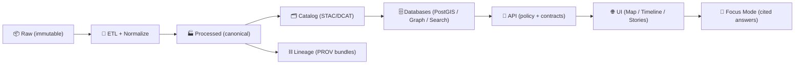
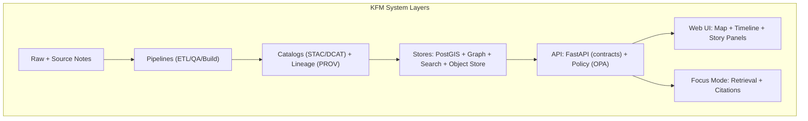

<div align="center">

<picture>
  <source media="(prefers-reduced-motion: reduce)" srcset="docs/assets/brand/kfm-seal-320.png">
  
</picture>

# Kansas Frontier Matrix (KFM) 🌾🗺️  
**Evidence-first geospatial knowledge hub for Kansas — from raw sources to auditable maps, datasets, and narratives.**  
<sub><em>“The map behind the map.” — every layer has receipts.</em></sub>

<br/>

<!-- Status / Principles -->


<br/>

<!-- Pipeline / Catalog / Lineage -->


<br/><br/>

</div>

> [!IMPORTANT]
> **KFM is not “just a map app.”** It is a governed evidence engine:  
> ✅ **No Source, No Answer** · ✅ **Contracts before convenience** · ✅ **Promotion is policy-gated**

---

## 🔗 Quick Links
- 🧭 [What this repo is](#-what-this-repo-is)
- ⛓️ [Truth Path](#️-the-truth-path-canonical-pipeline)
- 🧱 [Architecture at a glance](#-architecture-at-a-glance)
- 🗂️ [Repository map](#️-repository-map-where-things-live)
- 🚀 [Quickstart](#-quickstart-developer-stack)
- 🧾 [Contributing](#-how-to-contribute-by-role)
- ⚖️ [FAIR+CARE & sovereignty](#️-governance-faircare--sovereignty)
- 🤖 [Focus Mode & Story Nodes](#-focus-mode-ai--story-nodes)
- 🧪 [Validation & CI gates](#-validation--ci-gates)

---

## 🧭 What this repo is
KFM is an open-source platform to make Kansas’s **spatial truth** searchable, mappable, auditable, and reusable.

It is built to support:
- 📥 **Data ingestion + deterministic ETL**
- 🧾 **Catalogs & standards** (STAC / DCAT)
- ⛓️ **Lineage bundles** (W3C PROV)
- 🧠 **Semantic integration** (graph + references back to catalogs)
- 🔐 **Governed API boundary** (policy enforcement at the “trust membrane”)
- 🌐 **Map UI + Timeline + Story Nodes + Focus Mode**

---

## ✅ Core guarantees (non-negotiables)
| Guarantee | What it means in practice | Where it’s enforced |
|---|---|---|
| **Evidence-first** | No uncited facts, layers, or AI answers | Catalog + PROV + policy gates |
| **Contract-first** | Schemas + API contracts are first-class | `schemas/` + API tests |
| **Deterministic pipeline** | Re-runs are reproducible; outputs are versioned | ETL + manifests |
| **Fail-closed governance** | Missing metadata/lineage blocks promotion | CI + policy checks |
| **Single access boundary** | UI/clients must go through the API | API gateway / service layer |

> [!NOTE]
> If you’re here to “just upload a shapefile and ship it,” you’ll fight the system.  
> KFM is intentionally designed to prevent silent drift and untraceable outputs.

---

## ⛓️ The Truth Path (canonical pipeline)



### Required staging (data cannot skip the line)
- `data/raw/` → **immutable** source snapshots
- `data/work/` → disposable experiments / staging
- `data/processed/` → canonical processed outputs used downstream
- `data/catalog/` → dataset contracts (DCAT + cross-links)
- `data/stac/` → STAC collections/items & assets
- `data/prov/` → W3C PROV-style lineage bundles

### “Definition of Published” dataset (promotion gate)
A dataset is not considered **shippable** until all items below exist and validate:

| Artifact | Purpose | Typical location |
|---|---|---|
| **STAC** | spatial assets + discoverability | `data/stac/collections/`, `data/stac/items/` |
| **DCAT** | dataset contract & metadata view | `data/catalog/dcat/` |
| **PROV** | lineage: inputs → transforms → outputs | `data/prov/` |

> [!WARNING]
> **Bypass attempts are treated as defects.**  
> If something can’t be represented through the Truth Path, the pipeline/contract needs improvement—**not a shortcut.**

---

## 🧱 Architecture at a glance



### Interface boundary rule (a.k.a. “trust membrane”)
- **Only the API** is allowed to serve data to clients.
- Clients (UI, notebooks, partner tools) **must not** read DBs directly.
- Policy lives at the boundary: access control, redaction, sensitivity rules.

---

## 🗂️ Repository map (where things live)

> [!TIP]
> The canonical “one home per subsystem” layout is defined in the Master Guide.  
> The map below shows the **intended** structure and why each surface exists.

<details>
<summary><strong>📦 Expand repo map (typical v13 layout)</strong></summary>

```text
docs/
  MASTER_GUIDE_v13.md                 # Canonical repo + pipeline framing
  standards/                          # Profiles, protocols, constraints
  templates/                          # Governed templates (universal, story nodes, API extensions)
  governance/                          # ROOT_GOVERNANCE, ETHICS, SOVEREIGNTY, review gates
  reports/
    story_nodes/
      templates/
      draft/
      published/

schemas/
  stac/ dcat/ prov/ storynodes/ api/ ui/

src/                                  # (or top-level: pipelines/, api/, graph/, etc. depending on repo)
  pipelines/
  graph/
  server/

data/
  raw/ work/ processed/
  stac/
  catalog/
  prov/

tests/                                # Trust + governance test suite
tools/                                # Dev/Ops utilities (validated, audited)
web/                                  # React UI (Map / Timeline / Focus Mode client)
mcp/                                  # (optional) agent/tooling interfaces
releases/                             # Release notes, packaging, artifacts

README.md
CONTRIBUTING.md
SECURITY.md
CITATION.cff
LICENSE
docker-compose.yml
.env.example
```
</details>

---

## 🚀 Quickstart (developer stack)

> [!IMPORTANT]
> **This is the “happy path” for local development.**  
> If your branch uses different port mappings or service names, update the compose file accordingly.

### Prereqs
- Docker + Docker Compose
- Git

### Boot the stack
```bash
cp .env.example .env
docker-compose up --build
```

### Common local URLs (if enabled)
- API docs (Swagger): `http://localhost:8000/docs`
- UI: `http://localhost:3000`
- Postgres: `localhost:5432`
- Neo4j: `http://localhost:7474`

<details>
<summary><strong>🧪 Recommended “first checks” after boot</strong></summary>

- [ ] UI loads and can reach the API
- [ ] API returns health/ready
- [ ] A sample dataset appears in catalog endpoints
- [ ] A sample map layer renders from API outputs
- [ ] A sample Story Node renders with citations
- [ ] Focus Mode can answer a question with citations (and refuses when evidence is missing)

</details>

---

## 🧾 How to contribute (by role)

### 1) Data contributors (new datasets / domains)
**Goal:** add data without breaking provenance, policy, or downstream contracts.

**Checklist**
- [ ] Ingest into `data/raw/<domain>/` (plus source notes, license, retrieval date)
- [ ] Implement deterministic transforms in `src/pipelines/` (or `pipelines/`)
- [ ] Write intermediates to `data/work/<domain>/`
- [ ] Publish canonical outputs to `data/processed/<domain>/`
- [ ] Emit **STAC + DCAT + PROV** artifacts
- [ ] Run validations (schema/profile + link integrity + domain QA)
- [ ] Open PR with reproduction steps and impact summary

### 2) Backend contributors (API / graph / policy)
- [ ] Update contract first (OpenAPI/GraphQL)
- [ ] Add tests (unit + contract + integration)
- [ ] Ensure policy rules are enforced at the API boundary
- [ ] Version interfaces and document breaking changes

### 3) Frontend contributors (Map UI / Focus Mode client)
- [ ] UI must never bypass the API boundary
- [ ] Ensure citations render correctly and remain accessible
- [ ] Respect sensitivity flags / redaction rules
- [ ] Provide UX for “No Source, No Answer” outcomes (not silent failure)

### 4) Story authors (Story Nodes)
- [ ] Start from the governed Story Node template
- [ ] Store drafts under the Story Node draft area
- [ ] Every claim points to evidence (dataset IDs, doc refs, catalog links)
- [ ] No precise sensitive locations without explicit governance approval

---

## ⚖️ Governance: FAIR+CARE + sovereignty
KFM governance is an engineered capability. It is designed to:
- preserve Indigenous and community data rights,
- prevent harm from sensitive disclosures,
- and keep the system auditable end-to-end.

> [!IMPORTANT]
> KFM aligns to **FAIR** (Findable, Accessible, Interoperable, Reusable) and **CARE** (Collective Benefit, Authority to Control, Responsibility, Ethics).  
> Data sovereignty considerations may require **redaction, aggregation, delayed release, or restricted access** depending on context.

---

## 🤖 Focus Mode (AI) & Story Nodes
**Focus Mode is not a general chatbot.** It is a **policy-governed, cited analyst**.

Expected behavior:
- ✅ draws from KFM-ingested, cataloged sources (not arbitrary web text)
- ✅ produces citations linked to the evidence trail
- ✅ logs/audits outputs for review
- ✅ refuses when evidence is insufficient (“No Source, No Answer”)

Story Nodes are curated narratives designed to render in the UI and provide provenance-linked context bundles for Focus Mode.

---

## 🧪 Validation & CI gates
KFM CI is expected to block merges when invariants are violated.

Typical gates (implementation may vary by branch):
- Markdown lint + structure validation
- STAC/DCAT/PROV schema/profile validation
- API contract tests (OpenAPI/GraphQL)
- Secrets/safety checks and sensitivity scans
- Link integrity checks

> [!WARNING]
> If CI fails, treat it as a governance boundary: **fix the artifact**; don’t bypass the rule.

---

## 🔒 License, Security, Citation
- **License:** see `LICENSE`
- **Security policy:** see `SECURITY.md`
- **How to cite KFM:** see `CITATION.cff`

---

## 🕰️ Version history
| Version | Date | Summary |
|---|---:|---|
| 0.2 | 2026-02-08 | Root README enhanced with advanced formatting, diagrams, callouts, and scan-first navigation while preserving Truth Path + governance framing. |
| 0.1 | 2026-02-08 | Root README aligned to Truth Path pipeline and governance-first workflow. |
