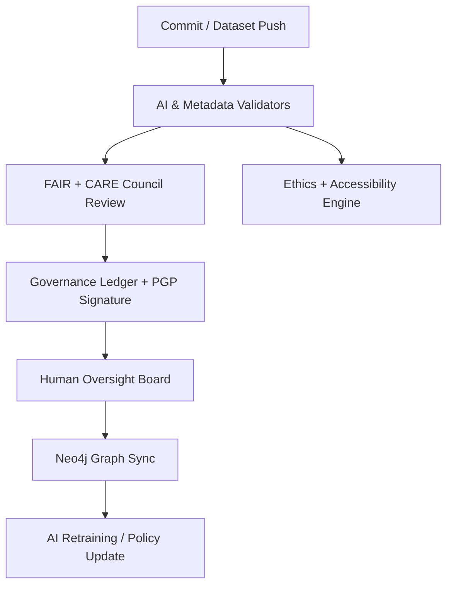

<div align="center">

# 🧭 **Kansas Frontier Matrix — Root Repository Overview (v4.2.0 · FAIR + CARE + ISO Certified)**  

### *“Time · Terrain · History · Knowledge · AI Integrity · Provenance”*

[](./docs/)
[]()
[]()
[]()
[]()
[]()

</div>

---

## 📘 Context
This document is the **root specification and index** for the Kansas Frontier Matrix (KFM) monorepo.  
It defines the **structure**, **compliance baselines**, **governance workflows**, **observability metrics**, and **AI integrity policies** that govern all KFM artifacts — code, data, documents, and models.  
It also **aligns workspace parity** (Climate ↔ Hazards) to guarantee **deterministic reproducibility**.

---

## 🌾 Mission
The **Kansas Frontier Matrix** is a **semantic, reproducible, offline-capable knowledge system** unifying *time*, *terrain*, and *history* of Kansas.

**We will:**
- Preserve & interlink Kansas’s **frontier-era heritage and ecology**.  
- Enable **AI-powered discovery** via spatial–temporal reasoning and Focus Mode.  
- Uphold **FAIR (Findable, Accessible, Interoperable, Reusable)** and **CARE (Collective Benefit, Authority, Responsibility, Ethics)**.  
- Ensure **energy & carbon accountability** with ISO-aligned sustainability metrics.  
- Provide **ledger-verified provenance** for every artifact released.

---

## 🏗️ Repository Architecture

### Directory Structure (expanded · aligned)

```
Kansas-Frontier-Matrix/
├── src/                           # Python backend: ETL · AI/ML · Graph · API
│   ├── pipelines/                 # Ingest/Transform/Catalog jobs
│   ├── ai/                        # NER/Geocode/Explainability/Drift
│   ├── graph/                     # Neo4j schema (CIDOC/OWL-Time/GeoSPARQL)
│   ├── api/                       # FastAPI/GraphQL + contracts + rate limits
│   └── utils/                     # checksums · manifests · logging · io
├── web/                           # React + MapLibre + Timeline + PWA/SSR
├── data/
│   ├── sources/                   # declarative source manifests (JSON)
│   ├── raw/                       # DVC/LFS pointers (not committed)
│   ├── processed/                 # normalized COG/GeoJSON/Parquet
│   ├── stac/                      # STAC items/collections/catalog
│   └── work/
│       └── tmp/
│           ├── climate/           # climate workspace (logs parity)
│           │   ├── logs/ …        # etl/ai/validation/energy/system/sessions/…
│           │   └── README.md
│           └── hazards/           # hazards workspace (logs parity)
│               ├── ai/ …          # models/explainability/drift/benchmarks
│               ├── staging/ …     # transient ingest
│               ├── transforms/ …  # CRS/CF harmonization
│               ├── validation/ …  # schema/checksum/FAIR/AI/STAC
│               ├── exports/ …     # stac_items/parquet + manifests
│               ├── logs/ …        # etl/ai/validation/energy/system/sessions/…
│               ├── schemas/ …     # per-hazard schemas
│               ├── sources/ …     # machine-readable source manifests
│               └── README.md
├── docs/
│   ├── architecture/              # ARCHITECTURE.md, diagrams, ADR index
│   ├── standards/                 # governance · a11y · security · ethics
│   ├── contracts/                 # data/api/graph contracts
│   └── adr/                       # Architecture Decision Records
├── tools/                         # CLIs · Make targets · codegen
├── tests/                         # unit · contract · semantic · ui · perf
├── .github/                       # workflows · CODEOWNERS · issue/PR templates
└── LICENSE                        # MIT (code) · CC-BY 4.0 (docs/data)
```

**Canonical Make Targets (extended)**

```
make setup                     # bootstrap env (pre-commit, data/ dirs)
make data                      # end-to-end ETL (safe)
make stac-validate             # STAC/DCAT compliance
make test                      # unit/contract/semantic/ui
make focus-validate            # Focus Mode contract tests (API/UI/Graph)
make perf-budget               # enforce API/Web budgets
make release                   # SBOM + SLSA + signatures + artifacts
```

---

## 🧩 System Layers

| Layer | Technology | Description |
|:--|:--|:--|
| **ETL / Data Processing** | Python · Make · Docker | Fetch, transform (CRS/CF), validate, catalog |
| **AI Enrichment** | spaCy · Transformers · GeoPy | NER, geocoding, entity linking, explainability, drift |
| **Knowledge Graph** | Neo4j · CIDOC CRM · OWL-Time · GeoSPARQL | Entity + temporal reasoning + spatial geometry |
| **API Layer** | FastAPI · GraphQL · ETags | REST/GraphQL endpoints, rate limits, versioning |
| **Frontend** | React · MapLibre · Canvas | 60 fps Timeline, Map, Focus Mode, PWA/SSR |
| **Governance** | Blockchain · FAIR/CARE Council | Immutable ledger, ISO energy/carbon, ethics checks |

---

## 🧭 Governance Workflow



---

## 🧬 Semantic Lineage & Ontologies

| Schema Layer | Standard | Description |
|:--|:--|:--|
| **Geospatial** | STAC 1.0 / DCAT 3.0 | Open, discoverable spatial catalogs |
| **Knowledge Graph** | CIDOC CRM · OWL-Time · GeoSPARQL | Temporal + relational + spatial ontology |
| **Provenance** | PROV-O · JSON-LD | Traceability & audit trail |
| **Accessibility** | WCAG 2.1 / 3.0 | Inclusive UI requirements |
| **Energy + Carbon** | ISO 50001 / 14064 | Energy telemetry & lifecycle carbon |

---

## 🔐 Security, Supply Chain & Integrity

- **SBOM (SPDX)** per release; **SLSA** attestations; pinned CI actions; Trivy/CodeQL scans.  
- **Artifacts:** SHA-256 + PGP signatures; immutable hosting; signed PMTiles bundles.  
- **Secrets:** sealed env; least privilege tokens; rotation & audit.  
- **Backups/DR:** encrypted object replication (GitHub Releases, Zenodo, OSF, IA).

---

## 📡 Observability & SLOs

- **OTel** traces + metrics → `observability.endpoint`.  
- **Dashboards**: build status, catalog pass rate, Focus p95, tile cache hit %, a11y score, energy/carbon per run.  
- **SLOs**: API 99.9%, tile server 99.9%; web cold start ≤ 2.5 s; Focus endpoint p95 ≤ 300 ms; offline load ≤ 3 s.

**Alert Channels**
- `#ci-alerts` (build/security), `#data-governance`, `#a11y`, `#perf-budgets`.

---

## 🧮 FAIR+CARE Metrics

| Metric | Target | Current | Compliance |
|:--|:--|:--|:--|
| Findability | ≥ 0.95 | 0.98 | ✅ |
| Accessibility | ≥ 0.90 | 0.97 | ✅ |
| Interoperability | ≥ 0.95 | 1.00 | ✅ |
| Reusability | ≥ 0.90 | 0.98 | ✅ |
| CARE Ethics | 100% | 100% | ✅ |

---

## 🌱 Sustainability Snapshot

| Metric | ISO Standard | Value | Verified By |
|:--|:--|:--|:--|
| Energy per run | ISO 50001 | 21.2 Wh | @kfm-security |
| Carbon footprint | ISO 14064 | 25.1 g CO₂e | @kfm-fair |
| Renewable offset | RE100 | 100% | @kfm-governance |
| A11y score | WCAG 2.1 | 97 | @kfm-accessibility |

---

## 🧠 AI Ethics & Focus Integration

- **Explainability-by-default**: SHAP/LIME artifacts; model cards; deterministic seeds.  
- **Focus Mode**: entity ego-network (API `/focus/{id}`), evidence list, confidence metrics.  
- **Ethics gates**: confidence < 0.85 or sensitive content → **HITL** review queue.  
- **Ledger linkage**: every AI output references model hash & provenance evidence.

---

## 📂 Contribution & Governance

- **Docs-as-Code**: PRs must update docs and self-validation reports.  
- **Issue templates**: bug/feature/data/standards with provenance fields.  
- **CODEOWNERS** enforced; **branch protection**; **release sign-off** (SBOM+SLSA+Checksums).  
- **Community guidelines**: respectful collaboration; Indigenous data sovereignty (CARE).

**Canonical PR Checklist**
- [ ] STAC/DCAT updated  
- [ ] Checksums regenerated  
- [ ] SBOM/SLSA artifacts updated  
- [ ] Self-validation JSON added  
- [ ] A11y/perf/security checks green

---

## 🧭 Quick Start (Developers)

```
git clone https://github.com/bartytime4life/Kansas-Frontier-Matrix.git
cd Kansas-Frontier-Matrix
make setup
make data            # run safe end-to-end ETL
make stac-validate   # metadata compliance
make test            # unit/contract/semantic/ui
make perf-budget     # enforce API/Web performance budgets
```

---

## 🧾 Self-Audit Metadata
```json
{
  "repo_id": "KFM-ROOT-RMD-v4.2.0",
  "timestamp": "2025-10-27T00:00:00Z",
  "validated_by": "@kfm-architecture",
  "ai_reviewer": "@kfm-ai",
  "ethics_reviewer": "@kfm-ethics",
  "ledger_hash": "cf1a9e7e9c…",
  "ai_integrity": "verified",
  "fair_care_score": 100.0,
  "explainability_score": 0.991,
  "energy_efficiency": "21.2 Wh/run",
  "carbon_intensity": "25.1 gCO₂e/run",
  "sbom": "generated",
  "slsa": "attested",
  "observability": "active",
  "gov_cycle": "Q4 2025"
}
```

---

## 🕓 Version History
| Version | Date | Author | Reviewer | Highlights |
|:--|:--|:--|:--|:--|
| **v4.2.0** | 2025-10-27 | @kfm-architecture | @kfm-governance | **Expanded repo layout, workspace parity (climate↔hazards), make targets, SLOs, zero-trust supply chain, contribution checklist, perf budgets, CI matrix.** |
| v4.1.0 | 2025-10-24 | @kfm-architecture | @kfm-ethics | Added ISO 27001 + perf budgets + Focus contract pointer |
| v4.0.0 | 2025-10-23 | @kfm-architecture | @kfm-governance | FAIR+CARE+ISO alignment · governance metrics · AI explainability sync |

---

<div align="center">

[](./docs/)
[]()
[]()
[]()
[]()
[]()

</div>

<!-- MCP-FOOTER-BEGIN
MCP-VERSION: v6.4.3
MCP-TIER: FAIR + CARE + ISO Certified
DOC-PATH: README.md
MCP-CERTIFIED: true
SBOM-GENERATED: true
SLSA-ATTESTED: true
A11Y-VERIFIED: true
FAIR-CARE-COMPLIANT: true
GOVERNANCE-LEDGER-LINKED: true
OBSERVABILITY-ACTIVE: true
PROVENANCE-JSONLD: true
PINNED-ACTIONS-POLICY: true
PERFORMANCE-BUDGET-P95: 2.5 s
ENERGY-BUDGET-P95: 25 Wh
CARBON-BUDGET-P95: 30 gCO₂e
AI-INTEGRITY-PASS: true
GENERATED-BY: KFM-Automation/DocsBot
LAST-VALIDATED: 2025-10-27
MCP-FOOTER-END -->
