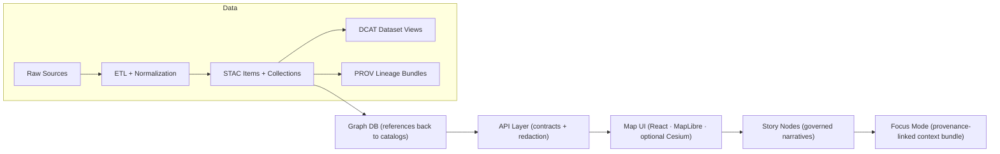

# Kansas Frontier Matrix (KFM) 🌾🗺️  
**Evidence-first geospatial knowledge hub for Kansas — from raw sources to auditable maps, datasets, and narratives.**

KFM is a **pipeline → catalog → databases → API → UI/AI** system that turns messy inputs (archives, GIS, remote sensing, simulations) into **trustworthy, provenance-linked knowledge** you can search, map, and cite—without “black box” outputs.

---

## Table of Contents
- [What this repo is](#what-this-repo-is)
- [Core guarantees (non‑negotiables)](#core-guarantees-non-negotiables)
- [The “Truth Path” (canonical pipeline)](#the-truth-path-canonical-pipeline)
- [Repository map (where things live)](#repository-map-where-things-live)
- [Quickstart (developer stack)](#quickstart-developer-stack)
- [How to contribute (by role)](#how-to-contribute-by-role)
- [Governance: FAIR+CARE + Sovereignty](#governance-faircare--sovereignty)
- [Focus Mode (AI) and Story Nodes](#focus-mode-ai-and-story-nodes)
- [Validation & CI gates](#validation--ci-gates)
- [License, security, citation](#license-security-citation)
- [Version history](#version-history)

---

## What this repo is
KFM is built to support:
- **Data ingestion + transformation** (repeatable ETL)
- **Metadata catalogs** (STAC/DCAT) and **lineage** (PROV)
- **Databases** optimized for spatial, graph, and search workloads
- A governed **API layer** (the only allowed access path for UI/clients)
- A user-facing **Map UI** and a provenance-bound **AI assistant (“Focus Mode”)**

If you’re looking for “just a GIS viewer,” this repo is intentionally *more strict*:
- It is **not** an upload-and-forget portal.
- It is **not** a free-form chatbot.
- It is a governed system where every artifact must be traceable, validated, and policy-compliant.

---

## Core guarantees (non‑negotiables)
These are the invariants that keep KFM “together” as a system:

1. **Evidence-first**
   - Every dataset, map layer, narrative, and AI answer must be grounded in repository-managed sources and traceable metadata.

2. **Contract-first**
   - Schemas, profiles, and API contracts are first-class repo artifacts. Changes require compatibility/versioning discipline.

3. **Deterministic pipeline**
   - ETL is idempotent and logged. Given the same inputs and config, outputs are stable (or differences are explicitly explained).

4. **Fail-closed governance**
   - If metadata is missing, validations fail, or policy is uncertain, promotion/access is blocked by default.

---

## The “Truth Path” (canonical pipeline)



### Data lifecycle (required staging)
All data must move through these staged locations:

- `data/raw/<domain>/`  
  Source snapshots exactly as acquired (plus source notes).

- `data/work/<domain>/`  
  Intermediate artifacts (safe to delete/regenerate).

- `data/processed/<domain>/`  
  Canonical processed outputs used downstream.

### Required “boundary artifacts” (publish gate)
A dataset is not “published” in KFM until it has:

- **STAC** records:
  - `data/stac/collections/`
  - `data/stac/items/`
- **DCAT** dataset entry:
  - `data/catalog/dcat/` (JSON-LD)
- **PROV** lineage:
  - `data/prov/` (W3C PROV bundle)

These boundary artifacts are the interface to the graph, API, UI, and Focus Mode.

---

## Repository map (where things live)
> **Principle:** one canonical home per subsystem. If you can’t answer “where does this belong?” check `docs/MASTER_GUIDE_v13.md`.

A typical v13 layout (names may vary slightly by branch, but intent should not):

```
docs/
  MASTER_GUIDE_v13.md                 # Canonical pipeline + repo rules (source of truth)
  standards/                          # STAC/DCAT/PROV profiles, protocols
  templates/                          # Governed doc templates (Universal, Story Node v3, API extension)
  governance/                          # ROOT_GOVERNANCE, ETHICS, SOVEREIGNTY, review gates
  reports/
    story_nodes/
      templates/
      draft/
      published/
        <story_slug>/
          story.md
          assets/

schemas/
  stac/ dcat/ prov/ storynodes/ ui/ telemetry/

src/
  pipelines/                          # ETL + validators + catalog builders
  graph/                              # Graph loaders, ontology, migrations
  server/                             # API services (contracts, policy hooks)

data/
  raw/ work/ processed/
  stac/ catalog/dcat/ prov/

tests/
tools/
web/                                   # UI (Map UI + Focus Mode client)
releases/

README.md
CONTRIBUTING.md
CHANGELOG.md
SECURITY.md
CITATION.cff
docker-compose.yml
.env.example
.pre-commit-config.yaml
```

---

## Quickstart (developer stack)
KFM is designed to run as a local stack (services + databases + UI) for development.

### Prereqs
- Docker + Docker Compose
- Git

### Boot
```bash
cp .env.example .env
docker-compose up --build
```

### Common local URLs (if enabled in your compose)
- API docs (Swagger): `http://localhost:8000/docs`
- UI: `http://localhost:3000`
- Postgres: `localhost:5432`
- Neo4j: `http://localhost:7474`

> If you hit port conflicts, stop the conflicting local service or remap ports in `docker-compose.yml`.

---

## How to contribute (by role)

### 1) Data contributors (new datasets / domains)
**Goal:** add data without breaking provenance, policy, or downstream contracts.

Checklist:
1. **Create / choose a domain**
   - If this is a new domain, also create: `docs/data/<domain>/README.md` (sources, rationale, pipeline notes).

2. **Ingest raw**
   - Put source material under `data/raw/<domain>/`
   - Include source notes (license, retrieval date, any terms).

3. **Transform deterministically**
   - Add or extend pipeline code under `src/pipelines/`
   - Write intermediate outputs to `data/work/<domain>/`
   - Final outputs to `data/processed/<domain>/`

4. **Publish boundary artifacts (required)**
   - STAC in `data/stac/...`
   - DCAT in `data/catalog/dcat/...`
   - PROV in `data/prov/...`

5. **Run validations**
   - Metadata schema/profile validation
   - Link integrity checks (where applicable)
   - Any domain-specific checks

6. **Open PR**
   - Include “what changed”, “what data”, and “how to reproduce the build”.

### 2) Backend contributors (API / graph / policy)
Checklist:
- Update **OpenAPI/GraphQL** contract first (contract-first)
- Add/adjust tests (contract tests and unit/integration tests)
- If touching graph schema: include migration scripts + version notes
- Ensure policy rules are enforced by API boundaries (never bypass)

### 3) Frontend contributors (Map UI / Focus Mode UI)
Checklist:
- UI must never bypass API governance (no direct DB access, no embedded “secret” data)
- Follow accessibility and telemetry hooks requirements (when present)
- Treat story rendering and citations as first-class UX

### 4) Story authors (Story Nodes)
Checklist:
- Start from `docs/templates/TEMPLATE__STORY_NODE_V3.md`
- Store drafts under `docs/reports/story_nodes/draft/`
- Every factual claim must link to evidence (dataset/catalog/doc references)
- No “free text” facts that aren’t grounded in KFM artifacts

---

## Governance: FAIR+CARE + Sovereignty
KFM treats governance as an engineered capability, not an afterthought:

- **FAIR**: findable, accessible, interoperable, reusable data via catalogs + standards-aligned metadata.
- **CARE**: collective benefit, authority to control, responsibility, ethics—especially for Indigenous and community data.

Practical implications:
- Sensitive locations, personal data, and culturally sensitive information require **explicit handling** (tagging, redaction, access controls, and review gates).
- Some changes trigger manual governance review (e.g., sensitive datasets, AI narrative features, new external sources).

See:
- `docs/governance/ROOT_GOVERNANCE.md`
- `docs/governance/ETHICS.md`
- `docs/governance/SOVEREIGNTY.md`
- `docs/governance/REVIEW_GATES.md`

---

## Focus Mode (AI) and Story Nodes
**Focus Mode** is not a general chatbot. It is a **read-only, policy-governed, cited analyst**.

Behavioral guarantees:
- Uses only KFM-ingested and cataloged sources (no open-web browsing)
- Produces **inline citations** that link back to datasets/documents
- Applies the same policy rules as the rest of the system (redaction, access control)
- Produces audit logs so answers can be reviewed later

**Story Nodes** are curated narratives designed to render in the UI and provide provenance-linked context bundles for Focus Mode.

---

## Validation & CI gates
KFM’s CI is expected to block merges when invariants are violated. Typical gates include:
- Markdown/doc structure + lint checks
- STAC/DCAT/PROV schema/profile validation
- API contract tests (OpenAPI/GraphQL)
- Security scans (secrets, PII/sensitive content, sensitive location leakage)
- Classification consistency checks (no accidental “downgrades”)

If CI fails, treat it as a governance boundary—fix the artifact; don’t bypass the rule.

---

## License, security, citation
- **License:** see `LICENSE`
- **Security policy:** see `SECURITY.md`
- **How to cite KFM:** see `CITATION.cff`

---

## Version history
| Version | Date | Summary |
|---|---:|---|
| 0.1 | 2026-02-08 | Root README rebuilt to align with v13 structure, Truth Path pipeline, and governance-first workflow. |
