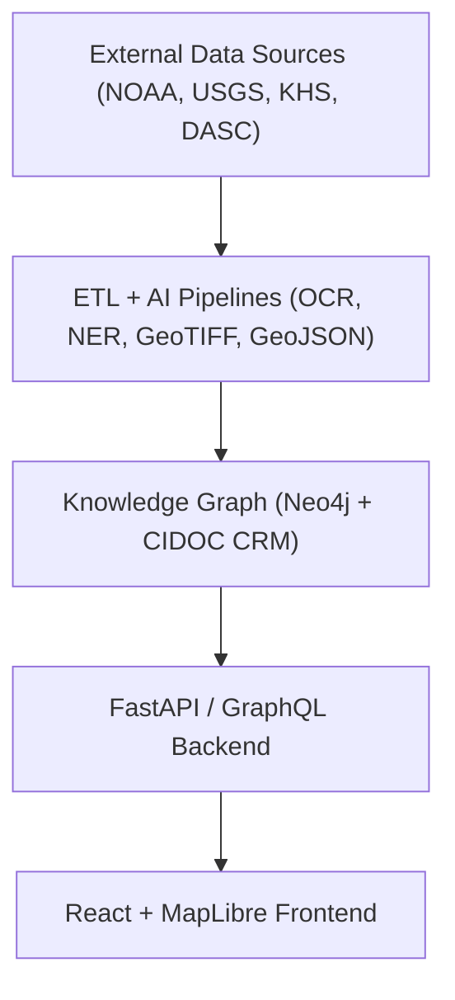

<div align="center">

# 🌾 **Kansas Frontier Matrix — Open-Source Geospatial Historical Mapping Hub**
`README.md`

**Purpose:** Provide a complete overview of the Kansas Frontier Matrix (KFM) — its mission, architecture, directory structure, and open contribution framework.  
This serves as the primary **entry point** for developers, researchers, and collaborators exploring the KFM system.

[](docs/README.md)
[](LICENSE)
[](docs/standards/faircare.md)
[]()

</div>

---

## 📘 Overview

**Kansas Frontier Matrix (KFM)** is an **open-source, multidisciplinary knowledge system** that integrates Kansas’s environmental, cultural, and historical data into a reproducible digital ecosystem.  
It unites **maps, archives, and datasets** from NOAA, USGS, Kansas Historical Society, tribal archives, and public records into a **semantic knowledge graph** viewable through a **timeline-based web map**.

Built under **Master Coder Protocol (MCP v6.3)** and aligned with **FAIR+CARE principles**, KFM ensures data transparency, reproducibility, and ethical stewardship across its workflows.

---

## 🎯 Mission

> *“To weave Kansas’s past into a living digital landscape where history, geography, and ecology converge.”*

KFM’s mission is to connect **historical context, ecological data, and spatial intelligence** by:
- Empowering researchers to study historical and environmental change.  
- Enabling educators to visualize Kansas’s transformation through time.  
- Supporting communities in preserving heritage and oral histories through open collaboration.

---

## ✨ Key Features

| Feature | Description |
|----------|-------------|
| 🗺️ **Interactive Map & Timeline** | Explore Kansas data via a synchronized MapLibre-based time-aware visualization. |
| 🧠 **AI-Powered Focus Mode** | Dynamically filter and summarize entities (people, places, events) using transformer-based models. |
| 🧩 **Knowledge Graph** | Neo4j graph modeling CIDOC CRM & OWL-Time ontologies for linked entity reasoning. |
| ⚙️ **ETL & AI Pipelines** | Reproducible ingestion, OCR, NLP, and geospatial standardization pipelines. |
| 📚 **FAIR+CARE Compliance** | Fully aligned with ethical open data governance for cultural and Indigenous datasets. |
| 🌐 **STAC/DCAT Metadata** | Global interoperability through open metadata standards. |
| 🧮 **Governed Open Source** | CI/CD-validated workflows with SPDX SBOMs and signed governance ledgers. |

---

## 🏗️ System Architecture

KFM’s modular architecture integrates **data processing**, **AI reasoning**, and **interactive visualization**.



All layers communicate using **open standards** — GeoJSON, STAC, DCAT, and JSON-LD — ensuring transparency and FAIR interoperability.

---

## 🗂️ Directory Layout

```
KansasFrontierMatrix/
├── src/                     # Core system modules
│   ├── ai/                  # NLP, summarization, explainability models
│   ├── api/                 # FastAPI / GraphQL backend
│   ├── graph/               # Neo4j schema & ontology integration
│   └── pipelines/           # ETL, validation, and AI enrichment flows
│
├── web/                     # React + MapLibre web client
│   ├── src/                 # Components & interactive views
│   └── public/              # Static assets
│
├── data/                    # Data sources and outputs
│   ├── raw/                 # Unprocessed downloads
│   ├── processed/           # Normalized GeoJSON & GeoTIFF files
│   └── stac/                # STAC catalog metadata
│
├── docs/                    # Documentation & governance
│   ├── standards/           # FAIR+CARE, licensing, and governance
│   ├── templates/           # Issue forms, SOPs, model cards
│   └── architecture.md      # Extended diagrams & system context
│
├── tools/                   # Build, ingest, and validation utilities
│   ├── ingest_data.py
│   ├── generate_stac.py
│   └── validate_data.py
│
├── tests/                   # Unit & integration tests
│
├── .github/                 # CI/CD workflows & governance forms
│
├── LICENSE                  # MIT License (code) / CC-BY 4.0 (data)
├── CONTRIBUTING.md           # Contribution guidelines
└── Makefile                  # Build and validation entry point
```

---

## 🧱 Data Standards

| Standard | Purpose |
|-----------|----------|
| **STAC 1.0.0** | Geospatial asset discovery and indexing |
| **DCAT 3.0** | Dataset catalog interoperability |
| **CIDOC CRM** | Cultural heritage ontology for provenance |
| **OWL-Time** | Temporal reasoning for event chronology |
| **GeoJSON / GeoTIFF** | Open geospatial vector and raster formats |
| **JSON-LD / RDF** | Semantic web compatibility |

---

## 🧠 Focus Mode

**AI-powered “Focus Mode”** dynamically contextualizes entities and relationships through semantic queries and graph traversal.

- Automatically links people, places, treaties, and events.  
- Provides contextual summaries using trained transformer models (`focus_transformer_v1`).  
- Enhances exploratory research through explainable AI.  

Example API query:
```bash
GET /api/focus/Fort_Larned
```

Returns a semantic subgraph of connected events, treaties, and documents.

---

## ⚙️ Installation & Usage

```bash
# Clone the repository
git clone https://github.com/bartytime4life/Kansas-Frontier-Matrix.git
cd Kansas-Frontier-Matrix

# Build and run with Docker
docker-compose up --build

# Or run locally
make setup
npm start        # Frontend
python main.py   # Backend
```

**Local URLs:**
- 🌐 Web App → `http://localhost:3000`  
- 🧠 API Docs → `http://localhost:8000/docs`

---

## 🤝 Contributing

KFM follows the **Master Coder Protocol v6.3** — *“Documentation First, Code Second.”*

1. Document new changes under `docs/` or `data/sources/`.  
2. Ensure front-matter metadata includes license, checksum, and version.  
3. Run validation:
   ```bash
   make validate
   ```
4. Submit a pull request with descriptive commits and updated READMEs.

All contributions undergo FAIR+CARE and CI/CD validation before merge.

---

## ⚖️ License

| Type | License | Scope |
|------|----------|--------|
| **Code** | MIT License | Source and pipelines |
| **Data / Docs** | CC-BY 4.0 | Datasets and documentation |
| **Metadata** | SPDX SBOM | `releases/v9.7.0/sbom.spdx.json` |

---

## 🕰️ Version History

| Version | Date | Author | Summary |
|----------|------|---------|----------|
| v9.7.0 | 2025-11-05 | A. Barta | Added complete directory layout, FAIR+CARE compliance mapping, and governance automation. |
| v9.5.0 | 2025-10-20 | A. Barta | Integrated Focus Mode and STAC/DCAT interoperability. |
| v9.3.0 | 2025-08-12 | KFM Core Team | Enhanced ETL pipelines and ontology integration. |
| v9.0.0 | 2025-06-01 | KFM Core Team | Public launch under MCP v6.3. |

---

<div align="center">

**© 2025 Kansas Frontier Matrix — MIT / CC-BY 4.0**  
Maintained under **Master Coder Protocol v6.3** · FAIR+CARE Certified · Diamond⁹ Ω / Crown∞Ω Ultimate Certified  
[Documentation Index](docs/README.md) · [Governance Charter](docs/standards/governance/ROOT-GOVERNANCE.md)

</div>
