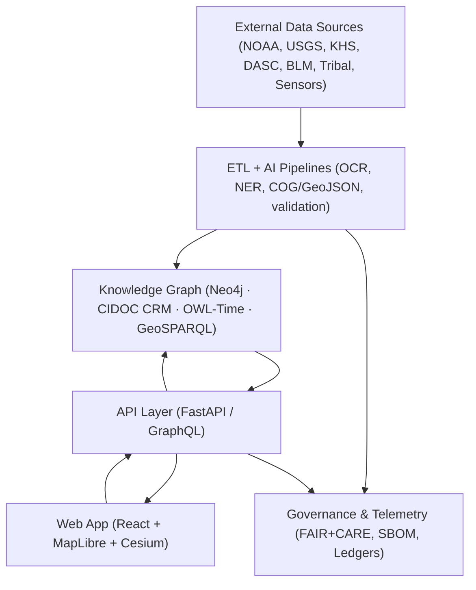

<div align="center">

# 🌾 **Kansas Frontier Matrix — Open-Source Geospatial Historical Mapping Hub**
`README.md`

**Purpose:**  
Primary entry for developers, historians, scientists, and community contributors to understand the mission, architecture, governance, and data framework of the **Kansas Frontier Matrix (KFM)**.  
KFM unites Kansas’s historical, environmental, and cultural data into a **FAIR+CARE-certified**, **MCP-compliant**, and **reproducible open data ecosystem**.

[](docs/README.md)
[](LICENSE)
[](docs/standards/faircare.md)
[]()

</div>

---

## 📘 Overview
The **Kansas Frontier Matrix (KFM)** is a **semantic geospatial knowledge hub** integrating Kansas’s **environmental, cultural, and historical archives** into an **open-source digital infrastructure**.  
Built under **Master Coder Protocol v6.3** and aligned with **FAIR+CARE** data ethics, it enables **traceable**, **reproducible**, and **machine-readable** data publication.

KFM aggregates **maps, archives, and datasets** from:
- **NOAA**, **USGS**, **Kansas Historical Society**, **Kansas DASC**
- **Tribal archives**, **BLM GLO Records**, **local museums & libraries**

Every artifact is versioned, checksum-verified, and governed through transparent FAIR+CARE workflows.

---

## 🎯 Mission
> *“Weave Kansas’s past into a living digital landscape where history, geography, and ecology converge.”*

KFM connects **historical context**, **ecological data**, and **cultural geography** by:
- Enabling **interdisciplinary research** on environmental & societal change  
- Empowering **communities and educators** with visual, narrative analytics  
- Preserving **Indigenous knowledge and heritage** through ethical open data  

---

## ✨ Key Features (v10.0)
| Feature | Description |
|---|---|
| 🗺️ **Interactive Map & Timeline** | Synchronized MapLibre + D3 visualization linked to temporal data and story nodes. |
| 🧠 **Focus Mode v2** | Adaptive AI narratives (`focus_transformer_v2`), subgraph insights, explainability overlays, CARE guardrails. |
| 🧩 **Knowledge Graph** | Neo4j-based graph aligned with CIDOC CRM, OWL-Time, GeoSPARQL, PROV-O; federated queries. |
| ⚙️ **ETL & AI Pipelines** | Automated ingestion, OCR, NER, geocoding, summarization, validation (FAIR+CARE, data contracts). |
| 📚 **FAIR+CARE Governance** | Ethics-by-design for cultural/Indigenous data with transparent Council ledger. |
| 🌐 **STAC/DCAT Catalogs** | STAC 1.0 + DCAT 3.0 catalogs for dataset discovery; streaming STAC bridge for live sources. |
| 🛰️ **3D Temporal Scenes** | Cesium-powered 3D layers for deep-time to future projections. |
| 🧮 **Reproducible Open Source** | SPDX SBOMs, SLSA-style attestations, GitHub Actions CI/CD, consolidated telemetry. |

---

## 🏗️ System Architecture


All layers exchange **open schemas** (GeoJSON, COG, STAC, DCAT, JSON-LD/RDF) and emit **MCP telemetry** for cross-validated reproducibility.

---

## 🗂️ Directory Layout
```
KansasFrontierMatrix/
├── src/
│   ├── ai/                 # Focus AI, models, explainability, training, streaming
│   ├── api/                # FastAPI / GraphQL routes, services, auth
│   ├── graph/              # Neo4j schema, ingest, queries, federation
│   └── pipelines/          # ETL, validation (FAIR+CARE), utilities
│
├── web/
│   ├── src/                # Components: MapView, TimelineView, FocusPanel, StoryNode
│   └── public/             # Icons, fonts, a11y assets
│
├── data/
│   ├── sources/            # DCAT/STAC source manifests
│   ├── raw/                # Downloaded datasets (LFS/DVC-tracked)
│   ├── processed/          # Validated GeoJSON, GeoTIFF/COG, CSVs
│   └── stac/               # STAC catalog collections/items
│
├── docs/                   # Documentation, governance, templates
│   ├── standards/          # FAIR+CARE, licensing, governance charters
│   ├── templates/          # Issue forms, SOPs, model cards
│   └── architecture.md     # Extended system design
│
├── tools/                  # Ingest/generate/validate CLIs
├── tests/                  # Unit/integration suites
├── .github/                # CI/CD workflows, issue templates, security
├── LICENSE                 # MIT License (code); data/content under CC-BY 4.0 when noted
├── CONTRIBUTING.md         # MCP v6.3 contribution protocol
└── Makefile                # Build, validate, test, run
```

---

## 🧱 Data & Semantic Standards
| Standard | Purpose |
|---|---|
| **STAC 1.0** | Geospatial asset indexing & time-series discovery |
| **DCAT 3.0** | Interoperable dataset cataloging |
| **CIDOC-CRM** | Cultural heritage ontology for entities & provenance |
| **OWL-Time** | Temporal reasoning & chronology |
| **GeoSPARQL / GeoJSON / GeoTIFF-COG** | Spatial modeling & open geodata formats |
| **JSON-LD / RDF** | Linked data publication & knowledge integration |
| **SPDX** | SBOM structure for supply chain & licensing |

---

## 🧠 Focus Mode (AI Context Engine)
**Goal:** Accelerate understanding through AI-mediated narratives and relationship mapping.

| Layer | Function |
|---|---|
| **Backend** | `focus_transformer_v2` generates contextual summaries from subgraphs and STAC/DCAT context. |
| **Frontend** | Focus Panel shows narrative, related People/Places/Events, map/timeline highlights, and explainability overlays. |
| **Governance** | CARE filters, citation provenance, and output telemetry to `releases/v10.0.0/focus-telemetry.json`. |

**API Example**
```http
GET /api/focus/Fort_Larned
```
**Response:** Subgraph (edges + entities) · AI summary · citations/provenance · ethics flags.

---

## ⚙️ Installation & Quickstart
```bash
# Clone
git clone https://github.com/bartytime4life/Kansas-Frontier-Matrix.git
cd Kansas-Frontier-Matrix

# Compose (recommended)
docker-compose up --build

# OR local
make setup
npm --prefix web install && npm --prefix web start     # frontend  http://localhost:3000
uvicorn src.api.main:app --reload                      # backend   http://localhost:8000/docs
```

---

## 🤝 Contributing (MCP v6.3)
KFM follows **“Documentation First, Code Second.”**

1) Update docs in `docs/` and/or source manifests in `data/sources/`.  
2) Validate:
```bash
make validate     # STAC/DCAT + FAIR+CARE + schema lint
make test         # unit/integration
```
3) Ensure **YAML front-matter** (license, checksum, version, FAIR+CARE flags).  
4) Submit a PR using the **Pull Request Template**; CI/CD must pass.

---

## ⚖️ Licensing
| Asset | License | Notes |
|---|---|---|
| **Code** | MIT | See `LICENSE` |
| **Docs & Data** | CC-BY 4.0 | Indicated per file/dataset |
| **SBOM** | SPDX | `releases/v10.0.0/sbom.spdx.json` |

---

## 🧮 FAIR+CARE & Governance
| Principle | Implementation |
|---|---|
| **Findable** | STAC/DCAT UUIDs, indexed catalogs |
| **Accessible** | Open repo, docs, and APIs |
| **Interoperable** | JSON-LD ontologies; open formats |
| **Reusable** | Versioned datasets, checksums, provenance |
| **CARE** | Council reviews; cultural sensitivity and consent; governance ledger |

---

## 🕰️ Version History
| Version | Date | Author | Summary |
|---|---|---|---|
| v10.0.0 | 2025-11-09 | A. Barta | Upgraded hub to v10: Focus v2, streaming STAC bridge, 3D scenes, federated graph, improved governance & telemetry. |
| v9.7.0 | 2025-11-05 | A. Barta | MCP v6.3 + FAIR+CARE alignment; AI telemetry & governance linkages. |
| v9.5.0 | 2025-10-20 | A. Barta | Focus Mode integration and DCAT 3.0 alignment. |
| v9.0.0 | 2025-06-01 | KFM Core Team | Initial MCP-compliant public release. |

---

<div align="center">

**© 2025 Kansas Frontier Matrix — MIT / CC-BY 4.0**  
Maintained under **Master Coder Protocol v6.3** · **FAIR+CARE Certified** · **Diamond⁹ Ω / Crown∞Ω Ultimate Certified**  
[Back to Documentation Index](docs/README.md) · [Governance Charter](docs/standards/governance/ROOT-GOVERNANCE.md)

</div>