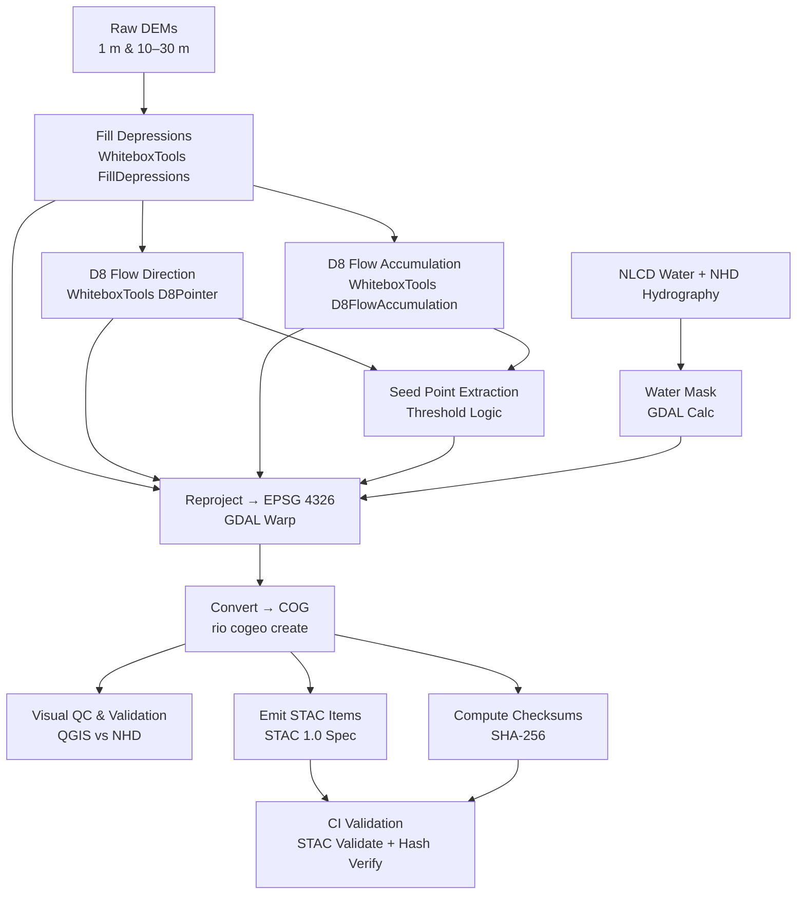

<div align="center">

# 💧 Kansas Frontier Matrix — Processed Hydrology Data

### **Flow · Terrain · Reproducibility** — *Hydrologic foundation layers for Kansas Frontier Matrix*

[](../../../.github/workflows/site.yml)
[](../../../.github/workflows/stac-validate.yml)
[](../../../.github/workflows/codeql.yml)
[](../../../.github/workflows/trivy.yml)
[](../../../../docs/)
[](../../../../LICENSE)

</div>

---

## 📚 Overview

Processed **hydrologic foundation layers** derived from LiDAR and legacy DEMs to support:

* Stream extraction and basin delineation
* Flood/runoff and hazard modeling
* Watershed and terrain morphology studies
* Historical hydrology–climate correlation

**Sources:** LiDAR 1 m DEMs (Kansas DASC / USGS 3DEP) · Historic 10–30 m DEMs · NLCD Water · USGS NHD
**Formats:** COG GeoTIFF (rasters) · GeoJSON (vectors) · EPSG:4326 (WGS 84)
**Catalog:** STAC Items under `data/stac/items/hydro_*`

---

## 🌊 Data Products

| Product                 | File                         | Description                                        | Source                  | Units  | Format      |
| ----------------------- | ---------------------------- | -------------------------------------------------- | ----------------------- | ------ | ----------- |
| **Filled DEM**          | `dem_filled_1m_ks.tif`       | Hydrologically conditioned (sink-filled) DEM (1 m) | KS LiDAR / USGS 3DEP    | m      | COG GeoTIFF |
| **Flow Direction (D8)** | `flow_dir_d8_1m_ks.tif`      | D8 pointer grid (1–128)                            | Derived (WhiteboxTools) | int    | COG GeoTIFF |
| **Flow Accumulation**   | `flow_accum_base_1m_ks.tif`  | Raw accumulation (pre-threshold)                   | Derived (WhiteboxTools) | cells  | COG GeoTIFF |
| **Water Mask**          | `watermask_ks.tif`           | Binary water layer (NLCD + NHD fusion)             | USGS / DASC             | binary | COG GeoTIFF |
| **Stream Seeds**        | `stream_seed_points.geojson` | Candidate outlets / pour points                    | Derived                 | n/a    | GeoJSON     |

---

## 🗂 Directory Layout

```bash
data/
└── processed/
    └── hydrology/
        ├── dem_filled_1m_ks.tif
        ├── flow_dir_d8_1m_ks.tif
        ├── flow_accum_base_1m_ks.tif
        ├── watermask_ks.tif
        ├── stream_seed_points.geojson
        ├── metadata/
        │   ├── dem_filled_1m_ks.json
        │   ├── flow_dir_d8_1m_ks.json
        │   └── flow_accum_base_1m_ks.json
        ├── checksums/
        │   ├── dem_filled_1m_ks.tif.sha256
        │   ├── flow_dir_d8_1m_ks.tif.sha256
        │   └── flow_accum_base_1m_ks.tif.sha256
        └── README.md
```

---

## ⚙️ Processing Workflow



<!-- END OF MERMAID -->

---

## 🗃 Example STAC Item

```json
{
  "type": "Feature",
  "stac_version": "1.0.0",
  "id": "flow_dir_d8_1m_ks",
  "properties": {
    "title": "Flow Direction (D8) – Kansas LiDAR DEM",
    "datetime": "2020-01-01T00:00:00Z",
    "processing:software": "WhiteboxTools 2.2.0",
    "derived_from": ["data/processed/hydrology/dem_filled_1m_ks.tif"],
    "license": "CC-BY-4.0"
  },
  "assets": {
    "data": {
      "href": "./flow_dir_d8_1m_ks.tif",
      "type": "image/tiff; application=geotiff; profile=cloud-optimized",
      "roles": ["data"]
    }
  },
  "bbox": [-102.05, 36.99, -94.59, 40.00]
}
```

---

## 🧪 Reproducibility & Validation

| Validation Step  | Command                                  | Purpose                                |
| ---------------- | ---------------------------------------- | -------------------------------------- |
| **Integrity**    | `sha256sum -c checksums/*.sha256`        | Verify file hashes (CI-enforced)       |
| **STAC Schema**  | `make stac-validate`                     | Validate STAC 1.0 JSON schema          |
| **Pipeline Run** | `make hydrology` / `make validate-hydro` | Rebuild or validate hydrology pipeline |
| **Environment**  | Docker (GDAL • WhiteboxTools • Python)   | Containerized reproducibility          |
| **QA/QC**        | Visual cross-check in QGIS vs NHD        | Spatial accuracy assessment            |

---

## 🧩 Contributing

1. Add new COG / GeoJSON outputs to this folder.
2. Create matching STAC JSON under `metadata/` and SHA-256 in `checksums/`.
3. Document inputs, parameters, and tool versions in `DERIVATION.md`.
4. Run `make validate-hydro`.
5. Open a PR including data sources, licenses, and (optional) preview PNG.

> **Merge Gate:** Checksums and STAC validation must pass CI before merge.

---

## 🔗 References

GDAL • WhiteboxTools • TauDEM • USGS NHD • Kansas DASC Geoportal • STAC 1.0 • MCP Documentation

---

### ✅ Version History

| Version | Date       | Author            | Notes                                                                             |
| ------- | ---------- | ----------------- | --------------------------------------------------------------------------------- |
| v1.1    | 2025-10-10 | KFM Data Ops Team | Updated for MCP Markdown Framework v2 — added badges and compliant Mermaid syntax |

---
