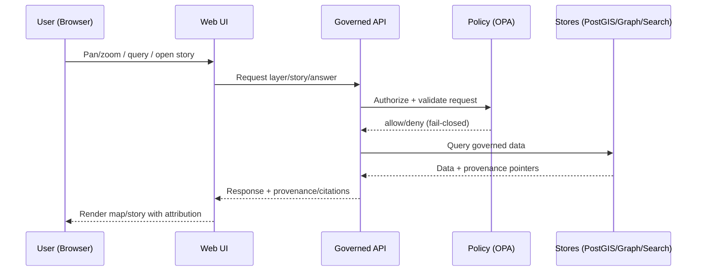

# Kansas Frontier Matrix (KFM) 🗺️🧭  
*A “living atlas” of Kansas—maps + timelines backed by governed catalogs, a knowledge graph, and provenance-linked Story Nodes.*


> [!IMPORTANT]
> KFM is **evidence-first** and **fail-closed**: if a dataset, story, or AI answer can’t be traced to sources (and validated), it shouldn’t ship.

---

## Table of contents
- [📘 Overview](#-overview)
- [🗂️ Directory layout](#️-directory-layout)
- [🧭 Context](#-context)
- [🗺️ Diagrams](#️-diagrams)
- [📦 Data & metadata](#-data--metadata)
- [🌐 STAC, DCAT & PROV alignment](#-stac-dcat--prov-alignment)
- [🧱 Architecture](#-architecture)
- [🧠 Story Nodes & Focus Mode](#-story-nodes--focus-mode)
- [🧪 Validation & CI/CD](#-validation--cicd)
- [⚖️ FAIR+CARE & governance](#️-faircare--governance)
- [🤝 Contributing](#-contributing)
- [🛡️ Security](#️-security)
- [📜 License](#-license)
- [🕰️ Version history](#️-version-history)

---

## 📘 Overview

### Mission
Kansas Frontier Matrix (KFM) is a **provenance-first geospatial knowledge hub**: it turns raw files into **trustworthy maps, timelines, and narratives**—and keeps the “map behind the map” available via citations, metadata, and lineage.

### What KFM is
At its heart, KFM is a **pipeline → catalog → database → API → UI** system:

- **Pipelines** ingest and process data.
- **Catalog + provenance** artifacts make datasets discoverable and auditable.
- **Stores** (spatial + graph + search) serve governed query needs.
- **APIs** mediate access and enforce policy.
- **UI** (web map/timeline) presents layers + narratives with provenance.

### What KFM is not
- Not “upload-and-forget.”
- Not a black-box GIS.
- Not an ungoverned chatbot: KFM’s assistant (“Focus Mode”) is designed to **cite-or-abstain**.

---

## 🗂️ Directory layout

> [!NOTE]
> This is the **current top-level layout** as reflected in the repository root. Subdirectories evolve—treat this as the starting map.

```text
.
├─ .github/         # Repo governance + CI/CD control plane
├─ api/             # Backend services (governed API surface)
├─ data/            # Raw/work/processed data + catalogs/provenance artifacts
├─ docs/            # Governed documentation (standards, templates, guides)
├─ mcp/             # MCP-related integration (tools/adapters for Focus Mode)
├─ pipelines/       # ETL/ELT + orchestration for the canonical truth path
├─ policy/          # Policy-as-code (OPA/Rego) + enforcement packages
├─ releases/        # Release packaging / published artifacts
├─ schemas/         # Schemas for docs/data/policy validation
├─ tests/           # Unit/integration/contract/policy tests
├─ tools/           # Validation, linting, helper tooling
├─ web/             # Frontend UI (map/timeline + provenance UX)
├─ .env.example
├─ docker-compose.yml
├─ CHANGELOG.md
├─ CITATION.cff
├─ CONTRIBUTING.md
├─ LICENSE
└─ README.md
```

---

## 🧭 Context

### Core invariants (non-negotiables)
- **Trust membrane:** the UI never touches databases directly—**all access goes through governed APIs**.
- **Canonical truth path:** data follows a fixed order (raw → processed → catalogs/prov → stores → API → UI).
- **Fail-closed policy:** if governance checks fail, merges/deploys should block.
- **Cite-or-abstain:** Focus Mode must return citations or refuse when evidence is missing.

---

## 🗺️ Diagrams

### System overview (truth path)
```mermaid
flowchart LR
  A[Raw sources] --> B[Pipelines]
  B --> C[Processed artifacts]
  C --> D[Catalog + Provenance<br/>(STAC / DCAT / PROV)]
  D --> E[Stores<br/>PostGIS · Graph · Search]
  E --> F[Governed API<br/>REST / (optional GraphQL)]
  F --> G[Web UI<br/>Map · Timeline · Story Nodes]
```

### Request flow (trust membrane)


---

## 📦 Data & metadata

### The “truth path” in practice
KFM expects a disciplined lifecycle:

1. **Raw**: immutable source drops (keep originals).
2. **Work**: intermediate, reproducible transforms (scripts/config recorded).
3. **Processed**: publishable geospatial artifacts (e.g., GeoJSON, COGs, tiles).
4. **Catalog + provenance**: machine-readable metadata + lineage.
5. **Stores**: PostGIS / graph / search indexes (rebuilt from artifacts).
6. **API**: governed access to layers, stories, and evidence.
7. **UI**: map/timeline/narrative experiences with provenance surfaced.

### Adding a dataset (typical contribution flow)
- [ ] Create/identify **raw** source(s) under `data/`
- [ ] Add pipeline steps under `pipelines/` to create **processed** outputs
- [ ] Generate/commit catalog + lineage artifacts (see STAC/DCAT/PROV below)
- [ ] Validate schemas + links locally (or via CI)
- [ ] Open a PR with evidence + provenance notes

> [!TIP]
> Treat catalogs/provenance as **first-class artifacts**—they are the contract between pipelines and runtime services.

---

## 🌐 STAC, DCAT & PROV alignment

KFM uses open standards to keep data **Findable, Accessible, Interoperable, Reusable**:

- **STAC**: geospatial item/collection metadata for discovery.
- **DCAT (JSON-LD)**: dataset-level catalog metadata (publisher, license, coverage, distributions).
- **W3C PROV-O**: lineage graph describing how outputs were produced (inputs → activities → outputs, with timestamps/agents).

---

## 🧱 Architecture

### High-level components
- **Web UI (`web/`)**: map/timeline/narratives + provenance UX  
- **API (`api/`)**: governed surface area (REST, optional GraphQL)  
- **Stores**: spatial + graph + search (implementation may vary by environment)  
- **Policy (`policy/`)**: authorization + governance checks (fail-closed)  
- **Pipelines (`pipelines/`)**: reproducible transforms that feed catalogs/stores  

### Local quickstart (Docker Compose)
**Prereqs:** Docker + Docker Compose

```bash
cp .env.example .env
docker compose up --build
```

Then open:
- UI: `http://localhost:3000`
- API docs: `http://localhost:8000/docs`

> [!NOTE]
> Service ports and enabled containers can vary—treat `docker-compose.yml` as the source of truth for what runs locally.

---

## 🧠 Story Nodes & Focus Mode

### Story Nodes
Story Nodes are governed narrative artifacts that connect:
- claims → citations
- narratives → map layers
- stories → evidence bundles (catalog/prov references)

### Focus Mode (governed AI)
Focus Mode is KFM’s **policy-gated** assistant designed for:
- retrieval grounded in KFM evidence
- responses that **include citations** (or abstain)
- auditing of prompts/outputs where required by governance

---

## 🧪 Validation & CI/CD

KFM treats governance checks like tests. Typical gates include:
- **Docs validation:** structure/lint/link checks for governed Markdown
- **Schema validation:** Story Nodes + STAC/DCAT/PROV artifacts
- **Policy tests:** OPA/Rego unit tests for allow/deny decisions
- **Contract tests:** API surface (OpenAPI) diffs/compat
- **Security & supply chain:** dependency hygiene, SBOM/attestation (as adopted)

> [!IMPORTANT]
> If a change bypasses CI gates or policy enforcement, it conflicts with KFM’s evidence-first design goals.

---

## ⚖️ FAIR+CARE & governance

KFM aims to maximize public value while respecting rights and safety:

- **FAIR:** data is discoverable + reusable with strong metadata
- **CARE:** community rights, authority to control, and ethical handling are first-class concerns

> [!WARNING]
> Sensitive locations (including culturally restricted sites) may require **generalization/redaction** and formal review.  
> When in doubt: **do not publish precise coordinates**; flag for governance review.

---

## 🤝 Contributing

See [`CONTRIBUTING.md`](CONTRIBUTING.md) for the full workflow.

**Quick rules of thumb**
- Prefer small, reviewable PRs.
- Include provenance/citations for factual claims.
- Don’t break the trust membrane.
- Expect CI to block missing schemas/metadata/policy tests.

---

## 🛡️ Security

- Report security issues via the repo’s security policy (see the **Security** tab).
- Assume **fail-closed** policy posture for access control.
- Avoid committing secrets; rely on env files / secret managers in deployment.

---

## 📜 License

This repository is licensed under **Apache-2.0**. See [`LICENSE`](LICENSE).

---

## 🕰️ Version history

| Version | Date (UTC) | Notes |
|---:|---|---|
| 1.0 | 2026-02-11 | Root README authored to reflect KFM governance + architecture intent and current repo layout. |