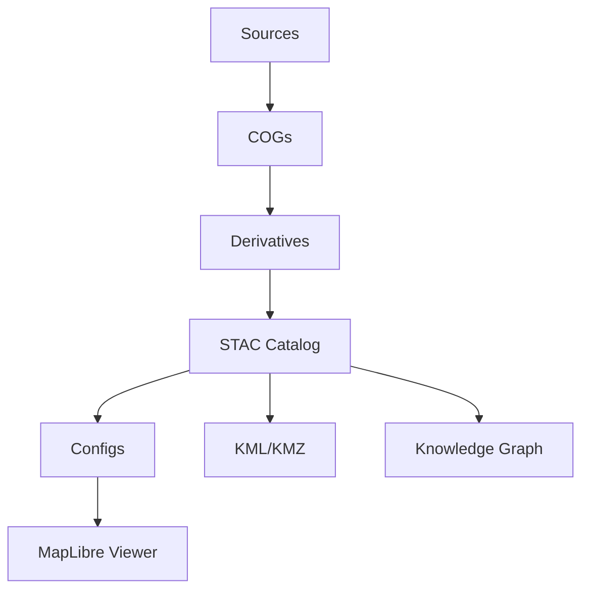

# Kansas Geo Timeline — **Time · Terrain · History**

🌾 Explore the story of Kansas across centuries — where **terrain, climate, culture, and history** intersect.  
This project builds an **open-source, reproducible system** to transform archival maps, LiDAR terrain, treaties, railroads, and oral histories into an **interactive atlas + knowledge graph**.  

---

## 🚀 Quick Links

- 🌐 **[Live Web Viewer](https://bartytime4life.github.io/Kansas-Frontier-Matrix/web/)**  
- 🌍 **[Google Earth KMZ](earth/Kansas_Terrain.kmz)**  
- 📊 **[STAC Catalog](stac/catalog.json)**  

---

## 🗺 Why It Matters

Kansas’s history is layered in **maps, treaties, disasters, and stories**.  
This project helps educators, researchers, and communities explore:

- How **railroads and towns spread** across tribal lands.  
- How **droughts, floods, and the Dust Bowl** reshaped settlement.  
- How **oral histories and archaeology** connect to landscapes.  

It’s more than maps — it’s a **time-aware knowledge hub** for Kansas.

---

## 🔧 How It Works

⸻

⚡ Quickstart

Local Python

python -m venv .venv
. .venv/bin/activate
pip install -r requirements.txt

make fetch cogs terrain stac stac-validate site-config
python -m http.server -d web 8080

Docker

docker compose up -d site

⸻

📂 Repository Layout

data/
  sources/       # JSON descriptors (URL, CRS, bounds, license, time)
  cogs/          # Cloud-Optimized GeoTIFFs (immutable)
  derivatives/   # slope, aspect, hydrology, change maps
  processed/     # cleaned + normalized vectors/rasters
stac/            # STAC 1.0.0 catalog, collections, items
web/             # MapLibre viewer, configs, legends
earth/           # Google Earth exports (KML/KMZ)
scripts/         # ETL, STAC tools, validators
docker/          # reproducible containers
.github/         # CI/CD workflows, roadmap, pre-commit

⸻

🌍 Data Sources

Main sources integrated so far:
	•	USGS — LiDAR DEM (1 m), Historical Topos
	•	Kansas GIS Hub — parcels, soils, floodplains
	•	NOAA — climate normals, tornado/hazard datasets
	•	FEMA & NIFC — disaster declarations, wildfire perimeters
	•	Kansas Geological Survey — hydrology, core samples
	•	Oral Histories & Archaeology — tribal narratives, excavation data

Every dataset is documented with time, CRS, license, and provenance in data/sources/*.json.

⸻

🎯 Use Cases
	•	Animate railroad expansion (1850–1910) alongside treaty boundaries.
	•	Overlay Dust Bowl land cover change with NOAA drought indices.
	•	Link oral histories and diaries to specific places and years.
	•	Compare pre-dam vs post-dam hydrology in Kansas River floodplains.

⸻

✅ Reproducibility & CI
	•	Checksums: .sha256 sidecars for every artifact.
	•	Validation: STAC schema + JSON schema in CI.
	•	CI Pipelines:
	•	site.yml → build & deploy web viewer
	•	stac-badges.yml → shields for dataset health
	•	codeql.yml + trivy.yml → security scans

Run locally:

make prebuild

⸻

🛠 Roadmap
	•	M1: Expand data sources (treaties, railroads, hazards).
	•	M2: Terrain & hydrology analysis (flowdir, floodplains).
	•	M3: Storytelling layers (oral histories, archaeology).
	•	M4: UI enhancements (story maps, vector tiles).
	•	M5: Predictive modeling & MCP simulation protocols.

See ROADMAP.md.

⸻

🤝 Contributing

Contributions welcome!
	•	Keep STAC valid and configs schema-checked.
	•	Use MCP experiment style: state hypothesis → method → data → results.

⸻

📚 Citation

@software{kansas_geo_timeline_2025,
  title = {Kansas Geo Timeline},
  author = {Barta, Andy and contributors},
  year = {2025},
  url = {https://github.com/bartytime4life/Kansas-Frontier-Matrix}
}

⸻

MIT © 2025 — Kansas Frontier Matrix

---

✅ This version:  
- Looks **polished and professional** at first glance.  
- Shows **technical credibility** (STAC, CI, reproducibility, ontology integration).  
- Highlights **why it matters** (impact + use cases).  
- Feels like both an **open-source project** and a **serious research platform**.  
