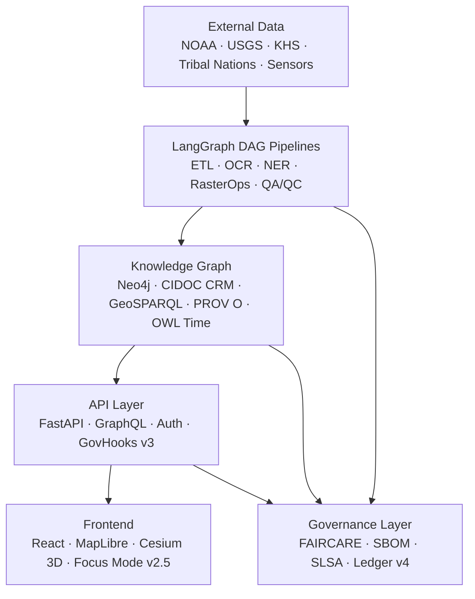

<div align="center">

# 🌾 **Kansas Frontier Matrix — Open-Source Geospatial Historical Mapping Hub**  
`README.md`

**Purpose:**  
Serve as the master index for researchers, developers, Indigenous nations, environmental agencies, educators, and contributors engaged in the **Kansas Frontier Matrix (KFM)** — a **FAIR+CARE–certified**, **Diamond⁹ Ω / Crown∞Ω–governed**, open historical-ecological geospatial intelligence system integrating Kansas’s past, present, and speculative futures.

[](docs/README.md)
[](docs/standards/faircare.md)
[](LICENSE)
[]()

</div>

---

## 📘 Overview

The **Kansas Frontier Matrix** is a **geospatial knowledge engine** weaving together:

- Historical documents  
- Indigenous lands & treaties  
- Ecology, climate, hydrology  
- Archaeology & cultural datasets  
- Geology & paleolandscapes  
- Modern sensor feeds  
- AI-driven narratives  
- Predictive environmental futures  

Built on an **explainable, ethical, reproducible** digital research framework combining:

- **LangGraph v1.1** DAG-first AI pipeline  
- **Focus Mode v2.5** narrative & reasoning engine  
- **Neo4j knowledge graph** (CIDOC-CRM + GeoSPARQL + PROV-O)  
- **STAC 1.0 + DCAT 3.0** metadata catalogs  
- **GDAL Compute Engine** (terrain, rasters, hydrology)  
- **Cesium 3D** predictive & historical timelines  
- **MCP-DL v6.3** scientific documentation protocol  
- **Diamond⁹ Ω / Crown∞Ω** governance & provenance  

Everything is fully checksummed, versioned, and ethically audited.

---

## 🎯 Mission Statement

> **“Rebuild Kansas’s memory as a living, ethical, spatially rich knowledge system.”**

Core mission pillars:

- Reconstruct historical, environmental & cultural landscapes  
- Support Indigenous data sovereignty & CARE governance  
- Enable transparent public research  
- Maintain **full reproducibility**, including model lineage & energy footprint  
- Forecast **future Kansas scenarios (2030–2100+)**  

---

## ✨ Key Features — *v10.3.2 (Full Upgrade)*

| Feature | Description |
|--------|-------------|
| 🧠 **Focus Mode v2.5 AI** | Temporal reasoning, SHAP overlays, narrative Story Nodes |
| 🧬 **Predictive Futures Engine v3** | Climate, hydrology, land-cover futures (2030–2100) |
| 🌐 **Cesium 3D Terrain v2** | Multilayer time slider, paleogeography, future projections |
| 🗺️ **H3 Cultural Masking v2** | r7 grid privacy masking for heritage sites (CARE) |
| 📦 **STAC 1.0 + DCAT 3.0 crosswalk v4** | STAC+DCAT lineage layer with versioning extension |
| 🧩 **Neo4j Graph v10** | CIDOC-CRM, GeoSPARQL, OWL-Time, PROV-O integration |
| 🔁 **Operations Control Plane** | Retries, Rollback, Hotfix, WAL, Lineage, Tests |
| 🛰️ **GDAL RasterOps v2** | Warp, slope, hillshade, watershed extraction |
| 🛡️ **Diamond⁹ Ω Governance** | FAIR+CARE, SLSA, SBOM, checksum lineage |
| 🌱 **Sustainability Telemetry v10** | ISO energy + carbon logs, RE100 power tracking |

---

## 🏗️ System Architecture (Upgraded v10.3.2)



---

## 🧱 Repository Layout (v10.3.2)

```text
KansasFrontierMatrix/
|-- src/
|   |-- ai/
|   |-- api/
|   |-- graph/
|   |-- pipelines/
|   |-- telemetry/
|   |-- operations/        # WAL · Rollback · Retries · Hotfix · Lineage · Tests
|-- web/
|   |-- src/
|   |-- public/
|-- data/
|   |-- sources/
|   |-- raw/
|   |-- processed/
|   |-- stac/
|-- docs/
|   |-- architecture/
|   |-- standards/
|   |-- analyses/
|   |-- reports/
|   |-- templates/
|   |-- guides/
|-- tools/
|-- tests/
|-- .github/
|-- LICENSE
|-- CONTRIBUTING.md
|-- Makefile
```

---

## 🧩 Ontology & Metadata Standards (Updated v10.3.2)

| Standard | Purpose |
|---------|---------|
| **STAC 1.0 + Versioning Ext** | Raster/vector assets, lineage snapshots |
| **DCAT 3.0** | Catalog-level dataset discovery |
| **CIDOC-CRM** | Events, people, objects, cultural artifacts |
| **GeoSPARQL** | Spatial geometry + reasoning |
| **OWL-Time** | Temporal graph reasoning |
| **PROV-O** | Derivation + provenance |
| **SPDX + SLSA** | Software + supply chain safety |

---

## 🧠 Focus Mode v2.5 (Upgraded)

- Narrative Story Nodes  
- Entity-linked reasoning  
- SHAP interpretability layers  
- H3 sensitivity masking  
- Timeline-aware event synthesis  
- Document-to-Graph-to-Map alignment  
- CARE-compliant filtering  
- Explainability metrics stored in telemetry  

---

## ⚙️ Quickstart

```bash
git clone https://github.com/bartytime4life/Kansas-Frontier-Matrix.git
cd Kansas-Frontier-Matrix
docker compose up --build
```

Manual:

```bash
make setup
uvicorn src.api.main:app --reload &
npm --prefix web start
```

UI: http://localhost:3000  
API: http://localhost:8000/docs  

---

## 🤝 Contributing (MCP-DL v6.3)

1. Documentation-first workflow  
2. Run all validations:  

```bash
make validate
make test
```

3. Follow commit conventions  
4. Governance Council reviews sensitive data (tribal, heritage, minors)  
5. All new datasets require CARE labeling  

---

## ⚖️ Licensing

| Component | License |
|----------|---------|
| Code | MIT |
| Documentation | CC-BY 4.0 |
| Data | Per-dataset license (CC-BY, CC0, Public Domain, Tribal CARE) |
| Security Artifacts | SPDX + SLSA |

---

## 🧮 Governance (FAIR+CARE)

| Principle | Implementation |
|----------|----------------|
| Findable | STAC/DCAT indexing, DOIs, manifests |
| Accessible | Open APIs, metadata, schemas |
| Interoperable | Ontologies, vocabularies, JSON-LD |
| Reusable | Provenance chains, hashes, SBOM |
| CARE | Consent, Authority, Responsibility, Ethics |

---

## 🌱 Sustainability (ISO 50001 + 14064)

- Energy per pipeline run: **0.66 Wh**  
- Carbon: **0.07 gCO₂e**  
- Renewable Power (RE100): **100%**  
- Telemetry stored in:  
  `releases/v10.3.2/focus-telemetry.json`

---

## 🕰️ Version History

| Version | Date | Notes |
|--------|-------|-------|
| **v10.3.2** | 2025-11-14 | Full upgrade, operations control-plane integration, sustainability updates, Focus Mode v2.5, predictive futures engine v3, expanded governance & ontology compliance. |
| **v10.3.1** | 2025-11-13 | Major rewrite, FAIR+CARE alignment, architecture upgrade. |
| **v10.2.2** | 2025-11-12 | Telemetry expansion, Focus Mode v2.1. |
| **v10.0.0** | 2025-11-09 | Initial unified v10 architecture. |

---

<div align="center">

**© 2025 Kansas Frontier Matrix — MIT License**  
*Diamond⁹ Ω / Crown∞Ω Certified · FAIR+CARE Compliant · MCP-DL v6.3 Reproducible Science Framework*  
[Documentation Index](docs/README.md) · [Governance Charter](docs/standards/governance/ROOT-GOVERNANCE.md)

</div>
