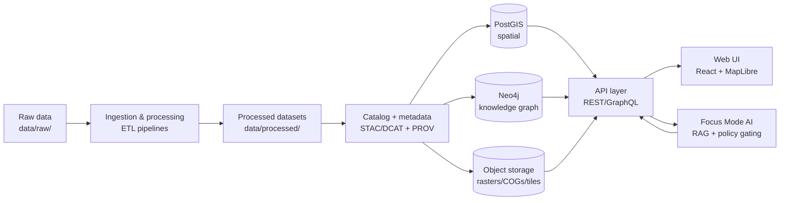

# Kansas Frontier Matrix (KFM) 🧭🗺️
*A governed, provenance-first geospatial + historical knowledge system for Kansas (data → pipelines → APIs → UI/Focus Mode).*


---

## What is KFM?

**Kansas Frontier Matrix (KFM)** is a **governed geospatial/historical knowledge system** designed to turn *raw files and archival materials* into **trustworthy map layers, narratives (Story Nodes), and AI-assisted exploration (Focus Mode)**.

KFM is intentionally built around:

- **Provenance-first UX** (“the map behind the map”)  
- **FAIR + CARE governance** (rights, ethics, and responsible reuse)
- **Clean architecture boundaries** (domain → use cases → interfaces → infrastructure)
- A strict **trust membrane**: UI and external clients **never** talk to databases directly (API-only access)

> [!NOTE]
> KFM is *not* a generic upload-and-forget GIS portal. Every layer/story/answer is expected to be evidence-backed, validated, and reviewable.

---

## Table of contents

- [Core capabilities](#core-capabilities)
- [Integrated domains & map layers](#integrated-domains--map-layers)
- [System architecture](#system-architecture)
- [Repository layout](#repository-layout)
- [Quickstart (Docker Compose)](#quickstart-docker-compose)
- [Workflows](#workflows)
  - [Add a new dataset layer](#add-a-new-dataset-layer)
  - [Add a Story Node](#add-a-story-node)
  - [Run AI-driven experiments](#run-ai-driven-experiments)
- [Governance & sensitive data](#governance--sensitive-data)
- [Contributing](#contributing)
- [Docs & references](#docs--references)
- [License](#license)

---

## Core capabilities

### 🗺️ Interactive mapping + time navigation
- Layer toggles + timeline controls
- 2D maps and (optionally) 3D/terrain experiences
- Feature inspection with metadata and provenance

### 📚 Story Nodes (governed narrative artifacts)
- Markdown-authored narrative slides/steps
- Each claim is expected to be supported by citations
- Story steps can drive map state (“next” changes extent/layers)

### 🤖 Focus Mode (AI assistant, evidence-bound)
- Retrieval-augmented Q&A **grounded in KFM’s internal knowledge base**
- Citations and source links attached to answers
- Policy gating + audit/provenance logging

### 🔎 Search + cross-linking
- Metadata catalog + full-text search
- Knowledge graph relationships (people ↔ places ↔ events ↔ documents)
- Cross-layer reasoning (“what changed here over time?”)

---

## Integrated domains & map layers

The previous README draft didn’t explicitly cover several critical integrations. This version **adds** the missing domains and frames them as **first-class layers** in the KFM data model + pipeline.

> [!IMPORTANT]
> For some domains (notably **land ownership**), KFM must support **access controls, aggregation, and redaction** to avoid exposing sensitive or restricted information.

### Coverage matrix

| Domain / Layer | What it enables in KFM | Typical representations | Notes |
|---|---|---|---|
| **Land ownership / parcels** 🧾 | Ownership history, land-use transitions, reservation boundaries, deed/patent overlays | Parcels, PLSS grids, transactions, time-sliced ownership | Must handle PII + restricted datasets |
| **Historical figures** 👤 | People-centric exploration (who/where/when), relationships, biographies, travel routes | `Person` nodes, roles, affiliations, event links | Extracted from documents + curated records |
| **Hydrology** 💧 | River/stream networks, watershed context, groundwater, water quality and infrastructure | NHD networks, gages, aquifers, wells, quality observations | Supports flood + drought narratives |
| **Geology** 🪨 | Bedrock/stratigraphy, core samples, formations, geologic change context | Polygons + points with depth metadata | Often linked to soils + water |
| **Disasters** ⚠️ | Floods, tornado events, emergencies, drought timelines, recovery impacts | Event layers + affected areas + dates | Tie to Story Nodes + impact analyses |
| **Air quality / smoke** 🌫️ | Smoke plume visualization, AQ trend mapping, health-impact framing | Time-series rasters, station points, plume polygons | Typically paired with fires + meteorology |
| **Soils** 🌱 | Soil constraints, agricultural suitability, erosion risk, dust bowl analysis | SSURGO polygons, erosion indices, properties | Heavily used in land-use history |
| **Fires** 🔥 | Burn perimeters, ignition points, prescribed burns, historical fire regimes | Perimeters + attributes + time slices | Links tightly with smoke |
| **Roads** 🛣️ | Settlement access, corridor growth, logistics, routing, economic history | Road networks (by era), nodes/edges, attributes | Supports network + accessibility analyses |
| **Trains / railroads** 🚆 | Railroad expansion, depot towns, commodity flows, migration patterns | Rail lines (by year built), stations, corridors | High value for historical narratives |

---

## System architecture



### Trust membrane rule (non-negotiable)
- **Web UI and external clients** access data **only via the governed API**
- **Core services** access storage **only through repository interfaces** (no direct DB calls from domain/use-case logic)

---

## Repository layout

> [!TIP]
> The structure below follows the KFM clean-layer boundaries. Your repo may vary slightly; treat this as the *intended* monorepo layout.

```text
.
├── .github/
│   └── workflows/                # CI validation: docs, schemas, links, tests
├── data/
│   ├── raw/                      # raw downloads / vendor exports / scans
│   └── processed/                # normalized outputs ready for load + tiling
├── docs/
│   ├── architecture/             # system overview, boundaries, policies
│   ├── datasets/                 # dataset registry + data dictionaries
│   ├── governance/               # FAIR/CARE, sensitivity policy, access rules
│   ├── stories/                  # Story Nodes (Markdown) + media manifests
│   └── runbooks/                 # operational notes, deployment, troubleshooting
├── experiments/
│   ├── README.md                 # how experiments are run + logged
│   └── <experiment_slug>/        # reproducible experiment units
├── src/
│   ├── domain/                   # pure entities/models (no DB/UI deps)
│   ├── usecases/                 # workflows + business rules
│   ├── interfaces/               # ports/contracts + repository interfaces
│   ├── infrastructure/           # DB/Neo4j/FS implementations + adapters
│   ├── pipelines/                # ingestion + transformation pipelines
│   └── services/                 # API + indexing + AI orchestration
├── web/
│   └── app/                      # React/TypeScript + MapLibre UI
├── docker-compose.yml
└── README.md
```

---

## Quickstart (Docker Compose)

> [!IMPORTANT]
> If you see port conflicts (e.g., `5432`, `7474`, `8000`, `3000`), update your compose port mappings or stop local services using those ports.

```bash
# 1) clone
git clone <YOUR_REPO_URL>
cd Kansas-Frontier-Matrix

# 2) configure environment
cp .env.example .env

# 3) start stack
docker compose up --build
```

### Common dev entrypoints
- API docs: `http://localhost:8000/docs`
- GraphQL (if enabled): `http://localhost:8000/graphql`
- Web UI: `http://localhost:3000`

---

## Workflows

### Add a new dataset layer

Use this checklist when adding **land parcels**, **hydrology**, **soil**, **railroads**, **fires**, etc.

- [ ] **Decide sensitivity + access rules** (public vs restricted vs aggregated)
- [ ] Add raw source to `data/raw/<dataset>/` (or document the fetch script)
- [ ] Create/update pipeline in `src/pipelines/`  
- [ ] Output normalized artifact(s) to `data/processed/<dataset>/`
- [ ] Generate/update **metadata** (STAC/DCAT) and **provenance** (PROV)
- [ ] Load to stores (PostGIS / Neo4j / object storage) via infrastructure adapters
- [ ] Expose via API (REST/GraphQL) **without leaking restricted fields**
- [ ] Add UI layer toggle + legend + attribution
- [ ] Add docs: dataset registry entry + schema + examples
- [ ] Add tests: pipeline idempotency + contract tests + policy checks

<details>
<summary><strong>Definition of Done for a dataset layer</strong></summary>

- Provenance record exists and is linked from UI layer info
- Source license/terms are documented
- Reproducible pipeline (same input → same output hash)
- No UI/AI path bypasses policy checks
- Story Nodes can cite the dataset by stable identifier

</details>

---

### Add a Story Node

1. Create a new file under `docs/stories/<StoryName>.md`
2. Follow the Story Node template (required headings/ordering)
3. Include citations for every factual claim
4. Ensure CI validation passes (structure, links, media, provenance refs)

---

### Run AI-driven experiments

KFM supports **AI driving experiments** in a *governed* way—meaning experiments must be reproducible, use vetted datasets, and produce auditable outputs.

Recommended experiment shape:

```text
experiments/<slug>/
├── README.md            # hypothesis, dataset IDs, metrics, results
├── config.yml           # pinned inputs + parameters
├── run.py               # entrypoint
└── outputs/             # generated artifacts (gitignored if large)
```

Example experiment themes aligned to KFM domains:
- Smoke plume detection → compare models or thresholds (fires ↔ air quality)
- Flood-risk mapping → hydrology + disasters overlays
- Parcel ownership change → land ownership + historical events
- Railroad expansion correlation → trains + towns + economics
- Named-entity extraction → historical figures + documents + knowledge graph

> [!NOTE]
> Experiments should write outputs that can be referenced by Story Nodes **only after review** (to avoid “model says so” narratives).

---

## Governance & sensitive data

> [!WARNING]
> KFM may handle culturally restricted information, sensitive site locations, and personally identifying data (especially around land ownership and living individuals). **When in doubt: redact, aggregate, or restrict** and route for governance review.

Key expectations:
- FAIR + CARE principles must be respected
- Policy-as-code enforcement (deny-by-default for restricted datasets)
- AI answers must cite sources or abstain
- Provenance must be visible and auditable

---

## Contributing

Contributions are welcome—but KFM treats docs, story content, and datasets as **governed artifacts**.

**Before opening a PR:**
- [ ] Data source + license documented
- [ ] Metadata + provenance included
- [ ] Sensitivity reviewed + access rules declared
- [ ] Tests added/updated
- [ ] Story content uses the template and includes citations

---

## Docs & references

KFM design and workflow are grounded in internal project documentation. Suggested doc placement (adjust to match your repo):

- `docs/architecture/` — system overview, boundaries, diagrams  
- `docs/datasets/` — dataset inventory + dictionaries  
- `docs/governance/` — FAIR/CARE + sensitivity and access policy  
- `docs/stories/` — Story Nodes (Markdown)  

Internal reference sources used to build this README (titles may be mirrored into `docs/reference/`):
- **Kansas Frontier Matrix (KFM) – Comprehensive Technical Blueprint**
- **Kansas Frontier Matrix (KFM) – Unified Technical Blueprint & Supporting Ideas**
- **KFM-Data for Kansas**
- **Kansas-Frontier-Matrix: Open-Source Geospatial Historical Mapping Hub Design**
- **Kansas Frontier Matrix (KFM) Comprehensive Guide**

---

## License

**TBD** (add your project’s license file and update this section)