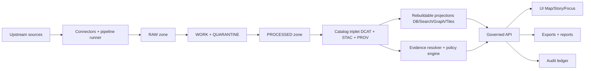
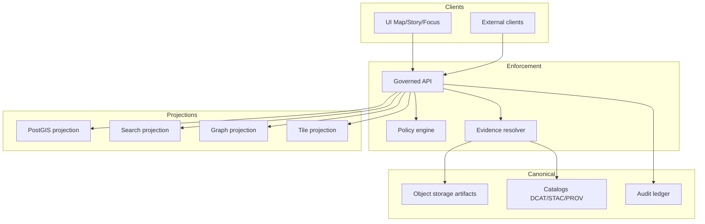
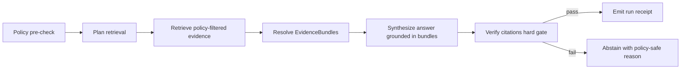

# Kansas Frontier Matrix (KFM)

> **Map-first • Time-aware • Governed • Evidence-first • Cite-or-abstain**

**Status:** vNext (blueprint-driven build; reference build date: **2026-02-21**)  
**Core promise:** Anything you can **see**, **cite**, **export**, or ask KFM to **explain** is traceable to an immutable **DatasetVersion** + resolvable **EvidenceBundle**, with **policy enforced consistently in CI and at runtime**.  
**Primary experiences:** **Map Explorer** + **Timeline** + **Stories** + **Catalog** + **Focus Mode**  
**Owners:** TBD (add CODEOWNERS + maintainer list)  
**License:** TBD (repo license + per-dataset licenses enforced in catalogs and exports)

[](#)
[](#)
[](#)
[](#)
[](#)
[](#)

---

## Quick navigation

[Quick start](#quick-start) •
[What is KFM](#what-is-kfm) •
[System overview](#system-overview) •
[Core invariants](#core-invariants) •
[Domain model and IDs](#domain-model-and-ids) •
[Truth path and Promotion Contract](#truth-path-and-promotion-contract) •
[Canonical storage and rebuildable projections](#canonical-storage-and-rebuildable-projections) •
[Catalog triplet profiles](#catalog-triplet-profiles) •
[Evidence and citations](#evidence-and-citations) •
[Policy, obligations, and rights](#policy-obligations-and-rights) •
[Governed API](#governed-api) •
[Map, timeline, and story UX](#map-timeline-and-story-ux) •
[Focus Mode AI](#focus-mode-ai) •
[Governance](#governance) •
[Security](#security) •
[Contracts and schema registry](#contracts-and-schema-registry) •
[Repository layout](#repository-layout) •
[CI-CD and release gates](#ci-cd-and-release-gates) •
[Roadmap and work packages](#roadmap-and-work-packages) •
[Gap and risk registers](#gap-and-risk-registers) •
[References](#references)

---

## Quick start

> **NOTE**
> This repository’s exact commands / package managers / service topology may vary by branch.
> If you don’t find the files referenced here, treat those sections as **target conventions** and update the README to match repo reality.

### 1) Get oriented

```bash
git clone <REPO_URL>
cd Kansas-Frontier-Matrix

# inventory entrypoints
ls

# if a Makefile exists
test -f Makefile && make help || true
```

### 2) Run the baseline checks (if present)

```bash
# Node/TypeScript workspace
node -v && npm -v
npm ci
npm test

# Python workspace
python --version
python -m venv .venv
source .venv/bin/activate
pip install -r requirements.txt
pytest
```

### 3) First principle while exploring

> **Rule of thumb:** if a thing is user-visible, it must be **promotable** and **citeable**.  
> If it cannot be cataloged and cited, it does not belong on the map.

[↑ Back to top](#kansas-frontier-matrix-kfm)

---

## What is KFM

KFM is a governed knowledge system where the **map + timeline** are the primary interface. Trust comes from a strict “truth path”:

- immutable **DatasetVersions**
- strict catalogs (**DCAT + STAC + PROV**) treated as **contract surfaces**
- policy-as-code enforced **in CI and runtime**
- a deterministic **Evidence Resolver** that turns citations into resolvable evidence bundles
- append-only **audit ledger** + reproducible **run receipts**
- rebuildable projections (DB/search/graph/tiles) that can be recreated from canonical artifacts

KFM is deliberately *not* “a GIS app plus a chatbot.” It is a governed system designed so that **evidence remains inspectable** as the system scales.

[↑ Back to top](#kansas-frontier-matrix-kfm)

---

## System overview

### High-level flow



### Trust membrane

**Enforcement boundary (non-negotiable):**
- **Clients MUST NOT** access object storage / DB directly.
- Access flows through a **governed API** that applies **policy**, **evidence resolution**, **obligations**, and **audit logging** consistently.
- Backend domain logic **MUST NOT** bypass repository interfaces to talk directly to infrastructure.



[↑ Back to top](#kansas-frontier-matrix-kfm)

---

## Core invariants

These are KFM’s “non-negotiables.” If we violate them, we don’t merely have bugs—we break governance.

### Invariants (what must always be true)

| Invariant | Meaning | Enforced by |
|---|---|---|
| **Truth path** | Data moves Raw → Work/Quarantine → Processed → Catalog → Published via fail-closed gates | Promotion Contract (CI + pipeline) |
| **Trust membrane** | No direct client-to-storage/DB; domain never bypasses interfaces | network controls + code structure + tests |
| **Catalogs are contract surfaces** | DCAT/STAC/PROV are canonical interface between pipeline outputs and runtime | profiles + validators + link-check |
| **Evidence-first UX** | Evidence is a primary interaction everywhere | evidence drawer required + publish gates |
| **Cite-or-abstain Focus Mode** | If citations can’t be verified, Focus Mode abstains | citation verifier hard gate + eval harness |
| **Canonical vs rebuildable** | Object storage + catalogs + audit ledger are canonical; DB/search/tiles are projections | rebuild scripts + “source of truth” discipline |
| **Deterministic identity** | DatasetVersion IDs + artifact digests + bundle IDs are stable and digest-based | canonical hashing + “hash drift” tests |
| **Policy consistency** | Same policy semantics in CI and runtime | shared policy bundle + fixtures-driven tests |
| **No sensitive leakage** | Errors/tiles/exports must not reveal restricted existence or precise sensitive locations | stable error model + redaction tests |

> **Norms used in docs:** MUST / MUST NOT / SHOULD / MAY (RFC-style).  
> **Section tags:** CONFIRMED / PROPOSED / UNKNOWN.

[↑ Back to top](#kansas-frontier-matrix-kfm)

---

## Domain model and IDs

### Minimum domain entities (v1)

KFM is deliberately small at the core. Everything composes out of these:

- **Dataset** — conceptual dataset identity (slug, title, steward, themes)
- **DatasetVersion** — immutable released version (spec_hash, release time, policy label)
- **Artifact** — concrete file/asset (path, media type, digest, size) in a specific zone
- **EvidenceRef** — stable pointer to evidence (dcat/stac/prov/doc/graph schemes)
- **EvidenceBundle** — policy-filtered evidence package resolved from EvidenceRefs
- **PolicyDecision** — allow/deny + obligations + reason codes
- **RunReceipt** — immutable record of ingest/transform/publish/focus operation (inputs/outputs + environment)
- **StoryNode + StoryNodeVersion** — narrative + map state + citations + policy label + review state
- **MapState** — viewport + time window + active layers (reproducible)

### Deterministic identity and hashing

**CONFIRMED posture:** DatasetVersion identity MUST be derived from a canonical specification (inputs + parameters + outputs).  
Once promoted, a DatasetVersion is immutable; changes create a new version.

**PROPOSED hashing pattern:**
- `spec_hash = sha256( JCS(spec_json) )` using canonical JSON (RFC 8785 JCS)
- `dataset_version_id = <dataset_slug> + "@" + short(spec_hash)`
- `artifact_digest = sha256(file_bytes)`
- `evidence_bundle_id = sha256(canonical_json(bundle_manifest))`

> Deterministic IDs enable caching, signing, reproducible builds, and rebuilding projections without ambiguity.

### Time model (time-aware)

KFM distinguishes at least two “clocks,” adding more only when necessary:

- **Event time:** when something happened (historical event, observation time, boundary effective date)
- **Transaction time:** when KFM acquired/processed/published the record (audit + lineage)
- **Valid time (optional):** when a statement is true (useful for boundary history/jurisdiction changes)

**Recommendation:** start with **event time + transaction time** everywhere. Add **valid time** only when it materially changes interpretation.

[↑ Back to top](#kansas-frontier-matrix-kfm)

---

## Truth path and Promotion Contract

### Data lifecycle zones (truth path)

| Zone | Purpose | What belongs here | Runtime-servable |
|---|---|---|---|
| **RAW** | Immutable acquisition | source snapshots + checksums + terms/license snapshots | **No** |
| **WORK** | Intermediate transforms | normalization, QA outputs, staging artifacts | **No** |
| **QUARANTINE** | Fail-closed holding | rights unclear, QA failed, sensitivity review pending | **No** |
| **PROCESSED** | Publishable artifacts | validated, policy-ready outputs | **Not directly** (served via API only when promoted) |
| **CATALOG** | Canonical metadata + lineage | DCAT + STAC + PROV + receipts + link validation | **Yes (via resolver/API)** |
| **PUBLISHED** | Governed runtime surfaces | only what’s safe and promotable reaches UI/exports | **Yes** |

### Promotion Contract (fail-closed gates)

Promotion is the act of declaring a DatasetVersion safe to surface through governed runtime.

**Minimal gates (v1.1 posture):**
- **Identity & versioning:** deterministic spec_hash; dataset_version_id assigned; spec stored
- **Artifacts:** processed artifacts exist; each has digest + media type; stable paths
- **Catalogs:** DCAT/STAC/PROV generated; schema-valid under KFM profiles
- **Cross-links:** all links resolve; EvidenceRefs resolve deterministically
- **Policy:** policy_label assigned; obligations applied; default-deny tests pass
- **QA:** QA report present; thresholds defined; failures quarantined
- **Audit:** run receipt emitted; append-only audit entry; approvals captured when required
- **Rights:** license + rights holder present for every distribution/asset; export constraints enforced

### Promotion manifest (template)

```json
{
  "kfm_promotion_manifest_version": "v1",
  "dataset_slug": "example_dataset",
  "dataset_version_id": "example_dataset@abcd1234",
  "spec_hash": "sha256:abcd1234",
  "released_at": "2026-02-20T13:00:00Z",
  "artifacts": [
    { "path": "artifacts/events.parquet", "digest": "sha256:2222", "media_type": "application/x-parquet" },
    { "path": "artifacts/events.pmtiles", "digest": "sha256:3333", "media_type": "application/vnd.pmtiles" }
  ],
  "catalogs": [
    { "path": "dcat.jsonld", "digest": "sha256:4444" },
    { "path": "stac/collection.json", "digest": "sha256:5555" },
    { "path": "prov/bundle.jsonld", "digest": "sha256:6666" }
  ],
  "qa": { "status": "pass", "report_digest": "sha256:7777" },
  "policy": { "policy_label": "public", "decision_id": "kfm://policy_decision/xyz" },
  "approvals": [
    { "role": "steward", "principal": "<id>", "approved_at": "2026-02-20T12:59:00Z" }
  ]
}
```

### Dataset integration “Definition of Done” (ticket-level)

A dataset integration is “done” only when it is end-to-end governable:

- **Acquisition:** RAW capture reproducible; acquisition manifest + terms snapshot + checksums recorded
- **Transforms:** deterministic WORK transforms; schema versioning; QA reports produced; receipts emitted
- **Artifacts:** PROCESSED artifacts in approved formats; digests recorded; extents computed
- **Catalogs:** DCAT/STAC/PROV validate + cross-link; EvidenceRefs resolve in test/staging
- **Runtime:** governed API serves with policy filtering + stable error model
- **UI:** evidence drawer renders EvidenceBundles for representative features/claims
- **Governance:** policy_label assigned; steward approval recorded; changelog explains what changed and how to verify

[↑ Back to top](#kansas-frontier-matrix-kfm)

---

## Canonical storage and rebuildable projections

KFM must be designed so that you can rebuild indexes and databases from promoted artifacts + catalogs (vendor lock-in reduction + disaster recovery).

### Canonical object storage layout (PROPOSED)

```text
data/
  raw/
    <dataset_slug>/
      <acquisition_id>/
        manifest.json
        artifacts/
          ...
  work/
    <dataset_slug>/
      <work_run_id>/
        ...
  processed/
    <dataset_slug>/
      <dataset_version_id>/
        artifacts/
          <artifact_name>.<ext>
        checksums.json
        qa/
          validation_report.json
  catalog/
    <dataset_slug>/
      <dataset_version_id>/
        dcat.jsonld
        stac/
          collection.json
          items/
            <item_id>.json
        prov/
          bundle.jsonld
        receipts/
          run_receipt.json
```

**Rules:**
- Only **processed** and **catalog** artifacts are eligible to be served to runtime.
- Every artifact has a digest and appears in `checksums.json`.
- Keep manifests and receipts close to artifacts so the “truth path” is navigable without a database.

### PostGIS projection schema (rebuildable)

PostGIS is useful for spatial queries, but it is a **projection** and must be rebuildable.

**Recommended projection tables (PROPOSED):**
- `datasets`: `dataset_slug`, `title`, `policy_label`, `latest_version_id`, …
- `dataset_versions`: `dataset_version_id`, `spec_hash`, `produced_at`, `policy_label`, `extents`, `qa_summary`
- `features__<dataset_slug>` or a generic `features` table:
  - `feature_id`
  - `geometry`
  - `properties` (JSONB)
  - `event_time`
  - `valid_time` (optional)
  - `evidence_ref`
  - `digests` (artifact/bundle digests as needed)

**Key requirement:** every feature row must carry `evidence_ref` and `dataset_version_id`.

### Search projection design (rebuildable)

Search is required for:
- dataset discovery
- story search
- document/OCR search

Index fields should include:
- `dataset_version_id`
- artifact digest(s)
- `evidence_ref`
- `policy_label`
- spatial + temporal extents (for filtering)
- text fields (OCR, metadata, narrative)

> **Important:** search results must map to EvidenceRefs that resolve; otherwise search becomes an unverifiable shadow source.

### Graph projection (optional early)

Graph becomes useful when you need:
- relationship traversal (places → events → documents)
- entity resolution and aliasing
- narrative linking

Start with a minimal graph schema:
- nodes: Dataset, DatasetVersion, Artifact, StoryNode, EvidenceRef (and later: Entity/Place/Person candidates)
- edges: `has_version`, `generated`, `cites`, `related_to`, plus **candidate** vs **asserted** identity edges

### Tile strategy (DECISION NEEDED)

**Default recommendation:** PMTiles for large public layers; dynamic tiles only when required.

Validation/verification gate:
- benchmark 1–2 representative layers at target size
- decide by P95 latency, cost, and operational complexity
- ensure tiles do not leak restricted existence or precise sensitive locations

### Evidence packs (exportable governed bundles)

For exports and offline review, package policy-safe evidence bundles as “Evidence Packs”:

- `manifest.json` (what’s included)
- `checksums.json` (digests)
- `CITATIONS.txt` (copy/paste attribution + citations)
- `LICENSES/` (license texts where required)
- optional `provenance.txt` / run receipt references
- exports MUST include dataset_version_id and audit_ref

[↑ Back to top](#kansas-frontier-matrix-kfm)

---

## Catalog triplet profiles

Catalogs are not “nice metadata.” They are contract surfaces.

### Responsibilities of the catalog triplet

- **DCAT** answers: “What is this dataset? Who published it? What is the license? What are the distributions?”
- **STAC** answers: “What assets exist? What are their spatiotemporal extents? Where are the files?”
- **PROV** answers: “How were these outputs created? Which inputs, which tools, which parameters?”

### KFM DCAT profile (PROPOSED minimum)

Minimum required fields:
- `dct:title`
- `dct:description`
- `dct:publisher`
- `dct:license` (or `dct:rights`)
- `dcat:theme` (controlled vocabulary)
- `dct:spatial` and `dct:temporal` coverage
- `dcat:distribution` (one per artifact class)
- `prov:wasGeneratedBy` link to PROV activity bundle
- `kfm:policy_label`
- `kfm:dataset_id` and `kfm:dataset_version_id`

### KFM STAC profile (PROPOSED minimum)

Collection:
- `id`, `title`, `description`
- `extent` (spatial bbox + temporal interval)
- `license`
- link to DCAT dataset record (`rel="describedby"`)
- `kfm:dataset_version_id` + policy label

Item:
- `id`
- `geometry` (or `bbox`) consistent with policy label (generalized if needed)
- `datetime` (or start/end)
- assets with `href` + `checksum` + `media_type`
- links to PROV run receipt and/or DCAT distribution

### KFM PROV profile (PROPOSED minimum)

Minimum required:
- `prov:Activity` per pipeline run
- `prov:Entity` per artifact (raw/work/processed)
- `prov:Agent` for pipeline and steward approval events
- `prov:used` and `prov:wasGeneratedBy` edges
- `kfm:policy_decision` references (decision_id + obligations)
- environment capture: container image digest, git commit, parameters

### Cross-linking rules (must be testable)

Define explicit cross-links so navigation is deterministic:
- DCAT dataset → distributions → artifact digests
- DCAT dataset → `prov:wasGeneratedBy` → PROV bundle
- STAC collection → link `rel="describedby"` → DCAT dataset
- STAC item → link to PROV activity and/or run receipt
- EvidenceRefs resolve into these objects without guessing

CI MUST include a link-checker that verifies cross-links for every promoted dataset version.

[↑ Back to top](#kansas-frontier-matrix-kfm)

---

## Evidence and citations

### EvidenceRef schemes (starter)

EvidenceRefs MUST be parseable without network calls and MUST resolve deterministically through the Evidence Resolver.

Preferred schemes:
- `dcat://...`
- `stac://...`
- `prov://...`
- `doc://...`
- `graph://...`
- `url://...` (discouraged; prefer governed snapshots)

### Evidence resolver contract (refined)

The evidence resolver:
- accepts EvidenceRef(s) or a structured reference (dataset_version + record id + span)
- applies policy and returns allow/deny + obligations
- returns an EvidenceBundle with:
  - human view (renderable card)
  - machine metadata (JSON)
  - artifact links (only if allowed)
  - digests + dataset_version ids
  - audit references

**UX constraint:** evidence resolution MUST be usable in **≤ 2 calls** from the UI.

### EvidenceBundle (template)

```json
{
  "bundle_id": "sha256:bundle...",
  "digest": "sha256:bundle...",
  "dataset_version_id": "example_dataset@abcd1234",
  "policy": {
    "decision": "allow",
    "policy_label": "public",
    "obligations": []
  },
  "cards": [
    {
      "title": "Record title",
      "description": "Human-readable summary",
      "dataset_version_id": "example_dataset@abcd1234",
      "license": "CC-BY-4.0",
      "artifacts": [
        { "href": "processed/.../artifacts/events.parquet", "digest": "sha256:2222" }
      ]
    }
  ],
  "audit_ref": "kfm://audit/entry/123"
}
```

### Evidence drawer (required trust surface)

The evidence drawer MUST show (at minimum):
- evidence bundle ID + digest
- dataset version ID + dataset name
- license + rights holder + attribution text
- freshness (last run timestamp) + validation status
- provenance chain (run receipt link)
- artifact links (only if policy allows)
- redactions applied (obligations)
- export controls (allowed/denied) with reason codes
- audit reference for governed operations

**Publishing rule:** story publishing must be blocked if any citation fails to resolve or is denied.

[↑ Back to top](#kansas-frontier-matrix-kfm)

---

## Policy, obligations, and rights

### Policy labels (starter vocabulary)

These vocabularies MUST be versioned and maintained:

- `public`
- `public_generalized`
- `restricted`
- `restricted_sensitive_location`
- `internal`
- `embargoed`
- `quarantine`

### Obligations library (examples)

Obligations are deterministic transforms and required UX behaviors.

Geometry:
- `generalize_geometry` (grid/dissolve/centroid/bbox as specified)
- `snap_to_grid` (quantize coords to grid size)
- `clip_to_admin` (clip geometry to approved boundary level)

Attributes:
- `remove_attributes` (allowlist/denylist; redact PII-like columns)
- `bucket_values` (replace values with bins)
- `topcode_counts` (cap small counts)

Runtime/UX:
- `show_notice` (human-readable explanation)
- `deny_export` (block bulk downloads; allow only on-screen viewing)
- `watermark_export` (watermark + dataset version + audit reference)

Time:
- `delay_release` (embargo until date/condition)
- `coarsen_time` (convert timestamps to day/month/year)

### Sensitivity default rules (fail-closed)

- Default deny for sensitive-location and restricted datasets.
- If any public representation is allowed, produce a separate **public_generalized** dataset version.
- Never leak restricted metadata in 403/404 responses or tile behavior.
- Do not embed precise coordinates in Story Nodes or Focus outputs unless policy explicitly allows.
- Treat redaction/generalization as a first-class transform recorded in PROV.

### Licensing and rights enforcement

Key principle: **online availability does not equal permission to reuse.**

Operational rules:
- Promotion gate requires license + rights holder for every distribution/asset.
- “Metadata-only reference” mode is allowed: you can catalog an item without mirroring it if rights do not allow.
- Export functions must include attribution + license text automatically.
- Story publishing gate blocks if rights are unclear for included media.

### Policy-as-code pattern (OPA/Rego example)

Policy must be versioned, tested, and shared by CI and runtime.

> See Appendix: templates for a starter policy bundle skeleton + fixtures-driven tests.

[↑ Back to top](#kansas-frontier-matrix-kfm)

---

## Governed API

KFM treats OpenAPI as a contract-first artifact: **clients consume contracts, not guesses**.

### API principles

- All responses include:
  - `dataset_version_id` when applicable
  - `audit_ref` for governed operations
  - policy-safe error behavior (no restricted existence leaks)
- Evidence resolution is a first-class endpoint
- Exports are always policy + rights checked
- Tiles are policy-safe and do not differ in ways that leak restricted existence

### Illustrative endpoint set (v1 posture)

> Exact paths may vary by repo; this list is the vNext target.

- `GET /api/v1/datasets` (policy-aware dataset discovery)
- `GET /api/v1/datasets/{dataset_slug}/versions`
- `GET /api/v1/stac/{dataset_slug}/collection.json`
- `GET /api/v1/stac/{dataset_slug}/items/{item_id}.json`
- `POST /api/v1/evidence/resolve` (EvidenceRefs → EvidenceBundles)
- `GET /api/v1/tiles/{layer}/{z}/{x}/{y}.pbf` (policy-safe tiles)
- `POST /api/v1/stories/publish` (publish gate enforces citations + rights)
- `POST /api/v1/focus/query` (Focus Mode cite-or-abstain)

### Error model (contract requirement)

Errors MUST include:
- `error_code`
- `message` (policy-safe)
- `audit_ref`

…and MUST NOT reveal restricted existence through 403/404 differences.

[↑ Back to top](#kansas-frontier-matrix-kfm)

---

## Map, timeline, and story UX

KFM’s UI is governed. It renders what the API returns and never embeds privileged credentials.

### Information architecture (refined)

Recommended top-level navigation:
- Map Explorer (primary)
- Timeline (optional; may be integrated into Map Explorer)
- Stories (Story Mode)
- Catalog (dataset discovery)
- Focus Mode (evidence-led Q&A)
- Admin/Steward (restricted)

Interaction loop:
> Explore (map/time) → Focus Mode → Evidence inspection → Story Nodes

### Core UI components (buildable)

Map Explorer:
- MapCanvas (MapLibre GL)
- LayerPanel (toggle, opacity, legend, policy badge, data version)
- TimelineSlider / TimeControl (range + histogram)
- SearchBar (places, datasets, story nodes)
- FeatureInspectPanel (attributes + citations)
- EvidenceDrawer (shared component)

Story Mode:
- StoryNodeList
- StoryNodeReader (markdown rendering with citation hooks)
- EvidenceDrawer (same component)

Focus Mode:
- ChatPanel
- EvidenceSnippets (inline citations)
- PolicyNotice (why some info is withheld)
- ExportAnswer (downloadable report with audit_ref + citations)

Admin/Steward:
- PromotionQueue (dataset versions pending approval)
- QAReportViewer
- PolicyLabelEditor (limited, controlled)
- StoryReviewQueue

### Map state as reproducible artifact

Map state includes:
- camera position (bbox/zoom)
- active layers + style parameters
- time window
- filters

Story Nodes store map state so stories replay the same view. Focus Mode can accept `view_state` hints so answers are contextual and testable.

### Trust surfaces (required)

- Automation status badges (healthy/degraded/failing) on layers/features
- Evidence drawer accessible from every layer and story claim
- Data version label per layer linking to catalogs
- Policy notices explicit at time of interaction (“geometry generalized due to policy”)
- “What changed?” panel comparing DatasetVersion diffs (counts, checksums, QA metrics)

### Accessibility and inclusive design (minimum)

- Keyboard navigable layer controls and evidence drawer; visible focus states
- Text labels for policy badges/status indicators (no color-only meaning)
- ARIA labels for map controls
- Safe markdown rendering for narratives (CSP + sanitization to prevent XSS)
- Export outputs include citations and audit_ref in readable form

[↑ Back to top](#kansas-frontier-matrix-kfm)

---

## Focus Mode AI

Focus Mode is not a general chatbot. It is a **governed workflow**.

### Control loop (reference design)



### Expectations

- **Citations are mandatory.** If citations cannot be verified, Focus Mode **abstains**.
- Every query emits a **run receipt** capturing model identifier, prompt version, retrieval config version, policy engine version, inputs/outputs by digest, and output hash.
- Prompt/model changes are treated like code changes and require review + evaluation harness pass.

### Evaluation harness (release gate)

At minimum:
- citation coverage and resolvability
- correct abstention/refusal behavior (policy-safe)
- sensitivity leakage checks (coords/PII-like strings where prohibited)
- golden query regression suite pinned to DatasetVersions

[↑ Back to top](#kansas-frontier-matrix-kfm)

---

## Governance

Governance becomes enforceable behavior through promotion gates, policy labels + obligations, access control, and append-only audit logging.

### Baseline roles (starter)

| Role | Responsibilities | Key powers (audited) |
|---|---|---|
| Public user | Read public layers/stories; Focus limited to public evidence | None |
| Contributor | Propose datasets/stories; draft content; cannot publish | PRs/issues |
| Reviewer/Steward | Approves promotions + story publishing; owns policy labels + redaction rules | approve promotions; approve publishing; apply embargo; restrict export |
| Operator | Runs pipelines and deployments; cannot override policy gates | deploy services; run jobs; manage infra credentials |
| Governance council / community stewards | Authority to control culturally sensitive materials | approve/deny public representations; require consultation |

### Governance artifacts (what must exist)

To operate governance, KFM must maintain:
- policy bundle repository (OPA/Rego or equivalent)
- policy decision fixtures (allow/deny + obligations)
- licensing classification rubric
- sensitivity rubric + generalization guidelines
- review workflow definition (Promotion Queue + Story Review Queue)
- audit ledger retention + access policy

### RACI (minimum)

- Dataset onboarding: R contributor + data engineer + GIS engineer; A steward; C council/legal; I operator
- Dataset promotion: R operator + data engineer; A steward; C council/security; I contributor
- Story publishing: R contributor + editor; A steward; C council/legal; I public
- Policy changes: R steward + policy engineer; A council/owner; C operators/contributors; I users

### ADRs (Architecture Decision Records)

Any decision that touches invariants (policy semantics, identity, catalogs, trust membrane, export rules) MUST be recorded as an ADR with rollback plan.

[↑ Back to top](#kansas-frontier-matrix-kfm)

---

## Security

### Threat model checklist (starter)

- TM-001: Any client access storage/DB directly? **MUST be NO**
- TM-002: Can public users infer restricted existence via error differences? **MUST be NO**
- TM-003: Are downloads/exports checked against policy labels + rights? **MUST be YES**
- TM-004: Can retrieved documents inject instructions that bypass policy? **MUST be mitigated**
- TM-005: Are citations verified and policy-filtered before synthesis? **MUST be YES**
- TM-006: Are outputs scanned for restricted patterns (coords/PII) where required? **SHOULD be YES**
- TM-007: Are pipeline credentials least-privileged and rotated? **MUST be YES**
- TM-008: Are processed artifacts immutable by digest? **MUST be YES**
- TM-009: Are builds reproducible with SBOM and provenance? **SHOULD be YES**
- TM-010: Is the audit ledger append-only and access-controlled? **MUST be YES**
- TM-011: Are audit logs redacted where they could leak restricted data? **MUST be YES**

### Incident response (PROPOSED)

- Severity levels tied to trust impact (policy leak = highest severity)
- On suspected leak: disable exports, rotate credentials, preserve audit logs, notify stewards
- Postmortems are governed docs and must reference affected dataset_version_ids and decisions

### Disaster recovery posture (PROPOSED)

- Restore canonical object storage + audit ledger from backups
- Rebuild PostGIS/search/graph/tiles from catalogs + processed artifacts
- Validate counts/extents against catalog metadata; record rebuild run receipt
- Smoke check API + UI evidence drawer resolution

[↑ Back to top](#kansas-frontier-matrix-kfm)

---

## Contracts and schema registry

KFM is contract-first. These artifacts are intended to be machine-validated in CI.

### Contract inventory (vNext target)

| Contract | Purpose | Suggested path |
|---|---|---|
| Dataset spec schema | Canonical input to spec_hash | `contracts/schemas/dataset_spec_v1.schema.json` |
| Promotion manifest schema | Promotion gate input | `contracts/schemas/promotion_manifest_v1.schema.json` |
| Run receipt schema | Immutable run logging | `contracts/schemas/run_receipt_v1.schema.json` |
| Evidence bundle schema | Evidence resolver output | `contracts/schemas/evidence_bundle_v1.schema.json` |
| Story Node v3 schema | Narrative + map state + citations | `contracts/schemas/story_node_v3.schema.json` |
| MapState schema | Reproducible view state | `contracts/schemas/map_state_v1.schema.json` |
| Focus response schema | Focus output envelope | `contracts/schemas/focus_response_v1.schema.json` |
| Diff report schema | “What changed?” dataset diffs | `contracts/schemas/diff_report_v1.schema.json` |
| OpenAPI contract | Governed API boundary | `contracts/openapi/kfm-api-v1.yaml` |
| Catalog profiles | DCAT/STAC/PROV strictness | `contracts/profiles/*` |

> **NOTE:** Some earlier drafts use `kfm_dataset_spec_version` while others use `kfm_spec_version`. Pick one in code and support migration with a compatibility shim.

[↑ Back to top](#kansas-frontier-matrix-kfm)

---

## Repository layout

> **UNKNOWN until verified:** current repo structure, naming conventions, existing modules, deployment environment, integrated datasets, and policy bundle state.

### Recommended layout (expanded, PROPOSED)

```text
Kansas-Frontier-Matrix/
├─ README.md
├─ .github/
│  ├─ workflows/                 # CI gates (schemas, policy tests, catalog lint, eval harness)
│  ├─ CODEOWNERS                 # enforce stewardship for policy/contracts/catalogs
│  └─ dependabot.yml             # optional
│
├─ docs/
│  ├─ adr/                       # Architecture Decision Records (required for invariant changes)
│  ├─ governance/                # roles, rubrics, review workflows, export rules
│  ├─ runbooks/                  # ops + incident + DR playbooks
│  ├─ reference/                 # PDFs and internal references (rights-reviewed)
│  └─ templates/                 # story node, dataset spec, tickets
│
├─ contracts/
│  ├─ openapi/                   # contract-first API specs
│  ├─ schemas/                   # JSON Schemas (spec, receipts, bundles, stories)
│  └─ profiles/                  # DCAT/STAC/PROV profiles + validators
│
├─ policy/
│  ├─ rego/                      # policy-as-code
│  ├─ tests/                     # policy unit tests (fixtures-driven)
│  └─ fixtures/                  # allow/deny/obligation fixtures
│
├─ data/                         # canonical zones (may be pointers to object storage in prod)
│  ├─ raw/
│  ├─ work/
│  ├─ quarantine/
│  ├─ processed/
│  ├─ catalog/
│  └─ audit/
│
├─ apps/                         # monorepo apps (recommended)
│  ├─ api/                       # governed API service
│  ├─ ui/                        # Map/Story/Focus frontend
│  └─ worker/                    # pipeline runner + index builders
│
├─ packages/                     # shared libs (domain, contracts, policy client)
│  ├─ domain/
│  ├─ contracts/
│  ├─ policy-client/
│  └─ evidence/
│
├─ tests/
│  ├─ integration/
│  ├─ contract/                  # contract tests for resolver/API boundaries
│  └─ eval/                      # Focus Mode evaluation harness (golden queries)
│
├─ tools/
│  ├─ catalog-lint/
│  ├─ linkcheck/
│  ├─ schema-validate/
│  └─ promote/                   # promotion CLI wrappers
│
└─ infra/                        # GitOps/Helm/Terraform (repo-dependent)
   ├─ k8s/
   └─ helm/
```

[↑ Back to top](#kansas-frontier-matrix-kfm)

---

## CI CD and release gates

### Required CI gates (fail-closed)

- JSON schema validation for specs/manifests/receipts/bundles/stories
- policy tests (fixtures-driven; default deny enforced)
- catalog lint + profile validation (DCAT/STAC/PROV)
- catalog cross-link checker (EvidenceRefs resolve; links OK)
- evidence resolver contract tests
- Focus Mode evaluation harness (golden queries) for any Focus-related changes

### GitOps environment promotions (PROPOSED)

- environments: dev → staging → production
- promotion gates: policy tests, contract tests, evidence resolution tests, Focus eval harness
- immutable deploy artifacts (container digests) recorded in run receipts

[↑ Back to top](#kansas-frontier-matrix-kfm)

---

## Roadmap and work packages

> **Build a complete vertical slice before scaling breadth.** KFM scales by repeating the playbook, not by redesigning the core.

### Phased build plan (vNext)

- **Phase 0:** Foundations — Promotion gates, catalogs, policy engine, evidence resolver, audit receipts
- **Phase 1:** First vertical slice dataset — one anchor dataset end-to-end with Map Explorer + Evidence Drawer
- **Phase 2:** Story Mode — Story Node v3 + review flow + publish gate
- **Phase 3:** Focus Mode — cite-or-abstain + citation verification + eval harness
- **Phase 4:** Scale-out — repeat playbook; add restricted datasets + generalized public derivatives; harden ops + supply chain

### Work packages (implementation plan)

| WP | Deliverable | Acceptance criteria (minimum) |
|---|---|---|
| WP-01 | Core domain + deterministic IDs | spec hashing implemented; DatasetVersion immutability enforced; hash stability tests |
| WP-02 | Truth path storage + catalogs | RAW/WORK/PROCESSED layout; DCAT/STAC/PROV generator; profile validators in CI |
| WP-03 | Policy engine + obligations | default-deny policy rules; obligations library; fixtures-driven tests; stable reason codes |
| WP-04 | Evidence resolver | EvidenceRef parsing; bundle generation; policy filtering; bounded call SLA; contract tests |
| WP-05 | Governed API v1 | datasets/STAC/evidence/story/focus endpoints; stable error model; audit_ref in responses |
| WP-06 | Map Explorer UI baseline | layer panel + time slider + evidence drawer; version badges; accessibility basics |
| WP-07 | Story Node v3 publishing | authoring + review states; citation lint; publish receipts; diff view |
| WP-08 | Focus Mode MVP | cite-or-abstain; citation verification hard gate; eval harness in CI; refusal UX |
| WP-09 | Ops + DR rehearsal | dashboards + alerts; rebuild pipeline; backup/restore drill; incident runbooks |

> **RISK:** Do not start WP-06 (UI) until WP-03 and WP-04 exist. Without policy + evidence resolution, UI becomes an ungoverned map viewer.

[↑ Back to top](#kansas-frontier-matrix-kfm)

---

## Gap and risk registers

### Gap register (high priority)

Track gaps in-repo with owner + verification plan. Examples:

- GAP-001 Governance roles and decision rights (adopt baseline roles + RACI; add CODEOWNERS)
- GAP-002 Authn/Authz + IdP selection (default: OIDC + RBAC + policy_label; implement `/whoami`)
- GAP-003 Tile serving strategy (PMTiles vs dynamic; benchmark; decide via P95 + cost)
- GAP-004 EvidenceRef schemes and resolver guarantees (implement; CI test resolves refs across classes)
- GAP-005 Policy label vocabulary + obligation model (fixtures for each label; UI badges match)
- GAP-006 Rights metadata granularity (capture at distribution/asset level; enforce in exports)
- GAP-007 Sensitive location generalization standards (public_generalized derivatives + redaction tests)
- GAP-008 Boundary change modeling (valid time) (pilot county boundaries; story demo correctness)
- GAP-009 Entity resolution governance (steward-only asserted `sameAs`; candidates separate)

### Risk register (starter)

Maintain as a governed artifact; examples:
- RISK-001 Policy bypass via direct DB/storage access
- RISK-002 Licensing violation (unlicensed media mirrored)
- RISK-003 Sensitive location leakage
- RISK-004 Non-resolvable citations
- RISK-005 Hash drift/version confusion
- RISK-008 Focus Mode hallucination or restricted leakage
- RISK-011 Audit logs contain PII
- RISK-012 Community harm from narrative framing

[↑ Back to top](#kansas-frontier-matrix-kfm)

---

## References

### Primary KFM specs (vNext)

- KFM — Most Expansive Compendium / Grand Master Blueprint (reference build: 2026-02-21)
- KFM — Definitive Design & Governance Guide (vNext)
- KFM — Ultimate Blueprint (Draft)

### Secondary technical and domain reference library (provided PDFs)

- GIS + mapping: Mapping Urban Spaces; A Primer of GIS; Geostatistical Mapping; GIS in Sustainable Urban Planning; Archaeological 3D GIS; ArcGIS Pro explorations; Google Earth Engine applications
- Web + UI: Research-Based Web Design & Usability Guidelines; Using SVG with CSS3 and HTML5; React/webpack/fullstack references; Professional Markdown guide
- DevOps + pipelines: Docker GitOps OpenShift; Open-Source Data Pipelines; Podman in Action; Kubernetes/containers with Node
- Security: Software Security Guide for Developers (2026 Edition)
- Data engineering & analysis: Pandas guide; Data mining references; reverse engineering/event trace references

> **Reminder:** KFM is evidence-first. Don’t add user-visible content that cannot be traced to catalogs + evidence bundles.

[↑ Back to top](#kansas-frontier-matrix-kfm)

---

<details>
<summary><strong>Appendix: Canonical templates (starter)</strong></summary>

### A1) Dataset spec (starter)

> This spec is the canonical input to `spec_hash`. Keep it stable and canonicalize before hashing.

```json
{
  "kfm_spec_version": "v1",
  "dataset_slug": "noaa_storm_events",
  "title": "NOAA Storm Events",
  "source": {
    "source_id": "src-noaa-1",
    "kind": "api/bulk",
    "terms_snapshot": { "stored": true, "path": "data/raw/noaa_storm_events/<acq>/terms.txt" }
  },
  "cadence": "monthly",
  "outputs": [
    { "name": "events", "format": "geoparquet" },
    { "name": "events_tiles", "format": "pmtiles" }
  ],
  "policy": { "default_policy_label": "public" }
}
```

### A2) Layer config (starter)

```json
{
  "layer_id": "noaa_storm_events",
  "title": "NOAA Storm Events",
  "dataset_version_id": "kfm://dataset/noaa_storm_events@<hash>",
  "rendering": {
    "type": "vector_tile",
    "source": "/api/v1/tiles/noaa_storm_events/{z}/{x}/{y}.pbf",
    "minzoom": 4,
    "maxzoom": 14
  },
  "time": { "field": "event_time_start", "mode": "range" },
  "evidence": {
    "on_click": { "kind": "stac", "template": "stac://noaa_storm_events/{feature_id}" }
  },
  "policy": { "policy_label": "public" }
}
```

### A3) Run receipt (starter)

```json
{
  "kfm_run_receipt_version": "v1",
  "run_id": "kfm://run/2026-02-20T12:00:00Z.abcd",
  "run_type": "pipeline|publish|focus",
  "started_at": "2026-02-20T12:00:00Z",
  "ended_at": "2026-02-20T12:05:00Z",
  "actor": { "principal": "<id>", "role": "operator|steward|system" },
  "environment": {
    "git_commit": "<sha>",
    "container_image": "<digest>",
    "tool_versions": { "policy": "<ver>", "catalog": "<ver>" }
  },
  "inputs": [{ "href": "raw/.../manifest.json", "digest": "sha256:..." }],
  "outputs": [{ "href": "processed/.../artifacts/events.parquet", "digest": "sha256:..." }],
  "policy": { "decision_id": "kfm://policy_decision/xyz", "policy_label": "public" },
  "qa": { "status": "pass", "report_digest": "sha256:..." },
  "audit_ref": "kfm://audit/entry/123"
}
```

</details>
