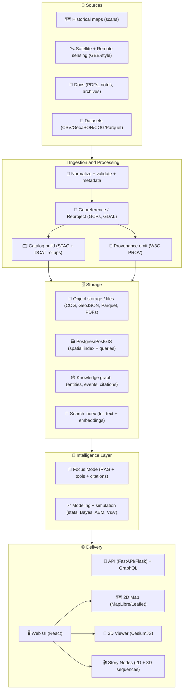

# Kansas Frontier Matrix (KFM) 🧭🗺️  
**An open-source geospatial + knowledge + modeling hub for Kansas** 🌾  
Built to fuse **historical mapping**, **remote sensing**, **GIS**, **simulation**, and **AI-assisted research workflows** into one cohesive system.

<p align="left">
  <a href="https://github.com/bartytime4life/Kansas-Frontier-Matrix/actions/workflows/ci.yml"></a>
  <a href="https://github.com/bartytime4life/Kansas-Frontier-Matrix/actions/workflows/codeql.yml"></a>
  <a href="https://github.com/bartytime4life/Kansas-Frontier-Matrix/issues"></a>
  <a href="#contributing-"></a>
  <a href="#license-"></a>
  
  
  
  
  
  
  
</p>

> [!NOTE]
> **New here?** Start with:
> - 🤝 **Collaboration & automation hub:** [`./.github/README.md`](./.github/README.md)  
> - 🧱 **Architecture docs:** [`./docs/architecture/`](./docs/architecture/)  
> - 🗺️ **Data conventions:** see **Data standards & conventions** below  
> - 🧭 **Story Nodes:** see **Story Nodes** below  
> - 🛣️ **Roadmap:** see **Roadmap** below  

---

<a id="toc"></a>

## Table of contents 📌
- [Quick links](#quick-links-)
- [KFM in 60 seconds](#kfm-in-60-seconds-)
- [What KFM is](#what-kfm-is-)
- [Modes](#modes-)
- [Core principles and north stars](#core-principles-and-north-stars-)
- [Architecture at a glance](#architecture-at-a-glance-)
- [Repository map](#repository-map-target-shape-)
- [Quickstart](#quickstart-)
- [Data standards and conventions](#data-standards-and-conventions-)
- [Catalog QA quick gate](#catalog-qa-quick-gate-)
- [Story Nodes](#story-nodes-)
- [Pipelines and data products](#pipelines-and-data-products-)
- [Modeling and analytics](#modeling-and-analytics-)
- [Interoperability and APIs](#interoperability-and-apis-)
- [Governance and ethics](#governance-and-ethics-)
- [Contributing](#contributing-)
- [Roadmap](#roadmap-starter-)
- [Project reference library](#project-reference-library-pdfs-and-influence-map-)
- [License](#license-)

---

<a id="quick-links"></a>

## Quick links 🔗

| Action | Link |
|---|---|
| 🐛 Report a bug | <https://github.com/bartytime4life/Kansas-Frontier-Matrix/issues/new?template=bug_report.yml> |
| ✨ Request a feature | <https://github.com/bartytime4life/Kansas-Frontier-Matrix/issues/new?template=feature_request.yml> |
| 🗺️ Request a data layer or source | <https://github.com/bartytime4life/Kansas-Frontier-Matrix/issues/new?template=data_layer_request.yml> |
| ❓ Ask a question | <https://github.com/bartytime4life/Kansas-Frontier-Matrix/issues/new?template=question.yml> |
| 🧪 CI runs | <https://github.com/bartytime4life/Kansas-Frontier-Matrix/actions> |
| 🧩 Collaboration rules and labels | [`./.github/README.md`](./.github/README.md) |
| 🔐 Security policy | [`./.github/SECURITY.md`](./.github/SECURITY.md) *(add if missing)* |

> [!TIP]
> If a template link 404s, use the chooser: <https://github.com/bartytime4life/Kansas-Frontier-Matrix/issues/new/choose>

---

<a id="kfm-in-60-seconds"></a>

## KFM in 60 seconds ⚡

KFM is a **Kansas-scale spatial workbench** that treats *maps + documents + time + modeling outputs* as first-class, versioned, and provable artifacts.

**You can use KFM to:**
- 🗺️ Georeference historical scans into time-aware map layers  
- 🛰️ Generate remote-sensing layers and publish them with metadata  
- 🧾 Connect documents ↔ places ↔ time (with citations and traceability)  
- 🧠 Run “Focus Mode” summaries that link back to evidence  
- 📈 Produce reproducible analyses and simulations with stored artifacts  
- 🎬 Publish Story Nodes that guide people through Kansas history in 2D and 3D  

---

<a id="what-kfm-is"></a>

## What KFM is 🧭

KFM is a **“spatial truth + provenance + modeling” hub** for Kansas.

It’s designed to:
- 🗂️ keep a **catalog-first** view of all data (layers, documents, runs, outputs)
- 🧾 record **how** a layer was made (sources → transforms → assets)
- 🔎 make datasets **searchable, mappable, and auditable**
- 🧪 support analysis from **EDA → regression → Bayesian → simulation**
- 🌐 deliver results through a **map UI + timeline + Story Nodes**

> 🎯 **Goal:** Make Kansas-scale spatial truth **searchable**, **mappable**, **auditable**, and **modelable** — from archival scans to satellite-derived datasets.

---

<a id="modes"></a>

## Modes 🎛️

KFM is intentionally multi-modal so different audiences can use the same “truth layer” without needing the same tooling background.

| Mode | What it feels like | What it’s for |
|---|---|---|
| 🗺️ Explore Mode | Layer browser + map + timeline | Browse datasets, overlays, inspect features |
| 🎬 Story Mode | Guided narrative + map steps | Teaching, public storytelling, curated tours |
| 📊 Analysis Mode | Dashboards + charts + downloads | Evidence distillation, decision support |
| 🧠 Focus Mode | Evidence-backed summaries + citations | “Explain this place/layer/event” with traceability |
| 🧊 3D Story Mode | Smooth 2D → 3D transitions | Terrain context, corridors, uncertainty volumes, digital-twin style views |

> [!IMPORTANT]
> **Story and analysis do not replace exploration** — they sit on top of the same catalog and provenance chain.

---

<a id="core-principles-and-north-stars"></a>

## Core principles and north stars ⭐
- 🧾 **Provenance-first:** every layer has sources, transform history, and license notes.
- 🔎 **Searchable and mappable:** “find it” and “see it” are first-class features.
- 🧠 **Citations over vibes:** outputs point back to evidence.
- 🧱 **Clean boundaries:** domain logic ≠ infrastructure ≠ UI.
- 🧪 **Reproducible by default:** scripts and notebooks run the same on any machine.
- 🧭 **Standards-forward:** STAC, DCAT, PROV, GeoJSON, COG, OGC patterns when possible.
- ❤️ **Human-centered governance:** systems support decisions; they don’t replace accountability.

---

<a id="architecture-at-a-glance"></a>

## Architecture at a glance 🧱



---

<a id="repository-map-target-shape"></a>

## Repository map target shape 🗂️

> [!NOTE]
> If your repo already has a structure, keep it — this is a **target shape** for clarity and onboarding. 🧭

```text
Kansas-Frontier-Matrix/
├─ 📁 .github/                       # 🤝 Collaboration + CI/CD (see .github/README.md)
├─ 📁 api/                           # 🧩 Python API (FastAPI/Flask) + services
│  ├─ 📁 app/
│  ├─ 📁 domain/
│  ├─ 📁 services/
│  ├─ 📁 adapters/
│  └─ 📁 infrastructure/
├─ 📁 web/                           # 🌐 Front-end (React)
│  ├─ 📁 src/
│  ├─ 📁 viewers/                    # 🗺️ maplibre + 🧊 cesium bootstraps
│  ├─ 📁 story_nodes/                # 🎬 narrative-driven map steps (2D/3D)
│  └─ 📁 public/
├─ 📁 data/                          # 🗃️ Curated datasets + manifests
│  ├─ 📁 sources/                    # 🧾 external dataset manifests (URLs, license, access notes)
│  ├─ 📁 raw/
│  ├─ 📁 processed/
│  ├─ 📁 catalog/                    # 🗂️ STAC catalogs/collections/items
│  └─ 📁 provenance/                 # 🧾 PROV JSON-LD or similar
├─ 📁 pipelines/                     # 🛰️ ETL jobs and runners (batch-first, reproducible)
├─ 📁 tools/
│  └─ 📁 validation/
│     └─ 📁 catalog_qa/              # ✅ fast STAC/DCAT gate before heavier checks
├─ 📁 scripts/                       # 🧰 CLI utilities (ingest, validate, export)
├─ 📁 notebooks/                     # 🧪 Research notebooks (EDA, experiments)
├─ 📁 mcp/                           # 🧠 SOPs + governance + “how we work”
├─ 📁 docs/                          # 📚 Docs & diagrams
│  ├─ 📁 architecture/
│  ├─ 📁 specs/
│  ├─ 📁 library/                    # 🎒 Reference PDFs (licensed separately)
│  └─ 📁 story_nodes/                # 🎬 Story Node specs + templates
├─ 🧪 tests/
├─ 🐳 docker-compose.yml
├─ 🧾 .env.example
└─ 📘 README.md
```

---

<a id="quickstart"></a>

## Quickstart 🚀

### Option A — Docker recommended 🐳
```bash
# 1) Clone
git clone https://github.com/bartytime4life/Kansas-Frontier-Matrix.git
cd Kansas-Frontier-Matrix

# 2) Configure environment
cp .env.example .env

# 3) Run
docker compose up --build
```

### Option B — Local dev Python + Node 💻
> [!TIP]
> If this repo has per-service docs, prefer those:
> - `api/README.md` (backend)
> - `web/README.md` (frontend)

```bash
# Python backend
python -m venv .venv
source .venv/bin/activate
pip install -r api/requirements.txt

# Start command depends on the API framework used:
# - FastAPI: uvicorn api.app.main:app --reload
# - Flask:   flask --app api.app run --debug

# Web frontend
cd web
npm install
npm run dev
```

✅ Typical local endpoints:
- `http://localhost:8000` → API  
- `http://localhost:5173` → Web UI  

---

<a id="data-standards-and-conventions"></a>

## Data standards and conventions 🗺️🧾

KFM stays scalable by being boring in the right places.

### Formats
- 🧭 **Vector:** GeoJSON (preferred for transport), GeoPackage/Shapefile accepted for ingest
- 🧊 **Raster:** Cloud-Optimized GeoTIFF (**COG**) preferred for web streaming
- 🧪 **Tables:** Parquet preferred for timeseries and analytics; CSV accepted for ingest
- 🗂️ **Catalog:** STAC catalogs/collections/items plus DCAT rollups for data portals
- 🧾 **Lineage:** W3C PROV records per run and per derived asset

### Coordinate and projection rules
- Store original CRS **and** publish normalized web-map derivatives when needed  
- For rasters, map projection metadata into STAC **Projection extension** fields (`proj:*`) where possible  
- Keep Kansas bbox and validity checks in CI for anything claiming to be “Kansas-wide”  

### Required provenance for any data PR
- Source name + reference (URL or archive id)
- License/terms (or “unknown” with rationale)
- Spatial reference (EPSG) and units
- Time coverage (single year, range, or “undated”)
- Processing steps (georef point count, simplification, resampling, etc.)
- Checksums + version stamp (recommended)

> [!WARNING]
> If we can’t explain where the data came from and how it was processed, we can’t trust it — and it won’t ship. 🧱🗺️

### Minimal STAC-like manifest example
```json
{
  "id": "kfm.ks.railroads.1870_1910.v1",
  "title": "Kansas Railroads (1870–1910)",
  "type": "vector",
  "format": "geojson",
  "bbox": [-102.05, 36.99, -94.59, 40.00],
  "time_range": {"start": "1870-01-01", "end": "1910-12-31"},
  "crs": "EPSG:4326",
  "provenance": {
    "sources": [
      {"label": "Kansas Historical Society", "ref": "KHS:<id-or-url>", "accessed": "<YYYY-MM-DD>"}
    ],
    "license": "TBD",
    "attribution": "TBD"
  },
  "transforms": [
    {"step": "georeference", "tool": "gdalwarp", "date": "<YYYY-MM-DD>", "by": "<github-handle>"}
  ],
  "assets": {
    "data": {"href": "data/processed/railroads_1870_1910.geojson", "sha256": "<checksum>"}
  }
}
```

---

<a id="catalog-qa-quick-gate"></a>

## Catalog QA quick gate ✅

A recurring failure mode in geospatial catalogs is simple stuff:
- missing `license` or `providers`
- missing `stac_extensions`
- broken top-level links that derail federation and indexing

So KFM includes a fast **Catalog QA** check you can run locally and in CI.

```bash
python3 tools/validation/catalog_qa/run_catalog_qa.py \
  --root data/ \
  --glob "**/collection.json" \
  --fail-on-warn
```

**What it checks**
- required keys present and shaped correctly
- top-level STAC links are reachable (HEAD/GET)

> [!TIP]
> This is meant to be a **quick gate** before heavier schema validation and deeper geospatial QA.

---

<a id="story-nodes"></a>

## Story Nodes 🎬

Story Nodes are how KFM becomes a **living atlas** instead of “just another GIS repo.”

A Story Node is a small, machine-ingestible narrative unit that can:
- 🧭 define *what the user should see* (layers, map bounds, time range)
- 🧾 attach citations and evidence
- 🧠 link to knowledge-graph entities
- 🎛️ drive UI transitions, including 2D → 3D sequences

### Story Node folder shape
```text
web/story_nodes/
└─ kansas_from_above/
   ├─ config.json         # camera steps, layer fades, timings
   ├─ narrative.md        # human-readable story (with citations)
   └─ assets/             # optional local images / tiles / media
```

### Story Node conventions
- ✅ Separate **facts** from **interpretation**
- ✅ Keep citations close to the claim
- ✅ Tag entities and places so the graph can index them
- ✅ Prefer reproducible assets (tiles, COGs, GeoJSON) over screenshots

### 3D Story Nodes
KFM supports a hybrid approach where:
- MapLibre remains the primary 2D UI model
- CesiumJS becomes a Story Node mode, not a replacement
- Story Nodes orchestrate the transition (camera lock, fades, engine switch)

> [!NOTE]
> The first recommended demo Story Node is **“Kansas From Above”** — a proof-of-capability artifact to justify 3D support without a giant re-architecture.

---

<a id="pipelines-and-data-products"></a>

## Pipelines and data products 🛰️🧰

KFM pipelines are batch-first, deterministic, and provenance-emitting.

### Pipeline types
- 🗺️ **Historical map pipeline**  
  Scan → metadata → georef → COG → STAC item → DCAT rollup → map overlay

- 🛰️ **Remote sensing pipeline**  
  GEE-style job → output raster/vector → catalog entry → QA → publish

- 🌊 **Timeseries pipeline**  
  Fetch station data → normalize → Parquet → STAC assets → provenance → dashboards

### Pipeline contract
Every pipeline should:
- declare inputs and outputs explicitly
- emit provenance per run
- update catalog artifacts as a first-class deliverable
- fail fast on schema and Kansas-bounds validation

> [!TIP]
> When adding a new pipeline, start by writing the catalog shape first, then implement the transform.

---

<a id="modeling-and-analytics"></a>

## Modeling and analytics 🧠📈

KFM is not just a map viewer — it’s a **modeling workbench**.

### What belongs here
- 📈 **Statistics and regression:** trend modeling, uncertainty, bias checks, reproducible inference
- 🎲 **Bayesian workflows:** posterior reasoning, uncertainty propagation, decision support
- 🧠 **ML and deep learning:** classification, change detection, feature extraction when appropriate
- 🛰️ **Remote sensing analytics:** indices, time-series, land cover transitions
- 🧪 **Simulation:** scenario testing, sensitivity analysis, verification and validation discipline

### Modeling hygiene checklist
- ✅ Define objective + assumptions
- ✅ Version the dataset + manifest
- ✅ Track train/test splits + seeds
- ✅ Report uncertainty + sensitivity
- ✅ Store artifacts (plots, metrics, model cards)
- ✅ Tie outputs back to sources and citations

---

<a id="interoperability-and-apis"></a>

## Interoperability and APIs 🔌

KFM is designed to be a platform, not a silo:
- 🧩 REST API with clear contracts (OpenAPI)
- 🕸️ GraphQL for graph-shaped queries when useful
- 🗂️ STAC catalogs for geospatial interoperability
- 🧾 DCAT rollups for data-portal federation
- 🧱 CORS-enabled endpoints for embedding in external sites

> [!TIP]
> Treat the API as part of the governance: schema-first, versioned, backwards compatible.

---

<a id="governance-and-ethics"></a>

## Governance and ethics ❤️🧭

KFM’s north star is public knowledge with responsible handling.

### What we protect
- culturally sensitive locations and vulnerable sites
- personally identifying information in any modern datasets
- narrative integrity and provenance clarity

### Expected behaviors
- 🧾 Prefer citing primary sources and stable references
- 🧠 Label AI-generated outputs and keep them evidence-backed
- 🔒 Use generalization or redaction for sensitive geometry
- 🧪 Ship reproducible work products, not vibes

> [!IMPORTANT]
> “Open” does not mean “careless.” KFM aims to align with FAIR + CARE thinking wherever applicable.

---

<a id="contributing"></a>

## Contributing 🤝

We welcome contributions that improve:
- 🧾 data provenance, ingest tooling, validation
- 🗺️ mapping UX and performance
- 🎬 Story Nodes and educational walkthroughs
- 🧠 Focus Mode reliability and citations
- 📈 modeling modules and reproducibility
- 📚 documentation and tutorials

**Start here →** [`./.github/README.md`](./.github/README.md) ✅

Suggested workflow:
1. 🍴 Fork or branch  
2. ✅ Add tests where applicable  
3. 🧹 Format + lint  
4. 📣 Open a PR with a short “why” + screenshots for UI changes

### Data contribution checklist
- [ ] Dataset has a manifest + license + source reference
- [ ] Transform history documented with scripts or commands
- [ ] CRS is explicit
- [ ] BBox and time range present when applicable
- [ ] Sensitive fields reviewed and redacted when needed
- [ ] Catalog QA passes

---

<a id="roadmap-starter"></a>

## Roadmap starter 🛣️
- [ ] 🗂️ Dataset manifest schema + validator CLI  
- [ ] ✅ Catalog QA quick gate in CI  
- [ ] 🛰️ Remote sensing pipeline templates and publish flow  
- [ ] 🧾 Document KB ingestion with citations and metadata  
- [ ] 🎬 Story Node template pack and authoring guide  
- [ ] 🧊 3D Story Node demo “Kansas From Above”  
- [ ] 🗺️ Map + timeline MVP layer browser + feature inspect  
- [ ] 📈 Modeling notebooks for regression, Bayesian, simulation examples  
- [ ] 🔐 Auth + roles for public vs collaborators vs admin  
- [ ] 📦 Reproducible releases with versioned catalogs + changelogs  

---

<a id="project-reference-library-pdfs-and-influence-map-"></a>

## Project reference library PDFs and influence map 📚🎒
> This repo is backed by a curated multidisciplinary reading pack that shapes architecture, modeling rigor, GIS workflows, and UI/infra decisions.  
> ⚠️ Reference materials may have different licenses than the repository code. Keep them in `docs/library/` and respect upstream terms.

<details>
<summary><strong>📦 Expand: Reference PDFs by domain</strong></summary>

### 🧭 Core KFM docs
- `docs/specs/Kansas Frontier Matrix (KFM) – Comprehensive Engineering Design.docx`
- `docs/specs/Latest Ideas.docx`

### 🗺️ GIS, geoprocessing, cartography
- `docs/library/python-geospatial-analysis-cookbook.pdf`
- `docs/library/making-maps-a-visual-guide-to-map-design-for-gis.pdf`
- `docs/library/PostgreSQL Notes for Professionals - PostgreSQLNotesForProfessionals.pdf`

### 🛰️ Remote sensing and Earth Engine
- `docs/library/Cloud-Based Remote Sensing with Google Earth Engine-Fundamentals and Applications.pdf`

### 🌐 Web and graphics and 3D
- `docs/library/responsive-web-design-with-html5-and-css3.pdf`
- `docs/library/webgl-programming-guide-interactive-3d-graphics-programming-with-webgl.pdf`

### 📈 Statistics and experiments and modeling discipline
- `docs/library/Understanding Statistics & Experimental Design.pdf`
- `docs/library/regression-analysis-with-python.pdf`
- `docs/library/graphical-data-analysis-with-r.pdf`

### 🧪 Simulation and optimization and advanced math
- `docs/library/Scientific Modeling and Simulation_ A Comprehensive NASA-Grade Guide.pdf`
- `docs/library/Generalized Topology Optimization for Structural Design.pdf`
- `docs/library/Spectral Geometry of Graphs.pdf`

### ❤️ Ethics and philosophy
- `docs/library/Introduction to Digital Humanism.pdf`
- `docs/library/Principles of Biological Autonomy - book_9780262381833.pdf`

</details>

---

<a id="license"></a>

## License 🧾
**MIT** for code, unless otherwise noted.

> [!IMPORTANT]
> 🗃️ **Data note:** datasets, scans, and third‑party documents can have different licenses and attribution than the code. Track this in manifests and metadata.

---

## Acknowledgements 🙌🌾
Built by combining **geospatial engineering**, **data science rigor**, **systems design**, and **human-centered governance** into a cohesive platform for Kansas-scale exploration and decision support.
