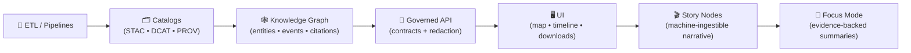
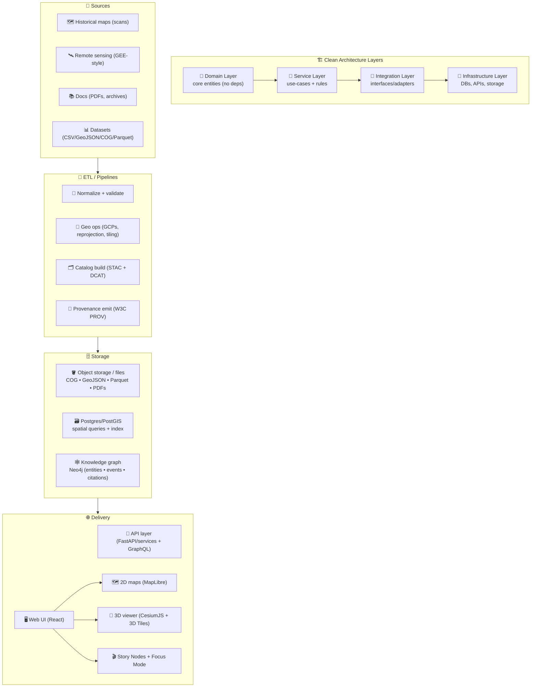
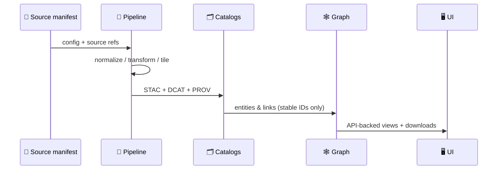

# Kansas Frontier Matrix (KFM) 🧭🌾🗺️  
**An open-source geospatial + knowledge + modeling hub for Kansas** — built for **maps + documents + time + models** with **provenance-first guardrails**.

<div align="left">

<a href="https://github.com/bartytime4life/Kansas-Frontier-Matrix/actions/workflows/ci.yml"></a>
<a href="https://github.com/bartytime4life/Kansas-Frontier-Matrix/actions/workflows/codeql.yml"></a>
<a href="https://github.com/bartytime4life/Kansas-Frontier-Matrix/issues"></a>
<a href="#contributing-"></a>
<a href="#license-"></a>


</div>

> [!NOTE]
> **New here?** Start with these *canonical* docs (and please keep them up to date):  
> - 📘 **Master Guide (v13):** `docs/MASTER_GUIDE_v13.md` *(source doc: `docs/specs/MARKDOWN_GUIDE_v13.md.gdoc` or exported `.md`)*  
> - 📚 **Comprehensive technical doc:** `docs/specs/Kansas Frontier Matrix (KFM) – Comprehensive Technical Documentation.docx`  
> - 🧭 **Design audit (gaps + opportunities):** `docs/specs/Kansas-Frontier-Matrix Design Audit – Gaps and Enhancement Opportunities.pdf`  
> - 🧪 **MCP protocols (research + documentation discipline):** `docs/specs/Scientific Method _ Research _ Master Coder Protocol Documentation.pdf`  
> - 🧱 **Architecture blueprints:** `docs/architecture/`  
> - 🧾 **Governance & ethics:** `docs/governance/`  
> - 🤝 **Collaboration rules & labels:** `/.github/README.md`  
> - 🔐 **Security policy:** `/.github/SECURITY.md` *(add if missing)*

---

## Table of contents 📌
- [Quick links](#quick-links-)
- [KFM in 60 seconds](#kfm-in-60-seconds-)
- [What KFM is](#what-kfm-is-)
- [The non-negotiable pipeline](#the-non-negotiable-pipeline-)
- [KFM artifacts](#kfm-artifacts-)
- [Modes](#modes-)
- [Architecture at a glance](#architecture-at-a-glance-)
- [Repository map](#repository-map-)
- [Quickstart](#quickstart-)
- [Core workflows](#core-workflows-)
- [Data standards](#data-standards-)
- [Catalog QA quick gate](#catalog-qa-quick-gate-)
- [Story Nodes and Focus Mode](#story-nodes-and-focus-mode-)
- [Modeling and analytics](#modeling-and-analytics-)
- [Scalability and performance](#scalability-and-performance-)
- [Security and privacy](#security-and-privacy-)
- [Governance and ethics](#governance-and-ethics-)
- [Contributing](#contributing-)
- [Roadmap](#roadmap-)
- [Project reference library](#project-reference-library-)
- [License](#license-)

---

## Quick links 🔗

| Action | Link |
|---|---|
| 🐛 Report a bug | <https://github.com/bartytime4life/Kansas-Frontier-Matrix/issues/new?template=bug_report.yml> |
| ✨ Request a feature | <https://github.com/bartytime4life/Kansas-Frontier-Matrix/issues/new?template=feature_request.yml> |
| 🗺️ Request a data layer or source | <https://github.com/bartytime4life/Kansas-Frontier-Matrix/issues/new?template=data_layer_request.yml> |
| ❓ Ask a question | <https://github.com/bartytime4life/Kansas-Frontier-Matrix/issues/new?template=question.yml> |
| 🧪 CI runs | <https://github.com/bartytime4life/Kansas-Frontier-Matrix/actions> |
| 🔐 Private security reporting | `Security` tab → “Report a vulnerability” *(preferred)* |

> [!TIP]
> If a template link 404s, use the chooser: <https://github.com/bartytime4life/Kansas-Frontier-Matrix/issues/new/choose>

---

## KFM in 60 seconds ⚡

KFM is a **Kansas-scale spatial workbench** that treats:

✅ **datasets** (vector/raster/tables)  
✅ **documents** (PDFs, scans, archives)  
✅ **time** (timelines, time ranges, event sequences)  
✅ **model outputs** (plots, metrics, simulations)  

…as **first-class, versioned, auditable artifacts**. 🧾

**You can use KFM to:**
- 🗺️ Georeference historical scans into **time-aware** map layers  
- 🛰️ Generate remote-sensing layers (Earth Engine-style workflows) and publish them with metadata  
- 🧾 Connect documents ↔ places ↔ time (with citations + traceability)  
- 🎬 Publish **Story Nodes** that guide people through Kansas history in 2D + 3D  
- 📈 Run reproducible analytics (EDA → regression → Bayesian → simulation) with stored artifacts  
- 🧠 Run **Focus Mode** summaries that link back to evidence, not vibes  

---

## What KFM is 🧭

KFM is a **“spatial truth + provenance + modeling” hub** for Kansas — a **living atlas** that can grow without losing trust.

KFM is designed to:
- 🗂️ keep a **catalog-first** view of assets (layers, docs, runs, outputs)  
- 🧾 record **how** an asset was made (sources → transforms → published artifacts)  
- 🔎 make datasets **searchable, mappable, and auditable**  
- 🧪 support analysis from **EDA → inference → simulation**  
- 🌐 deliver results through a **map UI + timeline + Story Nodes**  

### What KFM is NOT 🚫
- ❌ “Just a map viewer” (KFM is pipeline + provenance + publishing discipline)  
- ❌ “A data dump” (datasets ship only when discoverable and validated)  
- ❌ “Autonomous AI” (Focus Mode is advisory, evidence-backed, human-controlled)  

---

## The non-negotiable pipeline 🚦

> [!IMPORTANT]
> **Pipeline ordering is absolute**. Nothing may bypass earlier stages:
>
> **ETL → STAC/DCAT/PROV catalogs → Knowledge graph → Governed APIs → UI → Story Nodes → Focus Mode**



### Why this matters 🧠
- **Catalogs** prevent “mystery layers” and make federation/indexing possible  
- **PROV lineage** preserves “how it was made” (auditability)  
- **Graph** enables cross-linking (docs ↔ places ↔ events ↔ datasets)  
- **API boundary** enforces governance (no UI direct-to-graph shortcuts)  
- **Narratives** become *traceable artifacts*, not “hand-wavy storytelling”  

---

## KFM artifacts 🧾📦

KFM ships “things” as a small set of governed artifact types:

| Artifact | What it is | Where it lives (typical) | Gate(s) |
|---|---|---|---|
| 🧾 **Source manifest** | What we used + license + access notes | `data/sources/**` | schema + license required |
| 🧼 **Processed data** | Ready-to-use geo/tabular assets | `data/processed/**` | geo validation + bounds |
| 🗂️ **STAC** | spatial asset metadata | `data/catalog/stac/**` | STAC schema + links |
| 🗃️ **DCAT** | dataset/distribution discovery | `data/catalog/dcat/**` | DCAT schema + links |
| 🧬 **PROV** | lineage (inputs → transforms → outputs) | `data/prov/**` | required for promotion |
| 🕸️ **Graph bundle** | entity/event/citation graph ingest | `data/graph/**` or `src/graph/**` | ID stability + constraints |
| 📜 **API contract** | OpenAPI/GraphQL specs | `src/server/contracts/**` | contract-first review |
| 🎬 **Story Node** | narrative + map steps + citations | `docs/reports/story_nodes/**` + `web/story_nodes/**` | citations hard gate |
| 🧪 **Evidence artifact** | analysis output treated like data | `mcp/**` + catalogs | reproducibility + PROV |

> [!TIP]
> Use templates (v13) to keep artifacts consistent:
> - `docs/templates/TEMPLATE__KFM_UNIVERSAL_DOC.md`  
> - `docs/templates/TEMPLATE__STORY_NODE_V3.md`  
> - `docs/templates/TEMPLATE__API_CONTRACT_EXTENSION.md`

---

## Modes 🎛️

KFM is intentionally multi-modal so different audiences can use the same “truth layer” without needing the same tooling background.

| Mode | What it feels like | What it’s for |
|---|---|---|
| 🗺️ Explore Mode | Layer browser + map + timeline | Browse datasets, overlays, inspect features |
| 🎬 Story Mode | Guided narrative + map steps | Teaching, public storytelling, curated tours |
| 📊 Analysis Mode | Charts + downloads + notebooks | Evidence distillation, decision support |
| 🧠 Focus Mode | Evidence-backed summaries + citations | “Explain this place/layer/event” with traceability |
| 🧊 3D Story Mode | Smooth 2D → 3D transitions | Terrain context, corridors, uncertainty volumes |

---

## Architecture at a glance 🧱

KFM keeps a clean separation of concerns: **UI ↔ API ↔ pipeline workers ↔ storage**, alongside a **knowledge graph** for “documents ↔ places ↔ time” linking.



---

## Repository map 🗂️

> [!NOTE]
> Repos evolve. This is a **v13-aligned target map** for clarity, onboarding, and preventing drift.  
> If your repo still uses legacy folders (e.g. `api/`, `pipelines/`), keep shipping — but migrate toward the single-home layout.

### Target shape (v13) 🎯
```text
Kansas-Frontier-Matrix/
├─ 📁 .github/                          # 🤝 Collaboration + CI/CD
├─ 📁 docs/
│  ├─ 📁 architecture/                  # 🧱 blueprints, ADRs, diagrams
│  ├─ 📁 governance/                    # ⚖️ FAIR/CARE, ethics, sovereignty
│  ├─ 📁 templates/                     # 🧾 governed templates (docs, story nodes, API)
│  ├─ 📁 reports/
│  │  ├─ 📁 story_nodes/
│  │  │  ├─ 📁 draft/                   # 📝 WIP stories
│  │  │  └─ 📁 published/               # ✅ reviewed stories
│  │  └─ 📁 analyses/                   # 📈 exported reports + artifacts
│  ├─ 📁 specs/                         # 📚 master docs (design, audit, protocols)
│  └─ 📄 glossary.md                    # 📖 shared terms (add if missing)
├─ 📁 schemas/                          # 🧩 JSON Schemas (STAC/DCAT/PROV/story nodes/contracts)
├─ 📁 data/
│  ├─ 📁 sources/                       # 🧾 source manifests (URLs, license, access notes)
│  ├─ 📁 raw/                           # 📥 immutable raw inputs
│  ├─ 📁 work/                          # 🧪 staging area (scratch / intermediate)
│  ├─ 📁 processed/                     # 🗄️ official derived assets (versioned)
│  ├─ 📁 catalog/
│  │  ├─ 📁 stac/                       # 🗂️ STAC catalogs/collections/items
│  │  └─ 📁 dcat/                       # 🗃️ DCAT rollups (datasets/distributions)
│  ├─ 📁 prov/                          # 🧬 provenance JSON-LD (per run / per asset)
│  └─ 📁 graph/                         # 🕸️ graph bundles (optional export/import)
├─ 📁 src/
│  ├─ 📁 pipelines/                     # 🛰️ ETL jobs & runners (deterministic)
│  ├─ 📁 graph/                         # 🕸️ ontology bindings + ingest scripts + constraints
│  └─ 📁 server/                        # 🔌 API boundary (contracts + implementations)
├─ 📁 web/                              # 🖥️ Frontend (React)
│  ├─ 📁 viewers/                       # 🗺️ MapLibre + 🧊 Cesium integration
│  └─ 📁 story_nodes/                   # 🎬 UI packaging for Story Nodes
├─ 📁 mcp/                              # 🧪 Methods & Computational Experiments (runs, model cards)
├─ 🧪 tests/                            # ✅ unit + integration tests
├─ 🐳 docker-compose.yml
├─ 🧾 .env.example
└─ 📘 README.md
```

---

## Quickstart 🚀

### Option A — Docker recommended 🐳
```bash
# 1) Clone
git clone https://github.com/bartytime4life/Kansas-Frontier-Matrix.git
cd Kansas-Frontier-Matrix

# 2) Configure environment
cp .env.example .env

# 3) Run
docker compose up --build
```

### Option B — Local dev Python + Node 💻
> [!TIP]
> If this repo has per-service docs, prefer those:
> - `src/server/README.md` or `api/README.md` (backend)
> - `web/README.md` (frontend)

```bash
# Python backend
python -m venv .venv
source .venv/bin/activate
pip install -r api/requirements.txt  # or src/server/requirements.txt (depending on repo layout)

# Start command depends on the framework used:
# - FastAPI: uvicorn api.app.main:app --reload
# - Flask:   flask --app api.app run --debug

# Web frontend
cd web
npm install
npm run dev
```

✅ Typical local endpoints:
- `http://localhost:8000` → API  
- `http://localhost:5173` → Web UI  

---

## Core workflows 🧰

These workflows mirror KFM’s “contracts-first, evidence-first” discipline.

### 1) Add a new dataset layer 🗺️
**Definition of Done (DoD):**
- ✅ Source manifest created (`data/sources/...`) with license + attribution  
- ✅ Deterministic pipeline step produces processed asset(s)  
- ✅ STAC Item/Collection created + DCAT rollup updated  
- ✅ PROV lineage emitted (inputs → transforms → outputs)  
- ✅ QA passes (catalog gate + geo/links/bounds)  
- ✅ Optional: Story Node or Docs updated (recommended)



### 2) Add a pipeline step 🛰️
- ✅ deterministic + config-driven (same input → same output)  
- ✅ emits PROV with parameters + tool versions  
- ✅ writes to `data/work/` until validation passes  
- ✅ publishes atomically into `data/processed/` + catalogs

### 3) Add a Story Node 🎬
A Story Node is a small narrative unit that can:
- 🧭 define view state (layers, bounds, time range)  
- 🧾 attach citations + evidence  
- 🕸️ link to knowledge-graph entities  
- 🎛️ orchestrate UI transitions, including 2D → 3D sequences  

**Hard gates**
- ✅ Provenance for every claim (citations to cataloged sources)  
- ✅ Fact vs interpretation is explicit  
- ✅ Graph entity references use stable IDs  
- ✅ Sensitive-location rules are honored (mask/jitter/generalize)

### 4) Add an evidence artifact (analysis/model output) 🧪
Treat analysis output like “data with lineage,” not screenshots in a PR:
- ✅ save artifacts in `mcp/` (plots, metrics, notebooks, model cards)  
- ✅ register them in STAC/DCAT + PROV  
- ✅ link them into stories only after registration

### 5) Add an API endpoint/service 🔌
- ✅ define contract (OpenAPI/GraphQL) before implementation  
- ✅ tests + versioning strategy (avoid breaking changes)  
- ✅ redaction rules if data is sensitive  
- ✅ UI uses the API (no “direct graph” shortcuts)

### 6) Add a UI feature 🖥️
- ✅ layer UI links back to provenance (STAC/DCAT/PROV)  
- ✅ legends/popup show attribution + license  
- ✅ responsive + accessible patterns (mobile-first where possible)  
- ✅ honors governance gates (sensitive locations, consent, restricted data)

---

## Data standards 🗺️🧾

KFM stays scalable by being boring in the right places.

### Formats ✅
- 🧭 **Vector:** GeoJSON (preferred for transport), GeoPackage/Shapefile accepted for ingest  
- 🧊 **Raster:** Cloud-Optimized GeoTIFF (**COG**) preferred for web streaming  
- 🧪 **Tables:** Parquet preferred for analytics/time series; CSV accepted for ingest  
- 🗂️ **Catalog:** STAC catalogs/collections/items + DCAT rollups for portal/federation  
- 🧬 **Lineage:** W3C PROV records per run and per derived asset  

### Naming (recommended) 🏷️
Use stable, searchable IDs:
```text
kfm.<state>.<domain>.<layer>.<time>.<version>

# example
kfm.ks.transport.railroads.1870_1910.v1
```

### Coordinate and projection rules 🧭
- Preserve original CRS **and** publish web-ready derivatives when needed  
- Track CRS explicitly in metadata (don’t assume consumers “guess right”)  
- Kansas bounds check for any dataset claiming Kansas scope:
  - Reference bbox: `[-102.05, 36.99, -94.59, 40.00]`

### Scan ingestion rules (maps & archives) 🖼️
- Prefer **lossless** formats for masters  
- Use **lossy** derivatives only for previews/quicklooks  
- Record compression choices in provenance (it’s a scientific decision)

### Minimal STAC-like manifest example 🧾
```json
{
  "id": "kfm.ks.transport.railroads.1870_1910.v1",
  "title": "Kansas Railroads (1870–1910)",
  "type": "vector",
  "format": "geojson",
  "bbox": [-102.05, 36.99, -94.59, 40.00],
  "time_range": {"start": "1870-01-01", "end": "1910-12-31"},
  "crs": "EPSG:4326",
  "provenance": {
    "sources": [
      {"label": "Kansas Historical Society", "ref": "KHS:<id-or-url>", "accessed": "<YYYY-MM-DD>"}
    ],
    "license": "TBD",
    "attribution": "TBD"
  },
  "transforms": [
    {"step": "georeference", "tool": "gdalwarp", "date": "<YYYY-MM-DD>", "by": "<github-handle>"}
  ],
  "assets": {
    "data": {"href": "data/processed/railroads_1870_1910.geojson", "sha256": "<checksum>"}
  }
}
```

---

## Catalog QA quick gate ✅

A recurring failure mode in geospatial catalogs is simple stuff:
- missing `license` or `providers`
- missing `stac_extensions`
- broken top-level links that derail federation and indexing

Run locally (and in CI):

```bash
python3 tools/validation/catalog_qa/run_catalog_qa.py \
  --root data/ \
  --glob "**/collection.json" \
  --fail-on-warn
```

**What it checks**
- required keys present and shaped correctly  
- top-level STAC links are reachable (HEAD/GET)  

> [!TIP]
> This is a **quick gate** before heavier schema validation and deeper geospatial QA.

---

## Story Nodes and Focus Mode 🎬🧠

Story Nodes are how KFM becomes a **living atlas** instead of “just another GIS repo.”

### Story Node folder shape (UI package) 📦
```text
web/story_nodes/
└─ kansas_from_above/
   ├─ config.json         # camera steps, layer fades, timings
   ├─ narrative.md        # human-readable story (with citations)
   └─ assets/             # optional images / tiles / media
```

### Governed Story Node shape (reviewable) ✅
```text
docs/reports/story_nodes/
└─ published/
   └─ kansas_from_above/
      ├─ STORY_NODE.md     # template-based, citations hard gate
      ├─ config.json
      └─ assets/
```

### 3D Story Nodes 🧊
Recommended approach:
- MapLibre remains the primary 2D engine  
- CesiumJS becomes a Story Node mode (not a full UI replacement)  
- Story Nodes orchestrate the transition (camera lock, fades, engine switch)  

---

## Modeling and analytics 🧠📈

KFM is not just a map viewer — it’s a **modeling workbench**.

### What belongs here
- 📈 **Statistics and regression** (trend modeling, diagnostics, uncertainty)  
- 🎲 **Bayesian workflows** (priors/posteriors, credible intervals, decision support)  
- 🛰️ **Remote sensing analytics** (indices, reducers, time series, transitions)  
- 🧪 **Simulation & scenario testing** (V&V, UQ, sensitivity analysis, repeatable runs)

### Modeling hygiene checklist ✅
- ✅ define objective + assumptions  
- ✅ version datasets + manifests  
- ✅ track train/test splits + seeds  
- ✅ report uncertainty + sensitivity  
- ✅ store artifacts (plots, metrics, model cards)  
- ✅ tie outputs back to sources + provenance  

> [!CAUTION]
> Analytics work is vulnerable to “false certainty” without solid experimental design, replication discipline, and clear reporting.

---

## Scalability and performance ⚙️📦

KFM is built to grow from “a few layers” into **Kansas-scale** multi-modal spatiotemporal data.

### Practical scaling principles
- 🧱 separate cold storage from query indices (object storage ↔ PostGIS/graph indices)  
- 🧮 push computation to data where possible (cloud-style remote sensing workflows)  
- ♻️ prefer immutable, versioned artifacts (processed outputs + catalogs + lineage)  
- ⚡ optimize for interactive exploration (fast bbox/time queries, cached tiles, previews)

### Future-friendly extension points 🔭
- pattern queries over spatiotemporal streams (events/situations)  
- adaptive execution and compilation strategies  
- heterogeneous acceleration patterns (GPU/parallel pipelines)  
- visual analytics loops to tune parameters interactively (map-first debugging)

---

## Security and privacy 🛡️🔒

KFM is a public-knowledge project — but **not all spatial data should be public at full resolution**.

### Sensitive location policy 🧭
If a dataset contains sensitive locations (e.g., culturally sensitive sites, protected resources):
- generalize location precision (mask/jitter/grid indexing)  
- restrict access where required  
- do not publish exact coordinates unless explicitly allowed  

### Baseline security posture ✅
- 🔐 secrets never committed (use `.env`, CI secrets)  
- ✅ CodeQL + dependency scanning  
- 🧪 least-privilege access controls for admin tools  
- 🧾 auditability for published artifacts (what changed, when, and why)

> [!IMPORTANT]
> Security references in `docs/library/` exist to improve **defensive hardening**.  
> This repo does **not** accept contributions that add misuse-ready exploitation instructions.

---

## Governance and ethics ❤️🧭

KFM’s north star is public knowledge with responsible handling.

### Governance pillars
- **FAIR**-style discoverability for non-sensitive data (findable, accessible, interoperable, reusable)  
- **CARE**-aligned respect for community rights and narratives (especially Indigenous knowledge)  
- **Human-centered accountability** (systems support decisions; they don’t replace accountability)  

### Mapping is not neutral 🗺️⚖️
Maps and data practices are socially embedded; KFM prioritizes transparency, provenance, and respectful representation.

---

## Contributing 🤝

We welcome contributions that improve:
- 🧾 provenance, ingest tooling, validation  
- 🗺️ mapping UX and performance  
- 🎬 Story Nodes and educational walkthroughs  
- 🧠 Focus Mode reliability and citations  
- 📈 modeling modules and reproducibility  
- 📚 documentation and templates  

**Start here →** `/.github/README.md` ✅

### Contribution categories (v13 mindset) 🧩
| Category | Example change | What must be updated |
|---|---|---|
| (A) New data | new dataset/layer | manifests + STAC/DCAT + PROV + QA |
| (B) New pipeline | new ETL transform | deterministic config + provenance + tests |
| (C) New graph entity type | new ontology node | schema/IDs + ingestion rules + docs |
| (D) New API endpoint | new service route | OpenAPI/GraphQL contract + tests + redaction |
| (E) New UI feature | new overlay/story UI | provenance UI + accessibility + API usage |

---

## Roadmap 🛣️

### 🚀 Near-term (foundation you can build on)
- [ ] 🧩 `schemas/` for manifests + story nodes + contracts  
- [ ] ✅ Catalog QA quick gate wired into CI (fail-on-warn)  
- [ ] 🧾 PROV emission standard (per pipeline run)  
- [ ] 🗂️ STAC + DCAT publishing templates + examples  
- [ ] 🕸️ Graph schema + stable ID protocol (entities/events/citations)  
- [ ] 📖 `docs/glossary.md` + `docs/sops/` (real procedures, not placeholders)  
- [ ] 🧪 `mcp/` experiment log + model card template usage  

### 🎬 Product surface (MVP that feels real)
- [ ] 🗺️ Map + timeline MVP (layer browser + feature inspect)  
- [ ] 🎬 Story Node template pack + authoring guide  
- [ ] 🧊 3D Story Node demo “Kansas From Above”  
- [ ] 🧠 Focus Mode rules + citation enforcement (no unsourced summaries)

### 🌾 Design-audit inspired additions (high value)
- [ ] 🎙️ Oral histories + Indigenous narratives ingestion path *(with sovereignty gates)*  
- [ ] 🔥 Historic fire regimes + paleoclimate proxies + hydrology modeling hooks  
- [ ] 🧾 Treaty timeline: land transfers + context linked to sources  
- [ ] 📈 Modeling notebooks: regression / Bayesian / simulation examples with stored artifacts

---

## Project reference library 📚🎒

> [!WARNING]
> Reference PDFs may have **different licenses** than this repo. Keep them in `docs/library/` (or outside the repo) and respect upstream terms.

<details>
<summary><strong>🧠 Influence map (what each reference is “for”)</strong></summary>

| Subsystem | What it influences | References |
|---|---|---|
| 🧱 KFM system design | architecture, modules, workflows, repo structure | `docs/specs/Kansas Frontier Matrix (KFM) – Comprehensive Technical Documentation.docx` • `docs/specs/MARKDOWN_GUIDE_v13.md.gdoc` • `docs/specs/Kansas-Frontier-Matrix Design Audit – Gaps and Enhancement Opportunities.pdf` • `docs/specs/Scientific Method _ Research _ Master Coder Protocol Documentation.pdf` |
| 🗺️ GIS + spatial ops | PostGIS patterns, geometry ops, exporting, overlays | `docs/library/python-geospatial-analysis-cookbook.pdf` • `docs/library/PostgreSQL Notes for Professionals - PostgreSQLNotesForProfessionals.pdf` |
| 🛰️ Remote sensing | cloud workflows, reducers, time-series, export/publish | `docs/library/Cloud-Based Remote Sensing with Google Earth Engine-Fundamentals and Applications.pdf` |
| 🎨 Cartography + map design | hierarchy, labels, legends, visual discipline | `docs/library/making-maps-a-visual-guide-to-map-design-for-gis.pdf` • `docs/library/Mobile Mapping_ Space, Cartography and the Digital - 9789048535217.pdf` |
| 🧊 3D + graphics | WebGL fundamentals, rendering mental models | `docs/library/webgl-programming-guide-interactive-3d-graphics-programming-with-webgl.pdf` |
| 📱 Web UI | responsive layout + accessibility | `docs/library/responsive-web-design-with-html5-and-css3.pdf` |
| 🖼️ Raster formats | lossless vs lossy, web format tradeoffs | `docs/library/compressed-image-file-formats-jpeg-png-gif-xbm-bmp.pdf` |
| 📈 Stats + inference | regression, EDA, experimental design pitfalls | `docs/library/Understanding Statistics & Experimental Design.pdf` • `docs/library/regression-analysis-with-python.pdf` • `docs/library/Regression analysis using Python - slides-linear-regression.pdf` • `docs/library/graphical-data-analysis-with-r.pdf` |
| 🎲 Bayesian reasoning | priors/posteriors, credible intervals, uncertainty | `docs/library/think-bayes-bayesian-statistics-in-python.pdf` |
| 🧪 Simulation discipline | verification/validation, UQ, sensitivity analysis | `docs/library/Scientific Modeling and Simulation_ A Comprehensive NASA-Grade Guide.pdf` |
| 🤖 ML practice | practical ML workflows + theory | `docs/library/Deep Learning for Coders with fastai and PyTorch - Deep.Learning.for.Coders.with.fastai.and.PyTorch.pdf` • `docs/library/Understanding Machine Learning - From Theory to Algorithms.pdf` *(or bundled)* |
| ⚙️ Systems + scaling | concurrency, heterogeneous hardware, query compilation | `docs/library/Scalable Data Management for Future Hardware.pdf` • `docs/library/concurrent-real-time-and-distributed-programming-in-java-threads-rtsj-and-rmi.pdf` |
| 🧭 Interoperability | cross-org sharing, governance patterns | `docs/library/Data Spaces.pdf` |
| ❤️ Ethics + accountability | human-centered governance + autonomy framing | `docs/library/Introduction to Digital Humanism.pdf` • `docs/library/Principles of Biological Autonomy - book_9780262381833.pdf` • `docs/library/On the path to AI Law’s prophecies and the conceptual foundations of the machine learning age.pdf` |
| 🧮 Advanced math + optimization | graph theory + structural optimization primitives | `docs/library/Spectral Geometry of Graphs.pdf` • `docs/library/Generalized Topology Optimization for Structural Design.pdf` |
| 🔐 Privacy + data mining | disclosure control, auditing mindset | `docs/library/Data Mining Concepts & applictions.pdf` *(or bundled)* |
| 🛡️ Security (defense) | hardening mindset + countermeasures | `docs/library/ethical-hacking-and-countermeasures-secure-network-infrastructures.pdf` • `docs/library/Gray Hat Python - Python Programming for Hackers and Reverse Engineers (2009).pdf` |
| 🧰 General programming shelf | cross-language fundamentals | `docs/library/A programming Books.pdf` • `docs/library/B-C programming Books.pdf` • `docs/library/D-E programming Books.pdf` • `docs/library/F-H programming Books.pdf` • `docs/library/I-L programming Books.pdf` • `docs/library/M-N programming Books.pdf` • `docs/library/O-R programming Books.pdf` • `docs/library/S-T programming Books.pdf` • `docs/library/U-X programming Books.pdf` |

</details>

<details>
<summary><strong>📦 Reference PDFs by domain (full list)</strong></summary>

### 🧭 Canonical KFM docs
- `docs/specs/Kansas Frontier Matrix (KFM) – Comprehensive Technical Documentation.docx`  
- `docs/specs/MARKDOWN_GUIDE_v13.md.gdoc` *(export to `.md` for the repo)*  
- `docs/specs/Kansas-Frontier-Matrix Design Audit – Gaps and Enhancement Opportunities.pdf`  
- `docs/specs/Scientific Method _ Research _ Master Coder Protocol Documentation.pdf`  

### 🗺️ GIS, geoprocessing, cartography
- `docs/library/python-geospatial-analysis-cookbook.pdf`  
- `docs/library/PostgreSQL Notes for Professionals - PostgreSQLNotesForProfessionals.pdf`  
- `docs/library/making-maps-a-visual-guide-to-map-design-for-gis.pdf`  
- `docs/library/Mobile Mapping_ Space, Cartography and the Digital - 9789048535217.pdf`  
- `docs/library/compressed-image-file-formats-jpeg-png-gif-xbm-bmp.pdf`  

### 🛰️ Remote sensing and Earth Engine
- `docs/library/Cloud-Based Remote Sensing with Google Earth Engine-Fundamentals and Applications.pdf`  

### 🌐 Web and graphics and 3D
- `docs/library/responsive-web-design-with-html5-and-css3.pdf`  
- `docs/library/webgl-programming-guide-interactive-3d-graphics-programming-with-webgl.pdf`  

### 📈 Statistics, experiments, and modeling discipline
- `docs/library/Understanding Statistics & Experimental Design.pdf`  
- `docs/library/regression-analysis-with-python.pdf`  
- `docs/library/Regression analysis using Python - slides-linear-regression.pdf`  
- `docs/library/graphical-data-analysis-with-r.pdf`  
- `docs/library/think-bayes-bayesian-statistics-in-python.pdf`  
- `docs/library/Scientific Modeling and Simulation_ A Comprehensive NASA-Grade Guide.pdf`  
- `docs/library/Deep Learning for Coders with fastai and PyTorch - Deep.Learning.for.Coders.with.fastai.and.PyTorch.pdf` *(if present)*  
- `docs/library/Understanding Machine Learning - From Theory to Algorithms.pdf` *(or bundled)*  

### 🧪 Simulation, optimization, advanced math
- `docs/library/Generalized Topology Optimization for Structural Design.pdf`  
- `docs/library/Spectral Geometry of Graphs.pdf`  

### 🧰 Systems, scalable data, and interoperability
- `docs/library/Scalable Data Management for Future Hardware.pdf`  
- `docs/library/concurrent-real-time-and-distributed-programming-in-java-threads-rtsj-and-rmi.pdf`  
- `docs/library/Data Spaces.pdf`  

### ❤️ Ethics, autonomy, and governance
- `docs/library/Introduction to Digital Humanism.pdf`  
- `docs/library/Principles of Biological Autonomy - book_9780262381833.pdf`  
- `docs/library/On the path to AI Law’s prophecies and the conceptual foundations of the machine learning age.pdf`  

### 🛡️ Security (defensive)
- `docs/library/ethical-hacking-and-countermeasures-secure-network-infrastructures.pdf`  
- `docs/library/Gray Hat Python - Python Programming for Hackers and Reverse Engineers (2009).pdf`  

### 🧱 General programming shelf (bundles)
- `docs/library/A programming Books.pdf`  
- `docs/library/B-C programming Books.pdf`  
- `docs/library/D-E programming Books.pdf`  
- `docs/library/F-H programming Books.pdf`  
- `docs/library/I-L programming Books.pdf`  
- `docs/library/M-N programming Books.pdf`  
- `docs/library/O-R programming Books.pdf`  
- `docs/library/S-T programming Books.pdf`  
- `docs/library/U-X programming Books.pdf`  

</details>

---

## License 🧾
**MIT** for code, unless otherwise noted.

> [!IMPORTANT]
> 🗃️ **Data note:** datasets, scans, and third‑party documents can have different licenses and attribution than the code. Track this in manifests and metadata.

---

## Acknowledgements 🙌🌾
Built by combining **geospatial engineering**, **data science rigor**, **systems design**, **cartographic discipline**, and **human-centered governance** into a cohesive platform for Kansas-scale exploration and decision support.