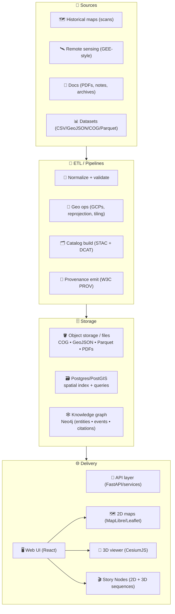

# Kansas Frontier Matrix (KFM) 🧭🗺️  
**An open-source geospatial + knowledge + modeling hub for Kansas** 🌾  
Built to fuse **historical mapping**, **remote sensing**, **GIS**, **simulation**, and **AI-assisted research workflows** into one cohesive system — with **provenance-first** guardrails.

<p align="left">
  <a href="https://github.com/bartytime4life/Kansas-Frontier-Matrix/actions/workflows/ci.yml"></a>
  <a href="https://github.com/bartytime4life/Kansas-Frontier-Matrix/actions/workflows/codeql.yml"></a>
  <a href="https://github.com/bartytime4life/Kansas-Frontier-Matrix/issues"></a>
  <a href="#contributing-"></a>
  <a href="#license-"></a>
  
  
  
  
  
  
  
</p>

> [!NOTE]
> **New here?** Start with:
> - 🤝 **Collaboration & automation hub:** [`./.github/README.md`](./.github/README.md)  
> - 🔐 **Security policy:** [`./.github/SECURITY.md`](./.github/SECURITY.md) *(add if missing)*  
> - 🧱 **Architecture docs:** [`./docs/architecture/`](./docs/architecture/) *(target folder)*  
> - 🗺️ **Data conventions:** see **Data standards & conventions** below  
> - 🎬 **Story Nodes:** see **Story Nodes** below  

---

## Table of contents 📌
- [Quick links](#quick-links-)
- [KFM in 60 seconds](#kfm-in-60-seconds-)
- [What KFM is](#what-kfm-is-)
- [KFM-MDP](#kfm-mdp-the-data-promotion-rulebook-)
- [Modes](#modes-)
- [Core principles and north stars](#core-principles-and-north-stars-)
- [Architecture at a glance](#architecture-at-a-glance-)
- [Repository map](#repository-map-target-shape-)
- [Quickstart](#quickstart-)
- [Data standards and conventions](#data-standards-and-conventions-)
- [Catalog QA quick gate](#catalog-qa-quick-gate-)
- [Story Nodes](#story-nodes-)
- [Pipelines and data products](#pipelines-and-data-products-)
- [Modeling and analytics](#modeling-and-analytics-)
- [Interoperability and APIs](#interoperability-and-apis-)
- [Governance and ethics](#governance-and-ethics-)
- [Contributing](#contributing-)
- [Roadmap](#roadmap-starter-)
- [Project reference library](#project-reference-library-pdfs-and-influence-map-)
- [License](#license-)

---

## Quick links 🔗

| Action | Link |
|---|---|
| 🐛 Report a bug | <https://github.com/bartytime4life/Kansas-Frontier-Matrix/issues/new?template=bug_report.yml> |
| ✨ Request a feature | <https://github.com/bartytime4life/Kansas-Frontier-Matrix/issues/new?template=feature_request.yml> |
| 🗺️ Request a data layer or source | <https://github.com/bartytime4life/Kansas-Frontier-Matrix/issues/new?template=data_layer_request.yml> |
| ❓ Ask a question | <https://github.com/bartytime4life/Kansas-Frontier-Matrix/issues/new?template=question.yml> |
| 🧪 CI runs | <https://github.com/bartytime4life/Kansas-Frontier-Matrix/actions> |
| 🤝 Collaboration rules and labels | [`./.github/README.md`](./.github/README.md) |
| 🔐 Private security reporting | `Security` tab → “Report a vulnerability” *(preferred)* |

> [!TIP]
> If a template link 404s, use the chooser: <https://github.com/bartytime4life/Kansas-Frontier-Matrix/issues/new/choose>

---

## KFM in 60 seconds ⚡

KFM is a **Kansas-scale spatial workbench** that treats *maps + documents + time + modeling outputs* as **first-class, versioned, and provable artifacts**.

**You can use KFM to:**
- 🗺️ Georeference historical scans into **time-aware** map layers  
- 🛰️ Generate remote-sensing layers (Earth Engine-style workflows) and publish them with metadata  
- 🧾 Connect documents ↔ places ↔ time (with citations and traceability)  
- 🧠 Run “Focus Mode” summaries that link back to evidence  
- 📈 Produce reproducible analyses and simulations with stored artifacts  
- 🎬 Publish **Story Nodes** that guide people through Kansas history in 2D + 3D  

---

## What KFM is 🧭

KFM is a **“spatial truth + provenance + modeling” hub** for Kansas.

It’s designed to:
- 🗂️ keep a **catalog-first** view of all assets (layers, documents, runs, outputs)
- 🧾 record **how** a layer was made (sources → transforms → assets)
- 🔎 make datasets **searchable, mappable, and auditable**
- 🧪 support analysis from **EDA → regression → Bayesian → simulation**
- 🌐 deliver results through a **map UI + timeline + Story Nodes**

> 🎯 **Goal:** Make Kansas-scale spatial truth **searchable**, **mappable**, **auditable**, and **modelable** — from archival scans to satellite-derived datasets.

### What KFM is NOT 🚫
- ❌ “Just a map viewer” (KFM is pipeline + provenance + publishing discipline)
- ❌ “A data dump” (datasets ship only when discoverable and validated)
- ❌ “Autonomous AI” (Focus Mode is advisory, evidence-backed, human-controlled)

---

## KFM-MDP the data promotion rulebook 🚦

KFM is intentionally **pipeline-driven** and **gate-enforced**: data flows through an ordered lifecycle where validation can’t be skipped. This mirrors the design goal of **staging → validation → atomic publish**, with rollback/kill-switch behavior for bad releases. 


**Why it matters:** federated catalog consumers (and humans!) break on missing licensing, providers, extension metadata, and dead links — so we treat metadata like code. 

> [!IMPORTANT]
> If it touches `data/**`, expect Catalog QA to run (fast), and full schema/geo QA to be required before “promotion.”

---

## Modes 🎛️

KFM is intentionally multi-modal so different audiences can use the same “truth layer” without needing the same tooling background.

| Mode | What it feels like | What it’s for |
|---|---|---|
| 🗺️ Explore Mode | Layer browser + map + timeline | Browse datasets, overlays, inspect features |
| 🎬 Story Mode | Guided narrative + map steps | Teaching, public storytelling, curated tours |
| 📊 Analysis Mode | Charts + downloads + notebooks | Evidence distillation, decision support |
| 🧠 Focus Mode | Evidence-backed summaries + citations | “Explain this place/layer/event” with traceability |
| 🧊 3D Story Mode | Smooth 2D → 3D transitions | Terrain context, corridors, uncertainty volumes |

> [!NOTE]
> Story + Analysis do not replace Explore — they sit on top of the same catalogs, provenance, and governance chain. 

---

## Core principles and north stars ⭐
- 🧾 **Provenance-first:** every layer has sources, transform history, and license notes. 
- 🔎 **Searchable and mappable:** “find it” and “see it” are first-class features.
- 🧠 **Citations over vibes:** outputs point back to evidence. 
- 🧱 **Clean boundaries:** domain logic ≠ infrastructure ≠ UI (testable, swappable adapters). 
- 🧪 **Reproducible by default:** scripts and notebooks run the same on any machine.
- 🧭 **Standards-forward:** STAC, DCAT, PROV, GeoJSON, COG, OGC patterns when possible.
- ❤️ **Human-centered governance:** systems support decisions; they don’t replace accountability.  [oai_citation:0‡Principles of Biological Autonomy - book_9780262381833.pdf](file-service://file-PwPXcX5554FpuRsF3iXTCf)

---

## Architecture at a glance 🧱

KFM follows a clean separation of concerns (UI ↔ API ↔ pipeline workers ↔ storage), and uses a **knowledge graph** alongside spatial storage for “documents ↔ places ↔ time” linking. 



> [!TIP]
> The design doc calls out a **PostGIS + GeoJSON** pipeline, a **Neo4j** knowledge graph layer, and a modern web UI stack as core components. 

---

## Repository map target shape 🗂️

> [!NOTE]
> If your repo already has a structure, keep it — this is a **target shape** for clarity and onboarding. 🧭

```text
Kansas-Frontier-Matrix/
├─ 📁 .github/                       # 🤝 Collaboration + CI/CD (see .github/README.md)
├─ 📁 api/                           # 🧩 Python API (FastAPI/Flask) + services
├─ 📁 web/                           # 🌐 Front-end (React)
│  ├─ 📁 viewers/                    # 🗺️ MapLibre + 🧊 Cesium bootstraps
│  └─ 📁 story_nodes/                # 🎬 narrative map steps (2D/3D)
├─ 📁 data/                          # 🗃️ Curated datasets + manifests
│  ├─ 📁 sources/                    # 🧾 external dataset manifests (URLs, license, access notes)
│  ├─ 📁 raw/
│  ├─ 📁 processed/
│  ├─ 📁 catalog/                    # 🗂️ STAC catalogs/collections/items
│  └─ 📁 provenance/                 # 🧾 PROV JSON-LD or similar
├─ 📁 pipelines/                     # 🛰️ ETL jobs and runners (batch-first, reproducible)
├─ 📁 tools/
│  └─ 📁 validation/
│     └─ 📁 catalog_qa/              # ✅ fast STAC/DCAT gate before heavier checks
├─ 📁 notebooks/                     # 🧪 Research notebooks (EDA, experiments)
├─ 📁 mcp/                           # 🧠 SOPs + governance + “how we work”
├─ 📁 docs/                          # 📚 Docs & diagrams
│  ├─ 📁 architecture/
│  ├─ 📁 specs/
│  ├─ 📁 security/
│  └─ 📁 library/                    # 🎒 Reference PDFs (licensed separately)
├─ 🧪 tests/
├─ 🐳 docker-compose.yml
├─ 🧾 .env.example
└─ 📘 README.md
```

> [!TIP]
> A recent design audit recommends stronger **SOPs, glossary, templates, and validation tooling** to keep growth consistent as new contributors join. 

---

## Quickstart 🚀

### Option A — Docker recommended 🐳
```bash
# 1) Clone
git clone https://github.com/bartytime4life/Kansas-Frontier-Matrix.git
cd Kansas-Frontier-Matrix

# 2) Configure environment
cp .env.example .env

# 3) Run
docker compose up --build
```

### Option B — Local dev Python + Node 💻
> [!TIP]
> If this repo has per-service docs, prefer those:
> - `api/README.md` (backend)
> - `web/README.md` (frontend)

```bash
# Python backend
python -m venv .venv
source .venv/bin/activate
pip install -r api/requirements.txt

# Start command depends on the API framework used:
# - FastAPI: uvicorn api.app.main:app --reload
# - Flask:   flask --app api.app run --debug

# Web frontend
cd web
npm install
npm run dev
```

✅ Typical local endpoints:
- `http://localhost:8000` → API  
- `http://localhost:5173` → Web UI  

---

## Data standards and conventions 🗺️🧾

KFM stays scalable by being boring in the right places.

### Formats ✅
- 🧭 **Vector:** GeoJSON (preferred for transport), GeoPackage/Shapefile accepted for ingest
- 🧊 **Raster:** Cloud-Optimized GeoTIFF (**COG**) preferred for web streaming
- 🧪 **Tables:** Parquet preferred for analytics/timeseries; CSV accepted for ingest
- 🗂️ **Catalog:** STAC catalogs/collections/items + DCAT rollups for portal/federation
- 🧾 **Lineage:** W3C PROV records per run and per derived asset

### Coordinate and projection rules 🧭
- Store original CRS **and** publish normalized web-map derivatives when needed  
- For rasters, map projection metadata into STAC **Projection extension** fields (`proj:*`) where possible  
- Keep Kansas bbox and validity checks in CI for anything claiming to be “Kansas-wide”

> [!IMPORTANT]
> GeoJSON often **does not carry CRS info** in a way tools consistently respect — the same file can be misinterpreted if the CRS isn’t tracked in metadata.  [oai_citation:1‡webgl-programming-guide-interactive-3d-graphics-programming-with-webgl.pdf](file-service://file-7Nd7iS68ES97NmWhPiRWTP)

### Scan ingestion rules (maps & archives) 🖼️
Historical map scans are **data** — treat them like scientific inputs:
- Prefer **lossless** formats for “masters” (don’t throw away information)
- Use **lossy** derivatives (e.g., JPEG) only for lightweight previews/quicklooks
- Record compression choices in provenance

Lossless vs lossy compression is a key tradeoff in raster workflows; common web formats include JPEG, TIFF, and PNG.  [oai_citation:2‡F-H programming Books.pdf](file-service://file-6M57f592rSBag5JxTUMXGm)

### Cartography rules (KFM UI + exports) 🎨🗺️
KFM map outputs should follow baseline cartographic discipline:
- Figure–ground clarity
- Visual hierarchy
- Typography & labeling
- Color selection
- Legend design

A practical “design checklist” for maps includes exactly these elements.  [oai_citation:3‡Cloud-Based Remote Sensing with Google Earth Engine-Fundamentals and Applications.pdf](file-service://file-JVv3nbvtonX1HcpeERi9kV)

### Required provenance for any data PR 🧾
- Source name + reference (URL or archive id)
- License/terms (or “unknown” with rationale)
- Spatial reference (EPSG) and units
- Time coverage (single year, range, or “undated”)
- Processing steps (georef point count, simplification, resampling, etc.)
- Checksums + version stamp (recommended)

> [!WARNING]
> If we can’t explain where the data came from and how it was processed, we can’t trust it — and it won’t ship. 🧱🗺️

### Minimal STAC-like manifest example
```json
{
  "id": "kfm.ks.railroads.1870_1910.v1",
  "title": "Kansas Railroads (1870–1910)",
  "type": "vector",
  "format": "geojson",
  "bbox": [-102.05, 36.99, -94.59, 40.00],
  "time_range": {"start": "1870-01-01", "end": "1910-12-31"},
  "crs": "EPSG:4326",
  "provenance": {
    "sources": [
      {"label": "Kansas Historical Society", "ref": "KHS:<id-or-url>", "accessed": "<YYYY-MM-DD>"}
    ],
    "license": "TBD",
    "attribution": "TBD"
  },
  "transforms": [
    {"step": "georeference", "tool": "gdalwarp", "date": "<YYYY-MM-DD>", "by": "<github-handle>"}
  ],
  "assets": {
    "data": {"href": "data/processed/railroads_1870_1910.geojson", "sha256": "<checksum>"}
  }
}
```

---

## Catalog QA quick gate ✅

A recurring failure mode in geospatial catalogs is simple stuff:
- missing `license` or `providers`
- missing `stac_extensions`
- broken top-level links that derail federation and indexing

So KFM includes a fast **Catalog QA** check you can run locally and in CI.

```bash
python3 tools/validation/catalog_qa/run_catalog_qa.py \
  --root data/ \
  --glob "**/collection.json" \
  --fail-on-warn
```

**What it checks**
- required keys present and shaped correctly
- top-level STAC links are reachable (HEAD/GET)

> [!TIP]
> This is meant to be a **quick gate** before heavier schema validation and deeper geospatial QA.

---

## Story Nodes 🎬

Story Nodes are how KFM becomes a **living atlas** instead of “just another GIS repo.”

A Story Node is a small, machine-ingestible narrative unit that can:
- 🧭 define what the user should see (layers, map bounds, time range)
- 🧾 attach citations + evidence
- 🕸️ link to knowledge-graph entities
- 🎛️ drive UI transitions, including 2D → 3D sequences

The Story Node authoring guide emphasizes:
- provenance for every claim
- linking entities + places
- separating “facts” from “interpretation” 

### Story Node folder shape
```text
web/story_nodes/
└─ kansas_from_above/
   ├─ config.json         # camera steps, layer fades, timings
   ├─ narrative.md        # human-readable story (with citations)
   └─ assets/             # optional images / tiles / media
```

### 3D Story Nodes 🧊
KFM supports a hybrid approach where:
- MapLibre remains the primary 2D model
- CesiumJS becomes a Story Node mode (not a full UI replacement)
- Story Nodes orchestrate the transition (camera lock, fades, engine switch)

A recommended “proof of capability” demo Story Node is **Kansas From Above**, designed to show 2D → 3D narrative transitions without requiring a giant re-architecture. 

---

## Pipelines and data products 🛰️🧰

KFM pipelines are **batch-first**, **deterministic**, and **provenance-emitting** — designed to scale without turning into a “mystery ETL box.”

### Pipeline types
- 🗺️ **Historical map pipeline**  
  Scan → metadata → georef → COG → STAC item → DCAT rollup → overlay

- 🛰️ **Remote sensing pipeline (Earth Engine-style)**  
  Cloud masking → index/feature compute → reducers → export → catalog entry → QA → publish  
  (Cloud-based remote sensing emphasizes scaling analysis by bringing computation to data.) 

- 🌊 **Timeseries pipeline**  
  Fetch → normalize → Parquet → STAC assets → provenance → dashboards

### Pipeline contract ✅
Every pipeline should:
- declare inputs and outputs explicitly
- emit provenance per run
- update catalog artifacts as a first-class deliverable
- fail fast on schema and Kansas-bounds validation

> [!TIP]
> When adding a new pipeline, start by writing the catalog shape first, then implement the transform. This keeps “shipping” aligned with discoverability.

---

## Modeling and analytics 🧠📈

KFM is not just a map viewer — it’s a **modeling workbench**.

### What belongs here
- 📈 **Statistics and regression:** trend modeling, uncertainty, bias checks, reproducible inference  
  Regression work should include assumption checks (e.g., residual analysis) and transparent reporting. 

- 🎲 **Bayesian workflows:** posterior reasoning, uncertainty propagation, decision support  
  Bayesian parameter estimation uses posterior distributions and credible intervals instead of “single-number certainty.” 

- 🛰️ **Remote sensing analytics:** indices, time-series, land cover transitions  
  (Earth Engine-style workflows enable large-scale time-series analysis and reducers.) 

- 🧪 **Simulation:** scenario testing, sensitivity analysis, verification & validation (V&V) discipline  
  NASA-grade modeling practice emphasizes V&V, uncertainty quantification, documentation, and repeatability.  [oai_citation:4‡python-geospatial-analysis-cookbook.pdf](file-service://file-HT14njz1MhrTZCE7Pwm5Cu)

### Modeling hygiene checklist ✅
- ✅ Define objective + assumptions
- ✅ Version the dataset + manifest
- ✅ Track train/test splits + seeds
- ✅ Report uncertainty + sensitivity
- ✅ Store artifacts (plots, metrics, model cards)
- ✅ Tie outputs back to sources and citations

> [!CAUTION]
> Stats work is vulnerable to “false certainty” if you ignore multiple testing, flexible stopping, and weak experimental design. The experimental design reference explicitly highlights replication challenges and false positives in published results.  [oai_citation:5‡D-E programming Books.pdf](file-service://file-2BV3fPbrEfRn2KmoE6nnbP)

---

## Interoperability and APIs 🔌

KFM is designed to be a platform, not a silo:
- 🧩 REST API with clear contracts (OpenAPI)
- 🕸️ GraphQL for graph-shaped queries when useful
- 🗂️ STAC catalogs for geospatial interoperability
- 🧾 DCAT rollups for data-portal federation
- 🧱 CORS-enabled endpoints for embedding in external sites

> [!TIP]
> Treat the API as part of the governance: schema-first, versioned, backwards compatible.

---

## Governance and ethics ❤️🧭

KFM’s north star is public knowledge with responsible handling.

### Data trust and sharing 🤝
Modern “data spaces” framing emphasizes that **trust, governance, and interoperability** are core to sharing data across organizations — not afterthoughts.  [oai_citation:6‡Cloud-Based Remote Sensing with Google Earth Engine-Fundamentals and Applications.pdf](file-service://file-JVv3nbvtonX1HcpeERi9kV)

### Human-centered systems 🧑‍🤝‍🧑
Digital Humanism framing emphasizes aligning technology with human values and accountability rather than replacing it.  [oai_citation:7‡Principles of Biological Autonomy - book_9780262381833.pdf](file-service://file-PwPXcX5554FpuRsF3iXTCf)

### Mapping is not neutral 🗺️⚖️
Mobile mapping scholarship underscores that maps and data practices are socially embedded (and can carry power implications), so we build with transparency and care.  [oai_citation:8‡Cloud-Based Remote Sensing with Google Earth Engine-Fundamentals and Applications.pdf](file-service://file-JVv3nbvtonX1HcpeERi9kV)

### Sensitive location policy 🧭🔒
If a dataset contains sensitive locations (e.g., culturally sensitive sites):
- generalize location precision (mask/jitter/grid indexing)
- restrict access where required
- do not publish exact coordinates unless explicitly allowed

The engineering design documentation explicitly mentions H3 hex indexing as one approach for protecting sensitive-site precision while supporting analysis. 

### AI accountability (Focus Mode) 🧠⚖️
AI-related features are opt-in and must remain evidence-backed and transparent. Broader AI governance concerns include accountability and conceptual foundations for machine learning systems.  [oai_citation:9‡Principles of Biological Autonomy - book_9780262381833.pdf](file-service://file-PwPXcX5554FpuRsF3iXTCf)

---

## Contributing 🤝

We welcome contributions that improve:
- 🧾 data provenance, ingest tooling, validation
- 🗺️ mapping UX and performance
- 🎬 Story Nodes and educational walkthroughs
- 🧠 Focus Mode reliability and citations
- 📈 modeling modules and reproducibility
- 📚 documentation and tutorials

**Start here →** [`./.github/README.md`](./.github/README.md) ✅

Suggested workflow:
1. 🍴 Fork or branch  
2. ✅ Add tests where applicable  
3. 🧹 Format + lint  
4. 📣 Open a PR with a short “why” + screenshots for UI changes  

---

## Roadmap starter 🛣️
- [ ] 🗂️ Dataset manifest schema + validator CLI  
- [ ] ✅ Catalog QA quick gate in CI  
- [ ] 🛰️ Remote sensing pipeline templates + publish flow  
- [ ] 🧾 Document KB ingestion with citations + metadata  
- [ ] 🎬 Story Node template pack + authoring guide  
- [ ] 🧊 3D Story Node demo “Kansas From Above”  
- [ ] 🗺️ Map + timeline MVP layer browser + feature inspect  
- [ ] 📈 Modeling notebooks for regression, Bayesian, simulation examples  
- [ ] 🔐 Auth + roles for public vs collaborators vs admin  
- [ ] 📦 Reproducible releases with versioned catalogs + changelogs  

> [!TIP]
> A design audit also recommends adding stronger SOPs (runbooks), glossary, and “definition of done” templates to keep contributions consistent. 

---

## Project reference library PDFs and influence map 📚🎒
> This repo is backed by a curated multidisciplinary reading pack that shapes architecture, modeling rigor, GIS workflows, and UI/infra decisions.  
> ⚠️ Reference materials may have different licenses than the repository code. Keep them in `docs/library/` and respect upstream terms.

<details>
<summary><strong>📦 Expand: Reference PDFs by domain</strong></summary>

### 🧭 Canonical KFM design docs
- `docs/specs/Kansas Frontier Matrix (KFM) – Comprehensive Engineering Design.docx` 
- `docs/specs/Latest Ideas.docx` 
- `docs/specs/MARKDOWN_GUIDE_v13.md` (Story Nodes + Focus Mode authoring conventions) 
- `docs/specs/Kansas-Frontier-Matrix Design Audit – Gaps and Enhancement Opportunities.pdf` 

### 🗺️ GIS, geoprocessing, cartography
- `docs/library/python-geospatial-analysis-cookbook.pdf`  [oai_citation:10‡webgl-programming-guide-interactive-3d-graphics-programming-with-webgl.pdf](file-service://file-7Nd7iS68ES97NmWhPiRWTP)
- `docs/library/making-maps-a-visual-guide-to-map-design-for-gis.pdf`  [oai_citation:11‡Cloud-Based Remote Sensing with Google Earth Engine-Fundamentals and Applications.pdf](file-service://file-JVv3nbvtonX1HcpeERi9kV)
- `docs/library/PostgreSQL Notes for Professionals - PostgreSQLNotesForProfessionals.pdf` 
- `docs/library/F-H programming Books.pdf` (geo data mgmt + formats + compression)  [oai_citation:12‡F-H programming Books.pdf](file-service://file-6M57f592rSBag5JxTUMXGm)

### 🛰️ Remote sensing and Earth Engine
- `docs/library/Cloud-Based Remote Sensing with Google Earth Engine-Fundamentals and Applications.pdf` 

### 🌐 Web and graphics and 3D
- `docs/library/responsive-web-design-with-html5-and-css3.pdf` 
- `docs/library/webgl-programming-guide-interactive-3d-graphics-programming-with-webgl.pdf` 
- `docs/library/Mobile Mapping_ Space, Cartography and the Digital - 9789048535217.pdf`  [oai_citation:13‡Cloud-Based Remote Sensing with Google Earth Engine-Fundamentals and Applications.pdf](file-service://file-JVv3nbvtonX1HcpeERi9kV)

### 📈 Statistics, experiments, and modeling discipline
- `docs/library/Understanding Statistics & Experimental Design.pdf`  [oai_citation:14‡D-E programming Books.pdf](file-service://file-2BV3fPbrEfRn2KmoE6nnbP)
- `docs/library/regression-analysis-with-python.pdf` 
- `docs/library/graphical-data-analysis-with-r.pdf` 
- `docs/library/think-bayes-bayesian-statistics-in-python.pdf` 
- `docs/library/Scientific Modeling and Simulation_ A Comprehensive NASA-Grade Guide.pdf`  [oai_citation:15‡python-geospatial-analysis-cookbook.pdf](file-service://file-HT14njz1MhrTZCE7Pwm5Cu)

### 🧪 Simulation, optimization, advanced math
- `docs/library/Generalized Topology Optimization for Structural Design.pdf`
- `docs/library/Spectral Geometry of Graphs.pdf`

### 🧰 Systems, scalable data, and interoperability
- `docs/library/Scalable Data Management for Future Hardware.pdf` 
- `docs/library/Data Spaces.pdf`  [oai_citation:16‡Cloud-Based Remote Sensing with Google Earth Engine-Fundamentals and Applications.pdf](file-service://file-JVv3nbvtonX1HcpeERi9kV)

### ❤️ Ethics, autonomy, and governance
- `docs/library/Introduction to Digital Humanism.pdf`  [oai_citation:17‡Principles of Biological Autonomy - book_9780262381833.pdf](file-service://file-PwPXcX5554FpuRsF3iXTCf)
- `docs/library/Principles of Biological Autonomy - book_9780262381833.pdf`  [oai_citation:18‡Principles of Biological Autonomy - book_9780262381833.pdf](file-service://file-PwPXcX5554FpuRsF3iXTCf)
- `docs/library/On the path to AI Law’s prophecies and the conceptual foundations of the machine learning age.pdf`  [oai_citation:19‡Principles of Biological Autonomy - book_9780262381833.pdf](file-service://file-PwPXcX5554FpuRsF3iXTCf)

### 🧱 General programming shelf (bundles)
- `docs/library/A programming Books.pdf`
- `docs/library/B-C programming Books.pdf`
- `docs/library/D-E programming Books.pdf`
- `docs/library/F-H programming Books.pdf`
- `docs/library/I-L programming Books.pdf`
- `docs/library/M-N programming Books.pdf`
- `docs/library/O-R programming Books.pdf`
- `docs/library/S-T programming Books.pdf`
- `docs/library/U-X programming Books.pdf`

</details>

---

## License 🧾
**MIT** for code, unless otherwise noted.

> [!IMPORTANT]
> 🗃️ **Data note:** datasets, scans, and third‑party documents can have different licenses and attribution than the code. Track this in manifests and metadata.

---

## Acknowledgements 🙌🌾
Built by combining **geospatial engineering**, **data science rigor**, **systems design**, and **human-centered governance** into a cohesive platform for Kansas-scale exploration and decision support.