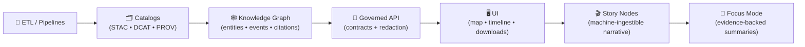
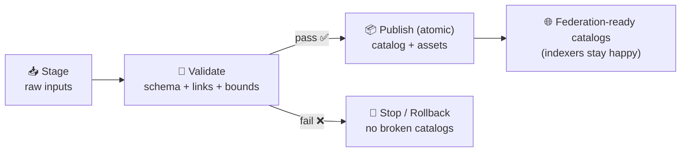
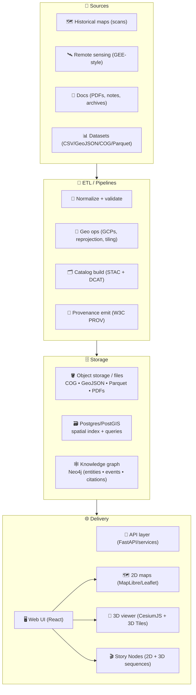
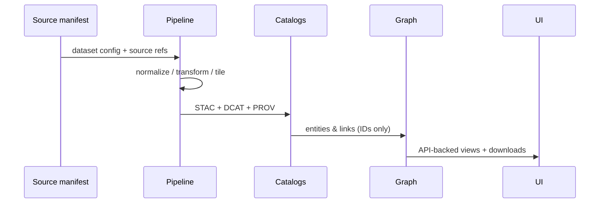

# Kansas Frontier Matrix (KFM) 🧭🌾🗺️  
**An open-source geospatial + knowledge + modeling hub for Kansas** — built for **maps + documents + time + models** with **provenance-first guardrails**.

<div align="left">

<a href="https://github.com/bartytime4life/Kansas-Frontier-Matrix/actions/workflows/ci.yml"></a>
<a href="https://github.com/bartytime4life/Kansas-Frontier-Matrix/actions/workflows/codeql.yml"></a>
<a href="https://github.com/bartytime4life/Kansas-Frontier-Matrix/issues"></a>
<a href="#contributing-"></a>
<a href="#license-"></a>


</div>

> [!NOTE]
> **New here?** Start with:
> - 🧠 **Master work protocol (v13):** `docs/specs/MARKDOWN_GUIDE_v13.md` *(or the source doc if you keep it as `.gdoc`)*  
> - 📘 **System design & technical docs:** `docs/specs/Kansas Frontier Matrix (KFM) – Comprehensive Technical Documentation.docx`  
> - 🧭 **Design audit (gaps + opportunities):** `docs/specs/Kansas-Frontier-Matrix Design Audit – Gaps and Enhancement Opportunities.pdf`  
> - 🤝 **Collaboration rules & labels:** `./.github/README.md`  
> - 🔐 **Security policy:** `./.github/SECURITY.md` *(add if missing)*  
> - 🧱 **Architecture docs:** `./docs/architecture/` *(target folder)*  
> - 🎬 **Story Nodes:** see **Story Nodes & Focus Mode** below  

---

## Table of contents 📌
- [Quick links](#quick-links-)
- [KFM in 60 seconds](#kfm-in-60-seconds-)
- [What KFM is](#what-kfm-is-)
- [v13 invariants](#v13-invariants-)
- [KFM-MDP](#kfm-mdp-the-data-promotion-rulebook-)
- [Modes](#modes-)
- [Architecture at a glance](#architecture-at-a-glance-)
- [Repository map](#repository-map-target-shape-)
- [Quickstart](#quickstart-)
- [Core workflows](#core-workflows-)
- [Data standards and conventions](#data-standards-and-conventions-)
- [Catalog QA quick gate](#catalog-qa-quick-gate-)
- [Story Nodes and Focus Mode](#story-nodes-and-focus-mode-)
- [Modeling and analytics](#modeling-and-analytics-)
- [Scalability and performance](#scalability-and-performance-)
- [Security and privacy](#security-and-privacy-)
- [Governance and ethics](#governance-and-ethics-)
- [Contributing](#contributing-)
- [Roadmap](#roadmap-starter-)
- [Project reference library and influence map](#project-reference-library-and-influence-map-)
- [License](#license-)

---

## Quick links 🔗

| Action | Link |
|---|---|
| 🐛 Report a bug | <https://github.com/bartytime4life/Kansas-Frontier-Matrix/issues/new?template=bug_report.yml> |
| ✨ Request a feature | <https://github.com/bartytime4life/Kansas-Frontier-Matrix/issues/new?template=feature_request.yml> |
| 🗺️ Request a data layer or source | <https://github.com/bartytime4life/Kansas-Frontier-Matrix/issues/new?template=data_layer_request.yml> |
| ❓ Ask a question | <https://github.com/bartytime4life/Kansas-Frontier-Matrix/issues/new?template=question.yml> |
| 🧪 CI runs | <https://github.com/bartytime4life/Kansas-Frontier-Matrix/actions> |
| 🔐 Private security reporting | `Security` tab → “Report a vulnerability” *(preferred)* |

> [!TIP]
> If a template link 404s, use the chooser: <https://github.com/bartytime4life/Kansas-Frontier-Matrix/issues/new/choose>

---

## KFM in 60 seconds ⚡

KFM is a **Kansas-scale spatial workbench** that treats:

✅ **datasets** (vector/raster/tables)  
✅ **documents** (PDFs, scans, archives)  
✅ **time** (timelines, time ranges, event sequences)  
✅ **model outputs** (plots, metrics, simulations)  

…as **first-class, versioned, auditable artifacts**. 🧾

**You can use KFM to:**
- 🗺️ Georeference historical scans into **time-aware** map layers  
- 🛰️ Generate remote-sensing layers (Earth Engine-style workflows) and publish them with metadata  
- 🧾 Connect documents ↔ places ↔ time (with citations + traceability)  
- 🎬 Publish **Story Nodes** that guide people through Kansas history in 2D + 3D  
- 📈 Run reproducible analytics (EDA → regression → Bayesian → simulation) with stored artifacts  
- 🧠 Run **Focus Mode** summaries that link back to evidence, not vibes  

---

## What KFM is 🧭

KFM is a **“spatial truth + provenance + modeling” hub** for Kansas.

It’s designed to:
- 🗂️ keep a **catalog-first** view of assets (layers, docs, runs, outputs)  
- 🧾 record **how** an asset was made (sources → transforms → published artifacts)  
- 🔎 make datasets **searchable, mappable, and auditable**  
- 🧪 support analysis from **EDA → regression → Bayesian → simulation**  
- 🌐 deliver results through a **map UI + timeline + Story Nodes**  

> 🎯 **Goal:** Make Kansas-scale spatial truth **searchable**, **mappable**, **auditable**, and **modelable** — from archival scans to satellite-derived datasets.

### What KFM is NOT 🚫
- ❌ “Just a map viewer” (KFM is pipeline + provenance + publishing discipline)  
- ❌ “A data dump” (datasets ship only when discoverable and validated)  
- ❌ “Autonomous AI” (Focus Mode is advisory, evidence-backed, human-controlled)  

---

## v13 invariants ⭐

These are the **non-negotiables** that prevent repo drift and keep trust intact:



**Invariants (must not regress):**
- 🧾 **Provenance first:** nothing gets used by graph/UI/story without catalogs + lineage.  
- 🧱 **API boundary rule:** UI never hits Neo4j/graph directly — access is governed through the API.  
- ♻️ **Deterministic ETL:** config-driven, idempotent transforms; same input → same output.  
- 🧠 **Evidence-first narrative:** Story Nodes + Focus Mode require citations; facts ≠ interpretation.  

---

## KFM-MDP the data promotion rulebook 🚦

KFM is intentionally **pipeline-driven** and **gate-enforced**: data flows through an ordered lifecycle where validation can’t be skipped.



**Why it matters:** federated catalog consumers (and humans!) break on missing licensing, providers, extension metadata, and dead links — so we treat metadata like code. 🧾⚙️

> [!IMPORTANT]
> If it touches `data/**`, expect Catalog QA to run (fast), and deeper schema/geo QA before “promotion.”

---

## Modes 🎛️

KFM is intentionally multi-modal so different audiences can use the same “truth layer” without the same tooling background.

| Mode | What it feels like | What it’s for |
|---|---|---|
| 🗺️ Explore Mode | Layer browser + map + timeline | Browse datasets, overlays, inspect features |
| 🎬 Story Mode | Guided narrative + map steps | Teaching, public storytelling, curated tours |
| 📊 Analysis Mode | Charts + downloads + notebooks | Evidence distillation, decision support |
| 🧠 Focus Mode | Evidence-backed summaries + citations | “Explain this place/layer/event” with traceability |
| 🧊 3D Story Mode | Smooth 2D → 3D transitions | Terrain context, corridors, uncertainty volumes |

> [!NOTE]
> Story + Analysis do not replace Explore — they sit on top of the same catalogs, provenance, and governance chain.

---

## Architecture at a glance 🧱

KFM aims for a clean separation of concerns: **UI ↔ API ↔ pipeline workers ↔ storage**, with a **knowledge graph** alongside spatial storage for “documents ↔ places ↔ time” linking.



---

## Repository map target shape 🗂️

> [!NOTE]
> If your repo already has a structure, keep it — this is a **target shape** for clarity, onboarding, and v13 invariants. 🧭

```text
Kansas-Frontier-Matrix/
├─ 📁 .github/                       # 🤝 Collaboration + CI/CD
├─ 📁 docs/
│  ├─ 📁 architecture/               # 🧱 diagrams + system notes
│  ├─ 📁 standards/                  # 🗂️ STAC/DCAT/PROV profiles, naming rules
│  ├─ 📁 templates/                  # 🧾 manifests, Story Node, model cards, SOPs
│  ├─ 📁 governance/                 # ❤️ ethics, CARE/FAIR, review gates, security notes
│  ├─ 📁 reports/
│  │  ├─ 📁 story_nodes/             # 🎬 narrative content (draft/published)
│  │  └─ 📁 analyses/                # 📈 exported reports + artifacts
│  └─ 📁 library/                    # 🎒 reference PDFs (licensed separately)
├─ 📁 data/
│  ├─ 📁 sources/                    # 🧾 external dataset manifests (URLs, license, access notes)
│  ├─ 📁 raw/                        # 📥 raw inputs (immutable)
│  ├─ 📁 processed/                  # 🧼 derived assets (versioned)
│  ├─ 📁 catalog/                    # 🗂️ STAC catalogs/collections/items + DCAT rollups
│  └─ 📁 provenance/                 # 🧾 PROV JSON-LD (per run / per asset)
├─ 📁 pipelines/                     # 🛰️ ETL jobs & runners (deterministic)
├─ 📁 tools/
│  └─ 📁 validation/
│     └─ 📁 catalog_qa/              # ✅ fast STAC/DCAT gate
├─ 📁 api/                           # 🔌 Backend (FastAPI/Flask/etc.)
├─ 📁 web/                           # 🖥️ Front-end (React)
│  ├─ 📁 viewers/                    # 🗺️ MapLibre + 🧊 Cesium bootstraps
│  └─ 📁 story_nodes/                # 🎬 UI-facing Story Node packages
├─ 📁 notebooks/                     # 🧪 research notebooks (EDA, experiments)
├─ 🧪 tests/
├─ 🐳 docker-compose.yml
├─ 🧾 .env.example
└─ 📘 README.md
```

---

## Quickstart 🚀

### Option A — Docker recommended 🐳
```bash
# 1) Clone
git clone https://github.com/bartytime4life/Kansas-Frontier-Matrix.git
cd Kansas-Frontier-Matrix

# 2) Configure environment
cp .env.example .env

# 3) Run
docker compose up --build
```

### Option B — Local dev Python + Node 💻
> [!TIP]
> If this repo has per-service docs, prefer those:
> - `api/README.md` (backend)
> - `web/README.md` (frontend)

```bash
# Python backend
python -m venv .venv
source .venv/bin/activate
pip install -r api/requirements.txt

# Start command depends on the API framework used:
# - FastAPI: uvicorn api.app.main:app --reload
# - Flask:   flask --app api.app run --debug

# Web frontend
cd web
npm install
npm run dev
```

✅ Typical local endpoints:
- `http://localhost:8000` → API  
- `http://localhost:5173` → Web UI  

---

## Core workflows 🧰

These workflows mirror the **“contracts-first”** mindset: define the *shape* of what ships, then implement transforms and UI.

### 1) Add a new dataset layer 🗺️
**Definition of done (DoD):**
- ✅ Source manifest created (`data/sources/...`) with license + attribution notes  
- ✅ Deterministic pipeline step produces processed asset(s)  
- ✅ STAC Item/Collection created + DCAT rollup updated  
- ✅ PROV lineage emitted (inputs → transforms → outputs)  
- ✅ QA passes (catalog gate + geo/links/bounds)  
- ✅ Story/Docs updated (optional but encouraged)

**Suggested flow**


### 2) Add a Story Node 🎬
A Story Node is a small narrative unit that can:
- 🧭 define what the user should see (layers, bounds, time range)  
- 🧾 attach citations + evidence  
- 🕸️ link to knowledge-graph entities  
- 🎛️ drive UI transitions, including 2D → 3D sequences  

**DoD for Story Nodes**
- ✅ Provenance for every claim (citations to cataloged sources)  
- ✅ Fact vs interpretation is explicit (especially if AI-assisted)  
- ✅ Graph entity references use stable IDs  
- ✅ Any sensitive-location rules are honored (masking/generalization)

### 3) Add an API endpoint/service 🔌
Contract-first expectation:
- ✅ Define contract in OpenAPI / GraphQL schema (target: `src/server/contracts/`)  
- ✅ Implement controller/resolver + tests  
- ✅ Add redaction rules if data is sensitive  
- ✅ Document usage for UI consumers  

### 4) Add a UI layer/feature 🖥️
- ✅ Add layer config to the registry (map layers should link to provenance)  
- ✅ Info popup / legend cites the dataset (via STAC/DCAT metadata)  
- ✅ Follow responsive + accessible patterns (mobile-first where possible)  
- ✅ Respect governance gates (sensitive locations, consent, restricted data)

---

## Data standards and conventions 🗺️🧾

KFM stays scalable by being boring in the right places.

### Formats ✅
- 🧭 **Vector:** GeoJSON (preferred for transport), GeoPackage/Shapefile accepted for ingest  
- 🧊 **Raster:** Cloud-Optimized GeoTIFF (**COG**) preferred for web streaming  
- 🧪 **Tables:** Parquet preferred for analytics/timeseries; CSV accepted for ingest  
- 🗂️ **Catalog:** STAC catalogs/collections/items + DCAT rollups for portal/federation  
- 🧾 **Lineage:** W3C PROV records per run and per derived asset  

### Naming (recommended) 🏷️
Use stable, searchable IDs:
```text
kfm.<state>.<domain>.<layer>.<time>.<version>

# example
kfm.ks.transport.railroads.1870_1910.v1
```

### Coordinate and projection rules 🧭
- Preserve original CRS **and** publish web-ready derivatives when needed  
- Track CRS explicitly in metadata (don’t assume consumers “guess right”)  
- Keep Kansas bounds checks in CI for anything claiming to be “Kansas-wide”  
  - Kansas bbox (reference): `[-102.05, 36.99, -94.59, 40.00]`

### Scan ingestion rules (maps & archives) 🖼️
Historical map scans are **scientific inputs**:
- Prefer **lossless** formats for masters (don’t discard information)  
- Use **lossy** derivatives (e.g., JPEG) only for previews/quicklooks  
- Record compression choices in provenance  

### Cartography rules (KFM UI + exports) 🎨🗺️
Baseline cartographic discipline:
- Figure–ground clarity  
- Visual hierarchy  
- Typography & labeling  
- Color selection  
- Legend design  

### Required provenance for any data PR 🧾
- Source name + reference (URL or archive id)  
- License/terms (or “unknown” with rationale)  
- Spatial reference (EPSG) and units  
- Time coverage (single year, range, or “undated”)  
- Processing steps (georef point count, simplification, resampling, etc.)  
- Checksums + version stamp *(recommended)*  

> [!WARNING]
> If we can’t explain where the data came from and how it was processed, we can’t trust it — and it won’t ship. 🧱🗺️

### Minimal STAC-like manifest example
```json
{
  "id": "kfm.ks.transport.railroads.1870_1910.v1",
  "title": "Kansas Railroads (1870–1910)",
  "type": "vector",
  "format": "geojson",
  "bbox": [-102.05, 36.99, -94.59, 40.00],
  "time_range": {"start": "1870-01-01", "end": "1910-12-31"},
  "crs": "EPSG:4326",
  "provenance": {
    "sources": [
      {"label": "Kansas Historical Society", "ref": "KHS:<id-or-url>", "accessed": "<YYYY-MM-DD>"}
    ],
    "license": "TBD",
    "attribution": "TBD"
  },
  "transforms": [
    {"step": "georeference", "tool": "gdalwarp", "date": "<YYYY-MM-DD>", "by": "<github-handle>"}
  ],
  "assets": {
    "data": {"href": "data/processed/railroads_1870_1910.geojson", "sha256": "<checksum>"}
  }
}
```

---

## Catalog QA quick gate ✅

A recurring failure mode in geospatial catalogs is simple stuff:
- missing `license` or `providers`
- missing `stac_extensions`
- broken top-level links that derail federation and indexing

So KFM includes a fast **Catalog QA** check you can run locally and in CI.

```bash
python3 tools/validation/catalog_qa/run_catalog_qa.py \
  --root data/ \
  --glob "**/collection.json" \
  --fail-on-warn
```

**What it checks**
- required keys present and shaped correctly  
- top-level STAC links are reachable (HEAD/GET)  

> [!TIP]
> This is a **quick gate** before heavier schema validation and deeper geospatial QA.

---

## Story Nodes and Focus Mode 🎬🧠

Story Nodes are how KFM becomes a **living atlas** instead of “just another GIS repo.”

### Story Node rules (hard gate) 🧾
- ✅ **Provenance for every claim** (citations to cataloged sources)  
- ✅ **Graph entity references** use stable IDs (people/places/events/docs)  
- ✅ **Fact vs interpretation** must be explicit (especially for AI-assisted content)  
- ✅ **Sensitive-location compliance** (mask/jitter/generalize when needed)  

### Story Node folder shape
```text
web/story_nodes/
└─ kansas_from_above/
   ├─ config.json         # camera steps, layer fades, timings
   ├─ narrative.md        # human-readable story (with citations)
   └─ assets/             # optional images / tiles / media
```

### 3D Story Nodes 🧊
Recommended approach:
- MapLibre remains the primary 2D engine  
- CesiumJS becomes a Story Node mode (not a full UI replacement)  
- Story Nodes orchestrate the transition (camera lock, fades, engine switch)  

---

## Modeling and analytics 🧠📈

KFM is not just a map viewer — it’s a **modeling workbench**.

### What belongs here
- 📈 **Statistics and regression**  
  Trend modeling, uncertainty, bias checks, residual diagnostics, transparent reporting.

- 🎲 **Bayesian workflows**  
  Priors + posteriors, uncertainty propagation, decision support using credible intervals.

- 🛰️ **Remote sensing analytics**  
  Indices, cloud masking, reducers, time-series, land cover transitions.

- 🧪 **Simulation & scenario testing**  
  Sensitivity analysis, verification & validation (V&V), uncertainty quantification (UQ), repeatable runs.

### Modeling hygiene checklist ✅
- ✅ Define objective + assumptions  
- ✅ Version the dataset + manifest  
- ✅ Track train/test splits + seeds  
- ✅ Report uncertainty + sensitivity  
- ✅ Store artifacts (plots, metrics, model cards)  
- ✅ Tie outputs back to sources and citations  

> [!CAUTION]
> Analytics work is vulnerable to “false certainty” without solid experimental design, replication discipline, and clear reporting.

---

## Scalability and performance ⚙️📦

KFM is built to grow from “a few layers” into **Kansas-scale** multi-modal spatiotemporal data.

### Practical scaling principles
- 🧱 **Separate cold storage from query indices** (object storage ↔ PostGIS/graph indices)  
- 🧮 **Push computation to data where possible** (cloud-style remote sensing workflows)  
- 🧪 **Prefer immutable, versioned artifacts** (processed outputs + catalogs + lineage)  
- ⚡ **Optimize for interactive exploration** (fast bbox/temporal queries, cached tiles, precomputed previews)

### Long-horizon capabilities (future-friendly) 🔭
- Pattern queries over spatiotemporal streams (events/situations)  
- Multi-query optimization and adaptive execution  
- JIT compilation strategies and GPU-aware acceleration patterns  
- Visual analytics loops to tune parameters interactively (map-first debugging)

> [!TIP]
> Performance work belongs *after* correctness + provenance. Speed is only valuable if the artifact is trusted.

---

## Security and privacy 🛡️🔒

KFM is a public-knowledge project — but not all spatial data should be public at full resolution.

### Sensitive location policy 🧭
If a dataset contains sensitive locations (e.g., culturally sensitive sites, protected resources):
- generalize location precision (mask/jitter/grid indexing)  
- restrict access where required  
- do not publish exact coordinates unless explicitly allowed  

### Baseline security posture ✅
- 🔐 Secrets never committed (use `.env`, CI secrets)  
- ✅ CodeQL + dependency scanning  
- 🧪 Least-privilege access controls for admin tools  
- 🧾 Auditability for published artifacts (what changed, when, and why)

> [!IMPORTANT]
> Security research references in `docs/library/` exist to improve **defensive hardening**. This repo does **not** accept contributions that add misuse-ready exploitation instructions.

---

## Governance and ethics ❤️🧭

KFM’s north star is public knowledge with responsible handling.

### Governance pillars
- **FAIR**-style discoverability for non-sensitive data (findable, accessible, interoperable, reusable)  
- **CARE**-aligned respect for community rights and narratives (especially Indigenous knowledge)  
- **Human-centered accountability** (systems support decisions; they don’t replace accountability)

### Mapping is not neutral 🗺️⚖️
Maps and data practices are socially embedded; KFM prioritizes transparency, provenance, and respectful representation.

---

## Contributing 🤝

We welcome contributions that improve:
- 🧾 data provenance, ingest tooling, validation  
- 🗺️ mapping UX and performance  
- 🎬 Story Nodes and educational walkthroughs  
- 🧠 Focus Mode reliability and citations  
- 📈 modeling modules and reproducibility  
- 📚 documentation and tutorials  

**Start here →** `./.github/README.md` ✅

### Contribution categories (v13 mindset) 🧩
Use these categories to ensure you touch the right surfaces:

| Category | Example change | What must be updated |
|---|---|---|
| (A) New data | new dataset/layer | manifests + STAC/DCAT + PROV + QA |
| (B) New pipeline | new ETL transform | deterministic config + provenance + tests |
| (C) New graph entity type | new ontology node | schema/IDs + ingestion rules + docs |
| (D) New API endpoint | new service route | OpenAPI/GraphQL contract + tests + redaction |
| (E) New UI feature | new overlay/story UI | layer registry + provenance UI + accessibility |

---

## Roadmap starter 🛣️
- [ ] 🗂️ Dataset manifest schema + validator CLI  
- [ ] ✅ Catalog QA quick gate in CI  
- [ ] 🛰️ Remote sensing pipeline templates + publish flow  
- [ ] 🧾 Document KB ingestion with citations + metadata  
- [ ] 🎬 Story Node template pack + authoring guide  
- [ ] 🧊 3D Story Node demo “Kansas From Above”  
- [ ] 🗺️ Map + timeline MVP layer browser + feature inspect  
- [ ] 📈 Modeling notebooks for regression, Bayesian, simulation examples  
- [ ] 🔐 Auth + roles for public vs collaborators vs admin  
- [ ] 📦 Reproducible releases with versioned catalogs + changelogs  

**Design-audit inspired additions (high value):**
- [ ] 🧠 Semantic layer / lightweight ontology protocol (IDs, types, relations)  
- [ ] 📚 Real SOPs + glossary + documentation-first templates  
- [ ] 🧾 Model cards + experiment logs for any AI/ML work  
- [ ] 🎙️ Oral histories + Indigenous narratives ingestion path *(with governance gates)*  
- [ ] 🔥 Historic fire regimes + paleoclimate proxies + hydrology modeling hooks  

---

## Project reference library and influence map 📚🎒
> This repo is backed by a curated multidisciplinary reading pack shaping architecture, modeling rigor, GIS workflows, UI/infra decisions, governance, and security.  
> ⚠️ Reference materials may have different licenses than the repository code. Keep them in `docs/library/` (or outside the repo) and respect upstream terms.

<details>
<summary><strong>🧠 Influence Map (what each reference is “for”)</strong></summary>

| Subsystem | What it influences | References |
|---|---|---|
| 🧱 KFM system design | architecture, modules, workflows, repo structure | `Kansas Frontier Matrix (KFM) – Comprehensive Technical Documentation.docx` • `MARKDOWN_GUIDE_v13.md.gdoc` • `Kansas-Frontier-Matrix Design Audit – Gaps and Enhancement Opportunities.pdf` |
| 🗺️ GIS + spatial ops | PostGIS patterns, geometry ops, exporting, overlays | `python-geospatial-analysis-cookbook.pdf` • `PostgreSQL Notes for Professionals - PostgreSQLNotesForProfessionals.pdf` |
| 🛰️ Remote sensing | cloud workflows, reducers, time-series, export/publish | `Cloud-Based Remote Sensing with Google Earth Engine-Fundamentals and Applications.pdf` |
| 🎨 Cartography + map design | hierarchy, labels, legends, visual discipline | `making-maps-a-visual-guide-to-map-design-for-gis.pdf` • `Mobile Mapping_ Space, Cartography and the Digital - 9789048535217.pdf` |
| 🧊 3D + graphics | WebGL fundamentals, rendering mental models | `webgl-programming-guide-interactive-3d-graphics-programming-with-webgl.pdf` |
| 📱 Web UI | responsive layout + accessibility | `responsive-web-design-with-html5-and-css3.pdf` |
| 🧾 Scans + formats | lossless vs lossy, raster/web format tradeoffs | `compressed-image-file-formats-jpeg-png-gif-xbm-bmp.pdf` |
| 📈 Stats + inference | regression, EDA, experimental design pitfalls | `regression-analysis-with-python.pdf` • `Regression analysis using Python - slides-linear-regression.pdf` • `graphical-data-analysis-with-r.pdf` • `Understanding Statistics & Experimental Design.pdf` |
| 🎲 Bayesian reasoning | priors/posteriors, credible intervals, uncertainty | `think-bayes-bayesian-statistics-in-python.pdf` |
| 🧪 Simulation discipline | verification/validation, UQ, sensitivity analysis | `Scientific Modeling and Simulation_ A Comprehensive NASA-Grade Guide.pdf` |
| 🧠 Deep learning | practical ML workflows for classification/vision/time-series | `Deep Learning for Coders with fastai and PyTorch - Deep.Learning.for.Coders.with.fastai.and.PyTorchpdf` |
| ⚙️ Systems + scaling | heterogeneous hardware, stream analytics, JIT, pattern queries | `Scalable Data Management for Future Hardware.pdf` • `concurrent-real-time-and-distributed-programming-in-java-threads-rtsj-and-rmi.pdf` |
| 🧭 Data governance | trust, interoperability, cross-org sharing | `Data Spaces.pdf` |
| ❤️ Ethics + accountability | human-centered governance + autonomy framing | `Introduction to Digital Humanism.pdf` • `Principles of Biological Autonomy - book_9780262381833.pdf` • `On the path to AI Law’s prophecies and the conceptual foundations of the machine learning age.pdf` |
| 🧮 Advanced math + optimization | graph theory + structural optimization primitives | `Spectral Geometry of Graphs.pdf` • `Generalized Topology Optimization for Structural Design.pdf` |
| 🧰 General programming shelf | cross-language fundamentals | `A programming Books.pdf` • `B-C programming Books.pdf` • `D-E programming Books.pdf` • `F-H programming Books.pdf` • `I-L programming Books.pdf` • `M-N programming Books.pdf` • `O-R programming Books.pdf` • `S-T programming Books.pdf` • `U-X programming Books.pdf` |
| 🛡️ Security (defense) | hardening mindset + countermeasures | `ethical-hacking-and-countermeasures-secure-network-infrastructures.pdf` • `Gray Hat Python - Python Programming for Hackers and Reverse Engineers (2009).pdf` |

</details>

<details>
<summary><strong>📦 Reference PDFs by domain (full list)</strong></summary>

### 🧭 Canonical KFM design docs
- `docs/specs/Kansas Frontier Matrix (KFM) – Comprehensive Technical Documentation.docx`  
- `docs/specs/MARKDOWN_GUIDE_v13.md.gdoc` *(or export to `.md` and store in the repo)*  
- `docs/specs/Kansas-Frontier-Matrix Design Audit – Gaps and Enhancement Opportunities.pdf`

### 🗺️ GIS, geoprocessing, cartography
- `docs/library/python-geospatial-analysis-cookbook.pdf`  
- `docs/library/PostgreSQL Notes for Professionals - PostgreSQLNotesForProfessionals.pdf`  
- `docs/library/making-maps-a-visual-guide-to-map-design-for-gis.pdf`  
- `docs/library/Mobile Mapping_ Space, Cartography and the Digital - 9789048535217.pdf`  
- `docs/library/compressed-image-file-formats-jpeg-png-gif-xbm-bmp.pdf`  

### 🛰️ Remote sensing and Earth Engine
- `docs/library/Cloud-Based Remote Sensing with Google Earth Engine-Fundamentals and Applications.pdf`  

### 🌐 Web and graphics and 3D
- `docs/library/responsive-web-design-with-html5-and-css3.pdf`  
- `docs/library/webgl-programming-guide-interactive-3d-graphics-programming-with-webgl.pdf`  

### 📈 Statistics, experiments, and modeling discipline
- `docs/library/Understanding Statistics & Experimental Design.pdf`  
- `docs/library/regression-analysis-with-python.pdf`  
- `docs/library/Regression analysis using Python - slides-linear-regression.pdf`  
- `docs/library/graphical-data-analysis-with-r.pdf`  
- `docs/library/think-bayes-bayesian-statistics-in-python.pdf`  
- `docs/library/Scientific Modeling and Simulation_ A Comprehensive NASA-Grade Guide.pdf`  
- `docs/library/Deep Learning for Coders with fastai and PyTorch - Deep.Learning.for.Coders.with.fastai.and.PyTorchpdf`  

### 🧪 Simulation, optimization, advanced math
- `docs/library/Generalized Topology Optimization for Structural Design.pdf`  
- `docs/library/Spectral Geometry of Graphs.pdf`  

### 🧰 Systems, scalable data, and interoperability
- `docs/library/Scalable Data Management for Future Hardware.pdf`  
- `docs/library/concurrent-real-time-and-distributed-programming-in-java-threads-rtsj-and-rmi.pdf`  
- `docs/library/Data Spaces.pdf`  

### ❤️ Ethics, autonomy, and governance
- `docs/library/Introduction to Digital Humanism.pdf`  
- `docs/library/Principles of Biological Autonomy - book_9780262381833.pdf`  
- `docs/library/On the path to AI Law’s prophecies and the conceptual foundations of the machine learning age.pdf`  

### 🛡️ Security (defensive)
- `docs/library/ethical-hacking-and-countermeasures-secure-network-infrastructures.pdf`  
- `docs/library/Gray Hat Python - Python Programming for Hackers and Reverse Engineers (2009).pdf`  

### 🧱 General programming shelf (bundles)
- `docs/library/A programming Books.pdf`  
- `docs/library/B-C programming Books.pdf`  
- `docs/library/D-E programming Books.pdf`  
- `docs/library/F-H programming Books.pdf`  
- `docs/library/I-L programming Books.pdf`  
- `docs/library/M-N programming Books.pdf`  
- `docs/library/O-R programming Books.pdf`  
- `docs/library/S-T programming Books.pdf`  
- `docs/library/U-X programming Books.pdf`  

</details>

---

## License 🧾
**MIT** for code, unless otherwise noted.

> [!IMPORTANT]
> 🗃️ **Data note:** datasets, scans, and third‑party documents can have different licenses and attribution than the code. Track this in manifests and metadata.

---

## Acknowledgements 🙌🌾
Built by combining **geospatial engineering**, **data science rigor**, **systems design**, **cartographic discipline**, and **human-centered governance** into a cohesive platform for Kansas-scale exploration and decision support.
