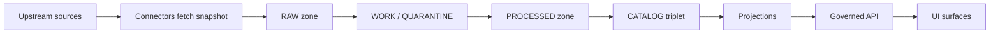
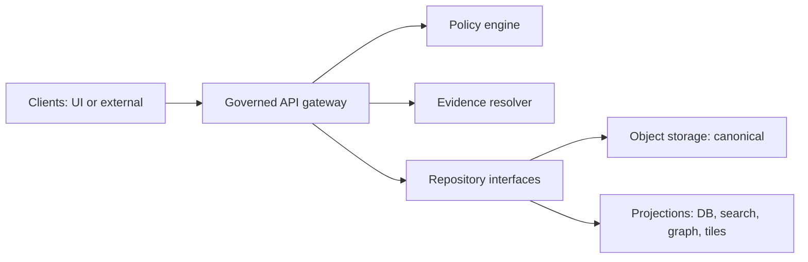

# Kansas Frontier Matrix (KFM)

Map-first • Time-aware • Governed • Evidence-first • Cite-or-abstain

> KFM is a governed knowledge system where the map and timeline are the primary interface, and every visible layer, story claim, or AI-assisted answer is backed by a resolvable evidence bundle tied to a specific dataset version.

`status: vNext / draft` `posture: fail-closed` `trust: evidence-first` `policy: default-deny`

**Core idea:** the product is **map + timeline + governed evidence** (not “just a map,” not “just a catalog,” not a general chatbot).

---

## Quick navigation

- [How to use this repo](#how-to-use-this-repo)
- [Non-negotiable invariants](#non-negotiable-invariants)
- [Architecture](#architecture)
- [Truth path lifecycle](#truth-path-lifecycle)
- [Promotion Contract](#promotion-contract)
- [Evidence model](#evidence-model)
- [User surfaces](#user-surfaces)
- [Governance](#governance)
- [Security](#security)
- [Recommended repo layout](#recommended-repo-layout)
- [Glossary](#glossary)
- [References](#references)

---

## How to use this repo

KFM is designed to be built and operated as a **governed system**. That means:

- **Implement the Promotion Contract gates and Evidence Resolver contract before scaling datasets.**
- Treat “user-visible” as “must be promotable and citeable.”
- Encode invariants as **merge-blocking tests** and **runtime guards** (not tribal knowledge).

**Normative language:** this project uses RFC-style keywords: **MUST**, **MUST NOT**, **SHOULD**, **MAY**.

**Tagging discipline (avoid overreach):**

- **CONFIRMED** — required invariants/contracts.
- **PROPOSED** — implementable default path; adopt explicitly.
- **UNKNOWN / DECISION NEEDED** — must be verified or decided (fail closed until resolved).

---

## Non-negotiable invariants

These are **merge-blocking requirements**. If any invariant is violated, governance and trust fail.

1. **Truth path lifecycle**
   - Upstream sources → governed acquisition → transformation → validation → cataloging → publication.
   - Runtime surfaces (Map/Story/Focus) read **only promoted dataset versions**.

2. **Trust membrane**
   - Clients **MUST NOT** access databases or object storage directly.
   - Backend domain logic **MUST NOT** bypass repository interfaces to talk directly to infrastructure.
   - All access flows through **governed APIs** that apply policy decisions, evidence resolution, and audit logging consistently.

3. **Evidence-first UX**
   - Evidence is a first-class interaction.
   - Evidence drawer / evidence view is required wherever a user can form beliefs (layers, popups, stories, charts, exports, AI answers).

4. **Cite-or-abstain Focus Mode**
   - Focus Mode answers **MUST** cite resolvable evidence bundles or abstain.
   - Citation verification is a **hard gate**.
   - Every run emits a run receipt (audit record).

5. **Canonical vs rebuildable stores**
   - Canonical: object storage artifacts + catalogs + audit ledger.
   - Rebuildable: DB/search/graph/tiles (projections derived from promoted artifacts).

6. **Deterministic identity**
   - Stable dataset identity + stable version identity.
   - Hashing must prevent “hash drift” and support reproducibility and caching.

---

## Architecture

### Truth path + governed surfaces



**CATALOG triplet** means: DCAT + STAC + PROV + run receipts (cross-linked and validated).  
**Projections** may include PostGIS tables, search indexes, graph edges, and tile bundles—each rebuildable.

### Trust membrane (policy boundary)



---

## Truth path lifecycle

KFM uses explicit lifecycle zones. These zones are **operational controls**, not just storage folders.

| Zone | Purpose | What belongs here | Mutability |
|---|---|---|---|
| RAW | Immutable acquisition | acquisition manifest, raw artifacts, checksums, minimal metadata/terms snapshot | Append-only |
| WORK / QUARANTINE | Intermediate transforms | normalization, QA, redaction candidates, temporary joins | Mutable, reviewed |
| PROCESSED | Publishable artifacts | GeoParquet/COG/PMTiles/media, checksums | Immutable by digest |
| CATALOG / LINEAGE | Cross-linked description | DCAT + STAC + PROV + run receipts | Versioned |
| PUBLISHED | Runtime delivery | governed APIs + UI surfaces | Reads promoted only |

---

## Promotion Contract

The Promotion Contract is how governance intent becomes enforceable behavior.

**Promotion** is the act of moving from Raw/Work to Processed + Catalog/Lineage, and therefore into runtime surfaces.

### Minimum promotion gates (fail closed)

A dataset version **MUST NOT** be promoted unless these gates pass:

- **Gate A — Identity & versioning**
  - Dataset ID and version ID are stable and deterministic.
  - Version is immutable.

- **Gate B — Licensing & rights metadata**
  - License/terms snapshot attached.
  - Rights holder and distribution constraints recorded (or “metadata-only reference” mode if content cannot be redistributed).

- **Gate C — Validation / QA**
  - Schema checks pass.
  - Spatial/temporal extent checks pass (as applicable).
  - QA reports produced.

- **Gate D — Catalog triplet & cross-links**
  - DCAT dataset and distributions produced.
  - STAC collection/items produced where relevant.
  - PROV bundle produced.
  - Cross-links validate (dataset ↔ distributions ↔ STAC assets ↔ PROV activities).

- **Gate E — Policy label assignment**
  - policy_label assigned from controlled vocabulary.
  - Any obligations/redactions/generalization are explicit and recorded.

- **Gate F — Provenance / run receipt / audit**
  - Run receipt emitted: inputs, transforms, outputs, digests, actor identity, timestamps.
  - Audit ledger entry written.

---

## Evidence model

### EvidenceRef → EvidenceBundle

**EvidenceRef** is a stable, resolvable reference used for citations (examples of schemes):

- `dcat://...` (dataset/distribution)
- `stac://...` (collection/item/asset)
- `prov://...` (activity/entity/agent lineage)
- `doc://...` (curated documents / Story Nodes)

The **Evidence Resolver**:

- Resolves refs into **EvidenceBundles**
- Applies **policy decisions** and **obligations** (e.g., redaction/generalization notices)
- Returns **evidence cards** that can be safely shown and cited

### Evidence drawer contract (UI)

Wherever users can form beliefs, the UI evidence view SHOULD show:

- dataset_version_id (immutable)
- license + rights holder
- policy label (policy-safe) + any applied generalization/redaction notice
- provenance chain / run receipt link
- artifact links + checksums + validation status

---

## User surfaces

### Map Explorer (baseline)

- Map-first exploration with time controls (time-aware data where applicable)
- Evidence drawer everywhere (layers, features, charts)

### Story Mode

- Story Nodes are publishable artifacts that:
  - replay map state
  - include citations that resolve to EvidenceRefs
  - cannot be published unless citations resolve (publish gate)

### Focus Mode (AI)

Focus Mode is a governed workflow (not open-ended chat):

1. Policy pre-check
2. Retrieval plan (based on intent + view_state)
3. Retrieve policy-filtered evidence
4. Resolve EvidenceBundles (apply obligations/redactions)
5. Synthesize answer grounded in bundle IDs
6. Verify citations (**HARD GATE**)
7. Emit run receipt (inputs, policy decisions, model/prompt versions, output digest)

If citations cannot be verified, Focus Mode **must abstain or reduce scope**.

### Discover Mode (optional)

A reproducible investigations surface:

- saved investigations (inputs, methods, outputs)
- provenance + policy labels
- run receipts and environment capture

---

## Governance

### Baseline roles (starting posture)

> NOTE: exact decision rights are a known gap; start with a minimal RACI and tighten over time.

- **Contributor** — proposes data sources, pipelines, story drafts
- **Steward** — approves promotion/publishing for governed artifacts; owns policy correctness
- **Operator** — runs infrastructure and deployments; enforces runtime invariants
- **Council** (optional) — adjudicates sensitive policy decisions and disputes

### Policy as code

- Default deny posture is recommended.
- Policy rules MUST be tested with fixtures in CI and block merges.
- Controlled vocabularies must be versioned (policy_label, artifact.zone, citation.kind, etc.).

### Auditability

- Pipeline runs emit run receipts and append to an audit ledger.
- Focus Mode queries emit run receipts (policy decisions + citation verification outcomes).
- “What changed?” should be answerable by comparing dataset versions + receipts.

---

## Security

Threat modeling is part of feature design and CI gates. Minimum checklist:

- Trust membrane: no client-to-storage/DB access
- Policy-safe errors: public users cannot infer restricted dataset existence
- Downloads/exports checked against policy labels and rights
- Focus Mode prompt-injection mitigation + citation verifier hard gate
- Audit logs access-controlled + redacted when required
- Pipeline credentials least-privileged and rotated
- Processed artifacts immutable by digest
- Policy rules tested in CI with fixtures

---

## Recommended repo layout

> PROPOSED default layout. Verify actual repo structure before enforcing.

```text
.
├─ api/                  # governed endpoints (dataset discovery, tiles, story, evidence resolve)
├─ evidence/             # EvidenceRef -> EvidenceBundle resolver + obligations/redaction
├─ policy/               # policy-as-code (OPA/Rego or equivalent) + fixtures + CI tests
├─ ingest/               # connectors + runner (fetch/snapshot + acquisition manifests)
├─ pipelines/            # dataset playbooks + validators + transforms
├─ catalog/              # DCAT/STAC/PROV generators + validators
├─ indexers/             # rebuildable projections (db/search/graph/tiles)
├─ ui/                   # Map Explorer + Story Mode + Focus Mode
├─ contracts/            # OpenAPI + JSON Schemas + controlled vocabularies
├─ docs/                 # specifications, ADRs, runbooks (linted, link-checked)
└─ ops/                  # deployment manifests, monitoring, backup/restore
```

---

## Glossary

- **Dataset**: logical identity (“NOAA Storm Events”).
- **DatasetVersion**: immutable promoted version tied to artifacts + catalogs + provenance.
- **Promotion**: moving a version into Processed + Catalog/Lineage so runtime can serve it.
- **EvidenceRef**: resolvable citation reference (dcat/stac/prov/doc).
- **EvidenceBundle**: policy-filtered evidence cards returned by the resolver.
- **Run receipt**: structured record of inputs, transforms, outputs, digests, policy decisions, timestamps, actor identity.
- **Policy label**: controlled classification (e.g., public, restricted) used for enforcement.
- **Obligation**: required action on allow (e.g., show notice, generalize geometry, redact fields).
- **Canonical store**: object storage artifacts + catalogs + audit ledger.
- **Projection**: rebuildable index/DB/tiles derived from promoted artifacts.

---

## References

Primary internal sources (recommended to keep in-repo under `docs/`):

- KFM — Grand Master Blueprint (vNext, 2026-02-21)
- KFM — Definitive Design & Governance Guide (vNext, 2026-02-20)

External interoperability standards (for implementation reference):

- DCAT (Data Catalog Vocabulary)
- STAC (SpatioTemporal Asset Catalog)
- PROV-O (Provenance)
- RFC 8785 (JSON Canonicalization Scheme)
- OpenAPI
- Policy-as-code engine (OPA/Rego or equivalent)

---

<p align="right"><a href="#kansas-frontier-matrix-kfm">Back to top</a></p>
