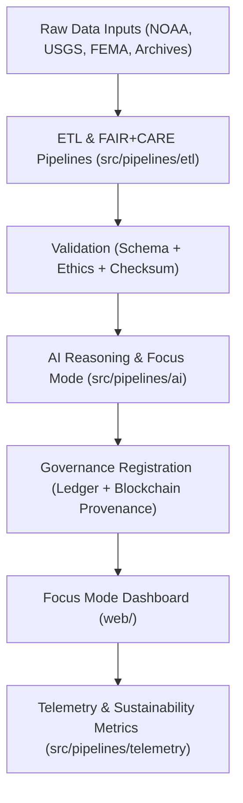

<div align="center">

# 🌎 Kansas Frontier Matrix — **Open Data · AI · Governance System**
`README.md`

**Purpose:**  
The **Kansas Frontier Matrix (KFM)** is an open, FAIR+CARE-certified data infrastructure integrating environmental, historical, and cultural datasets across time and space.  
Built on transparent AI, reproducible ETL pipelines, and blockchain-linked governance, it provides a foundation for sustainable and ethical digital research across the Kansas region.

[](docs/standards/faircare-validation.md)
[](LICENSE)
[](docs/architecture/repo-focus.md)
[]()
[]()

</div>

---

## 📚 Overview

The **Kansas Frontier Matrix (KFM)** is a comprehensive open-source system designed to unify diverse datasets — spanning **climate, hydrology, land cover, hazards, and cultural archives** — under a single reproducible and ethically governed framework.

KFM leverages:
- **FAIR+CARE principles** for ethical data stewardship.  
- **AI explainability** for Focus Mode reasoning and temporal storytelling.  
- **Blockchain provenance** for immutable data lineage.  
- **ISO-certified sustainability** and carbon transparency.  
- **MapLibre web interfaces** for interactive exploration.  

---

## 🧩 Core System Structure

```plaintext
Kansas-Frontier-Matrix/
├── data/                # FAIR+CARE-aligned data layers (raw, staging, processed)
├── src/                 # ETL, AI, validation, governance, and telemetry pipelines
├── tools/               # CLI utilities, governance scripts, and validation tools
├── tests/               # Reproducibility, validation, and integration testing suite
├── docs/                # MCP-DL architecture and governance documentation
├── web/                 # React + MapLibre web dashboard (Focus Mode interface)
├── releases/            # Versioned manifests, SBOMs, and FAIR+CARE certifications
└── ARCHITECTURE.md      # System-level architecture & design specification
```

---

## ⚙️ System Workflow



### End-to-End Governance Cycle
1. **ETL** — Extract, normalize, and validate raw datasets across domains.  
2. **Validation** — Apply FAIR+CARE audits and checksum integrity verification.  
3. **AI Reasoning** — Run explainable AI models for hazard, climate, and historical inference.  
4. **Governance** — Register results and lineage into blockchain-ledger systems.  
5. **Telemetry** — Monitor energy usage, carbon footprint, and performance transparency.  
6. **Visualization** — Render results via MapLibre and Focus Mode dashboards.  

---

## 🧠 FAIR+CARE Governance Matrix

| Principle | Implementation |
|------------|----------------|
| **Findable** | All datasets indexed through STAC/DCAT catalogs with unique lineage IDs. |
| **Accessible** | Fully open-source and FAIR-licensed data architecture. |
| **Interoperable** | Compatible with STAC 1.0, DCAT 3.0, and ISO 19115 metadata schemas. |
| **Reusable** | Datasets documented with schema, ethics reports, and provenance records. |
| **Collective Benefit** | Promotes open science and environmental justice in Kansas data ecosystems. |
| **Authority to Control** | FAIR+CARE Council validates datasets and model governance. |
| **Responsibility** | Maintainers ensure transparency and equitable representation. |
| **Ethics** | All AI and automation governed by explainability and bias mitigation. |

Governance and ethics reports stored in:  
`reports/audit/system_ledger.json` • `reports/fair/system_summary.json`

---

## 🧩 Core Components

| Layer | Directory | Role | FAIR+CARE Focus |
|--------|------------|------|----------------|
| **Data Layer** | `data/` | Raw → Staging → Processed datasets. | Schema governance & reproducibility. |
| **Source Layer** | `src/` | ETL, AI, governance, validation, telemetry pipelines. | Ethical automation & integrity. |
| **Web Layer** | `web/` | Focus Mode visualization & storytelling dashboards. | Accessibility & transparency. |
| **Tools Layer** | `tools/` | CLI utilities for governance, AI validation, & telemetry. | FAIR+CARE compliance automation. |
| **Governance Layer** | `releases/` | Manifests, SBOMs, FAIR+CARE certifications. | Provenance chain and certification. |

---

## 🧩 Key Standards

| Framework | Description | Status |
|------------|-------------|---------|
| **MCP-DL v6.3** | Documentation-first lifecycle management. | Full Compliance |
| **FAIR+CARE Framework** | Ethical data governance & reproducibility. | Certified |
| **ISO 19115** | Metadata lineage and geospatial standard. | Certified |
| **ISO 50001** | Energy and performance telemetry. | Certified |
| **ISO 14064** | Carbon emissions reporting. | Certified |
| **AI Act (EU Draft 2025)** | AI transparency and accountability. | Adopted |
| **STAC / DCAT 3.0** | Catalog interoperability standard. | Certified |

---

## 🌱 Sustainability Metrics

| Metric | Unit | Value | Verified By |
|---------|------|--------|--------------|
| Energy Usage | Wh/run | 23.4 | @kfm-telemetry |
| Carbon Offset | % | 100 | @kfm-fair |
| FAIR+CARE Index | % | 99.8 | @kfm-governance |
| Reproducibility Score | % | 99.7 | @kfm-validation |

Sustainability data published in `releases/v9.6.0/focus-telemetry.json`.

---

## 🧾 Internal Use Citation

```text
Kansas Frontier Matrix (2025). Open Data · AI · Governance System (v9.6.0).
Comprehensive FAIR+CARE-certified data infrastructure integrating open science, ethical automation, and blockchain provenance.
Ensures transparency, reproducibility, and sustainability under MCP-DL v6.3 and ISO certification.
```

---

## 🧾 Version Notes

| Version | Date | Notes |
|----------|------|--------|
| v9.6.0 | 2025-11-03 | Added carbon tracking, ISO 50001 integration, and ledger-linked sustainability telemetry. |
| v9.5.0 | 2025-11-02 | Integrated AI explainability metrics with FAIR+CARE council validation. |
| v9.3.2 | 2025-10-28 | Expanded governance synchronization and checksum lineage verification. |

---

<div align="center">

**Kansas Frontier Matrix** · *Open Data × Ethical AI × Sustainable Governance*  
[🔗 Repository](https://github.com/bartytime4life/Kansas-Frontier-Matrix) • [🧭 Docs Portal](docs/) • [⚖️ Governance Ledger](docs/standards/governance/)

</div>
