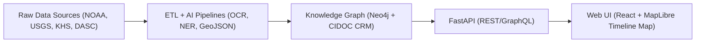

<div align="center">

# 🌾 **Kansas Frontier Matrix — Open-Source Geospatial Historical Mapping Hub**
`README.md`

**Purpose:** Provide an overview of the Kansas Frontier Matrix (KFM), its mission, architecture, data standards, and contribution guidelines — serving as the project’s entry point for developers, researchers, and collaborators.

[](docs/README.md)
[](LICENSE)
[](docs/standards/faircare.md)
[](https://stacspec.org)
[]()

</div>

---

## 📖 Table of Contents
- [Overview](#-overview)
- [Mission](#-mission)
- [Key Features](#-key-features)
- [System Architecture](#-system-architecture)
- [Data Standards](#-data-standards)
- [Focus Mode](#-focus-mode)
- [Installation & Usage](#-installation--usage)
- [Contributing](#-contributing)
- [License](#-license)
- [Version History](#-version-history)

---

## 🌍 Overview

**Kansas Frontier Matrix (KFM)** is an **open-source, multi-disciplinary knowledge system** designed to integrate Kansas’s environmental, cultural, and historical data into a cohesive, interactive digital atlas.  
It merges **maps, documents, and data** from diverse sources — USGS, NOAA, Kansas Historical Society, tribal archives, and more — into a semantic knowledge graph viewable through a timeline-map interface.

The project is built for **reproducibility, interoperability, and open collaboration**, aligning with the **Master Coder Protocol (MCP)** and **FAIR+CARE** principles.

---

## 🎯 Mission

> *“To weave Kansas’s past into a living digital landscape where history, geography, and ecology converge.”*

KFM’s mission is to **connect historical narratives with geospatial and environmental context**, empowering:
- **Researchers** to analyze historical and ecological change.
- **Educators** to visualize Kansas’s development through interactive storytelling.
- **Communities** to preserve and share local heritage data.

---

## ✨ Key Features

| Feature | Description |
|----------|-------------|
| 🗺️ **Interactive Map & Timeline** | Explore events, places, and people through a synchronized temporal-spatial interface using MapLibre GL. |
| 🧠 **AI-Powered Focus Mode** | Center the system on any entity (e.g., person, treaty, place) and dynamically filter all related data and insights. |
| 🔍 **Knowledge Graph** | Neo4j-based graph connecting entities like people, places, events, and documents, aligned with CIDOC CRM and OWL-Time. |
| ⚙️ **ETL & AI Pipelines** | Automated data ingestion, OCR, NLP, and geospatial transformation for reproducible dataset processing. |
| 📚 **FAIR+CARE Compliance** | Ensures data are Findable, Accessible, Interoperable, and Reusable, with CARE applied to Indigenous data. |
| 🧩 **STAC/DCAT Metadata** | All geospatial and tabular datasets use SpatioTemporal Asset Catalog (STAC 1.0.0) and DCAT 3.0 standards for open discovery. |
| 🌐 **Open-Source Governance** | Entire system runs on open standards, with transparent documentation and community-based versioning. |

---

## 🏗️ System Architecture

KFM’s modular architecture integrates **AI, ETL, and visualization pipelines** in a single reproducible monorepo:



**Core Layers**
1. **Data Source Layer:** External open datasets and archives.  
2. **ETL/AI Layer:** NLP, OCR, geocoding, summarization.  
3. **Graph Layer:** Semantic data relationships via Neo4j.  
4. **API Layer:** REST/GraphQL endpoints for map/timeline data.  
5. **Frontend Layer:** Interactive React-based map and timeline.

Refer to [`src/ARCHITECTURE.md`](src/ARCHITECTURE.md) for detailed diagrams and workflows.

---

## 🧱 Data Standards

KFM uses **open, machine-actionable metadata standards** to ensure data interoperability:

| Standard | Role |
|-----------|------|
| **STAC 1.0.0** | SpatioTemporal Asset Catalog for geospatial data indexing. |
| **DCAT 3.0** | Dataset metadata catalog for FAIR+CARE discoverability. |
| **CIDOC CRM** | Cultural heritage ontology linking entities and events. |
| **OWL-Time** | Temporal ontology for precise date and interval representation. |
| **GeoJSON / GeoTIFF** | Core open geospatial formats for data exchange. |
| **JSON-LD / RDF** | Semantic layer for knowledge graph export and SPARQL queries. |

Each dataset and pipeline output is versioned, checksum-verified, and validated through CI/CD (`stac-validate.yml` and `faircare-validate.yml`).

---

## 🧠 Focus Mode

**Focus Mode** is the AI-driven feature that enables users to “zoom in” semantically on an entity.  
Selecting an entity (e.g., *Medicine Lodge Treaty, 1867*) triggers contextual filtering:

1. **Neo4j Query**: Retrieve linked events, people, and documents.  
2. **Map View**: Zooms to relevant places; highlights correlated regions.  
3. **Timeline**: Filters to relevant time spans and related events.  
4. **AI Summary**: Generates contextual insights (trends, relationships, and impact).  

See [`src/ai/models/focus_transformer_v1/README.md`](src/ai/models/focus_transformer_v1/README.md) for model documentation.

---

## ⚙️ Installation & Usage

### Prerequisites
- Python 3.10+  
- Node.js 18+  
- Docker / Docker Compose  
- GDAL & rasterio for geospatial processing  

### Installation
```bash
git clone https://github.com/bartytime4life/Kansas-Frontier-Matrix.git
cd Kansas-Frontier-Matrix
make setup
```

### Running the Stack
```bash
docker-compose up
```
This launches:
- FastAPI backend  
- Neo4j database  
- React web client  

Visit `http://localhost:8000` for API docs and `http://localhost:3000` for the web app.

---

## 🤝 Contributing

Kansas Frontier Matrix is open for contributions under **MCP v6.3 documentation-first principles.**

### Guidelines
1. Fork and clone the repository.  
2. Create a feature branch (`git checkout -b feature/add-layer`).  
3. Add or modify code/data under proper directories (`src/`, `data/`, `docs/`).  
4. Document all changes before pushing (README, architecture, or dataset manifest).  
5. Submit a pull request using the [Issue Templates](.github/ISSUE_TEMPLATE).  

All contributions must pass **FAIR+CARE validation** and **CI checks** before merging.

---

## ⚖️ License

This project is released under the **MIT License** for code and **CC-BY 4.0** for documentation and data.  
See [LICENSE](LICENSE) for full terms.

---

## 🕰️ Version History

| Version | Date | Author | Summary |
|----------|------|---------|----------|
| v9.7.0 | 2025-11-05 | A. Barta | Added AI Focus Mode, FAIR+CARE validation, and STAC/DCAT compliance updates. |
| v9.5.0 | 2025-10-20 | A. Barta | Enhanced data ingestion workflows and metadata governance. |
| v9.3.0 | 2025-08-15 | KFM Core Team | Implemented telemetry and explainability dashboards. |
| v9.0.0 | 2025-06-01 | KFM Core Team | Initial project release and documentation baseline. |

---

<div align="center">

**© 2025 Kansas Frontier Matrix**  
Built under the **Master Coder Protocol v6.3** · FAIR+CARE Compliant · “Diamond⁹ Ω / Crown∞Ω Certified”  
[Website](https://github.com/bartytime4life/Kansas-Frontier-Matrix) · [Documentation](docs/README.md)

</div>