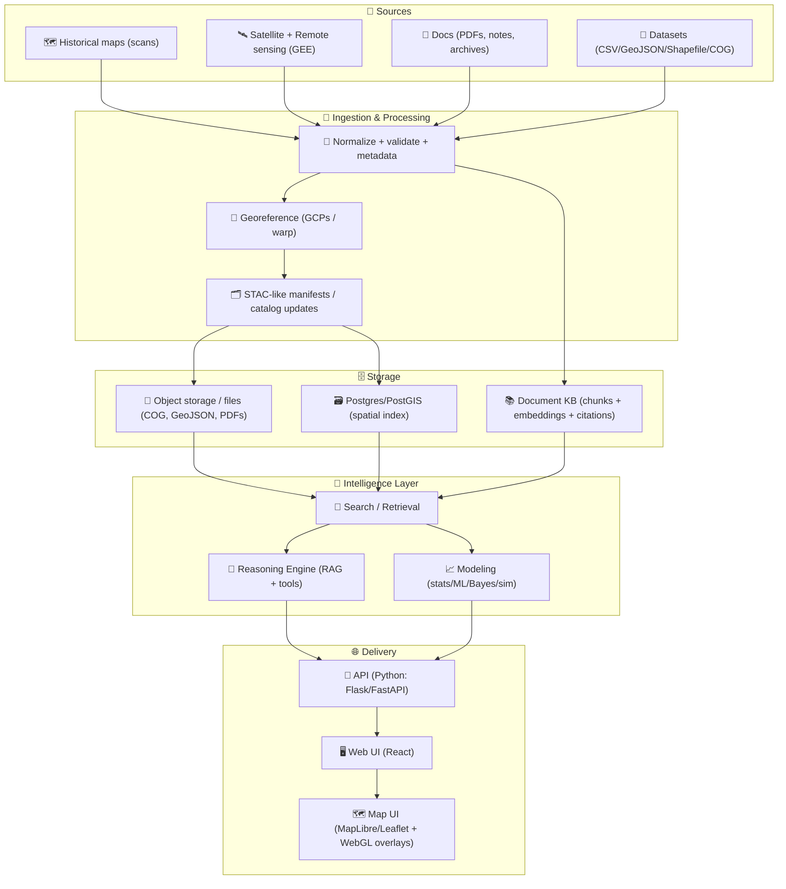

# Kansas Frontier Matrix (KFM) 🧭🗺️  
**An open-source geospatial + knowledge + modeling hub for Kansas** — built to fuse **historical mapping**, **remote sensing**, **GIS**, **simulation**, and **AI-assisted research workflows** into one cohesive system.


> 🎯 **Goal:** Make Kansas-scale spatial truth **searchable**, **mappable**, **auditable**, and **modelable**—from scanned historic maps and archival documents to modern satellite-derived datasets.

---

## ✨ What this repository is
Kansas Frontier Matrix is designed as a **multidisciplinary platform** combining:
- 🗺️ **Geospatial cataloging** (vector + raster + time)
- 🛰️ **Remote sensing workflows** (Google Earth Engine–style pipelines)
- 📚 **Document knowledge base** (historical sources + notes + metadata)
- 🧠 **AI reasoning & retrieval** (human-in-the-loop, citation-first workflows)
- 📈 **Modeling & simulation** (statistics → ML → Bayesian → system simulation)
- 🌐 **Interactive visualization** (web maps, layers, 3D overlays, timelines)

---

## 🧩 Core capabilities
- 🗃️ **Data ingestion + normalization**
  - Historical maps (georeferenced), shapefiles, GeoJSON, rasters, tabular datasets
  - Cataloged using a **STAC-like** manifest approach (metadata-first)
- 🧭 **Search + discovery**
  - “Find me all layers related to *railroads 1860–1910* near *X county*”
- 🕰️ **Time-aware mapping**
  - Timeline slider for historical changes, events, land-use transitions
- 🧪 **Experiment-friendly**
  - Notebooks + scripts for research workflows (reproducible pipelines)
- 🧱 **Clean architecture minded**
  - Separation of concerns: domain logic ≠ infrastructure ≠ UI
- 🔐 **Human-centered governance**
  - Digital Humanism + privacy/security principles baked into process & design

---

## 🧭 Architecture at a glance


---

## 🗂️ Repository map (suggested structure)
> 📌 If your repo already has a structure, keep it—this is the “target shape” for clarity.

```text
Kansas-Frontier-Matrix/
├─ 📁 api/                     # Python API (Flask/FastAPI)
│  ├─ 📁 app/
│  ├─ 📁 domain/
│  ├─ 📁 services/
│  ├─ 📁 adapters/
│  └─ 📁 infrastructure/
├─ 📁 web/                     # Front-end (React)
│  ├─ 📁 src/
│  └─ 📁 public/
├─ 📁 data/                    # Curated datasets + manifests
│  ├─ 📁 raw/
│  ├─ 📁 processed/
│  └─ 📁 catalog/              # STAC-like JSON manifests
├─ 📁 scripts/                 # CLI utilities (ingest, validate, export)
├─ 📁 notebooks/               # Research notebooks (EDA, experiments)
├─ 📁 mcp/                     # “Master Coder Protocol” + SOPs (ops + governance)
├─ 📁 docs/                    # Docs & diagrams
│  └─ 📁 library/              # Reference PDFs (optional)
├─ 🧪 tests/
├─ 🐳 docker-compose.yml
├─ 🧾 .env.example
└─ 📘 README.md
```

---

## 🚀 Quickstart
### Option A — Docker (recommended) 🐳
```bash
# 1) Clone
git clone https://github.com/<your-org>/Kansas-Frontier-Matrix.git
cd Kansas-Frontier-Matrix

# 2) Configure environment
cp .env.example .env

# 3) Run
docker compose up --build
```

### Option B — Local dev (Python + Node) 💻
```bash
# Python backend
python -m venv .venv
source .venv/bin/activate
pip install -r api/requirements.txt
python -m api.app

# Web frontend
cd web
npm install
npm run dev
```

✅ Expected local endpoints (typical):
- `http://localhost:8000` → API  
- `http://localhost:5173` → Web UI  

---

## 🗺️ Data standards & conventions
To keep the system interoperable and scalable:

- 🧾 **Catalog manifests**: STAC-like JSON (dataset id, bbox, time range, provenance, license, checksum)
- 🌍 **Vector**: GeoJSON (preferred for transport), Shapefile (accepted for ingest)
- 🧊 **Raster**: Cloud-Optimized GeoTIFF (COG) preferred for web streaming
- 🧭 **CRS**: store original + normalized “web map CRS” derivatives when needed
- 🧾 **Provenance-first**: every dataset should have:
  - Source reference(s)
  - Transform history (what changed, when, by whom)
  - Citation-ready metadata

---

## 🧠 Modeling & analytics (the “Matrix” part)
KFM isn’t just a map viewer — it’s a **modeling workbench**:

- 📈 **Statistics & regression**: trend modeling, uncertainty, bias checks, reproducible inference
- 🎲 **Bayesian workflows**: posterior reasoning, uncertainty propagation, decision support
- 🧠 **ML / Deep learning**: classification, change detection, feature extraction (where appropriate)
- 🛰️ **Remote sensing analytics**: indices, time-series, land cover transitions
- 🧪 **Simulation**: scenario testing, sensitivity analysis, model validation practices

> ✅ Principle: **Models support decisions; they don’t replace accountability.**

---

## 🌐 Visualization stack
- 🗺️ Web maps with modern rendering (MapLibre/Leaflet-style patterns)
- 🎛️ Layer controls + filters + queryable features
- 🕰️ Timeline slider for time-enabled datasets
- 🧊 Web-friendly raster tiling patterns (COG / tiled sources)
- 🧱 Optional: WebGL overlays (for 3D, dense data, GPU acceleration)

---

## 🔐 Security, privacy, and human-centered design ❤️
KFM is designed with a strong bias toward:
- ✅ Human agency and oversight (no “black box governance”)
- ✅ Data minimization and access control where required
- ✅ Auditability: *what the system shows* must be traceable to *why it shows it*
- ✅ Respect for communities and historical context (especially for sensitive datasets)

---

## 🤝 Contributing
We welcome contributions that improve:
- 🧾 data provenance, ingest tooling, validation
- 🗺️ mapping UX (layers, timeline, search, performance)
- 📈 modeling modules + reproducibility
- 📚 documentation + tutorials + examples

Suggested contribution workflow:
1. 🍴 Fork / branch  
2. ✅ Add tests where applicable  
3. 🧹 Format + lint  
4. 📣 Open PR with a short “why” + screenshots (for UI changes)

---

## 🛣️ Roadmap (starter)
- [ ] 🗂️ Dataset manifest schema + validator CLI  
- [ ] 🛰️ Remote sensing pipeline templates (GEE-like jobs → catalog)  
- [ ] 🧾 Document KB ingestion (chunking + metadata + citations)  
- [ ] 🗺️ Map + timeline MVP (layer browser, search, feature inspect)  
- [ ] 📈 Modeling notebooks: regression + Bayesian + simulation examples  
- [ ] 🔐 Auth + roles (public vs collaborator vs admin)  
- [ ] 📦 Reproducible releases (versioned catalogs + changelogs)

---

## 📚 Project reference library (all included project files)
> 🎒 This repo is backed by a **curated, multidisciplinary reading pack** used to shape architecture, modeling rigor, GIS workflows, and UI/infra decisions.

<details>
<summary><strong>📦 Expand: Reference PDFs & what they influence</strong></summary>

### 🧭 Core KFM documentation
- **Kansas Frontier Matrix (KFM) – Comprehensive Technical Documentation** → overall platform vision, architecture, modules
- **Kansas-Frontier-Matrix — Open-Source Geospatial Historical Mapping Hub Design** → geospatial hub blueprint, STAC-like cataloging, map+timeline UX, repo patterns

### 🗺️ GIS, cartography & geoprocessing
- **Geographic Information System Basics** → fundamentals, spatial concepts
- **Geoprocessing with Python** → scripting patterns for GIS workflows
- **Python Geospatial Analysis Cookbook** → practical recipes for GeoPandas/raster/vector ops
- **Making Maps: A Visual Guide to Map Design for GIS** → cartographic clarity & UX

### 🛰️ Remote sensing & Earth Engine
- **Cloud-Based Remote Sensing with Google Earth Engine — Fundamentals and Applications** → scalable RS workflows
- **Google Earth Engine Applications** → end-to-end examples for analytics & products

### 🌐 Web mapping, web UI & graphics
- **Responsive Web Design with HTML5 and CSS3** → layout, accessibility, front-end structure
- **Google Maps JavaScript API Cookbook** → mapping interaction patterns and API design ideas
- **Google Maps API Succinctly** → lightweight reference (API mental model)
- **WebGL Programming Guide** → GPU rendering basics, overlays, performance
- **Computer Graphics using JAVA 2D & 3D** → graphics fundamentals transferable to WebGL thinking

### 🧱 Architecture, systems & scalability
- **Clean Architectures in Python** → layering, boundaries, testable design
- **Scalable Data Management for Future Hardware** → storage/compute scaling perspective
- **Implementing Programming Languages** → compilers/interpreters mental models (useful for DSLs + pipelines)
- **Introduction to Docker** → containerization and reproducible environments
- **Command Line Kung Fu** → shell workflows, automation tricks (pipeline ergonomics)

### 🗄️ Databases & backend development
- **PostgreSQL Notes for Professionals** → SQL patterns, indexing, operations
- **MySQL Notes for Professionals** → alternate DB patterns & compatibility
- **Node.js Notes for Professionals** → services, tooling, integration patterns

### 📈 Data science, statistics & experimental design
- **Applied Data Science with Python and Jupyter** → notebooks, reproducible analytics
- **Regression Analysis with Python** → modeling foundations for trend + inference
- **Understanding Statistics & Experimental Design** → study design + inference hygiene
- **Statistics Done Wrong** → failure modes, bias, misuse prevention
- **Graphical Data Analysis with R** → visual reasoning and exploratory rigor

### 🧠 AI, ML & Bayesian reasoning
- **AI Foundations of Computational Agents (3rd Ed.)** → agents, decision-making, reasoning patterns
- **Artificial Neural Networks: An Introduction** → ANN fundamentals
- **Deep Learning in Python — Prerequisites** → DL pipeline prerequisites & best practices
- **Bayesian Computational Methods** → Bayesian computation, uncertainty-driven modeling

### 🧪 Simulation & engineering methods
- **Scientific Modeling and Simulation (NASA-grade guide)** → modeling discipline, validation, verification
- **Generalized Topology Optimization for Structural Design** → optimization thinking (networks/infrastructure)
- **Spectral Geometry of Graphs** → graph theory + structure analysis (networks, regions, connectivity)

### ❤️ Human-centered foundations
- **Introduction to Digital Humanism** → human values, security/privacy framing
- **Principles of Biological Autonomy** → autonomy, systems thinking, participatory epistemology

</details>

---

## 🧾 License
MIT (suggested). If you need a different license (Apache-2.0, GPL, CC for data), add it explicitly.

---

## 🙌 Acknowledgements
Built by combining **geospatial engineering**, **data science rigor**, **systems design**, and **human-centered governance** into a single cohesive platform for Kansas-scale exploration and decision support. 🌾
