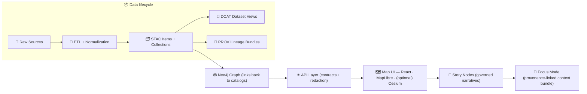

# 🌾🗺️ Kansas Matrix System (KFM) — *Provenance‑First Living Atlas*


-brightgreen)

**KFM is a geospatial knowledge + modeling platform** that fuses **maps**, **datasets**, **historical narratives**, and **AI-assisted analysis** into a single governed system — where every output has a traceable “**map behind the map**.” ✅

> [!IMPORTANT]
> **KFM is not a black-box GIS.** Nothing “magically appears” in the UI without passing through deterministic pipelines, catalogs, governance checks, and contracted APIs.

---

## ✨ What you get

- 🧱 **Pipeline → Catalog → Graph → API → UI → Story Nodes → Focus Mode** (strict ordering)
- 🧾 **Evidence metadata**: STAC / DCAT / PROV boundary artifacts
- 🧭 **Interactive web atlas**: Map + timeline + narrative reading
- 🧠 **Focus Mode AI** (local LLM via Ollama) with **citations** + policy enforcement
- 🛡️ **Policy-as-code** (OPA/Rego) for access control, redaction, publication gates, and AI rules

---

## ⚡ Quick Start (Docker Compose)

> [!TIP]
> This is the recommended path for a consistent dev environment (DBs, API, UI, and optional AI services).

### 1) Prereqs ✅
- Docker Desktop (or Docker Engine) + Docker Compose plugin  
- Git  
- (Optional) Ollama installed locally if you want **local** Focus Mode AI

### 2) Boot the stack 🚀
```bash
# from repo root
cp .env.example .env   # if present
docker compose up --build
# (older installs: docker-compose up --build)
```

### 3) Open the services 🌐
- 🧪 API docs (Swagger): `http://localhost:8000/docs`
- 🗺️ Web UI: `http://localhost:3000`
- 🕸️ Neo4j Browser: `http://localhost:7474`
- 🐘 PostGIS: `localhost:5432`

> [!WARNING]
> If you have port conflicts, the usual suspects are: **5432**, **7474**, **7687**, **8000**, **3000**.  
> Update your `.env` and/or `docker-compose.yml` accordingly.

---

## 🧩 Architecture at a glance



---

## 🧭 Non‑negotiable invariants (don’t fight these)

> [!CAUTION]
> These are **hard rules**. If you break them, KFM becomes un-auditable.

1. **Pipeline ordering is absolute**  
   **ETL → STAC/DCAT/PROV → Graph → API → UI → Story Nodes → Focus Mode**
2. **API boundary rule**  
   The UI **must never** query PostGIS/Neo4j directly — only through the governed API.
3. **Provenance First**  
   No dataset, narrative claim, or AI answer is “valid” without traceable sources.

---

## 🗂️ Repo layout (v13+ canonical homes)

```text
📁 .
├── 📦 data/
│   ├── 🧪 raw/<domain>/                 # immutable-ish source snapshots
│   ├── 🧰 work/<domain>/                # intermediate pipeline outputs
│   ├── ✅ processed/<domain>/           # final published outputs (evidence artifacts)
│   ├── 🗂️ stac/
│   │   ├── collections/                 # STAC collections
│   │   └── items/                       # STAC items
│   ├── 🧾 catalog/
│   │   └── dcat/                        # DCAT JSON-LD catalog entries
│   └── 🔗 prov/                         # PROV lineage bundles
├── 🧠 src/
│   ├── 🧪 pipelines/                    # deterministic ETL jobs (domain pipelines)
│   ├── 🕸️ graph/                        # graph build/migrations/sync tooling
│   └── 🌐 server/
│       ├── contracts/                   # OpenAPI / GraphQL SDL / schema contracts
│       └── ...                          # API implementation (REST/GraphQL)
├── 🗺️ web/                              # React UI (MapLibre configs, layers, components)
├── 🛡️ policy/                           # OPA/Rego policy-as-code (data + AI + access)
├── 🧬 schemas/                          # JSON Schemas (STAC/DCAT/PROV/story nodes/etc.)
├── 📚 docs/
│   ├── 🏛️ architecture/                 # system design docs, ADRs, blueprints
│   ├── 🧷 standards/                    # governed standards + profiles
│   ├── 🧩 templates/                    # doc/story/api templates
│   ├── 📒 data/<domain>/                # domain runbooks + notes
│   └── 📝 reports/story_nodes/
│       ├── 🧪 draft/                    # WIP narratives
│       └── ✅ published/                 # released narratives (folder-per-story)
├── 🧪 tests/                             # unit + integration tests
├── 🧰 tools/                             # validation + helper utilities (if present)
└── 🧫 mcp/                               # methods & computational experiments (optional)
```

> [!NOTE]
> If you see legacy folders (e.g., `api/`, `pipelines/`, `src/api/`), treat them as **migration targets** into the canonical homes above.

---

## 🧱 Core subsystems (how the pieces fit)

### 📦 Data & Pipelines (`src/pipelines/`)
- Deterministic ETL transforms **raw** → **processed** outputs
- Pipelines must be **idempotent** (re-running shouldn’t create duplicate “truth”)
- Outputs must generate boundary artifacts before “publication”:
  - 🗂️ STAC records
  - 🧾 DCAT dataset entries
  - 🔗 PROV lineage bundles

### 🕸️ Knowledge Graph (`src/graph/`)
- Neo4j stores **relationships** across people, places, events, documents, datasets
- Graph nodes should always reference back to catalog + provenance IDs

### 🌐 API Boundary (`src/server/`)
- FastAPI-style service boundary (REST and/or GraphQL)
- **Contract-first** development:
  - define/extend schemas & contracts first (`src/server/contracts/`)
  - implement resolvers/controllers second
  - add tests + (if needed) redaction rules

### 🗺️ Web UI (`web/`)
- React UI is a **pure client**
- It renders what the API returns, and surfaces provenance in legends/popovers/tooltips
- Map layers must cite their underlying evidence sources

### 📝 Story Nodes (`docs/reports/story_nodes/`)
Story Nodes are “**machine-ingestible storytelling**”:
- Every claim must be backed by citations/provenance
- Entities should link to stable graph IDs
- Facts vs interpretation must be distinguishable (especially with AI assistance)

### 🧠 Focus Mode (AI)
- AI must operate **through approved tools/APIs** (never direct DB access)
- AI must return **answers with citations**
- AI outputs are subject to governance policy checks (redaction, disallowed content, sensitive topics)

---

## 🧪 Common developer tasks

### Run tests ✅
```bash
docker compose exec api pytest
```

### Run a pipeline (example) 🧪
```bash
docker compose exec api python src/pipelines/<domain>/run.py
```

### Seed sample data (if included) 🌱
```bash
docker compose exec api python scripts/init_sample_data.py
```

### Explore APIs 🔎
- Swagger: `http://localhost:8000/docs`
- If enabled, GraphQL: `http://localhost:8000/graphql`

---

## 🛡️ Governance & policy (OPA/Rego)

KFM encodes governance rules as **versioned policy-as-code** in `policy/`:
- ✅ publication gates (metadata required, licenses required, provenance required)
- 🔐 access control + redaction (e.g., sensitive datasets)
- 🧠 AI behavior constraints (citations required, refusal paths, sensitive info blocking)

> [!TIP]
> Treat governance like code: propose changes by PR, review them, test them, version them.

---

## 🤝 Contributing

We welcome contributions — **as long as they preserve provenance**. 🙌

### ✅ Contribution checklist
- [ ] Deterministic pipeline (or doc-only change) with repeatable steps
- [ ] STAC/DCAT/PROV artifacts produced/updated where applicable
- [ ] Graph + API + UI changes follow the canonical ordering
- [ ] Policies updated if you introduce new sensitivity or access rules
- [ ] Tests added/updated (unit + integration where relevant)
- [ ] Documentation updated (domain runbooks, templates, or architecture notes)

> [!IMPORTANT]
> If you’re adding a new dataset/domain: start at `data/raw/<domain>/` and add a runbook at `docs/data/<domain>/README.md`.

---

## 📚 Key docs (start here)

- 📘 `docs/MASTER_GUIDE_v13.md` — canonical structure + rules of the road  
- 🏛️ `docs/architecture/` — blueprints, diagrams, ADRs  
- 🧷 `docs/standards/` — STAC/DCAT/PROV profiles + governance standards  
- 🧩 `docs/templates/` — governed templates (Story Nodes, API changes, etc.)

---

## 🗺️ Roadmap (high level)

<details>
  <summary>Click to expand 🔮</summary>

- 🧠 More robust Focus Mode tool-use + provenance bundles
- 🧭 Stronger redaction + sensitivity tiers (policy-driven)
- 🛰️ More domains (remote sensing, surveys, archival corpora, simulation outputs)
- 🧱 Better contract validation + schema versioning automation
- 🌐 Public “evidence explorer” experience (downloadable + citable artifacts)

</details>

---

## 📄 License

📌 **TBD** — add a `LICENSE` file and update this section once selected.

---

## 🆘 Troubleshooting (fast fixes)

- 🧱 **DB not ready** → re-run `docker compose up` and check logs  
- 🔁 **Hot reload not working** → verify volume mounts for `web/src` and server code  
- 🚫 **Ports busy** → stop the conflicting service or remap ports in `.env` / compose  
- 🧠 **Ollama not reachable** → ensure `ollama serve` is running and the API can reach `11434`  