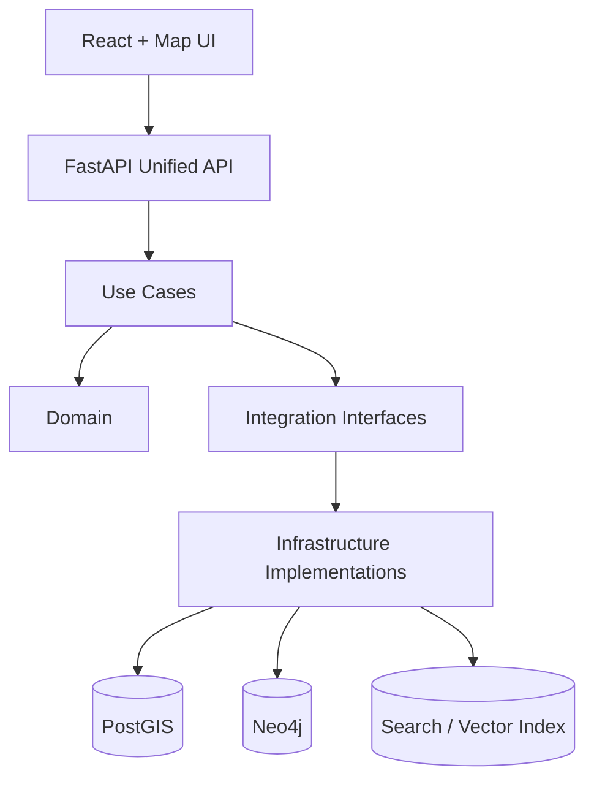
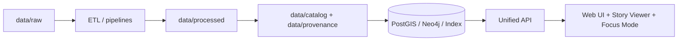

# Kansas Frontier Matrix (KFM)

**Kansas Frontier Matrix (KFM)** is a governed, evidence-backed geospatial + narrative platform: **interactive maps + timelines + Story Nodes + citation-first answers** delivered through a single, policy-enforced API.

This repository is designed as a **monorepo** so that **code, data, and documentation evolve in lockstep**, enabling end-to-end provenance and reproducibility.

---

## 📘 Overview

### What KFM is
KFM combines:

- **Geospatial data + time** (map layers, time sliders, spatial/temporal filters)
- **Narrative “Story Nodes”** (structured Markdown stories anchored to places, dates, and layers)
- **A unified backend API** (the *only* supported access path to governed data/services)
- **Policy enforcement** at the API boundary (a “trust membrane” that blocks bypasses and enforces rules)

### Core commitments (non-negotiables)
- **Clean Architecture / layered design** so business logic is separated from infrastructure and can evolve safely.
- **“Trust membrane” enforcement**: clients (UI or external) do **not** talk directly to databases; governance checks apply to every request/response.
- **FAIR + CARE governance**: metadata + provenance are required for datasets; culturally sensitive content gets extra safeguards.
- **Open licensing by default**: code and content are structured for reuse and responsible sharing.

---

## 🚀 Quickstart

> The fastest way to run the full stack locally is Docker Compose.

### Prerequisites
- Docker + Docker Compose
- Git
- Free local ports (defaults commonly include: **5432, 7687, 7474, 8000, 3000**)

### Start the stack
From the repository root:

```bash
docker-compose up --build
```

### What should come up
Typical dev defaults include:

- **PostgreSQL/PostGIS**: `localhost:5432`
- **Neo4j**: Bolt `localhost:7687` (and browser often at `http://localhost:7474`)
- **FastAPI backend**: `http://localhost:8000`
  - Swagger/OpenAPI UI: `http://localhost:8000/docs`
- **React web UI**: `http://localhost:3000`

### Sanity checks
- API: open `http://localhost:8000/docs` and try a simple GET (e.g., list datasets if present)
- Web UI: open `http://localhost:3000` and confirm base map loads
- Neo4j (if enabled): open `http://localhost:7474`

### Common troubleshooting
- **Port conflicts**: stop your local Postgres/Neo4j/etc or change Compose port mappings.
- **DB not ready**: if the API starts before DB, check logs and re-run `docker-compose up`.
- **Docker memory limits**: large datasets may require more memory.
- **Mounted volume permissions**: ensure `data/` and other mounted folders are writable.

---

## 🧱 Architecture at a glance

### Clean Architecture layers (KFM pattern)
KFM follows a layered architecture separating core rules from frameworks:

- **Domain layer**: core entities and concepts (framework-agnostic)
- **Use Case layer**: application workflows
- **Integration & Interface layer**: interfaces/adapters that connect core logic to external systems (repositories, gateways)
- **Infrastructure layer**: concrete implementations (DBs, web frameworks, deployment configs)



### Trust membrane + unified gateway
KFM treats the backend as a **single governed gateway**:

- The **FastAPI API** orchestrates internal calls (PostGIS, Neo4j, search index, AI services).
- **Clients never talk directly to databases**.
- Governance checks (including policy-as-code) apply **uniformly** to all requests and responses.

---

## 📦 Data + narrative “truth path”

KFM’s end-to-end “truth path” is designed to preserve lineage while adding value at each stage:



### Metadata & provenance are first-class
KFM expects standards-aligned metadata and lineage artifacts (commonly referenced: **STAC, DCAT, PROV**). New datasets should not be merged without required manifests/metadata/provenance.

### Story Nodes
Story Nodes are governed Markdown narratives that must conform to required templates and citation rules.

> **Expected location (by convention/versioned guidance):** `docs/reports/<topic>/story_nodes/`  
(Repo conventions may vary; align to the project’s governed documentation structure.)

---

## 🗂️ Repository layout

> Exact paths can vary by repo version; the intent is a clear, canonical home for every artifact.

| Area | Path (typical) | What lives here |
|------|-----------------|-----------------|
| Backend API | `api/` or `backend/` | FastAPI app, routes/controllers, services/use-cases, repository adapters, pipelines/scripts |
| Frontend | `web/` (with `web/src/`) | React UI, MapLibre GL map components, story viewer, timeline/layer controls |
| Data lake (versioned) | `data/` | `data/raw/`, `data/work/`, `data/processed/`, plus metadata + provenance folders |
| Documentation | `docs/` | Architecture, API docs, governance policies, CI guides, reference standards, story nodes |
| Deployment | `deploy/` and/or repo root | Compose files, Kubernetes manifests, CI/CD configuration |

### Documentation sub-areas (common conventions)
- `docs/governance/` — sovereignty/ethics/policy docs
- `docs/ci/` — CI rules, validation procedures, PR checklists
- `docs/reference/` — collected standards and references
- `docs/api/` — API usage/contracts (with OpenAPI/GraphQL links as applicable)

---

## 🧪 Validation, CI/CD, and the Master Coder Protocol (MCP)

KFM’s contribution model assumes strong automated gates:

- CI validates **code**, **data**, and **docs**
- CI can include schema checks (e.g., metadata JSON validation), linters, and test suites
- Policy checks may be enforced both in CI and at runtime through the API boundary

**MCP highlights (practical expectations):**
- Every code change includes tests; quality gates must pass.
- New datasets must include metadata (license/source) and provenance artifacts.
- Story Nodes must follow templates and citation requirements.
- **No secrets committed**: configuration via environment variables.
- Architectural layering is enforced in review (e.g., don’t put business logic in route handlers; don’t bypass repository interfaces).

---

## 🤝 Contributing

A typical contributor workflow:

1. **Open / pick an issue**
2. **Create a branch**
3. Make changes:
   - code changes in the correct layer
   - data additions in correct folders + metadata/provenance updates
   - documentation updates when required
4. **Run local checks** (examples):
   - Backend tests (example): `docker-compose exec api pytest`
   - Linters (example): `npm run lint`
   - Docs build (if used): `mkdocs serve`
5. **Open a Pull Request**
6. **CI runs** (build/test/lint + validate data/docs)
7. **Maintainer review** (architecture + governance compliance)
8. **Merge**, then deployment proceeds through the pipeline (with appropriate release gates)

> Contributions from external parties are expected to pass through governance gates: automated validation + maintainer approval.

---

## ⚖️ FAIR+CARE governance and sensitive data handling

KFM governance is designed to address both:
- **FAIR** requirements for data quality, discoverability, reuse, and interoperability (via required metadata/provenance)
- **CARE** requirements for data about Indigenous and vulnerable communities, including additional review and access controls

Common governance patterns described for KFM include:
- A **FAIR+CARE oversight** function for culturally sensitive content
- Dataset-level sensitivity flags (e.g., “indigenous”) that trigger extra review gates
- Policy enforcement that can restrict or redact outputs (for example, preventing precise locations for sensitive sites)

---

## 📜 License

Default licensing guidance:
- **MIT** for code
- **CC-BY** for data and documentation

See repository license files and dataset-level metadata for specifics and compatibility requirements.

---

## 🔗 Where to read more
- `docs/` (architecture, governance, CI, API usage)
- Story Nodes under `docs/reports/<topic>/story_nodes/` (by convention)
- Backend API docs at `http://localhost:8000/docs` when running locally