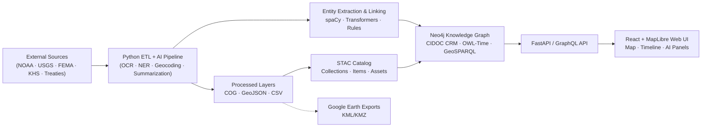

<div align="center">

# 🏗️ **Kansas Frontier Matrix — System Architecture**

### *Time · Terrain · History · Knowledge Graphs*

[](../../actions/workflows/site.yml)
[](../../actions/workflows/stac-validate.yml)
[](../../actions/workflows/codeql.yml)
[](../../actions/workflows/trivy.yml)
[](../docs/)
[%20%7C%20CC--BY%204.0%20\(docs\)-blue)](../LICENSE)
[](../docs/standards/)

</div>

---

## 📚 Table of Contents

* [🌾 Mission](#-mission)
* [🏛 Principles](#-principles)
* [🗺️ High-Level Diagram](#️-high-level-diagram)
* [🧱 Layered Architecture](#-layered-architecture)
* [🗂 Repository & Data Layout](#-repository--data-layout)
* [🧮 AI/ML Pipeline](#-aiml-pipeline)
* [🌐 API & Integration](#-api--integration)
* [🖥 Frontend](#-frontend)
* [🔒 Security, Integrity & Provenance](#-security-integrity--provenance)
* [🚀 CI/CD & Release Management](#-cicd--release-management)
* [📎 References](#-references)

---

## 🌾 Mission

**Kansas Frontier Matrix (KFM)** is a reproducible, open-source **geospatial–historical knowledge system** for Kansas that unites **people ↔ places ↔ events ↔ documents** in a **Neo4j-backed semantic graph**, surfaced through an interactive **Map + Timeline** UI. The system adheres to **MCP-DL v6.3**: documentation-first, versioned, provenanced, and auditable.

---

## 🏛 Principles

| Principle                        | Description                                                      |
| :------------------------------- | :--------------------------------------------------------------- |
| **Documentation-First (MCP-DL)** | Every change co-ships with docs, ADR/SOP updates, and metadata.  |
| **Reproducibility**              | Deterministic ETL, pinned environments, SHA-256 checksums.       |
| **Open Standards**               | STAC, DCAT, CIDOC CRM, OWL-Time, GeoSPARQL, PROV-O.              |
| **Separation of Concerns**       | ETL/AI ↔ Graph ↔ API ↔ Web, with clean interfaces.               |
| **Defense-in-Depth**             | CodeQL, Trivy, signed workflows, artifact retention, audit logs. |

---

## 🗺️ High-Level Diagram



---

## 🧱 Layered Architecture

### 1) **ETL & Data Processing** (`src/pipelines/`)

* **Extract**: APIs/archives → `data/raw/` (DVC/LFS pointers)
* **Transform**: GDAL/Rasterio/GeoPandas → `data/processed/` (COG, GeoJSON, CSV)
* **Catalog**: `data/stac/` STAC Items/Collections with `properties.version`, license, bbox, datetime
* **Validation**: `make stac-validate` + schema & checksum gates in CI

### 2) **AI/ML Enrichment**

* **OCR**: Tesseract/OpenCV for scanned docs → text
* **NLP**: spaCy custom NER + Transformers (summaries)
* **Linking**: fuzzy/contextual match → canonical graph nodes (USGS GNIS, controlled vocabs)
* **Evidence**: PROV-O lineage; confidence scores; multi-source corroboration

### 3) **Knowledge Graph** (Neo4j)

* **Model**: CIDOC CRM (entities/events/artifacts), OWL-Time (instants/intervals), GeoSPARQL (WKT)
* **Relations**: `MENTIONS`, `OCCURRED_AT`, `LOCATED_IN`, `PARTICIPATED_IN`
* **Ops**: Cypher constraints/indexes; spatial indexing; optional RDF export

### 4) **API Layer** (FastAPI + GraphQL)

* **Routes**: `/api/events`, `/api/entities/{id}`, `/api/search`, `/api/timeline`, `/api/tiles/{layer}`
* **Formats**: JSON, GeoJSON, CSV, DCAT/STAC; JSON-LD contexts for semantic clients
* **Security**: JWT auth, rate limits, structured audit logs, OpenAPI docs

### 5) **Frontend** (React + MapLibre + D3/Canvas Timeline)

* **Views**: map–timeline linkage; semantic highlight; AI summaries
* **UX**: WCAG 2.1 AA; keyboard nav; high-contrast mode
* **Config**: `web/config/layers.json` binds STAC items to UI layers

---

## 🗂 Repository & Data Layout

```text
Kansas-Frontier-Matrix/
├─ src/                # ETL, AI/ML, graph integration
├─ web/                # React SPA (MapLibre + Timeline)
├─ data/
│  ├─ sources/         # JSON manifests (provenance, endpoints)
│  ├─ raw/             # external data (via DVC/LFS)
│  ├─ processed/       # COG/GeoJSON/CSV outputs
│  └─ stac/            # STAC Items/Collections
├─ docs/               # ARCHITECTURE, SOPs, standards, model cards
├─ tools/              # utilities (checksums, tiles, deploy)
├─ tests/              # unit/integration tests
└─ .github/            # CI workflows + issue/PR templates
```

**Dataset requirements**

* Source manifest in `data/sources/` (license, URL, bbox, dates)
* Checksums (.sha256) for all artifacts
* STAC Item/Collection in `data/stac/` with version + links
* SOP or experiment log in `docs/`

---

## 🧮 AI/ML Pipeline

| Stage         | Tooling            | Output                                   |
| :------------ | :----------------- | :--------------------------------------- |
| OCR           | Tesseract, OpenCV  | Text from scans (with page coords)       |
| NER           | spaCy (custom)     | People/Places/Events/Dates spans         |
| Summarization | BART/T5            | Abstracts for UI/tooltips                |
| Geocoding     | GeoPy + GNIS       | Resolved lat/lon; disambiguated toponyms |
| Linking       | Rules + similarity | Entity IDs bound to graph nodes          |
| Cards         | MCP Model Cards    | Purpose, data, metrics, ethics, limits   |

All models and corpora are pinned; training/eval artifacts stored with checksums.

---

## 🌐 API & Integration

**Key endpoints**

* `GET /api/events?start=1850&end=1870&bbox=-100,37,-94,40`
* `GET /api/entities/{id}`
* `GET /api/search?q=“Santa Fe Trail”`
* `GET /api/tiles/{layer}` (vector/raster proxy)
* `GET /stac/*` (catalog access)

**Interchange**

* STAC 1.0 / DCAT 2.0 for dataset catalogs
* JSON-LD contexts for semantic clients
* KML/KMZ export for Google Earth

---

## 🖥 Frontend

| Subsystem | Stack       | Notes                                   |
| :-------- | :---------- | :-------------------------------------- |
| Map       | MapLibre GL | Layer toggles; STAC-driven sources      |
| Timeline  | D3/Canvas   | Smooth pan/zoom; linked selection       |
| Panels    | React       | AI summaries; entity detail; provenance |
| A11y      | WAI-ARIA    | Keyboard nav; skip links; focus traps   |

Deployment: GitHub Pages via `site.yml`, cache-busted assets, 404 fallback routing.

---

## 🔒 Security, Integrity & Provenance

| Control             | Mechanism                                          |
| :------------------ | :------------------------------------------------- |
| Static analysis     | CodeQL                                             |
| Dependency scanning | Trivy                                              |
| Provenance          | PROV-O + build logs + artifact hashes              |
| Integrity           | SHA-256 sidecars; reproducible ETL                 |
| AuthN/Z             | JWT; role-based guards on mutating routes          |
| CI governance       | Pinned actions, branch protection, required checks |

---

## 🚀 CI/CD & Release Management

* **Pipelines**: `pre-commit`, `unit-tests`, `stac-validate`, `codeql`, `trivy`, `pages-build-deployment`
* **Versioning**:

  * Code: SemVer (tags)
  * Data: STAC `properties.version`
  * Docs: MCP-DL header `version` + change log
* **PR Requirements**: passing CI, updated docs/STAC, license verification, checksum logs

**Quickstart**

```bash
make fetch            # download raw sources
make process          # normalize to COG/GeoJSON/CSV
make stac-validate    # validate STAC items/collections
make serve            # run API + web locally
```

---

## 📎 References

* `docs/file-and-data-architecture.md` — data layout & STAC rules
* `docs/templates/model_card.md` — MCP model cards
* `docs/standards/` — MCP-DL, markdown rules, ontology notes
* `web/` — SPA source (MapLibre + Timeline)
* `src/` — ETL, AI/ML, graph integration

---

<div align="center">

### 🏛 “Document the Frontier · Reconstruct the Past · Illuminate Connections.”

© 2025 Kansas Frontier Matrix — MIT (code) · CC-BY 4.0 (docs)

</div>
```
