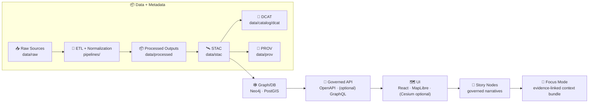

<div align="center">

# 🧭 Kansas Frontier Matrix (KFM)

**Open-source geospatial + historical mapping hub for Kansas — raw evidence ➜ governed datasets ➜ interactive 2D/3D maps ➜ evidence-backed answers.**[^kfm_system]

<p>
  <a href="https://github.com/bartytime4life/Kansas-Frontier-Matrix"></a>
  
  
  
  
</p>

<p>
  
  
  
</p>

**Repo Home:** [`../README.md`](../README.md) 🏠 · **Architecture:** [`../docs/architecture/`](../docs/architecture/) 🏗️ · **Standards:** [`../docs/standards/`](../docs/standards/) 🧾 · **Templates:** [`../docs/templates/`](../docs/templates/) 🧩

**Quick links:**  
[🚀 Quickstart](#-quickstart) · [🧱 Non-negotiables](#-non-negotiables-v13-invariants) · [🍳 Contribution flows](#-contribution-flows) · [🏗️ Architecture](#️-architecture-at-a-glance) · [📦 Repo layout](#-repo-layout-v13-friendly) · [🧩 the-github-folder](#-the-github-folder-what-lives-here) · [🧪 CI gates](#-fail-closed-ci-gates-what-blocks-a-merge) · [🤖 Focus Mode AI](#-focus-mode-ai-local-first-but-governed) · [📚 Project library](#-project-library) · [🧾 Sources](#-sources-footnotes)

</div>

> [!NOTE]
> This file lives in `.github/README.md` so it shows up when browsing the `.github/` folder.  
> If you maintain a root README, keep it shorter and link here for GitHub ops, CI gates, templates, and repo hygiene. 🧩

---

## 🔎 What is KFM?

KFM is a **pipeline → catalogs → graph/DB → API → UI → narratives → Focus Mode** system that turns raw historical + geospatial sources into **traceable** layers, stories, and answers.[^kfm_system][^v13_pipeline]

**Key boundary rule:** the UI does **not** query Neo4j/PostGIS directly — all access is mediated through the backend API so governance (redaction, licensing, sensitivity) is enforceable end-to-end.[^api_boundary]

> [!IMPORTANT]
> **Fail-closed by default:** if a policy/check is uncertain or fails, access/merges are blocked until fixed.[^fail_closed]

---

## 🧱 Non-negotiables (v13 invariants)

These are the “do not regress” rules we design CI/CD and reviews around:

- **Pipeline ordering is absolute:** ETL → (STAC/DCAT/PROV catalogs) → Graph → API → UI → Story Nodes → Focus Mode.[^v13_pipeline]  
- **Provenance-first:** every dataset and derived artifact (including AI/analysis outputs) requires **STAC + DCAT + PROV** before it can be used downstream.[^provenance_first][^stac_dcat_prov]  
- **Deterministic ETL:** pipelines are **idempotent**, config-driven, and logged (re-runnable without side effects).[^deterministic_etl]  
- **Evidence-first narrative:** Story Nodes and Focus Mode cannot introduce unsourced claims; all assertions must cite cataloged evidence.[^evidence_first]  
- **Sovereignty + classification propagation:** outputs cannot be **less restricted** than their inputs (sensitive in → sensitive out unless reviewed/redacted).[^sovereignty]

---

## 🚀 Quickstart

### ✅ Recommended: Docker Compose 🐳

```bash
# from the repo root
docker compose up --build
# (older Docker setups: docker-compose up --build)
```

Default local endpoints (adjust if your compose file differs):

- 🖥️ **Web UI**: `http://localhost:3000`
- 🧠 **API**: `http://localhost:8000`
- 📘 **Swagger / OpenAPI docs**: `http://localhost:8000/docs`
- 🕸️ **Neo4j Browser**: `http://localhost:7474`

> [!TIP]
> If ports conflict, update mappings in `docker-compose.yml` and restart. CI expects deterministic startup defaults for smoke tests.[^docker_quickstart]

---

## 🍳 Contribution flows

KFM contributions are intentionally “contracted” (schemas/templates first) and “evidence-first” (data + provenance before interpretation).[^contract_first][^stac_dcat_prov]

### 1) Add a dataset (Raw ➜ Work ➜ Processed ➜ Catalogs ➜ Graph)

**Canonical data lifecycle staging:**

- `data/raw/<domain>/...` (immutable source snapshots)  
- `data/work/<domain>/...` (intermediate scratch/artifacts)  
- `data/processed/<domain>/...` (final, serveable outputs)  
- `data/stac/…` + `data/catalog/dcat/…` + `data/prov/…` (boundary artifacts)  
- then (and only then) load into Neo4j/PostGIS via governed loaders.[^domain_pattern][^stac_dcat_prov]

**Dataset PR must include:**

- ✅ processed artifact(s) under `data/processed/...`
- ✅ STAC Collection/Item(s) under `data/stac/...`
- ✅ DCAT dataset record under `data/catalog/dcat/...`
- ✅ PROV lineage under `data/prov/...`
- ✅ domain runbook under `docs/data/<domain>/README.md` (sources, ETL steps, caveats)[^domain_pattern]

> [!CAUTION]
> Any proposal that “skips stages” (e.g., “inject data directly into UI”) is considered flawed unless rigorously justified.[^v13_pipeline]

---

### 2) Add an evidence artifact (analysis/AI output) 🧪🤖

KFM treats analysis outputs (OCR corpora, predicted layers, simulations) as **first-class datasets** with the same metadata/provenance requirements.[^evidence_artifacts]

**Rule of thumb:** if it will be shown, queried, or cited — it must be processed + cataloged + prov-traced like anything else.

---

### 3) Add a Story Node (governed narrative + choreography) 📚🗺️

A Story Node is typically:

- a **Markdown narrative** (citations required), plus  
- a **machine-ingestible choreography** that drives map state (layers, camera, timeline).[^story_nodes][^v13_story_focus]

Recommended home (v13): `docs/reports/story_nodes/…` (draft/published), validated by template + schema checks.[^v13_story_home]

---

### 4) Change an API contract (OpenAPI/GraphQL) 🔌📜

API changes are contract-first and versioned. Breaking changes require intentional versioning and updated tests.[^api_versioning]

Use the API contract extension template (recommended):  
`docs/templates/TEMPLATE__API_CONTRACT_EXTENSION.md`[^templates]

---

## 🏗️ Architecture at a glance

### High-level pipeline flow (v13 mental model)



**Why this matters:** every stage consumes only the formally validated outputs of the previous stage (traceability, reproducibility, governance).[^v13_pipeline][^stac_dcat_prov]

---

## 📦 Repo layout (v13-friendly)

KFM is a monorepo: **code + data + docs** versioned together so governance and evidence can be reviewed like code.[^repo_versioning]

### Canonical targets (with migration notes)

```text
📦 Kansas-Frontier-Matrix/
├─ 🧩 .github/                     # GitHub automation + templates + workflows (this folder) 🛠️
├─ 🧠 api/                          # FastAPI backend (current home) 🔌
├─ 🗺️ web/                          # React + TypeScript UI (current home) 🧭
├─ 🧰 pipelines/                     # ETL + validators + exporters 🧪
├─ 🗃️ data/
│  ├─ 📥 raw/                       # Immutable inputs (as obtained) 🔒
│  ├─ 🧪 work/                      # Intermediate/scratch artifacts 🧫
│  ├─ 🧼 processed/                  # Cleaned/normalized outputs (serveable) ✅
│  ├─ 🛰️ stac/
│  │  ├─ collections/               # STAC Collections
│  │  └─ items/                     # STAC Items
│  ├─ 🧾 catalog/
│  │  └─ dcat/                      # DCAT dataset records
│  └─ 🧾 prov/                      # PROV lineage bundles
├─ 📚 docs/
│  ├─ 🏗️ architecture/              # system overview, redesign blueprints, diagrams
│  ├─ 🧾 standards/                  # STAC/DCAT/PROV profiles, markdown protocol, ontology rules
│  ├─ 🧩 templates/                  # governed doc + story + API-change templates
│  ├─ 🧭 governance/                 # ethics/sovereignty/policy docs
│  └─ 📖 reports/story_nodes/        # Story Nodes (draft/published)
└─ 📌 CITATION.cff                   # cite a specific repo/version snapshot
```

> [!NOTE]
> Some docs reference a future consolidation to `src/server/` + `src/web/`. If/when you migrate, treat it as a **versioned change** (update links + CI + contracts together).[^release_versioning]

---

## 🧩 The `.github/` folder: what lives here?

GitHub treats `.github/` as a special “repo hygiene + automation” directory. In KFM, it is where **fail-closed governance becomes operational** through workflows, templates, and CODEOWNERS.[^kfm_system][^v13_ci]

### ✅ Baseline (common KFM-friendly contents)

- `ISSUE_TEMPLATE/` (issue forms)  
- `workflows/` (CI/CD gates)  
- `actions/` (small reusable composite actions)  
- `CODEOWNERS` (forced review boundaries)  
- `PULL_REQUEST_TEMPLATE.md` (Definition of Done checklists)  
- `SECURITY.md` (responsible disclosure & security expectations)  
- `dependabot.yml` + `release-drafter.yml` (automation)

### ⭐ Recommended `.github/` tree (opinionated, “fail-closed”)

```text
📁 .github/
├─ 📄 README.md                                📌 what this folder does + how to use it
├─ 📄 CODEOWNERS                               👥 required reviewers for sensitive areas
├─ 📄 SECURITY.md                              🔐 security policy + reporting
├─ 📄 dependabot.yml                           🔁 dependency update automation
├─ 📄 release-drafter.yml                      🧾 release notes automation
├─ 📄 PULL_REQUEST_TEMPLATE.md                 ✅ PR checklist (data + metadata + prov)
│
├─ 📁 actions/                                 🧰 reusable composite actions
│  ├─ 📁 setup-python/                         🐍 cache deps + lint/test helpers
│  ├─ 📁 validate-metadata/                    🛰️ STAC/DCAT/PROV schema checks
│  └─ 📁 scan-sensitive/                       🛡️ secrets + PII scanning helpers
│
├─ 📁 workflows/                               🧵 CI/CD gates (block merges) 🧱
│  ├─ 📄 ci.yml                                 ✅ backend/frontend lint + tests
│  ├─ 📄 data-contract.yml                      🧾 validate STAC/DCAT/PROV + linkage
│  ├─ 📄 docs.yml                               📝 markdown protocol + link checks
│  ├─ 📄 graph-integrity.yml                    🕸️ ontology + fixture graph constraints
│  ├─ 📄 api-contract.yml                       📜 OpenAPI/GraphQL contract tests
│  ├─ 📄 security.yml                           🔐 secret scanning + dependency scanning
│  └─ 📄 release.yml                            🏷️ tag/release automation (optional)
│
└─ 📁 ISSUE_TEMPLATE/
   ├─ 📄 bug_report.yml                         🐛
   ├─ 📄 feature_request.yml                    ✨
   ├─ 📄 dataset_request.yml                    📦 raw ➜ processed ➜ metadata ➜ prov
   ├─ 📄 story_node.yml                         📚 governed narrative intake
   ├─ 📄 governance_question.yml                🛡️ ethics/sovereignty/policy
   └─ 📄 config.yml                             ⚙️
```

---

## 🧪 Fail-closed CI gates (what blocks a merge)

KFM’s CI is designed to prevent “repo drift” and enforce contracts at every boundary.[^v13_ci][^fail_closed]

### Minimum gates to expect on PRs ✅

- **Markdown protocol & front-matter validation** (docs must follow governed structure)  
- **Link/reference validation** (no broken citations, no dead internal paths)  
- **Schema validation** for **STAC/DCAT/PROV** against KFM profiles  
- **Graph integrity tests** (fixture ontology constraints)  
- **API contract tests** (OpenAPI/GraphQL)  
- **Security scans** (secrets, sensitive/PII checks, dependency scanning)[^v13_ci]

> [!IMPORTANT]
> If CI fails, KFM expects you to fix the underlying contract violation — not bypass CI. That’s the whole point of governance-as-code. 🛡️

---

## 🧾 Standards, templates, and “contract-first” authoring

If you’re adding/altering anything user-facing, start here:

### 🧩 Templates (governed structure)

- `docs/templates/TEMPLATE__KFM_UNIVERSAL_DOC.md` (house doc template)[^templates]  
- `docs/templates/TEMPLATE__STORY_NODE_V3.md` (Story Node template)[^templates]  
- `docs/templates/TEMPLATE__API_CONTRACT_EXTENSION.md` (API change template)[^templates]

### 🛰️ Standards (profiles + protocols)

- `docs/standards/KFM_STAC_PROFILE.md` (STAC profile; project-specific fields)[^stac_profiles]  
- `docs/standards/KFM_DCAT_PROFILE.md` (DCAT profile; discoverability)[^stac_profiles]  
- `docs/standards/KFM_PROV_PROFILE.md` (PROV profile; lineage rules)[^stac_profiles]  
- `docs/standards/KFM_MARKDOWN_WORK_PROTOCOL.md` (authoring rules + checks)[^v13_ci]

---

## 🤖 Focus Mode AI: local-first, but governed

Focus Mode is designed as a governed workflow:

- local LLM inference (via Ollama)  
- retrieval through approved APIs/tools only  
- citations required  
- policy engine gate (block disallowed content)  
- provenance logging for auditability[^focus_mode][^ollama]

> [!TIP]
> Treat Focus Mode outputs like “assisted analysis,” not oracle truth: if it can’t cite evidence, it shouldn’t ship. ✅

<details>
<summary><b>Example: run Ollama locally (commands)</b></summary>

```bash
# Linux install (example)
curl -fsSL https://ollama.com/install.sh | sh

# pull + run a model
ollama pull llama3.2
ollama run llama3.2

# server mode (optional)
ollama serve
```

</details>

---

## 🧭 Cartography, coordinates, and “don’t lie with maps”

### Minimum map essentials (UI + exports)

When presenting a map (especially in Story Nodes), include:

- Title / explanatory text  
- Legend  
- Scale (scale bar)  
- Direction indicator (north arrow / compass rose)  
- Projection / coordinate system (CRS)  
- Sources & credits (data attribution + cartographic authorship)[^map_design]

### Grid reading convention (field sanity) 🧭

For grid coordinates (MGRS/UTM): **read RIGHT (easting) then UP (northing)**.[^grid_reading]

---

## 📚 Project library

These project files actively inform KFM’s architecture and standards. Consider storing them under `docs/library/` **only if licensing permits**. 📚✨

- **KFM Comprehensive Technical Blueprint** (system model, governance, invariants)[^kfm_system]  
- **Master Guide v13 (Draft / MARKDOWN_GUIDE_v13)** (pipeline ordering, contracts, CI gates)[^v13_pipeline]  
- **Map design reference** (cartographic essentials & metadata discipline)[^map_design]  
- **Land navigation reference** (grid reading conventions)[^grid_reading]  
- **Ollama guide** (local model workflows)[^ollama]  

> [!CAUTION]
> Before committing PDFs to the repo, verify redistribution rights. Even when facts are reusable, a book/PDF itself may not be.[^licensing]

---

## 📜 Notice & licensing

- Respect source licensing and attribution.  
- **No output artifact can be less restricted than its inputs** (classification propagation).[^sovereignty]  
- See `LICENSE` for code licensing and dataset cards/metadata for data licensing.

---

## 🧾 Sources (footnotes)

[^kfm_system]: KFM is defined as a provenance-first “pipeline–catalog–database–API–UI” system with governed mediation and a fail-closed posture. See: `../docs/architecture/system_overview.md` and long-form architecture docs under `../docs/architecture/` (including v13 redesign/vision docs).  
[^v13_pipeline]: v13 pipeline ordering is treated as inviolable: ETL → Catalogs (STAC/DCAT/PROV) → Graph → API → UI → Story Nodes → Focus Mode. See the Master Guide v13 / MARKDOWN_GUIDE_v13 (recommended home: `docs/MASTER_GUIDE_v13.md`) and related architecture docs under `../docs/architecture/`.  
[^api_boundary]: API boundary rule: UI must not query Neo4j directly; all access goes through the governed API layer (often referenced as `src/server/` in v13 materials). See Master Guide v13 / MARKDOWN_GUIDE_v13 invariants.  
[^fail_closed]: Fail-closed governance: if license/metadata/policy checks fail, merges/actions are blocked until corrected. See the KFM blueprint + Master Guide v13 invariants.  
[^provenance_first]: Provenance-first publishing: all published data (and AI outputs) must be traceable back to sources with catalogs + PROV before graph/UI use. See Master Guide v13 / MARKDOWN_GUIDE_v13.  
[^contract_first]: Contract-first principle: schemas/specs are first-class artifacts and changes trigger compatibility checks. See Master Guide v13 / MARKDOWN_GUIDE_v13.  
[^deterministic_etl]: Deterministic pipeline principle: idempotent, config-driven ETL with logged runs for reproducibility. See Master Guide v13 / MARKDOWN_GUIDE_v13.  
[^evidence_first]: Evidence-first narrative: Story Nodes and Focus Mode cannot include unsourced claims; AI content must be clearly identified and provenance-linked. See Master Guide v13 / MARKDOWN_GUIDE_v13.  
[^sovereignty]: Sovereignty/classification propagation: outputs cannot be less restricted than inputs; sensitive locations require safeguards/redaction. See Master Guide v13 / MARKDOWN_GUIDE_v13 governance invariants and `../docs/governance/`.  
[^domain_pattern]: Domain expansion pattern: `data/raw/<domain>` → `data/work/<domain>` → `data/processed/<domain>`, with catalogs in `data/stac`, `data/catalog/dcat`, and `data/prov`, plus a domain runbook in `docs/data/<domain>/README.md`. See Master Guide v13 / MARKDOWN_GUIDE_v13.  
[^evidence_artifacts]: Evidence artifact pattern: AI/analysis outputs must be stored, cataloged, prov-traced, and governed like any dataset. See Master Guide v13 / MARKDOWN_GUIDE_v13.  
[^story_nodes]: Story Nodes are governed narrative artifacts (markdown + machine-ingestible structure) with citations and map choreography. See Master Guide v13 / MARKDOWN_GUIDE_v13 and `../docs/templates/TEMPLATE__STORY_NODE_V3.md`.  
[^v13_story_focus]: Story/Focus contract: Focus Mode presents provenance-linked Story Node context; no unsourced material. See Master Guide v13 / MARKDOWN_GUIDE_v13.  
[^v13_story_home]: Story Node content home is commonly referenced as `docs/reports/story_nodes/` in v13 materials; align repo structure accordingly.  
[^docker_quickstart]: Docker Compose endpoints are established as typical defaults (UI `:3000`, API `:8000` with `/docs`, Neo4j `:7474`) in KFM design docs; update if your compose differs.  
[^api_versioning]: API versioning rule: OpenAPI/GraphQL are contracts; breaking changes require a version bump or versioned endpoints. See Master Guide v13 / MARKDOWN_GUIDE_v13.  
[^release_versioning]: Release versioning expectation: semantic versioning and explicit changelogs for breaking structural changes (e.g., “v13”). See Master Guide v13 / MARKDOWN_GUIDE_v13.  
[^v13_ci]: Minimum CI gates include markdown protocol, link checks, schema validation (STAC/DCAT/PROV), graph integrity tests, API contract tests, and security scans. See Master Guide v13 / MARKDOWN_GUIDE_v13.  
[^templates]: Templates referenced in v13: `docs/templates/TEMPLATE__KFM_UNIVERSAL_DOC.md`, `docs/templates/TEMPLATE__STORY_NODE_V3.md`, `docs/templates/TEMPLATE__API_CONTRACT_EXTENSION.md`.  
[^stac_profiles]: Standards referenced in v13: `docs/standards/KFM_STAC_PROFILE.md`, `docs/standards/KFM_DCAT_PROFILE.md`, `docs/standards/KFM_PROV_PROFILE.md`.  
[^focus_mode]: Focus Mode is designed as policy-governed AI that retrieves via approved tools/APIs, cites evidence, and logs provenance. See KFM blueprint + Master Guide v13 invariants.  
[^ollama]: Ollama is used as the local model runtime for Focus Mode in KFM design docs; use it to keep inference local and auditable.  
[^map_design]: Map outputs should communicate scale, CRS/projection, and attribution/credits. See `docs/library/making-maps-a-visual-guide-to-map-design-for-gis.pdf` (if stored) or your project library reference list.  
[^grid_reading]: Grid reading convention: read RIGHT then UP (easting then northing). See `docs/library/Map Reading & Land Navigation.pdf` (if stored) or your project library reference list.  
[^licensing]: Licensing reminder: ensure rights before redistributing third-party PDFs; prefer storing citations/metadata and linking to official sources when redistribution is unclear.