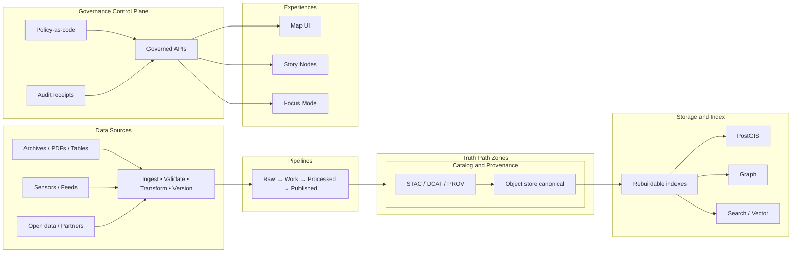

# Kansas Frontier Matrix

**Governed • Evidence-first • Map-first • FAIR+CARE aligned**

A governed spatio-temporal intelligence platform for Kansas: **data → pipelines → catalogs/provenance → governed APIs → map + story + Focus Mode**.

---

## Governance header

| Field | Value |
|---|---|
| Status | Alpha • governed rebuild |
| Owners | Repo CODEOWNERS + maintainers |
| License | Apache-2.0 |
| Policy posture | **Fail closed** (default deny) |
| Trust membrane | **No UI / client direct DB access** |

---

## Badges

[](LICENSE)


---

## Jump to

- [What is KFM](#what-is-kfm)
- [Non-negotiables](#non-negotiables)
- [Architecture at a glance](#architecture-at-a-glance)
- [Truth path and data zones](#truth-path-and-data-zones)
- [Run locally](#run-locally)
- [Repository map](#repository-map)
- [Governance and ethics](#governance-and-ethics)
- [Focus Mode and Story Nodes](#focus-mode-and-story-nodes)
- [Roadmap](#roadmap)
- [Contributing](#contributing)
- [Security](#security)
- [License and citation](#license-and-citation)

---

## What is KFM

**One sentence:** KFM turns Kansas’ scattered records and measurements—across centuries and landscapes—into **governed, auditable, map-first intelligence** that people can query, teach, and build on.

KFM is:
- A **governed knowledge system** for geospatial + historical data.
- A platform where every user-visible output is intended to be **traceable to sources** (datasets, documents, model runs) through catalogs and provenance.
- A system that serves both:
  - **Experts** (governed APIs, analysis, exports, reproducible runs)
  - **Non-experts** (map-first UI, Story Nodes, classroom-friendly narratives)

KFM is not:
- A black-box AI that improvises. KFM’s AI features are intended to operate **inside guardrails**: cite sources, obey policy, and label anything unverifiable as **not confirmed**.

[Back to top](#kansas-frontier-matrix)

---

## Non-negotiables

These are **invariants**. If a change weakens one of these, it’s a regression.

| Invariant | What it means | How it should be enforced |
|---|---|---|
| Trust membrane | UI and external clients **never** access DB/object storage directly | Governed API boundary + auth + policy checks + audit logs |
| Fail closed | If the system can’t verify license, sensitivity, provenance, or policy: **deny / block promotion** | CI gates + policy tests + default-deny runtime |
| Truth path | Outputs are explainable through: sources → pipelines → catalogs/provenance → storage/index → APIs → experiences | Promotion zones + catalogs + receipts + evidence resolver |
| Cite or abstain | Focus Mode + Story Nodes must cite resolvable evidence, or explicitly label “not confirmed” | Citation verifier + evidence resolver contract + audit references |

---

## Architecture at a glance



Key idea: **object storage is canonical** for artifacts; other stores are typically treated as **rebuildable indexes**. Promotion and serving are governed.

[Back to top](#kansas-frontier-matrix)

---

## Truth path and data zones

The truth path is both a **technical pipeline** and a **trust contract**. A practical version:

1. **Acquire**: digitize / scrape / ingest, capturing source + license + context  
2. **Validate**: schema checks, geospatial sanity, deduplication, QA sampling  
3. **Enrich**: geocoding, temporal normalization, linking, classifications  
4. **Catalog**: FAIR metadata + CARE constraints + provenance chain + citations  
5. **Serve**: governed APIs, exports, reproducible jobs  
6. **Explain**: Focus Mode answers and Story Nodes with resolvable evidence  

For zone-specific rules and folder conventions, start here:
- `data/README.md`
- `pipelines/README.md`
- `policy/README.md`
- `docs/README.md`

---

## Run locally

### Prerequisites
- Docker + Docker Compose v2

### Quick start

```bash
# 1) Configure environment
cp .env.example .env

# 2) Start core stack
docker compose up --build
```

Defaults (can be overridden via `.env`):
- Web UI: `http://localhost:3000`
- API: `http://localhost:8000`
- PostGIS: `localhost:5432`
- Neo4j: `http://localhost:7474` and `bolt://localhost:7687`

### Optional services via profiles

This repo supports additional services behind compose profiles:

```bash
# Start with policy engine + object store + vector + search
docker compose \
  --profile policy \
  --profile storage \
  --profile vector \
  --profile search \
  up --build
```

Optional endpoints (when enabled):
- OPA policy engine: `http://localhost:8181`
- MinIO: `http://localhost:9000` (console `http://localhost:9001`)
- Qdrant: `http://localhost:6333`
- Meilisearch: `http://localhost:7700`

### Stop and clean

```bash
docker compose down -v
```

> NOTE  
> `docker-compose.yml` currently mounts `./contracts` and `./schemas` into the API container. If those folders don’t exist yet, either create them or update the compose volumes.

[Back to top](#kansas-frontier-matrix)

---

## Repository map

```text
.
├── .github/        GitHub workflows, issue templates, security docs
├── data/           Data zones, catalogs, manifests, checksums, promotion rules
├── docs/           Architecture, ADRs, runbooks, specs, narrative standards
├── infra/          Deployment infrastructure and environment templates
├── pipelines/      Ingestion + processing pipelines and validation gates
├── policy/         Policy-as-code (OPA/Rego), sensitivity rules, tests
├── releases/       Release artifacts and immutability rules
├── scripts/        Developer scripts and maintenance utilities
├── src/            Backend services (API, catalog/provenance, resolvers)
├── tests/          Cross-cutting tests (policy, contracts, integration)
├── tools/          Tooling for catalogs, checksums, QA, and governance
├── web/            Map-first UI, Story Mode UI, Focus Mode UX surfaces
├── docker-compose.yml
├── .env.example
├── LICENSE
└── CITATION.cff
```

Start here for orientation:
- `docs/README.md`
- `data/README.md`

---

## Governance and ethics

KFM treats governance as a **system behavior**, not a policy memo.

- **FAIR + CARE**: metadata and interoperability plus community authority and ethics.
- **Authority to control**: sensitive and culturally restricted knowledge may require permissioning, redaction, or generalized outputs.
- **Default safety**: for restricted-by-default categories, prefer:
  - generalized geometry
  - aggregation (e.g., county / HUC rollups)
  - small-count suppression
  - deny-by-default for point outputs

If you’re adding a dataset or feature that could expose sensitive locations or vulnerable infrastructure, expect a governance review and policy tests.

[Back to top](#kansas-frontier-matrix)

---

## Focus Mode and Story Nodes

### Focus Mode
Focus Mode is the policy-aware assistant layer. The contract expectation is:
- Retrieve governed evidence (datasets, documents, lineage)
- Produce answers that **cite resolvable evidence**
- If it cannot cite: **abstain** or label **not confirmed**
- Emit an audit reference for traceability

### Story Nodes
Story Nodes are guided narratives that:
- are **map-native**
- remain evidence-backed
- expose provenance/citations in the UI
- support teaching and reproducible exploration, not entertainment

See:
- `docs/` for standards and Story Mode design
- `web/` for UI implementation details

---

## Roadmap

### Baseline platform
- Promotable datasets with catalogs/provenance
- Governed APIs + map-first UI
- Policy-as-code enforcement and audit receipts
- Story Nodes + Focus Mode grounded Q&A

### vNext++ expansion
A design proposal expands KFM toward a **governed 4D digital twin**:
- 4D volumetric data (x, y, z, time)
- Streaming analytics with bi-temporal semantics
- Scenario registry, run receipts, ensembles, uncertainty UX
- Optimization under governance constraints

Deliver vNext++ as **thin slices**, each with governance tests and reversible artifacts.

---

## Contributing

KFM prefers small, reviewable increments with governance baked in.

### The shortest path to a successful PR
- Add or modify **one** dataset/pipeline/policy/UI feature at a time
- Include:
  - catalogs (STAC/DCAT/PROV as applicable)
  - checksums/manifests
  - policy labels and redaction profile
  - tests that prove the trust membrane and fail-closed posture

<details>
<summary><strong>Definition of done for a new dataset integration</strong></summary>

- [ ] Source license captured and compatible
- [ ] Raw assets ingested with immutable checksums
- [ ] Validation gates pass (schema + geospatial sanity + QA sampling)
- [ ] Catalog metadata present (STAC/DCAT/PROV as applicable)
- [ ] Policy label applied (public/restricted/sensitive-location/embargoed)
- [ ] Promotion rules enforced in CI (fail closed)
- [ ] Evidence resolver can resolve citations to stable artifacts
- [ ] UI shows provenance surfaces (version badges, citations, “what changed” where relevant)

</details>

[Back to top](#kansas-frontier-matrix)

---

## Security

- Report vulnerabilities via `.github/SECURITY.md`
- Prefer least privilege, secrets hygiene, and auditable changes
- Treat policy changes as security-sensitive

---

## License and citation

- License: **Apache-2.0** (see `LICENSE`)
- Citation: see `CITATION.cff`

---