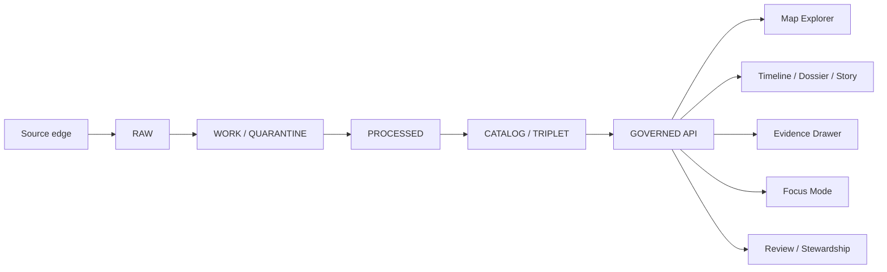

<!-- [KFM_META_BLOCK_V2]
doc_id: kfm://doc/TBD-VERIFY-root-readme-uuid
title: Kansas Frontier Matrix
type: standard
version: v1
status: review
owners: TBD-VERIFY-.github-CODEOWNERS
created: TBD-VERIFY-first-commit-date
updated: 2026-03-19
policy_label: TBD-VERIFY-public
related: [TBD-VERIFY-./CONTRIBUTING.md, TBD-VERIFY-./.github/README.md, TBD-VERIFY-./SECURITY.md, TBD-VERIFY-./docs/, TBD-VERIFY-./contracts/, TBD-VERIFY-./schemas/, TBD-VERIFY-./policy/, TBD-VERIFY-./data/, TBD-VERIFY-./tests/]
tags: [kfm, root-doc, governance, evidence-first, map-first, trust-system]
notes: [Root README revision candidate grounded in the mounted March 2026 KFM PDF corpus; live repo topology, CODEOWNERS, branch metadata, and adjacent Markdown still require direct verification.]
[/KFM_META_BLOCK_V2] -->

# Kansas Frontier Matrix

Governed, evidence-first, map-first, time-aware monorepo candidate for Kansas spatial evidence, publication, and trust-visible product surfaces.

> **Status:** Experimental  
> **Owners:** TBD-VERIFY — expected from `.github/CODEOWNERS` after repo mount  
>        
> **Quick jumps:** [Scope](#scope) · [Repo fit](#repo-fit) · [Accepted inputs](#accepted-inputs) · [Exclusions](#exclusions) · [Directory tree](#directory-tree) · [Quickstart](#quickstart) · [Usage](#usage) · [Diagram](#diagram) · [Operating tables](#operating-tables) · [Task list](#task-list-and-definition-of-done) · [FAQ](#faq) · [Appendix](#appendix)  
> **Repo fit:** `/README.md` *(PROPOSED root path; verify against the active branch checkout)*

> [!IMPORTANT]
> This README is intentionally verification-first. It is grounded in the mounted March 2026 KFM doctrine and refined reference layer, but the current session did **not** expose a repository checkout, workflow YAML, manifests, tests, or runtime logs. Treat path-level and implementation-shaped statements here as bounded until branch inspection confirms them.

| At a glance | Working rule |
|---|---|
| System identity | Governed spatial evidence system |
| Truth path | `Source edge → RAW → WORK / QUARANTINE → PROCESSED → CATALOG / TRIPLET → PUBLISHED` |
| Trust boundary | Governed APIs, not direct client access to canonical stores or model runtimes |
| Runtime answer rule | Cite or abstain |
| Promotion rule | Promotion changes trust state; deployment applies already-approved intent |
| Surface rule | Map-first, time-aware shell with Evidence Drawer and trust-visible negative states |

## Scope

This README covers the repo-root identity and operating posture of Kansas Frontier Matrix.

Use it for:

- root-level mission, boundaries, and non-negotiable invariants
- verification-first navigation across doctrine, contracts, policy, data, testing, apps, and operations
- a bounded root-map of the repo shape that still requires live-branch verification
- the minimum path from clone to trustworthy local inspection

Do not use it for:

- normative contract text that belongs in `./contracts/` or `./schemas/`
- full policy rules that belong in `./policy/`
- exhaustive domain/source coverage that belongs in `./docs/` or the domain/source atlas
- runtime or deployment claims that have not been re-verified on the active branch

### Evidence posture

| Label | Meaning in this README |
|---|---|
| **CONFIRMED** | Supported by the mounted March 2026 KFM corpus or directly visible current-session evidence. |
| **INFERRED** | Strongly implied by repeated corpus patterns, but not branch-verified in the current session. |
| **PROPOSED** | Recommended realization or repo shape consistent with doctrine, but not verified as mounted implementation. |
| **NEEDS VERIFICATION** | A likely repo-local fact, path, or control point that should be checked on the active branch before it is treated as current reality. |
| **UNKNOWN** | Not supported strongly enough in the current session to state as live repo or runtime fact. |

> [!NOTE]
> The accessible workspace for this run exposed a PDF corpus, not a mounted repository tree. This README therefore preserves doctrine confidently while keeping repo-local specifics visibly bounded.

[Back to top](#kansas-frontier-matrix)

## Repo fit

**Path:** `/README.md` *(PROPOSED; verify on the active branch)*  
**Role:** Root orientation document and verification-first operating index for Kansas Frontier Matrix.

Adjacency is listed as **path targets** rather than live relative links because the current session did not expose a mounted repo checkout.

| Direction | Path target | Status | Why it matters |
|---|---|---|---|
| Upstream | `./CONTRIBUTING.md` | NEEDS VERIFICATION | Contribution contract, review flow, and contributor expectations. |
| Upstream | `./.github/README.md` | NEEDS VERIFICATION | GitHub-side workflow, automation, and review-routing conventions. |
| Upstream | `./docs/` | NEEDS VERIFICATION | Architecture, governance, domain, ADR, and runbook depth. |
| Upstream | `./contracts/`, `./schemas/`, `./policy/` | NEEDS VERIFICATION | Machine-checkable contract, schema, and policy surfaces. |
| Downstream | `./apps/` | NEEDS VERIFICATION | Deployable user- and operator-facing surfaces. |
| Downstream | `./packages/` | NEEDS VERIFICATION | Shared reusable modules that support governed execution. |
| Downstream | `./data/` | NEEDS VERIFICATION | Registry, truth-path, catalog, and artifact-bearing data surfaces. |
| Downstream | `./tests/`, `./scripts/`, `./configs/` | NEEDS VERIFICATION | Verification harnesses, automation entrypoints, and runtime control layers. |

KFM is easiest to understand as a **truth path → catalog / evidence → governed API → trust-visible surface** system. The root README exists to keep that order clear before contributors descend into app-, package-, contract-, or domain-specific depth.

[Back to top](#kansas-frontier-matrix)

## Accepted inputs

At repo scale, “accepted inputs” means the source, data, metadata, and governance families KFM is designed to onboard and govern.

| Input family | Examples | Expected governed lane | Why it belongs |
|---|---|---|---|
| Historical tabular data | census extracts, registries, land records, archival tables | `RAW/` → `WORK/` | Supports time-aware joins, county/year baselines, and narrative explanation. |
| Vector geodata | boundaries, parcels, routes, service areas, sites | `RAW/` → `PROCESSED/` | Carries spatial identity into governed publication. |
| Raster geodata | DEMs, land cover, climate grids, scenes, hazard rasters | `RAW/` → `PROCESSED/` | Supports map-first delivery and evidence-linked derivatives. |
| Documentary evidence | archives, newspapers, oral histories, scans, story-support material | source intake → evidence flow | Enables story, dossier, and evidence-bearing publication when rights are clear. |
| Metadata and lineage | STAC, DCAT, PROV, manifests, sidecars, receipts | `CATALOG/` and proof surfaces | Makes discovery, lineage, and evidence resolution operational. |
| Derived analytical artifacts | summaries, model outputs, anomaly layers, released exports | governed processed or derived lanes | Allowed only when source, method, and release linkage remain visible. |
| Validation and review artifacts | QA reports, fixtures, review notes, correction notices | `WORK/`, `docs/`, `tests/` | Governance artifacts are part of the system, not disposable byproducts. |
| Policy-safe civic and infrastructure context | service summaries, generalized facility layers, corridor and service-area context | governed domain lanes | Must remain policy-labeled, precision-aware, and auditable. |

## Exclusions

These do **not** belong in the governed publication path.

| Exclusion | Why it stays out | Where it goes instead |
|---|---|---|
| Secrets, tokens, credentials | Never commit secrets into the repo or artifact path. | Secret manager / environment provisioning |
| Direct client-to-store or client-to-model paths | Breaks the trust membrane and bypasses policy and evidence resolution. | Governed APIs and protected runtime adapters |
| Publishable artifacts without receipts, digests, or catalog closure | Cannot be audited, reproduced, or corrected safely. | `WORK/QUARANTINE` until complete |
| Rights-unclear or sensitivity-unresolved material | Ambiguity must fail closed. | Quarantine, metadata-only handling, redaction, or generalized public-safe derivatives |
| Uncited Story or Focus claims | Violates cite-or-abstain. | Draft or internal review states only |
| Fine-grained restricted location exposure | Risks policy leakage, rights violations, or unsafe precision. | Restricted lanes or generalized public-safe outputs |
| Docs that imply live behavior without proof | Overclaiming weakens trust. | Mark `PROPOSED`, `UNKNOWN`, or `NEEDS VERIFICATION`, then revisit after branch inspection |
| Detached review/admin flows that sever geography or evidence context | Breaks the shell model and trust-visible review posture. | Review and stewardship as governed shell variation |

[Back to top](#kansas-frontier-matrix)

## Directory tree

### Documented root shape *(PROPOSED; verify against the active branch)*

```text
<repo-root>/
├── .github/
├── apps/
├── configs/
├── contracts/
├── data/
├── docs/
├── migrations/
├── packages/
├── policy/
├── schemas/
├── scripts/
├── tests/
└── ... additional root files and workspace metadata
```

### Top-level role map

| Path target | Status | Expected repo role |
|---|---|---|
| `./.github/` | NEEDS VERIFICATION | Workflow, templates, review routing, and merge discipline |
| `./apps/` | NEEDS VERIFICATION | Deployable surfaces: public, expert, steward, API, and worker applications |
| `./configs/` | NEEDS VERIFICATION | Shared configuration that should remain reviewable and secret-free |
| `./contracts/` | NEEDS VERIFICATION | API contracts, vocabularies, and interface surfaces |
| `./data/` | NEEDS VERIFICATION | Registry entries, truth-path data zones, example artifacts, and catalog surfaces |
| `./docs/` | NEEDS VERIFICATION | Architecture, governance, domain, ADR, diagram, and runbook documentation |
| `./migrations/` | NEEDS VERIFICATION | Schema, data, contract, or runtime migration work |
| `./packages/` | NEEDS VERIFICATION | Shared modules and reusable governed logic |
| `./policy/` | NEEDS VERIFICATION | Policy bundles, fixtures, and policy tests |
| `./schemas/` | NEEDS VERIFICATION | Validation schemas for contracts, artifacts, and publishable objects |
| `./scripts/` | NEEDS VERIFICATION | Automation entrypoints, helpers, and execution scaffolding |
| `./tests/` | NEEDS VERIFICATION | Unit, contract, policy, integration, runtime, and end-to-end verification |

Additional root surfaces such as `infra/`, `examples/`, `tools/`, workspace manifests, or environment overlays may exist, but they were **not** directly confirmed in the current session.

### What remains `UNKNOWN` or `NEEDS VERIFICATION`

- exact live repo tree and root file set
- actual schema and fixture inventory
- actual workflow inventory under `.github/workflows`
- exact deployment overlays, runtime topology, and observability depth
- exact mounted route tree, DTO set, and proof-object emission coverage

[Back to top](#kansas-frontier-matrix)

## Quickstart

The safest root-level quickstart is **verification-first**, not assumption-first.

```bash
# identify the exact revision you are reviewing
git rev-parse HEAD 2>/dev/null || echo "Not inside a Git checkout"

# inspect the repo root and near-root shape
find . -maxdepth 2 -type d 2>/dev/null | sort | sed -n '1,200p'

# inspect GitHub control-plane files if present
find .github -maxdepth 3 -type f 2>/dev/null | sort
ls -la .github/workflows 2>/dev/null || true

# inspect likely contract, schema, policy, and test surfaces
find contracts schemas policy tests -maxdepth 3 -type f 2>/dev/null | sort | sed -n '1,200p'

# inspect documentation, package, data, and app-facing surfaces
find docs packages data apps scripts configs -maxdepth 3 -type f 2>/dev/null | sort | sed -n '1,250p'

# inspect evidence, policy, and proof-object pressure
grep -RIn "EvidenceBundle\|EvidenceRef\|RuntimeResponseEnvelope\|release_manifest\|catalog_closure\|quarantine" . 2>/dev/null || true
grep -RIn "DCAT\|STAC\|PROV\|policy_label\|correction_notice\|review_record" . 2>/dev/null || true
```

> [!TIP]
> Run the inspection loop above before upgrading any implementation-shaped statement from `PROPOSED`, `NEEDS VERIFICATION`, or `UNKNOWN` to `CONFIRMED`.

<details>
<summary>Illustrative local-first contributor flow (use only where analogous targets actually exist)</summary>

```bash
make bootstrap
make validate-schemas
make test
make dev-up
make sample-ingest SOURCE=example_fixture
make catalog-validate
```

</details>

### Before documenting branch behavior as fact

1. Confirm what exists on this branch now.
2. Confirm which checks actually block merges.
3. Confirm which contracts, policies, and validations are enforced today.
4. Confirm that at least one end-to-end governed slice exists from source admission to evidence-backed public read.
5. Confirm whether public surfaces expose evidence, freshness, and policy-visible negative states rather than hiding them.
6. Confirm whether rollback, correction, and supersession are visible and evidenced rather than implied.

[Back to top](#kansas-frontier-matrix)

## Usage

### What KFM is

KFM is:

- a governed spatial evidence system
- a provenance-preserving publication program
- a map-first, time-aware shell over place, chronology, evidence, review state, and policy state
- a family of coordinated product surfaces that remain behind one trust membrane
- a Kansas-first operating environment for history, environment, land, hazards, services, and public knowledge
- a platform that can grow into bounded retrieval and AI assistance without weakening the evidence contract

### What KFM is not

KFM is **not**:

- a free-form chatbot
- a dashboard-only GIS stack
- a direct browser-to-database mapping surface
- a graph-first or vector-first authority engine
- a publication path that can skip rights, provenance, review, or release evidence
- a spectacle-first 3D product
- a detached admin console that severs review from geography, time, and evidence

### Non-negotiable invariants

| Invariant | Status | Practical meaning | What must never happen |
|---|---|---|---|
| Truth path | **CONFIRMED doctrine** | Data moves through `Source edge → RAW → WORK / QUARANTINE → PROCESSED → CATALOG / TRIPLET → PUBLISHED`. | Ad hoc publication from transient transforms, notebooks, or unpublished working states |
| Trust membrane | **CONFIRMED doctrine** | Public and role-limited access crosses governed APIs, policy, and evidence resolution. | Direct UI or external access to canonical stores, raw buckets, or model runtimes |
| Cite-or-abstain | **CONFIRMED doctrine** | Story, map, dossier, export, and Focus claims resolve to evidence or abstain. | Plausible uncited output presented as fact |
| Fail-closed posture | **CONFIRMED doctrine** | Unclear rights, unresolved sensitivity, or broken evidence blocks release. | “Best-effort” publication under ambiguity |
| Deterministic identity | **CONFIRMED doctrine** | Comparable inputs and the same spec produce stable identities and digests. | Unstable versions or ambiguous lineage |
| Evidence as interface | **CONFIRMED doctrine** | Evidence must be operationally reachable through resolvable support objects. | Provenance trapped in notes that surfaces cannot reach |
| Documentation as production surface | **CONFIRMED doctrine** | Behavior changes update docs, contracts, examples, diagrams, and runbooks together. | Silent drift between system behavior and written procedure |
| 2D default, 3D conditional | **CONFIRMED doctrine** | 2D remains the default operating surface; 3D carries extra governance burden. | Spectacle-first 3D becoming a parallel truth surface |

### Product surfaces and operating promise

| Surface | Status | What it should answer |
|---|---|---|
| Map Explorer | **CONFIRMED doctrine** | **Where?** |
| Timeline | **CONFIRMED doctrine** | **When?** |
| Dossier | **CONFIRMED doctrine** | **What matters about this place, feature, or subject?** |
| Story | **CONFIRMED doctrine** | **Why does the evidence matter?** |
| Evidence Drawer | **CONFIRMED doctrine** | **What does a visible claim rest on?** |
| Focus Mode | **CONFIRMED doctrine** | Natural-language investigation **without bypassing evidence or policy** |
| Review / Stewardship | **CONFIRMED doctrine** | Inspect, approve, restrict, correct, supersede, or withdraw within the same governed shell |

### Kansas operating lanes at a glance

| Lane | Typical grain | Why it matters early |
|---|---|---|
| Historical and demographic | county-version, county-year, event-time | Establishes time-aware joins and stable place/time scaffolding |
| Hydrology and water | station-time, watershed, raster | Strong public-safe thin-slice candidate |
| Hazards and environment | event-time, county, polygon, raster | High public value with visible governance needs |
| Land and cadastral history | parcel, tract, legal description, PLSS section | Supports land-tenure, settlement, and archival interpretation |
| Archives and heritage | document, place, event-time | Critical for story publication and evidence depth |
| Services and infrastructure context | place, corridor, service area | Useful early, but precision and rights posture must stay explicit |

### Preferred first governed slice

A strong first slice is **hydrology-first**:

1. one released hydrology dataset family with stable source descriptors
2. one map + timeline surface that opens directly into an Evidence Drawer
3. one public-safe dossier or detail path
4. one Focus path that either cites correctly or abstains
5. one visible correction or supersession drill

[Back to top](#kansas-frontier-matrix)

## Diagram


```mermaid
flowchart LR
    A[Source edge] --> B[RAW]
    B --> C[WORK / QUARANTINE]
    C --> D[PROCESSED]
    D --> E[CATALOG / TRIPLET]
    E --> F[GOVERNED API]
    F --> G[Map Explorer]
    F --> H[Timeline / Dossier / Story]
    F --> I[Evidence Drawer]
    F --> J[Focus Mode]
    F --> K[Review / Stewardship]
```

This is the core promise of the repo: every public or role-limited surface remains downstream of acquisition, policy checks, provenance capture, review state, and evidence resolution.

[Back to top](#kansas-frontier-matrix)

## Operating tables

### Truth path and promotion contract

Promotion is not a file copy. It is a governed state transition.

| Gate | Minimum proof | Fail-closed behavior |
|---|---|---|
| Identity and versioning | stable IDs, deterministic digests, immutable version references | Block on missing, duplicated, or unstable identity |
| Rights and license | rights snapshot, attribution basis, reuse posture | Hold or quarantine when rights are unclear |
| Sensitivity and generalization | policy label, obligations, generalization or redaction plan | Restrict, generalize, or block publication |
| Schema and QA | schema validity, spatial/time/unit checks, domain QC | Route to `WORK/QUARANTINE` on blocking failure |
| Catalog closure | linked catalog, lineage, and release linkage | Block if metadata and lineage do not resolve coherently |
| Receipt and review | run receipt, decision/review evidence, release inventory | Block if required review or proof objects are absent |
| Release and correction readiness | release manifest / proof pack, rollback and correction hooks | Block promotion until public-safe scope is inspectable and reversible |

### Release taxonomy

| Term | Meaning in KFM |
|---|---|
| Continuous integration | Proves a candidate change is buildable, testable, schema-valid, provenance-aware, and policy-checkable before trust widens |
| Continuous delivery | Assembles a releasable, immutable unit whose integrity, inventory, and provenance are explicit |
| Deployment | Applies already-approved desired state to a runtime surface |
| Promotion | Governs the transition from one trust state to another |
| Rollback / correction | Reverses or supersedes a prior decision **without erasing evidence** |

### Canonical vs rebuildable rule

| Class | Examples |
|---|---|
| **Canonical / authoritative** | `RAW`, `PROCESSED`, catalog-closure objects, review/decision artifacts, release manifests, correction notices |
| **Rebuildable / derived** | tiles, search indexes, vector indexes, graphs, caches, summaries, scenes, denormalized projections |

[Back to top](#kansas-frontier-matrix)

## Task list and definition of done

Use this as the minimum repo-root gate list for substantial work.

- [ ] implementation evidence baseline exists: repo tree, manifests, schema inventory, workflow inventory, and sample proof objects
- [ ] first-wave schemas plus valid and invalid fixtures validate in CI
- [ ] deny-by-default policy bundle and policy tests exist for integrity, provenance, rights/sensitivity, and runtime negative states
- [ ] release candidates emit validation, catalog-closure, manifest, and proof-pack artifacts
- [ ] `EvidenceBundle`-style drill-through works from consequential visible claims
- [ ] `RuntimeResponseEnvelope`-style negative-state grammar is visible and testable
- [ ] Map Explorer, Timeline, Dossier, Story, and Focus surfaces expose trust-visible state where relevant
- [ ] Evidence Drawer drill-through works from the same governed shell
- [ ] Focus either cites with audit linkage or abstains cleanly
- [ ] derived freshness, correction, supersession, withdrawal, and stale-visible states remain explicit
- [ ] behavior-significant changes update docs, contracts, examples, diagrams, and runbooks in the same governed stream
- [ ] one hydrology-first slice proves descriptor → ingest → validation → dataset version → catalog closure → decision/review → release → map/read surface → correction
- [ ] one rollback or correction drill is rehearsed and leaves evidence-bearing output behind

## FAQ

### Why is KFM stricter than a normal map portal?

Because KFM is designed as a **trust system**, not just a presentation layer. Provenance, policy, review, and evidence resolution are runtime obligations, not decoration.

### Why does this README keep saying `UNKNOWN` or `NEEDS VERIFICATION`?

Because repo size and documentation density do not prove runtime governance. Branch-local facts should be verified from the active repo and live artifacts, not inferred from persuasive prose.

### Why are Evidence Bundles, catalogs, and receipts treated as first-class?

Because discoverability, reproducibility, review, and public trust depend on resolvable metadata and lineage, not just attractive maps or fluent answers.

### Why keep observed, documentary, derived, modeled, and AI-synthesized outputs distinct?

Because KFM must preserve the difference between what was observed, what was recorded, what was derived, what was modeled, and what was synthesized for explanation.

### Why start with a narrow slice?

Because one fully governed slice proves the architecture honestly. Many half-governed features only prove that governance was bypassed.

### Why is 2D the default operating surface?

Because 2D keeps geography, chronology, evidence, and state easier to govern. 3D is allowed only when it adds real explanatory value and still returns users to the same evidence flow.

### Why are some repo paths still marked `TBD-VERIFY` or `NEEDS VERIFICATION`?

Because the current session exposed doctrine PDFs, not a mounted branch checkout. Root-doc adjacency should be verified against the active repository, not inferred from persuasive prose.

[Back to top](#kansas-frontier-matrix)

## Appendix

<details>
<summary>Open the root-doc verification appendix</summary>

### Working basis for this README candidate

This README is aligned to the current mounted March 2026 KFM reference layer:

- the March 18 master reissue as the strongest integrated baseline in hand
- the March 16–19 refined app, configuration, contract, data, policy, tooling, package, testing, schema, documentation, security, delivery, and atlas references as the supporting authority layer
- the current-session evidence boundary that exposed PDFs but not a mounted repo checkout

### Why placeholders remain in the meta block

The following values still require direct repo or metadata verification before publication:

- `doc_id`
- owners / CODEOWNERS
- created date
- policy label
- adjacent root-doc links and their exact paths

### First verification targets after repo mount

- root repo tree and package/workspace inventory
- schema directories, fixtures, and registry versions
- workflow catalog and merge-blocking status checks
- route inventory, DTO inventory, and runtime negative-path coverage
- EvidenceBundle-style resolver contracts and traces
- correction / rollback evidence and surface behavior

### Root README maintenance rule

Keep this file focused on:

- repo identity
- top-level navigation and boundaries
- non-negotiable invariants
- documented repo shape plus verification boundary
- the minimum governed quickstart
- root-level gates that help reviewers reject overclaiming early

Push deep schema catalogs, route trees, domain atlases, and environment-specific runbooks into their owning docs once those files exist and are verified.

[Back to top](#kansas-frontier-matrix)

</details>